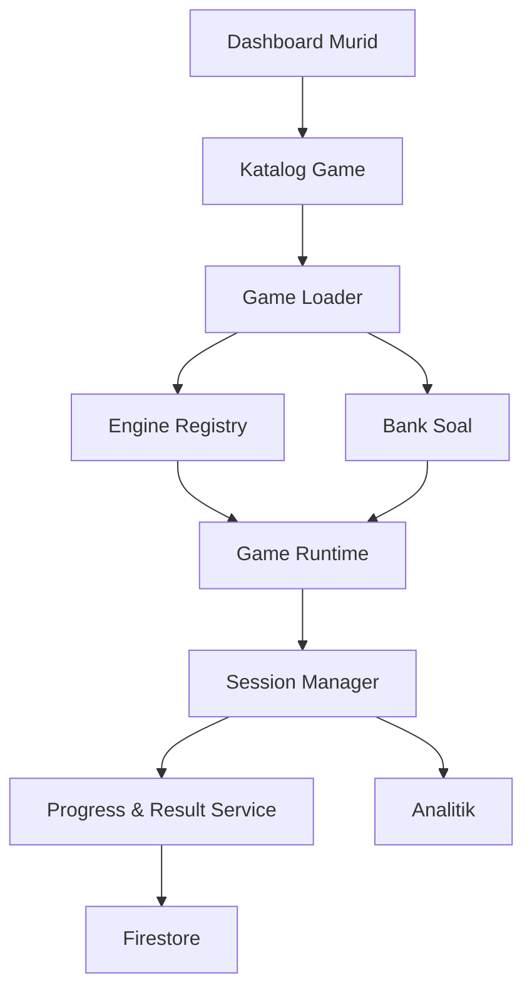
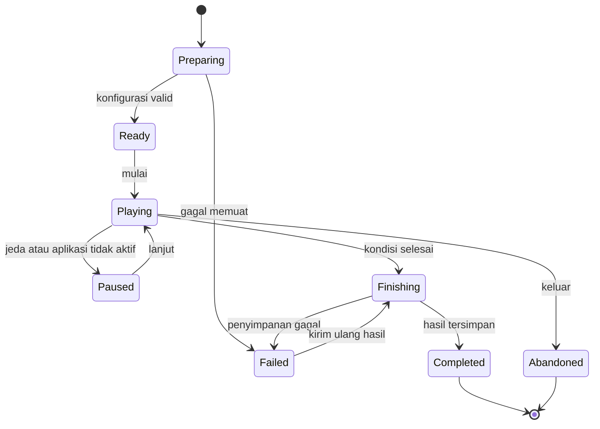

# Arsitektur Sistem Game

**Proyek:** Website Les Privat Kak Harris  
**Lokasi tujuan:** `docs/Games/02-Arsitektur-Game.md`  
**Status:** Rancangan awal  
**Fokus rilis:** Matematika SD–SMP  
**Platform:** Website responsif dengan Firebase/Firestore

## 1. Tujuan

Dokumen ini menetapkan susunan teknis sistem game agar setiap game tidak dibangun sebagai halaman yang berdiri sendiri. Semua game harus menggunakan kontrak, komponen, dan alur data bersama sehingga mekanik dapat digunakan ulang, materi dapat ditambah tanpa mengubah engine, dan progres murid tetap konsisten.

Arsitektur ini dirancang untuk kebutuhan saat ini, tetapi struktur jenjang dan engine tidak boleh menghalangi ekspansi ke SMA pada masa depan.

## 2. Prinsip Arsitektur

1. **Engine terpisah dari konten.** Engine mengatur mekanik; bank soal menyediakan materi.
2. **Konfigurasi mengendalikan variasi.** Perbedaan judul, materi, mode, tema, dan aturan game disimpan sebagai konfigurasi, bukan salinan kode.
3. **Satu inti sesi.** Skor, waktu, streak, status sesi, dan penyimpanan hasil menggunakan modul bersama.
4. **Filter sebelum render.** Game dan soal disaring berdasarkan akun sebelum ditampilkan.
5. **Server sebagai sumber data permanen.** Browser memegang keadaan sesi sementara; Firestore menyimpan konfigurasi, progres, dan hasil yang telah disahkan.
6. **Kegagalan harus aman.** Gangguan jaringan tidak boleh menggandakan hadiah atau merusak progres.
7. **Mobile-first.** Interaksi utama tidak bergantung pada hover, keyboard fisik, atau layar lebar.
8. **Ekspansi bertahap.** Modul awal sederhana, tetapi memiliki batas tanggung jawab yang jelas.

## 3. Gambaran Komponen



### Tanggung jawab utama

| Komponen | Tanggung jawab | Tidak boleh menangani |
| --- | --- | --- |
| Dashboard Murid | Navigasi dan konteks akun | Logika soal atau skor |
| Katalog Game | Menampilkan game yang boleh diakses | Memuat seluruh game lalu menyembunyikannya terlambat |
| Game Loader | Memvalidasi konfigurasi dan menyiapkan dependensi | Menentukan benar–salah jawaban sendiri |
| Engine Registry | Memetakan `engineType` ke implementasi engine | Menyimpan progres murid |
| Bank Soal | Menyediakan soal dan metadata | Mengatur tampilan atau hadiah |
| Game Runtime | Menjalankan loop permainan dan UI engine | Menulis langsung ke koleksi progres |
| Session Manager | Menjaga status sesi, skor, waktu, dan checkpoint | Mengubah isi bank soal |
| Progress & Result Service | Menyimpan hasil secara idempoten | Menggambar layar permainan |
| Analitik | Mencatat event penting secara terbatas | Menyimpan jawaban sensitif yang tidak diperlukan |

## 4. Lapisan Sistem

### 4.1 Lapisan Presentasi

Berisi katalog, layar pembuka, area permainan, jeda, ringkasan hasil, keadaan loading, kosong, dan error. Lapisan ini menerima state dari runtime dan mengirim aksi pengguna. Presentasi tidak menghitung hadiah permanen dan tidak mengakses Firestore secara langsung.

### 4.2 Lapisan Runtime

Berisi engine aktif, session manager, mode controller, scoring service, timer, difficulty controller, serta answer evaluator. Lapisan ini menjadi pusat keadaan satu sesi permainan.

### 4.3 Lapisan Konten

Berisi definisi game, bank soal, metadata materi, tingkat kesulitan, generator soal terkontrol, serta aset visual. Konten dapat dipakai oleh beberapa engine selama formatnya kompatibel.

### 4.4 Lapisan Data

Berisi autentikasi, profil murid, katalog yang diterbitkan, progres, hasil sesi, achievement, XP, dan analitik. Semua operasi tulis harus melewati service khusus agar aturan konsisten.

## 5. Modul Inti

### 5.1 Game Catalog Service

Mengambil metadata ringan untuk kartu game. Query minimal menggunakan:

- status `published`;
- jenjang atau rentang kelas akun;
- hak akses bila game dibatasi;
- versi konfigurasi aktif.

Katalog tidak boleh mengunduh bank soal atau aset permainan lengkap. Tujuannya agar daftar game tidak menampilkan semua item selama beberapa detik sebelum terfilter.

### 5.2 Game Loader

Urutan kerja:

1. menerima `gameId`;
2. mengambil profil dan hak akses murid;
3. mengambil definisi game aktif;
4. memvalidasi status, jenjang, kelas, dan versi;
5. memuat engine berdasarkan `engineType`;
6. mengambil soal sesuai aturan konten;
7. membuat sesi baru atau menawarkan pemulihan sesi;
8. merender layar siap bermain.

Jika salah satu validasi gagal, loader menampilkan pesan yang jelas dan kembali ke katalog tanpa membuat sesi kosong.

### 5.3 Engine Registry

Registry mencegah percabangan besar seperti `if engine === quiz` di banyak file.

```js
const engineRegistry = {
  quiz: createQuizEngine,
  generated_drill: createGeneratedDrillEngine,
  matching: createMatchingEngine,
  drag_drop: createDragDropEngine,
  puzzle: createPuzzleEngine,
  adventure: createAdventureEngine,
};
```

ID engine resmi adalah `quiz`, `generated_drill`, `matching`, `drag_drop`, `puzzle`, dan `adventure`. Nama tampilan boleh diterjemahkan, tetapi ID teknis tersebut tidak boleh diubah menjadi camelCase atau memakai nama mode.

Setiap engine wajib mengikuti antarmuka minimal:

```js
{
  initialize(context),
  start(),
  handleAction(action),
  getState(),
  pause(),
  resume(),
  finish(reason),
  destroy()
}
```

`destroy()` wajib membersihkan timer, listener, audio, dan state sementara agar membuka game baru tidak membawa efek sesi sebelumnya.

### 5.4 Session Manager

Session Manager menjadi sumber kebenaran state selama permainan:

```js
{
  sessionId,
  gameId,
  gameVersion,
  userId,
  engineType,
  mode,
  status,
  startedAt,
  lastCheckpointAt,
  currentRound,
  score,
  streak,
  lives,
  remainingTime,
  difficulty,
  answeredItemIds,
  summary
}
```

Nilai `status` dibatasi menjadi:

- `preparing`;
- `ready`;
- `playing`;
- `paused`;
- `finishing`;
- `completed`;
- `abandoned`;
- `failed`.

Transisi status harus melalui fungsi khusus. Sesi `completed` tidak dapat kembali ke `playing`.

### 5.5 Mode Controller

Mode controller menerapkan aturan Endless atau Terbatas tanpa menduplikasi engine. Detail standarnya dibahas dalam `14-Mode-Permainan.md`.

Tanggung jawabnya meliputi:

- menentukan kondisi selesai;
- menghitung putaran;
- mengatur batas soal, waktu, atau nyawa;
- memberi sinyal kenaikan kesulitan;
- menangani berhenti manual.

### 5.6 Scoring Service

Scoring service menerima kejadian permainan, bukan membaca tombol UI. Input minimalnya adalah kebenaran jawaban, waktu respons, tingkat kesulitan, streak, serta penalti yang diizinkan konfigurasi.

Rumus skor harus diberi versi melalui `scoring.version`. Perubahan rumus tidak boleh mengubah kembali skor dari sesi lama.

### 5.7 Answer Evaluator

Evaluator menangani pemeriksaan jawaban berdasarkan tipe soal, misalnya:

- pilihan tunggal;
- benar–salah;
- angka;
- pecahan;
- pasangan;
- urutan;
- kelompok.

Engine hanya mengirim jawaban pengguna dan menerima hasil terstruktur:

```js
{
  isCorrect: true,
  normalizedAnswer: "-12",
  expectedAnswer: "-12",
  feedbackCode: "correct",
  misconceptionCode: null
}
```

Untuk jawaban numerik, evaluator harus menormalisasi spasi, tanda minus, pemisah desimal, dan format yang sah. Dukungan notasi SMA belum wajib dalam MVP, tetapi tipe evaluator dapat ditambah tanpa mengubah kontrak engine.

### 5.8 Question Provider

Question Provider menjadi penghubung engine dengan bank soal. Fungsinya:

- memfilter jenjang, kelas, materi, dan kesulitan;
- memilih soal tanpa pengulangan terlalu cepat;
- melakukan shuffle dengan benar;
- memanggil generator soal yang disetujui;
- memastikan jumlah soal cukup;
- menghapus kunci jawaban dari data presentasi bila diperlukan.

Provider harus mendukung dua sumber:

1. **soal statis**, cocok untuk soal cerita atau soal yang dikurasi;
2. **soal generatif terkontrol**, cocok untuk operasi hitung dengan parameter dan batas yang jelas.

### 5.9 Progress & Result Service

Service ini menyimpan checkpoint dan hasil final. Setiap sesi memiliki `sessionId` unik yang juga digunakan sebagai kunci idempotensi. Pengiriman ulang hasil dengan `sessionId` sama harus memperbarui atau mengabaikan hasil yang sama, bukan memberi XP dua kali.

Service bertanggung jawab untuk:

- membuat catatan sesi;
- menyimpan checkpoint seperlunya;
- menyelesaikan sesi sekali saja;
- memperbarui progres materi;
- memicu perhitungan XP dan achievement;
- menandai sesi gagal atau ditinggalkan.

## 6. Kontrak Konfigurasi Game

Semua game menggunakan bentuk dasar berikut. Detail per engine dapat menambah properti di dalam `engineConfig`.

```json
{
  "schemaVersion": 1,
  "gameId": "operasi-bilangan-bulat-01",
  "version": 1,
  "status": "published",
  "title": "Misi Bilangan Bulat",
  "description": "Latihan operasi bilangan bulat kelas 7.",
  "engineType": "quiz",
  "education": {
    "levels": ["SMP"],
    "grades": [7],
    "curriculumTags": ["bilangan", "bilangan-bulat"]
  },
  "modes": [
    { "type": "limited_questions", "questionLimit": 10 },
    { "type": "limited_time", "timeLimitSeconds": 120 },
    { "type": "endless" }
  ],
  "content": {
    "questionSetIds": ["bilangan-bulat-kelas-7-v1"],
    "initialDifficulty": "easy",
    "allowedDifficulties": ["easy", "medium", "hard"]
  },
  "scoring": {
    "version": 1,
    "baseCorrect": 100,
    "wrongPenalty": 0,
    "streakEnabled": true,
    "speedBonusEnabled": false
  },
  "progress": {
    "xpEnabled": true,
    "achievementsEnabled": true,
    "checkpointEnabled": true
  },
  "ui": {
    "theme": "default-math",
    "showProgress": true,
    "showTimer": true
  },
  "engineConfig": {}
}
```

### Aturan konfigurasi

- `gameId` stabil dan tidak digunakan ulang untuk game lain.
- `version` naik saat aturan atau konten yang memengaruhi hasil berubah.
- `schemaVersion` menunjukkan versi bentuk data, bukan versi game.
- `education.levels` dapat menerima `SMA` di masa depan, tetapi konten awal hanya SD–SMP.
- Mode yang tidak didukung engine harus ditolak saat validasi.
- Konfigurasi yang belum valid tidak boleh berstatus `published`.
- Nilai default ditetapkan oleh validator, bukan tersebar di komponen UI.

## 7. Konteks yang Diterima Engine

Saat dibuat, engine menerima dependensi melalui satu objek konteks:

```js
{
  gameConfig,
  playerContext,
  sessionManager,
  modeController,
  questionProvider,
  answerEvaluator,
  scoringService,
  resultService,
  analytics,
  uiAdapter
}
```

`playerContext` hanya memuat data yang dibutuhkan sesi, seperti `userId`, jenjang, kelas, preferensi aksesibilitas, dan hak akses. Data pribadi lain tidak diberikan kepada engine.

## 8. Alur Sesi Permainan



Urutan normal:

1. Murid memilih game dari katalog yang sudah terfilter.
2. Loader memvalidasi akses dan konfigurasi.
3. Question Provider menyiapkan kumpulan awal.
4. Session Manager membuat sesi ber-ID unik.
5. Engine menjalankan permainan melalui Mode Controller.
6. Setiap jawaban dievaluasi dan memperbarui state lokal.
7. Checkpoint disimpan pada momen yang ditentukan, bukan setiap perubahan kecil.
8. Kondisi selesai memindahkan sesi ke `finishing`.
9. Result Service menyimpan ringkasan secara idempoten.
10. Setelah penyimpanan berhasil, sesi menjadi `completed` dan ringkasan ditampilkan.

## 9. Penyimpanan dan Pemulihan Sesi

### State sementara

State aktif disimpan di memori. Checkpoint lokal boleh digunakan untuk memulihkan gangguan singkat, tetapi tidak menjadi bukti akhir pemberian XP.

### Checkpoint Firestore

Checkpoint dipakai untuk sesi yang layak dilanjutkan. Data minimum:

- identitas sesi dan versi game;
- status terakhir;
- nomor putaran;
- skor sementara;
- waktu tersisa atau waktu berjalan;
- ID soal yang telah digunakan;
- waktu checkpoint.

Jawaban lengkap tidak perlu disimpan jika ringkasan agregat sudah cukup. Kebijakan rinci mengikuti `11-Database.md`.

### Aturan pemulihan

- hanya pemilik sesi yang dapat melanjutkan;
- sesi harus memakai versi game yang masih kompatibel;
- sesi berbatas waktu tidak otomatis mendapat waktu baru;
- sesi final tidak dapat dipulihkan;
- checkpoint kedaluwarsa ditandai `abandoned`;
- hasil dan hadiah final hanya diproses sekali.

## 10. Filter Jenjang dan Hak Akses

Filter dilakukan pada tiga lapisan:

1. **Query katalog:** hanya mengambil game yang sesuai profil murid.
2. **Validasi loader:** menolak URL langsung ke game yang tidak sesuai.
3. **Aturan data:** mencegah pembacaan atau penulisan data yang bukan milik pengguna.

Nilai jenjang dan kelas berasal dari profil akun yang tepercaya, bukan pilihan bebas pada kartu game. Struktur yang digunakan:

```js
{
  educationLevel: "SD" | "SMP" | "SMA",
  grade: 1 | 2 | 3 | 4 | 5 | 6 | 7 | 8 | 9 | 10 | 11 | 12
}
```

Kombinasi harus divalidasi, misalnya kelas 7 tidak sah untuk jenjang SD. Dukungan tipe SMA disiapkan pada struktur, tetapi katalog SMA belum diterbitkan dalam rilis awal.

## 11. Kontrak Hasil Sesi

Semua engine mengeluarkan ringkasan dalam bentuk umum:

```json
{
  "sessionId": "ses_...",
  "gameId": "operasi-bilangan-bulat-01",
  "gameVersion": 1,
  "engineType": "quiz",
  "mode": {
    "type": "limited_questions",
    "questionLimit": 10,
    "timeLimitSeconds": null,
    "initialLives": null
  },
  "status": "completed",
  "finishReason": "question_limit_reached",
  "startedAt": "server-time",
  "finishedAt": "server-time",
  "activeDurationSeconds": 184,
  "answeredCount": 10,
  "correctCount": 8,
  "wrongCount": 2,
  "skippedCount": 0,
  "accuracy": 0.8,
  "score": 920,
  "maxStreak": 5,
  "endingDifficulty": "medium",
  "topicSummary": [
    {
      "topicId": "bilangan-bulat",
      "attempted": 10,
      "correct": 8
    }
  ],
  "scoringVersion": 1,
  "rewardPolicyVersion": 1
}
```

Engine boleh menambahkan detail khusus dalam `engineSummary`, tetapi tidak boleh mengganti arti kolom umum.

Kontrak di atas adalah bentuk runtime kanonis dari `14-Mode-Permainan.md`. Saat dipersistenkan, `11-Database.md` memakai projection yang diratakan: `mode.type` menjadi `modeType` dan `answeredCount` menjadi `attemptedCount`. Mapping ini dilakukan oleh Result Service, bukan oleh tiap engine.

## 12. Error dan Kondisi Batas

| Kondisi | Perilaku yang diwajibkan |
| --- | --- |
| Game tidak ditemukan | Tampilkan pesan dan kembali ke katalog |
| Game tidak sesuai jenjang | Tolak akses tanpa menampilkan isi soal |
| Konfigurasi tidak valid | Jangan membuat sesi; catat error teknis |
| Bank soal kosong/kurang | Gunakan fallback yang sah atau hentikan sebelum mulai |
| Jaringan putus saat bermain | Lanjutkan state lokal bila aman dan tandai belum tersinkron |
| Gagal menyimpan hasil | Pertahankan status `finishing` dan sediakan kirim ulang |
| Tombol diklik berulang | Debounce aksi dan proses satu jawaban per putaran |
| Tab ditutup | Simpan checkpoint sesuai kebijakan; jangan otomatis memberi hadiah |
| Versi game berubah | Lanjutkan hanya jika kompatibel; selain itu akhiri sesi lama dengan aman |
| Timer tertunda di background | Hitung berdasarkan timestamp, bukan hanya interval browser |

## 13. Keamanan dan Integritas

- Pengguna hanya dapat membaca progres dan sesi miliknya sendiri.
- Admin dapat membaca data sesuai kebutuhan pengelolaan, bukan melalui UI murid.
- `userId`, jenjang, kelas, dan timestamp final tidak dipercaya dari input bebas browser.
- XP dan achievement permanen tidak dihitung hanya dari angka skor yang dikirim klien.
- Penyelesaian sesi memakai transaksi atau mekanisme idempoten.
- ID soal dan ringkasan hasil divalidasi terhadap game serta versi aktif.
- Kunci jawaban tidak disertakan dalam katalog dan tidak disimpan pada state UI lebih lama dari yang diperlukan.
- Analitik tidak mencatat nama, nomor telepon, atau data pribadi yang tidak relevan.

Untuk MVP, sebagian validasi dapat tetap berada pada klien karena keterbatasan arsitektur. Namun, hadiah permanen dan akses data tetap harus dilindungi oleh Firestore Rules dan, bila sudah diperlukan, fungsi backend tepercaya.

## 14. Strategi Pemuatan dan Performa

- Katalog hanya memuat metadata kartu.
- Kode engine dimuat sesuai kebutuhan dengan dynamic import.
- Bank soal diambil per game atau per batch, bukan seluruh koleksi.
- Aset berat dimuat setelah game dipilih.
- Konfigurasi yang sering digunakan dapat di-cache dengan versi.
- Listener realtime hanya digunakan jika manfaatnya jelas; sesi solo tidak memerlukan sinkronisasi realtime terus-menerus.
- Timer dan animasi dihentikan saat engine dihancurkan.
- Target awal: kartu katalog tampil tanpa kilatan game yang salah jenjang.

Contoh pemuatan engine:

```js
const engineLoaders = {
  quiz: () => import("./engines/quiz.js"),
  endless: () => import("./engines/endless.js"),
  matching: () => import("./engines/matching.js"),
};
```

## 15. Struktur Folder Implementasi yang Disarankan

Struktur ini merupakan arah, bukan kewajiban mengganti struktur repo saat ini secara langsung.

```text
games/
├── core/
│   ├── game-loader.js
│   ├── engine-registry.js
│   ├── session-manager.js
│   ├── mode-controller.js
│   ├── scoring-service.js
│   └── config-validator.js
├── engines/
│   ├── quiz/
│   ├── endless/
│   ├── matching/
│   ├── drag-drop/
│   ├── puzzle/
│   └── adventure/
├── content/
│   ├── question-provider.js
│   ├── answer-evaluator.js
│   └── generators/
├── data/
│   ├── game-catalog-service.js
│   ├── result-service.js
│   ├── progress-service.js
│   └── analytics-service.js
├── ui/
│   ├── components/
│   ├── screens/
│   └── themes/
└── shared/
    ├── constants.js
    ├── errors.js
    └── utilities.js
```

Sebelum implementasi, struktur aktual repo harus diperiksa agar migrasi dilakukan bertahap dan tidak mematahkan game yang sudah ada.

## 16. Ketergantungan Antar Dokumen

| Dokumen | Keputusan yang memakai arsitektur ini |
| --- | --- |
| `03-Engine-Quiz.md` | Implementasi kontrak engine pertama |
| `04-Engine-Endless.md` | Strategi generasi konten dan kenaikan kesulitan |
| `05–08-Engine-*.md` | Detail aksi dan state khusus engine |
| `09-Bank-Soal.md` | Skema Question Provider dan evaluator |
| `10-UI-UX.md` | Kontrak UI adapter dan state layar |
| `11-Database.md` | Bentuk koleksi, rules, checkpoint, dan hasil |
| `12-Achievement.md` | Pemicu achievement dari hasil yang sah |
| `13-Level-XP.md` | Perhitungan hadiah dan idempotensi |
| `14-Mode-Permainan.md` | Kondisi selesai lintas engine |
| `15-Analitik.md` | Event umum dan event khusus engine |

Jika dokumen turunan memerlukan perubahan pada kontrak umum, dokumen ini harus diperbarui lebih dahulu agar tidak muncul beberapa standar berbeda.

## 17. Batas MVP

Arsitektur MVP wajib mencakup:

- katalog terfilter sebelum render;
- Game Loader dan validator konfigurasi;
- Engine Registry;
- Session Manager;
- Mode Controller untuk Endless dan Terbatas;
- Question Provider untuk soal statis dan generator sederhana;
- evaluator pilihan tunggal dan angka;
- scoring dasar dengan versi;
- penyimpanan satu hasil per sesi;
- ringkasan hasil umum;
- pemulihan kegagalan simpan final.

Belum wajib pada MVP:

- orkestrasi multiplayer;
- sinkronisasi lintas perangkat secara langsung;
- editor visual konfigurasi game;
- sistem anti-cheat kompleks;
- unduhan seluruh konten untuk offline penuh;
- engine Adventure lengkap;
- input grafik dan notasi matematika SMA.

## 18. Kriteria Penerimaan Arsitektur

Arsitektur dianggap siap menjadi acuan implementasi jika:

1. Game baru dapat dibuat dari konfigurasi, bank soal, dan engine yang sudah tersedia.
2. Engine tidak mengakses Firestore langsung.
3. Semua engine menghasilkan kontrak hasil umum.
4. Mode Endless dan Terbatas dapat diterapkan tanpa menduplikasi keseluruhan engine.
5. Filter jenjang terjadi sebelum katalog dirender dan diverifikasi ulang saat game dibuka.
6. Satu sesi tidak dapat memberi hasil atau hadiah dua kali.
7. Timer tetap konsisten setelah tab masuk background.
8. Engine dapat dihancurkan tanpa meninggalkan listener atau timer.
9. Penambahan tipe soal atau jenjang tidak memerlukan perubahan pada seluruh engine.
10. Struktur dapat diterapkan bertahap pada repo tanpa mematikan game yang sudah berjalan.

## 19. Keputusan Arsitektur yang Ditetapkan

- Pola utama: engine berbasis konfigurasi dengan modul bersama.
- Backend data: Firebase Authentication dan Firestore mengikuti stack website saat ini.
- Sumber kebenaran sesi aktif: Session Manager.
- Sumber data permanen: service data dan Firestore.
- Engine dipilih melalui Engine Registry.
- Mode permainan dipisahkan dari mekanik engine.
- Bank soal diakses melalui Question Provider.
- Hasil lintas engine memakai kontrak umum dan versi skor.
- Filter jenjang diterapkan berlapis.
- SMA didukung oleh bentuk data, tetapi belum menjadi konten rilis awal.
- Adventure diposisikan sebagai orkestrator beberapa tantangan setelah engine dasar stabil.

## 20. Langkah Berikutnya

Setelah arsitektur ini disetujui, lanjutkan ke `14-Mode-Permainan.md`. Dokumen tersebut harus mengunci definisi mode Endless dan Terbatas, kondisi selesai, aturan waktu, soal, nyawa, jeda, keluar, pemulihan sesi, serta perilaku yang konsisten untuk semua engine.
