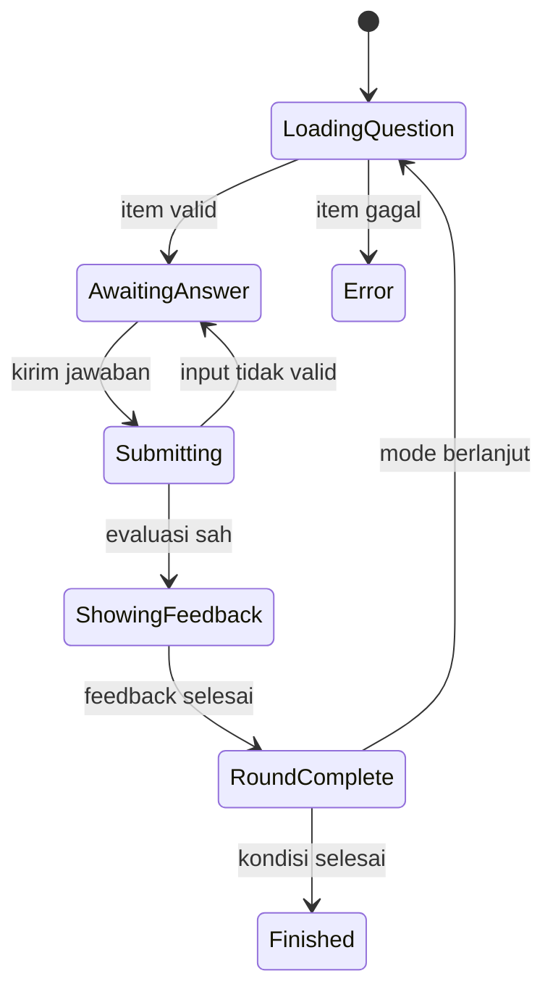

# Engine Quiz

**Proyek:** Website Les Privat Kak Harris  
**Lokasi tujuan:** `docs/Games/03-Engine-Quiz.md`  
**Status:** Rancangan awal  
**Prioritas:** P0 — engine pertama untuk MVP  
**Fokus rilis:** Matematika SD–SMP

## 1. Tujuan

Engine Quiz menjalankan permainan berbasis satu pertanyaan dan satu jawaban pada setiap putaran. Engine ini menjadi fondasi awal untuk latihan matematika karena dapat digunakan ulang pada banyak materi tanpa menanam soal, jenjang, rumus skor, atau aturan mode langsung ke kode engine.

Engine wajib mendukung:

- pilihan tunggal;
- benar–salah;
- jawaban angka;
- mode Endless;
- mode Terbatas berdasarkan jumlah soal;
- mode Terbatas berdasarkan waktu;
- umpan balik langsung setelah jawaban;
- ringkasan hasil yang mengikuti kontrak lintas engine.

## 2. Batas Tanggung Jawab

### Engine Quiz menangani

- alur satu putaran soal;
- state pertanyaan aktif;
- penerimaan aksi memilih, mengetik, mengirim, dan melanjutkan;
- penguncian input setelah jawaban dikirim;
- permintaan evaluasi jawaban kepada Answer Evaluator;
- penyajian umpan balik hasil evaluasi;
- permintaan soal berikutnya;
- detail hasil khusus quiz.

### Engine Quiz tidak menangani

- autentikasi dan hak akses murid;
- query katalog game;
- penyimpanan langsung ke Firestore;
- perhitungan XP atau achievement permanen;
- penentuan kondisi akhir mode;
- isi dan kurasi bank soal;
- validasi jenjang akun;
- rumus skor yang tersebar di komponen UI.

Tanggung jawab tersebut tetap berada pada modul bersama yang ditetapkan dalam `02-Arsitektur-Game.md`.

## 3. Target Penggunaan

### Jenjang awal

- SD kelas 1–6.
- SMP kelas 7–9.

### Contoh materi

- operasi hitung dasar;
- pecahan dan desimal;
- perbandingan;
- bilangan bulat;
- aljabar dasar;
- geometri;
- pengukuran;
- statistika dasar.

Struktur engine tidak membatasi kelas 10–12, tetapi dukungan konten SMA, input notasi kompleks, grafik, akar, dan ekspresi simbolik belum termasuk MVP.

## 4. Tipe Pertanyaan Resmi

| `questionType` | Nama | Bentuk jawaban | Dukungan MVP |
| --- | --- | --- | --- |
| `single_choice` | Pilihan tunggal | Satu `optionId` | Ya |
| `true_false` | Benar–salah | `true` atau `false` | Ya |
| `numeric_input` | Jawaban angka | Nilai numerik ternormalisasi | Ya |
| `short_text` | Jawaban teks pendek | Teks ternormalisasi | Setelah MVP |
| `multi_select` | Pilihan jamak | Beberapa `optionId` | Setelah MVP |
| `fraction_input` | Input pecahan terstruktur | Pembilang dan penyebut | Setelah MVP dasar |

Tipe yang belum didukung harus ditolak saat konfigurasi dimuat. Engine tidak boleh menampilkan tipe tersebut sebagai soal biasa lalu menilainya dengan tebakan.

## 5. Kontrak Item Pertanyaan

Question Provider memberikan item kepada engine dengan bentuk umum:

```json
{
  "questionId": "bb7-add-001",
  "questionVersion": 1,
  "questionType": "single_choice",
  "prompt": {
    "format": "text",
    "content": "Hasil dari -8 + 13 adalah ..."
  },
  "options": [
    { "optionId": "a", "content": "-21" },
    { "optionId": "b", "content": "-5" },
    { "optionId": "c", "content": "5" },
    { "optionId": "d", "content": "21" }
  ],
  "answerSpecRef": "answer-ref-bb7-add-001-v1",
  "explanation": {
    "format": "text",
    "content": "Bergerak 13 langkah ke kanan dari -8 menghasilkan 5."
  },
  "metadata": {
    "educationLevel": "SMP",
    "grades": [7],
    "topicId": "bilangan-bulat",
    "subtopicId": "penjumlahan",
    "difficulty": "easy",
    "estimatedSeconds": 30,
    "curriculumTags": ["bilangan"]
  }
}
```

### Aturan item

- `questionId` stabil dan unik di dalam bank soal.
- `questionVersion` naik jika jawaban, prompt, atau makna soal berubah.
- `questionType` harus didukung oleh engine dan evaluator.
- `prompt.content` tidak boleh kosong.
- `answerSpecRef` mengarah ke spesifikasi jawaban yang dinilai oleh evaluator; engine tidak menentukan kunci jawaban sendiri.
- `options` wajib untuk `single_choice`, berjumlah minimal dua, dan setiap `optionId` unik.
- `options` tidak digunakan untuk `numeric_input`.
- `explanation` boleh tidak ada, tetapi direkomendasikan untuk soal yang berpotensi menimbulkan miskonsepsi.
- metadata jenjang, kelas, topik, dan kesulitan wajib lolos filter sebelum item diberikan kepada engine.

Pada MVP berbasis klien, data jawaban mungkin masih tersedia di bundle atau respons jaringan. Pemisahan `answerSpecRef` tetap digunakan agar kontrak tidak mengikat engine pada lokasi kunci jawaban dan dapat dipindahkan ke evaluator tepercaya kemudian.

## 6. Konfigurasi Khusus Engine

Konfigurasi umum mengikuti `02-Arsitektur-Game.md`. Properti berikut berada di dalam `engineConfig`:

```json
{
  "engineConfig": {
    "supportedQuestionTypes": [
      "single_choice",
      "true_false",
      "numeric_input"
    ],
    "shuffleQuestions": true,
    "shuffleOptions": true,
    "allowSkip": false,
    "allowAnswerChangeBeforeSubmit": true,
    "autoSubmitSingleChoice": false,
    "feedbackMode": "immediate",
    "feedbackDurationMs": 1200,
    "showCorrectAnswerAfterWrong": true,
    "showExplanation": true,
    "numericInput": {
      "allowNegative": true,
      "allowDecimal": true,
      "allowFractionText": false,
      "decimalSeparators": [",", "."],
      "maxLength": 12
    },
    "repeatPolicy": {
      "minimumGap": 5,
      "retryWrongAfterRounds": 3
    }
  }
}
```

### Nilai resmi MVP

- `feedbackMode`: hanya `immediate`.
- `feedbackDurationMs`: 500–5000 milidetik.
- `autoSubmitSingleChoice`: default `false` agar sentuhan yang salah masih dapat diperbaiki sebelum dikirim.
- `allowSkip`: default `false`.
- `shuffleOptions`: hanya berlaku pada pilihan; evaluator selalu memakai `optionId`, bukan posisi.
- `showCorrectAnswerAfterWrong`: default `true` untuk latihan.
- `maxLength`: batas karakter input, bukan batas nilai matematika.

Konfigurasi yang berada di luar rentang valid ditolak sebelum sesi dimulai.

## 7. State Internal Engine

```js
{
  phase: "loading_question",
  roundNumber: 1,
  currentQuestion: null,
  presentedOptionOrder: [],
  draftAnswer: null,
  submittedAnswer: null,
  evaluation: null,
  inputLocked: false,
  questionShownAt: null,
  submittedAt: null,
  feedbackEndsAt: null,
  pendingNextQuestion: false,
  perTypeSummary: {
    single_choice: { attempted: 0, correct: 0 },
    true_false: { attempted: 0, correct: 0 },
    numeric_input: { attempted: 0, correct: 0 }
  }
}
```

Nilai `phase` dibatasi menjadi:

- `loading_question`;
- `awaiting_answer`;
- `submitting`;
- `showing_feedback`;
- `round_complete`;
- `finished`;
- `error`.

State skor, streak, mode, waktu, dan status sesi tetap dimiliki Session Manager. Engine hanya menyimpan state yang khusus untuk mekanik quiz.

## 8. Alur Satu Putaran



Urutan normal:

1. Engine meminta satu item dari Question Provider.
2. Engine memvalidasi bentuk item yang diperlukan untuk tampilan.
3. Opsi diacak bila diizinkan dan urutannya dicatat.
4. Engine menandai waktu saat soal benar-benar terlihat.
5. Murid memilih atau memasukkan jawaban.
6. Engine memvalidasi input dasar dan mengunci input saat dikirim.
7. Answer Evaluator mengembalikan hasil terstruktur.
8. Scoring Service menerima event jawaban beserta waktu respons dan kesulitan.
9. Session Manager memperbarui hitungan, skor, streak, dan ringkasan.
10. UI menampilkan umpan balik dan penjelasan sesuai konfigurasi.
11. Mode Controller menentukan apakah sesi selesai.
12. Jika berlanjut, engine meminta soal berikutnya; jika selesai, engine menghasilkan ringkasan khusus quiz.

Soal berikutnya tidak boleh dimuat sebelum hasil putaran aktif tercatat. Hal ini mencegah jawaban hilang ketika pengguna menekan tombol dengan cepat.

## 9. Aksi yang Diterima

| `action.type` | Fungsi | Fase yang sah |
| --- | --- | --- |
| `SELECT_OPTION` | Memilih satu opsi | `awaiting_answer` |
| `SET_NUMERIC_INPUT` | Mengubah draf angka | `awaiting_answer` |
| `SUBMIT_ANSWER` | Mengirim jawaban | `awaiting_answer` |
| `SKIP_QUESTION` | Melewati soal jika diizinkan | `awaiting_answer` |
| `CONTINUE` | Menutup feedback manual | `showing_feedback` |
| `RETRY_LOAD` | Memuat ulang soal yang gagal | `error` |

Contoh aksi:

```js
{ type: "SELECT_OPTION", optionId: "c" }
{ type: "SET_NUMERIC_INPUT", value: "-12,5" }
{ type: "SUBMIT_ANSWER", actionId: "act_uuid", clientTimestamp: 1720000000000 }
```

### Aturan pemrosesan aksi

- setiap pengiriman memiliki `actionId` unik;
- hanya pengiriman pertama yang sah pada satu putaran diproses;
- action pada fase yang salah diabaikan dan dapat dicatat sebagai diagnostic event;
- klik ganda tidak menambah `attempted`, skor, atau penalti;
- input dikunci selama `submitting` dan `showing_feedback`;
- action yang tiba setelah deadline mode waktu tidak dinilai;
- engine tidak mempercayai `clientTimestamp` sebagai satu-satunya sumber waktu.

## 10. Evaluasi Jawaban

Engine mengirimkan konteks evaluasi berikut:

```js
{
  questionId,
  questionVersion,
  answerSpecRef,
  questionType,
  submittedAnswer,
  actionId,
  presentedOptionOrder
}
```

Evaluator mengembalikan:

```js
{
  isValid: true,
  isCorrect: true,
  normalizedAnswer: "5",
  expectedAnswer: "5",
  feedbackCode: "correct",
  misconceptionCode: null,
  evaluationVersion: 1
}
```

Jika input tidak valid, hasilnya berbentuk:

```js
{
  isValid: false,
  isCorrect: null,
  normalizedAnswer: null,
  expectedAnswer: null,
  feedbackCode: "invalid_numeric_format",
  misconceptionCode: null,
  evaluationVersion: 1
}
```

Input tidak valid tidak dihitung sebagai salah dan input dibuka kembali. Setelah jawaban valid dinilai, putaran tidak dapat dikembalikan ke `awaiting_answer`.

## 11. Aturan per Tipe Pertanyaan

### 11.1 Pilihan tunggal

- jawaban disimpan sebagai `optionId`;
- urutan tampilan opsi boleh diacak tanpa mengubah kunci;
- opsi tidak boleh dibedakan hanya dengan warna;
- tidak ada opsi yang terpilih saat soal pertama kali ditampilkan;
- tombol kirim nonaktif sampai satu opsi dipilih, kecuali `autoSubmitSingleChoice: true`;
- teks opsi yang sama tidak disarankan walaupun ID berbeda.

### 11.2 Benar–salah

- secara data menggunakan nilai boolean;
- UI menampilkan label **Benar** dan **Salah**, bukan `true` dan `false`;
- posisi tombol tidak diacak antarputaran agar tidak menjebak sentuhan;
- pernyataan harus cukup jelas dan tidak memakai negasi ganda yang tidak perlu.

### 11.3 Jawaban angka

- keyboard virtual atau `inputmode` disesuaikan dengan angka yang diizinkan;
- tanda minus tersedia bila `allowNegative: true`;
- koma dan titik dapat diterima sebagai desimal lalu dinormalisasi;
- pemisah ribuan tidak diterima pada MVP agar tidak ambigu;
- spasi luar dihapus;
- nilai seperti `-0` dinormalisasi menjadi `0`;
- perbandingan desimal memakai aturan toleransi dari spesifikasi jawaban, bukan perbandingan string;
- input kosong tidak dapat dikirim;
- notasi ilmiah, akar, pangkat, dan ekspresi aljabar belum didukung pada MVP.

Contoh normalisasi:

| Input murid | Hasil normalisasi |
| --- | --- |
| ` 12 ` | `12` |
| `-08` | `-8` |
| `2,5` | `2.5` |
| `-0` | `0` |
| `1.000` | Ditolak sebagai ambigu pada MVP |
| `3/4` | Ditolak jika `allowFractionText: false` |

## 12. Skor, Streak, dan Waktu Respons

Engine tidak menghitung rumus skor sendiri. Setelah evaluasi sah, engine mengirim event:

```js
{
  type: "quiz_answer_evaluated",
  isCorrect: true,
  responseTimeMs: 8400,
  difficulty: "easy",
  questionType: "numeric_input",
  topicId: "bilangan-bulat",
  questionId: "bb7-add-001"
}
```

Aturan awal:

- waktu respons dihitung sejak soal siap terlihat hingga pengiriman pertama yang sah;
- waktu saat sesi resmi `paused` tidak dihitung;
- jawaban benar menambah streak;
- jawaban salah atau `skipped` memutus streak;
- input tidak valid tidak memutus streak;
- bonus kecepatan hanya digunakan bila konfigurasi game mengaktifkannya;
- skor salah tidak negatif pada MVP;
- perubahan kesulitan berasal dari Difficulty Controller setelah hasil putaran dicatat.

## 13. Umpan Balik Pembelajaran

Jenis umpan balik minimum:

| Kondisi | `feedbackCode` | Perilaku UI |
| --- | --- | --- |
| Benar | `correct` | Tanda benar dan penguatan singkat |
| Salah | `incorrect` | Tanda salah, jawaban benar bila diizinkan, dan penjelasan |
| Input angka tidak sah | `invalid_numeric_format` | Pesan format tanpa menghitung jawaban |
| Soal dilewati | `skipped` | Tampilkan jawaban atau petunjuk sesuai konfigurasi |

Umpan balik harus:

- menjelaskan kesalahan tanpa mempermalukan murid;
- tidak hanya mengandalkan warna;
- cukup singkat agar ritme bermain tetap terjaga;
- dapat dibaca manual sebelum lanjut untuk penjelasan panjang;
- tidak menampilkan konfeti atau animasi berat pada setiap jawaban;
- menggunakan `misconceptionCode` untuk penjelasan spesifik bila tersedia.

Mode asesmen tanpa jawaban langsung dapat ditambahkan kemudian sebagai `feedbackMode: end_of_session`, tetapi belum termasuk MVP.

## 14. Pemilihan Soal dan Pengulangan

Engine meminta soal melalui Question Provider dengan konteks:

```js
{
  gameId,
  sessionId,
  allowedQuestionTypes,
  topicIds,
  educationLevel,
  grade,
  currentDifficulty,
  excludedQuestionIds,
  wrongQuestionIdsEligibleForRetry
}
```

Aturan:

- filter jenjang dan kelas dilakukan sebelum pemilihan;
- soal yang sama tidak muncul dalam jarak kurang dari `minimumGap` jika persediaan cukup;
- opsi diacak oleh engine atau provider, tetapi tidak keduanya pada putaran yang sama;
- soal yang pernah salah dapat dimunculkan lagi setelah jarak minimum untuk penguatan;
- pada `limited_questions`, provider harus menjamin persediaan cukup sebelum sesi dimulai;
- pada Endless, provider boleh membuat batch tambahan atau memakai generator terkontrol;
- ID soal yang sudah digunakan masuk checkpoint agar refresh tidak mengulang dari awal.

Detail skema dan kurasi konten akan ditetapkan dalam `09-Bank-Soal.md`.

## 15. Integrasi Mode

### Endless

- meminta soal sampai selesai manual, batas keamanan, nyawa habis bila aktif, atau konten habis;
- Difficulty Controller dapat menaikkan atau menurunkan tingkat soal;
- pengulangan soal dibatasi;
- checkpoint dilakukan sesuai interval;
- hadiah mengikuti pembatasan Endless pada `14-Mode-Permainan.md`.

### Terbatas berdasarkan soal

- setiap jawaban sah menambah `answeredCount`;
- jumlah pertanyaan yang dinilai harus tepat sesuai `questionLimit`;
- input tidak valid tidak mengurangi sisa soal;
- `skipped` dihitung jika fitur lewati aktif;
- soal terakhir tetap menampilkan feedback sebelum sesi diselesaikan.

### Terbatas berdasarkan waktu

- countdown dimulai setelah soal pertama siap;
- input dikunci saat deadline;
- jawaban yang sudah diterima sebelum deadline tetap boleh diselesaikan evaluasinya;
- soal baru tidak dimuat setelah waktu habis;
- feedback aktif diselesaikan secara singkat sebelum ringkasan ditampilkan.

### Terbatas berdasarkan nyawa

Dapat ditambahkan setelah MVP. Jawaban salah mengurangi nyawa melalui Mode Controller, bukan langsung oleh engine.

## 16. Pause, Checkpoint, dan Pemulihan

Checkpoint khusus Engine Quiz menyimpan:

```json
{
  "roundNumber": 6,
  "currentQuestionId": "bb7-add-006",
  "currentQuestionVersion": 1,
  "presentedOptionOrder": ["c", "a", "d", "b"],
  "phase": "awaiting_answer",
  "draftAnswer": null,
  "answeredQuestionIds": ["bb7-add-001", "bb7-add-002"],
  "wrongQuestionIds": ["bb7-add-002"],
  "perTypeSummary": {
    "single_choice": { "attempted": 3, "correct": 2 },
    "numeric_input": { "attempted": 2, "correct": 2 }
  }
}
```

Aturan pemulihan:

- draf jawaban angka tidak wajib disimpan ke server;
- soal aktif dan urutan opsinya harus sama setelah dipulihkan;
- putaran yang sudah dinilai tidak boleh dinilai ulang;
- checkpoint pada fase `submitting` dipulihkan dari catatan action terakhir atau kembali ke state aman tanpa menambah hasil;
- sesi berbatas waktu mengikuti aturan deadline asli;
- versi soal yang tidak lagi kompatibel mengakhiri sesi dengan aman.

## 17. Kontrak Ringkasan Khusus Quiz

Engine menambahkan `engineSummary` pada kontrak hasil umum:

```json
{
  "engineSummary": {
    "questionTypes": {
      "single_choice": { "attempted": 4, "correct": 3 },
      "true_false": { "attempted": 2, "correct": 2 },
      "numeric_input": { "attempted": 4, "correct": 3 }
    },
    "averageResponseTimeMs": 11840,
    "medianResponseTimeMs": 9700,
    "difficultyStarted": "easy",
    "difficultyEnded": "medium",
    "misconceptions": [
      { "code": "integer_sign_error", "count": 1 }
    ]
  }
}
```

Ringkasan tidak menyimpan teks soal atau jawaban bebas jika tidak diperlukan. Detail per item untuk analisis belajar, bila disimpan, harus mengikuti kebijakan `11-Database.md` dan `15-Analitik.md`.

## 18. UI Minimum

### Layar persiapan

- judul dan deskripsi game;
- materi serta jenjang;
- mode dan batas sesi;
- aturan skor utama;
- tombol mulai yang baru aktif setelah konten siap.

### Layar permainan

- indikator progres sesuai mode;
- skor dan streak jika diaktifkan;
- timer bila relevan;
- prompt soal yang terbaca jelas;
- area jawaban sesuai tipe;
- tombol kirim;
- tombol jeda dan keluar sesuai konfigurasi.

### Layar feedback

- status benar atau salah dengan ikon dan teks;
- jawaban yang benar bila diizinkan;
- penjelasan singkat;
- tombol lanjut bila feedback tidak otomatis.

### Layar hasil

- skor;
- akurasi;
- benar, salah, dan dilewati;
- streak tertinggi;
- waktu rata-rata;
- ringkasan materi yang perlu dilatih;
- tombol main lagi dan kembali ke katalog.

Pada ponsel, pilihan jawaban memiliki area sentuh minimal yang nyaman, tombol utama tidak tertutup keyboard, dan halaman tidak memaksa zoom horizontal.

## 19. Error dan Kondisi Batas

| Kondisi | Perilaku wajib |
| --- | --- |
| Item tidak sesuai schema | Tolak item dan minta pengganti; jangan tampilkan soal rusak |
| Tidak ada soal pengganti | Akhiri dengan `no_content` atau gagal sebelum mulai |
| Opsi kurang dari dua | Item tidak valid |
| `optionId` duplikat | Item tidak valid |
| Evaluator tidak tersedia | Kunci input sementara dan tawarkan coba lagi |
| Evaluasi gagal setelah submit | Pertahankan action dan kirim ulang secara idempoten |
| Klik ganda | Proses action pertama saja |
| Input angka terlalu panjang | Tolak sebelum submit dan jelaskan batas |
| Waktu habis bersamaan dengan submit | Nilai hanya action yang diterima sebelum deadline |
| Soal berubah saat sesi aktif | Gunakan snapshot versi sesi atau hentikan dengan `incompatible_version` |
| Jaringan putus | Lanjutkan lokal bila evaluator tersedia; tandai hasil belum tersinkron |
| Tab ditutup saat feedback | Pulihkan putaran sebagai sudah dinilai, bukan soal baru |

## 20. Analitik Minimum

Event khusus Engine Quiz:

- `quiz_question_presented`;
- `quiz_answer_submitted`;
- `quiz_answer_evaluated`;
- `quiz_invalid_input`;
- `quiz_question_skipped`;
- `quiz_question_load_failed`.

Payload minimum menggunakan ID dan metadata, bukan teks penuh:

```js
{
  gameId,
  gameVersion,
  sessionId,
  questionId,
  questionVersion,
  questionType,
  topicId,
  difficulty,
  isCorrect,
  responseTimeMs,
  evaluationVersion
}
```

Event tidak boleh memuat nama, nomor telepon, atau data pribadi lain yang tidak relevan. Detail kebijakan analitik mengikuti `15-Analitik.md`.

## 21. Struktur Implementasi yang Disarankan

```text
games/engines/quiz/
├── quiz-engine.js
├── quiz-state.js
├── quiz-actions.js
├── quiz-validator.js
├── quiz-summary.js
├── renderers/
│   ├── single-choice-renderer.js
│   ├── true-false-renderer.js
│   └── numeric-input-renderer.js
└── quiz-engine.test.js
```

Renderer hanya menangani tampilan dan aksi UI. Evaluasi jawaban tetap memakai service bersama agar tipe yang sama dapat dipakai oleh engine lain.

## 22. Contoh Konfigurasi Game

```json
{
  "schemaVersion": 1,
  "gameId": "misi-bilangan-bulat-01",
  "version": 1,
  "status": "published",
  "title": "Misi Bilangan Bulat",
  "description": "Latihan operasi bilangan bulat kelas 7.",
  "engineType": "quiz",
  "education": {
    "levels": ["SMP"],
    "grades": [7],
    "curriculumTags": ["bilangan", "bilangan-bulat"]
  },
  "modes": [
    {
      "type": "limited_questions",
      "label": "10 Soal",
      "questionLimit": 10,
      "allowPause": true
    },
    {
      "type": "limited_time",
      "label": "2 Menit",
      "timeLimitSeconds": 120,
      "allowPause": false
    },
    {
      "type": "endless",
      "label": "Endless",
      "allowPause": true,
      "allowManualFinish": true
    }
  ],
  "content": {
    "questionSetIds": ["bilangan-bulat-kelas-7-v1"],
    "initialDifficulty": "easy",
    "allowedDifficulties": ["easy", "medium", "hard"]
  },
  "scoring": {
    "version": 1,
    "baseCorrect": 100,
    "wrongPenalty": 0,
    "streakEnabled": true,
    "speedBonusEnabled": false
  },
  "progress": {
    "xpEnabled": true,
    "achievementsEnabled": true,
    "checkpointEnabled": true
  },
  "ui": {
    "theme": "default-math",
    "showProgress": true,
    "showTimer": true
  },
  "engineConfig": {
    "supportedQuestionTypes": [
      "single_choice",
      "true_false",
      "numeric_input"
    ],
    "shuffleQuestions": true,
    "shuffleOptions": true,
    "allowSkip": false,
    "allowAnswerChangeBeforeSubmit": true,
    "autoSubmitSingleChoice": false,
    "feedbackMode": "immediate",
    "feedbackDurationMs": 1200,
    "showCorrectAnswerAfterWrong": true,
    "showExplanation": true,
    "numericInput": {
      "allowNegative": true,
      "allowDecimal": false,
      "allowFractionText": false,
      "decimalSeparators": [",", "."],
      "maxLength": 8
    },
    "repeatPolicy": {
      "minimumGap": 5,
      "retryWrongAfterRounds": 3
    }
  }
}
```

## 23. Pengujian Minimum

### Unit test

- validasi konfigurasi engine;
- transisi fase yang sah dan tidak sah;
- satu jawaban per putaran;
- pengabaian klik ganda;
- normalisasi angka negatif dan desimal;
- pengacakan opsi tetap mempertahankan kunci berdasarkan ID;
- perhitungan ringkasan per tipe;
- pemulihan checkpoint.

### Integration test

- Question Provider → Engine → Evaluator → Scoring Service → Session Manager;
- sesi 10 soal selesai tepat setelah 10 item dinilai;
- mode waktu menolak jawaban sesudah deadline;
- Endless dapat selesai manual dan dipulihkan;
- kegagalan penyimpanan hasil dapat dikirim ulang tanpa hasil ganda;
- pergantian kesulitan menghasilkan permintaan soal sesuai tingkat baru.

### Pengujian UI

- layar ponsel kecil;
- keyboard angka tidak menutup tombol utama;
- pilihan dapat ditekan dengan sentuhan;
- pembaca layar menerima label soal dan status jawaban;
- warna bukan satu-satunya penanda;
- refresh pada setiap fase tidak merusak hitungan;
- akun SD tidak dapat membuka quiz khusus SMP melalui URL langsung.

## 24. Kriteria Penerimaan MVP

Engine Quiz dianggap siap diimplementasikan jika:

1. Mendukung `single_choice`, `true_false`, dan `numeric_input`.
2. Mengikuti antarmuka engine pada `02-Arsitektur-Game.md`.
3. Menggunakan Mode Controller untuk Endless, batas soal, dan batas waktu.
4. Menggunakan Question Provider dan Answer Evaluator, bukan bank soal langsung dari UI.
5. Hanya memproses satu jawaban sah per putaran.
6. Menormalisasi input angka dan membedakan input tidak valid dari jawaban salah.
7. Menghasilkan ringkasan umum dan `engineSummary` khusus quiz.
8. Memulihkan sesi tanpa menilai ulang putaran yang selesai.
9. Dapat dihancurkan tanpa meninggalkan timer, listener, atau input aktif.
10. Lulus pengujian ponsel, desktop, jenjang, mode, jaringan, dan klik ganda.

## 25. Fitur Setelah MVP

- pilihan jamak;
- input pecahan terstruktur;
- jawaban teks pendek dengan variasi sah;
- gambar dan audio pada prompt;
- feedback pada akhir sesi untuk mode asesmen;
- pembahasan langkah demi langkah;
- dukungan notasi matematika kompleks;
- evaluasi tepercaya di backend;
- authoring tool untuk membuat soal tanpa mengedit JSON;
- adaptasi berdasarkan pola miskonsepsi yang lebih kaya.

## 26. Keputusan yang Ditetapkan

- Engine Quiz adalah engine pertama dan prioritas P0.
- MVP memakai tiga tipe soal: pilihan tunggal, benar–salah, dan jawaban angka.
- Pilihan dinilai berdasarkan `optionId`, bukan urutan atau teks.
- Input angka dinormalisasi sebelum dibandingkan.
- Input tidak valid tidak dihitung sebagai jawaban salah.
- Satu putaran hanya menerima satu jawaban sah.
- Feedback MVP diberikan langsung setelah setiap jawaban.
- Mode, skor, XP, penyimpanan, dan pemilihan soal tetap berada pada modul bersama.
- Engine menyimpan detail khusus di `engineSummary` tanpa mengganti kontrak hasil umum.
- SMA belum menjadi target konten, tetapi tipe pertanyaan dapat diperluas kemudian.

## 27. Langkah Berikutnya

Setelah dokumen ini disetujui, lanjutkan ke `04-Engine-Endless.md`. Dokumen tersebut harus membedakan Engine Endless sebagai mekanik latihan cepat berkelanjutan dari mode `endless` yang dapat dipakai lintas engine, serta menetapkan generator soal, loop permainan, kenaikan kesulitan, variasi operasi, dan perlindungan dari pengulangan berlebihan.
