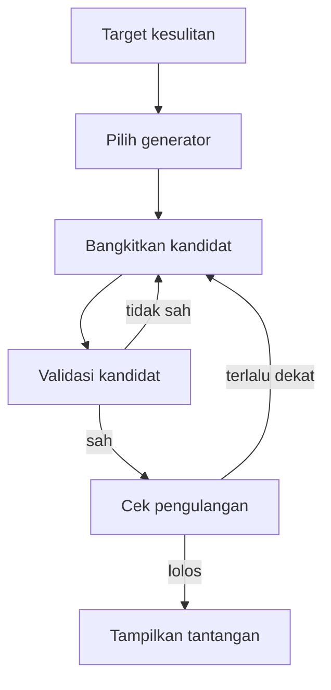
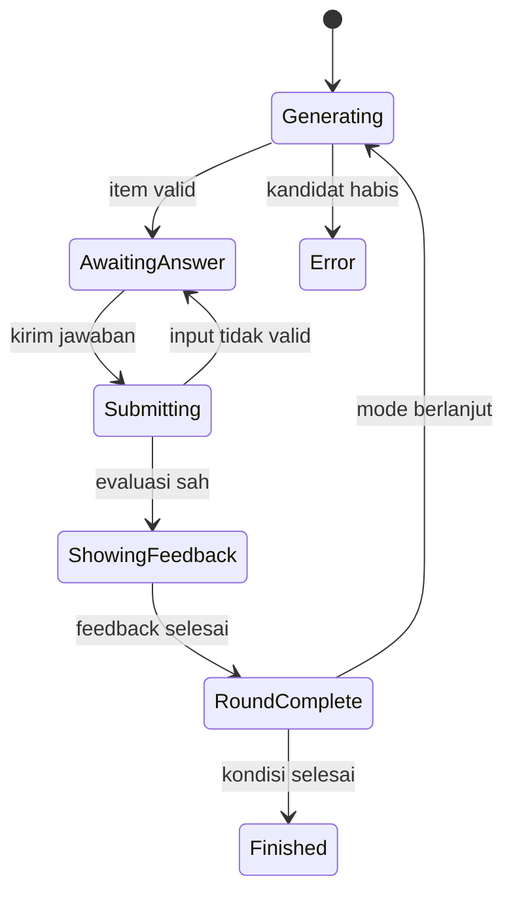

# Engine Endless

**Proyek:** Website Les Privat Kak Harris  
**Lokasi tujuan:** `docs/Games/04-Engine-Endless.md`  
**Status:** Rancangan awal  
**Prioritas:** P0 — pendamping Engine Quiz untuk MVP  
**Fokus rilis:** Matematika SD–SMP

## 1. Tujuan

Engine Endless menjalankan latihan singkat yang tantangannya dapat dibangkitkan secara terkontrol selama sesi berlangsung. Engine ini cocok untuk materi yang memiliki pola soal jelas, jawaban objektif, dan variasi parameter yang banyak, seperti operasi hitung, pecahan sederhana, perbandingan, pola bilangan, serta aljabar dasar.

Tujuan utamanya adalah:

- menyediakan pasokan soal tanpa harus menulis setiap kombinasi secara manual;
- meningkatkan atau menurunkan kesulitan berdasarkan performa murid;
- mencegah soal identik muncul terlalu cepat;
- menghasilkan soal dan jawaban yang tetap dapat direproduksi untuk audit;
- mendukung mode Endless maupun mode Terbatas;
- memakai kontrak sesi, skor, hasil, dan penyimpanan yang sama dengan engine lain.

Engine ini tidak boleh menghasilkan soal bebas tanpa aturan. Semua variasi berasal dari generator yang telah didaftarkan, memiliki batas parameter, validator, serta pengujian jawaban.

## 2. Pembedaan Engine dan Mode

Nama dokumen **Engine Endless** dipertahankan karena sudah digunakan dalam roadmap. Namun, istilah ini tidak sama dengan mode `endless` pada `14-Mode-Permainan.md`.

| Konsep | Fungsi | Contoh nilai |
| --- | --- | --- |
| Engine | Menentukan cara tantangan dibangkitkan dan dimainkan | `generated_drill` |
| Mode | Menentukan batas dan kondisi selesai sesi | `endless`, `limited_questions`, `limited_time` |

ID teknis resmi yang direkomendasikan untuk engine ini adalah:

```json
{
  "engineType": "generated_drill",
  "mode": {
    "type": "limited_questions",
    "questionLimit": 10
  }
}
```

Dengan pemisahan ini, latihan berhitung generatif dapat dimainkan sebagai:

- latihan tanpa target tetap dengan mode `endless`;
- tantangan 10 soal dengan mode `limited_questions`;
- tantangan 60 detik dengan mode `limited_time`.

Engine Registry dalam `02-Arsitektur-Game.md` memakai ID `generated_drill` dengan implementasi `createGeneratedDrillEngine`.

## 3. Batas Tanggung Jawab

### Engine menangani

- alur satu putaran latihan generatif;
- pemanggilan generator yang terdaftar;
- validasi bentuk tantangan hasil generator;
- pencegahan pengulangan terlalu cepat;
- penyimpanan fingerprint dan state generator selama sesi;
- permintaan evaluasi jawaban;
- penyajian umpan balik singkat;
- ringkasan khusus latihan generatif.

### Engine tidak menangani

- autentikasi dan hak akses murid;
- filter katalog berdasarkan jenjang;
- penulisan langsung ke Firestore;
- perhitungan XP atau achievement permanen;
- penentuan kondisi selesai mode;
- rumus skor lintas game;
- penerbitan generator atau materi tanpa proses validasi;
- pembuatan soal memakai AI secara langsung saat sesi berlangsung.

Mode Controller tetap menentukan kapan sesi selesai. Difficulty Controller menentukan target tingkat kesulitan. Question Provider atau Generator Registry menyediakan tantangan. Answer Evaluator memeriksa jawaban.

## 4. Target Penggunaan

### Jenjang awal

- SD kelas 1–6.
- SMP kelas 7–9.

### Materi yang cocok

- penjumlahan, pengurangan, perkalian, dan pembagian;
- operasi campuran;
- bilangan bulat;
- pecahan dan desimal sederhana;
- faktor dan kelipatan;
- perbandingan dan persen;
- konversi satuan;
- pola bilangan terkontrol;
- substitusi dan operasi aljabar dasar;
- luas, keliling, dan volume dengan parameter sah.

### Materi yang tidak cocok untuk MVP

- soal cerita panjang yang membutuhkan kurasi bahasa;
- pembuktian dan jawaban terbuka;
- konstruksi geometri bebas;
- grafik interaktif;
- ekspresi simbolik kompleks;
- materi yang memiliki beberapa strategi atau jawaban sah tetapi belum didukung evaluator.

Soal semacam itu lebih tepat memakai bank soal statis pada Engine Quiz atau engine khusus.

## 5. Prinsip Generator

Setiap generator wajib mengikuti prinsip berikut:

1. **Deterministik.** Seed dan versi generator yang sama menghasilkan tantangan yang sama.
2. **Terbatas.** Semua parameter memiliki rentang dan aturan yang jelas.
3. **Valid.** Tidak boleh menghasilkan pembagian nol, nilai di luar jenjang, prompt kosong, atau jawaban tak terdefinisi.
4. **Dapat diuji.** Jawaban dapat dihitung ulang oleh validator independen.
5. **Dapat diaudit.** Hasil sesi menyimpan ID generator, versi, seed, dan parameter penting.
6. **Tidak membocorkan jawaban ke UI.** Tampilan menerima data presentasi; Answer Evaluator menerima spesifikasi jawaban.
7. **Tidak bergantung jaringan per putaran.** Generator MVP dapat berjalan lokal setelah definisinya dimuat.
8. **Tidak memakai keacakan global.** Generator memakai sumber angka acak yang menerima seed dan state.

Generator soal berbasis AI langsung tidak termasuk MVP karena hasilnya sulit dijamin benar, lambat, memerlukan biaya jaringan, dan tidak mudah direproduksi.

## 6. Kontrak Konfigurasi Engine

Properti khusus berikut ditempatkan di dalam `engineConfig`:

```json
{
  "engineConfig": {
    "generatorPool": [
      {
        "generatorId": "integer-addition",
        "generatorVersion": 1,
        "weight": 3,
        "allowedDifficulties": ["easy", "medium", "hard"]
      },
      {
        "generatorId": "integer-subtraction",
        "generatorVersion": 1,
        "weight": 2,
        "allowedDifficulties": ["easy", "medium", "hard"]
      }
    ],
    "answerInputType": "numeric_input",
    "feedbackMode": "immediate",
    "feedbackDurationMs": 1000,
    "showExplanation": true,
    "generation": {
      "seedPolicy": "session",
      "prefetchCount": 3,
      "maxGenerationAttempts": 10,
      "minimumFingerprintGap": 8,
      "recentFingerprintLimit": 30
    },
    "difficulty": {
      "policy": "adaptive",
      "initial": "easy",
      "allowed": ["easy", "medium", "hard"],
      "evaluationWindow": 5,
      "increaseAccuracy": 0.8,
      "decreaseAccuracy": 0.5,
      "cooldownRounds": 3
    },
    "numericInput": {
      "allowNegative": true,
      "allowDecimal": false,
      "allowFractionText": false,
      "decimalSeparators": [",", "."],
      "maxLength": 12
    }
  }
}
```

### Aturan validasi

- `generatorPool` tidak boleh kosong.
- `generatorId` dan `generatorVersion` wajib tersedia di Generator Registry.
- `weight` berupa bilangan positif; bobot tidak perlu berjumlah 100.
- Setiap kesulitan pada pool harus termasuk dalam `difficulty.allowed`.
- `prefetchCount` untuk MVP berada pada rentang 0–5.
- `maxGenerationAttempts` minimal 1 dan disarankan maksimal 20.
- `minimumFingerprintGap` tidak boleh negatif.
- `evaluationWindow` minimal 3.
- `increaseAccuracy` harus lebih besar daripada `decreaseAccuracy`.
- `feedbackDurationMs` mengikuti rentang umum 500–5000 milidetik.
- Konfigurasi tidak valid ditolak sebelum sesi dibuat.

## 7. Generator Registry

Generator Registry memetakan identitas generator ke implementasi yang telah disetujui.

```js
const generatorRegistry = {
  "integer-addition@1": createIntegerAdditionV1,
  "integer-subtraction@1": createIntegerSubtractionV1,
  "multiplication-basic@1": createMultiplicationBasicV1,
};
```

Antarmuka minimal generator:

```js
{
  generatorId,
  generatorVersion,
  supportedEducation,
  supportedDifficulties,
  generate({ rng, difficulty, constraints, context }),
  validateGeneratedItem(item),
  calculateExpectedAnswer(parameters),
  createFingerprint(parameters)
}
```

Versi generator wajib naik jika perubahan dapat menghasilkan prompt, parameter, jawaban, atau distribusi soal yang berbeda dari seed yang sama. Perbaikan internal yang tidak mengubah hasil deterministik boleh tetap memakai versi lama.

## 8. Kontrak Tantangan Hasil Generator

Generator mengembalikan bentuk berikut:

```json
{
  "generatedItemId": "gen_7fa2c1",
  "generatorId": "integer-addition",
  "generatorVersion": 1,
  "seedStep": 17,
  "fingerprint": "integer-addition:-8:13",
  "questionType": "numeric_input",
  "prompt": {
    "format": "text",
    "content": "-8 + 13 = ..."
  },
  "parameters": {
    "left": -8,
    "right": 13,
    "operator": "+"
  },
  "answerSpecRef": "session-answer:17",
  "explanation": {
    "format": "text",
    "content": "Mulai dari -8 lalu bergerak 13 langkah ke kanan, sehingga hasilnya 5."
  },
  "metadata": {
    "educationLevel": "SMP",
    "grades": [7],
    "topicId": "bilangan-bulat",
    "subtopicId": "penjumlahan",
    "difficulty": "easy",
    "estimatedSeconds": 20
  }
}
```

### Aturan item

- `generatedItemId` unik dalam satu sesi.
- `fingerprint` stabil untuk kombinasi konsep dan parameter yang dianggap sama.
- `seedStep` menunjukkan posisi RNG saat item dibuat.
- `parameters` hanya berisi nilai yang diperlukan untuk reproduksi dan audit.
- `answerSpecRef` mengarah ke spesifikasi jawaban milik sesi, bukan jawaban mentah di state tampilan.
- `metadata` harus sesuai dengan konfigurasi game dan profil murid.
- Prompt, parameter, dan jawaban harus lolos validator sebelum item ditampilkan.
- Penjelasan boleh dibentuk dari template yang telah dikurasi, bukan teks bebas yang berisiko salah.

## 9. Pipeline Pembangkitan Tantangan



Urutan lengkap:

1. Engine meminta target kesulitan dari Difficulty Controller.
2. Generator dipilih dari pool menggunakan bobot dan RNG sesi.
3. Generator membuat kandidat berdasarkan seed, kesulitan, batas materi, dan konteks putaran.
4. Validator memeriksa bentuk data, rentang parameter, prompt, dan jawaban.
5. Fingerprint dibandingkan dengan riwayat terbaru.
6. Jika kandidat tidak sah atau terlalu cepat berulang, engine mencoba lagi hingga `maxGenerationAttempts`.
7. Kandidat yang lolos dicatat sebagai item aktif dan baru kemudian ditampilkan.
8. Bila seluruh percobaan gagal, engine menjalankan kebijakan fallback.

Generator tidak boleh mengubah skor, streak, mode, atau state permanen selama proses ini.

## 10. Pemilihan Generator Berbobot

Bobot mengatur frekuensi relatif, bukan menjamin urutan tertentu. Generator hanya masuk kandidat pilihan jika:

- mendukung jenjang dan kelas murid;
- mendukung target kesulitan;
- sesuai dengan topik game;
- tidak sedang dinonaktifkan;
- tidak melewati batas pengulangan generator yang ditentukan.

Contoh bobot 3 untuk penjumlahan dan 2 untuk pengurangan berarti dalam jangka panjang penjumlahan cenderung lebih sering muncul. Sistem tetap harus mencegah rentetan generator yang sama jika variasi konten menjadi terasa monoton.

Untuk MVP, pemilihan menggunakan weighted random deterministik dari RNG sesi. Rotasi atau distribusi terjamin dapat ditambahkan kemudian jika data menunjukkan bobot acak menghasilkan pengalaman yang tidak seimbang.

## 11. Pencegahan Pengulangan

Pengulangan diperiksa pada dua tingkat:

### Fingerprint item

Fingerprint mewakili tantangan yang sama atau secara praktis identik. Contoh:

```text
integer-addition:-8:13
```

Item dengan fingerprint yang sama tidak boleh muncul lagi sebelum jarak minimal `minimumFingerprintGap` tercapai.

### Pola konsep

Walaupun angkanya berbeda, pola yang sama dapat terasa berulang. Engine dapat mencatat signature tambahan, misalnya:

```text
integer-addition:negative-plus-positive
```

Pada MVP, fingerprint item wajib; pembatasan signature konsep bersifat opsional. Riwayat fingerprint dibatasi oleh `recentFingerprintLimit` agar state tidak tumbuh tanpa batas.

Jika ruang kombinasi generator sangat kecil, engine boleh melonggarkan jarak pengulangan secara bertahap setelah percobaan gagal, tetapi tidak boleh menampilkan item identik dua kali berturut-turut kecuali tidak ada alternatif yang sah. Pelonggaran harus dicatat dalam analitik internal.

## 12. Tingkat Kesulitan

Nilai resmi awal:

- `easy`;
- `medium`;
- `hard`.

Arti kesulitan ditentukan per generator, bukan hanya dari besar angka. Faktor kesulitan dapat meliputi:

- rentang bilangan;
- jumlah operasi;
- penggunaan bilangan negatif;
- ada atau tidaknya sisa pembagian;
- jumlah tempat desimal;
- kebutuhan menyamakan penyebut;
- jumlah langkah penalaran;
- bentuk prompt dan banyaknya informasi.

Contoh untuk penjumlahan bilangan bulat:

| Tingkat | Contoh batas awal |
| --- | --- |
| `easy` | Dua bilangan dari -20 sampai 20, hasil dari -30 sampai 30 |
| `medium` | Dua bilangan dari -100 sampai 100, kombinasi tanda lebih beragam |
| `hard` | Tiga bilangan atau operasi campuran dalam batas materi yang disetujui |

Rentang tersebut adalah contoh generator, bukan aturan global semua materi.

## 13. Adaptasi Kesulitan

Difficulty Controller memakai jendela jawaban terakhir sesuai `evaluationWindow`.

Aturan default MVP:

- naik satu tingkat jika minimal lima jawaban terakhir memiliki akurasi sekurangnya 80%;
- turun satu tingkat jika akurasi di bawah 50%;
- tetap jika berada di antara kedua batas;
- perubahan hanya satu tingkat per evaluasi;
- setelah perubahan, tunggu `cooldownRounds` sebelum evaluasi baru;
- kesulitan tidak boleh keluar dari daftar `difficulty.allowed`.

Waktu respons boleh menjadi sinyal pendukung, tetapi tidak boleh sendirian menaikkan atau menurunkan kesulitan pada MVP. Murid yang menjawab benar dengan lambat tetap menunjukkan pemahaman, sedangkan jawaban cepat yang salah tidak dianggap penguasaan.

Kesulitan awal dapat berasal dari konfigurasi game atau progres terakhir yang telah tervalidasi. Jika progres tidak tersedia, gunakan `difficulty.initial`.

## 14. State Internal Engine

```js
{
  phase: "generating",
  roundNumber: 1,
  currentItem: null,
  draftAnswer: null,
  submittedAnswer: null,
  evaluation: null,
  inputLocked: false,
  rng: {
    algorithm: "mulberry32",
    seed: 284917,
    step: 17
  },
  generationQueue: [],
  recentFingerprints: [],
  recentGeneratorIds: [],
  generationFailureCount: 0,
  currentDifficulty: "easy",
  lastDifficultyChangeRound: 0,
  questionShownAt: null,
  submittedAt: null,
  perGeneratorSummary: {}
}
```

Nilai `phase` dibatasi menjadi:

- `generating`;
- `awaiting_answer`;
- `submitting`;
- `showing_feedback`;
- `round_complete`;
- `finished`;
- `error`.

Skor, streak, nyawa, timer, batas mode, dan status sesi tetap dimiliki Session Manager.

## 15. Alur Satu Putaran



Urutan normal:

1. Engine meminta target kesulitan.
2. Engine mengambil item valid dari antrean atau membangkitkan item baru.
3. Item aktif dan waktu tampil dicatat.
4. Murid memasukkan jawaban.
5. Input dasar divalidasi dan dikunci saat dikirim.
6. Answer Evaluator menilai jawaban berdasarkan spesifikasi item.
7. Scoring Service menerima event jawaban.
8. Session Manager memperbarui hitungan, skor, streak, dan ringkasan.
9. Difficulty Controller menerima hasil putaran.
10. UI menampilkan feedback singkat.
11. Mode Controller menentukan apakah sesi selesai.
12. Jika berlanjut, engine berpindah ke putaran berikutnya.

Satu putaran hanya boleh menghasilkan satu event jawaban sah. Klik ganda atau pengiriman ulang setelah input terkunci harus diabaikan.

## 16. Aksi yang Diterima

| `action.type` | Fungsi | Fase yang sah |
| --- | --- | --- |
| `SET_ANSWER` | Mengubah draf jawaban | `awaiting_answer` |
| `SUBMIT_ANSWER` | Mengirim jawaban | `awaiting_answer` |
| `CONTINUE` | Menutup feedback manual | `showing_feedback` |
| `RETRY_GENERATION` | Mengulang pembangkitan setelah error yang dapat pulih | `error` |

Engine dapat menambahkan aksi pilihan jawaban jika suatu generator memakai `single_choice`, tetapi input numerik menjadi prioritas MVP.

Aksi jeda, lanjutkan sesi, berhenti manual, dan keluar ditangani oleh Session Manager atau Mode Controller, bukan sebagai aksi khusus generator.

## 17. Validasi dan Evaluasi Jawaban

Jawaban generatif tetap dinilai oleh Answer Evaluator bersama. Engine tidak membandingkan string input dengan jawaban tampilan.

Untuk `numeric_input`:

- spasi awal dan akhir dihapus;
- tanda minus Unicode dinormalisasi;
- koma atau titik dapat diterima sebagai pemisah desimal jika konfigurasi mengizinkan;
- input kosong ditolak;
- dua pemisah desimal atau format ambigu ditolak;
- nilai di luar batas panjang input ditolak;
- hasil normalisasi dibandingkan sebagai nilai matematika sesuai aturan evaluator.

Input tidak valid berbeda dari jawaban salah. Input tidak valid tidak mengubah skor, streak, nyawa, jumlah soal terjawab, atau posisi RNG. UI meminta murid memperbaiki input yang sama.

Evaluator juga menghitung ulang jawaban dari parameter generator melalui fungsi independen bila tersedia. Jika spesifikasi jawaban dan perhitungan ulang tidak cocok, item dianggap rusak, tidak dinilai kepada murid, dan dicatat sebagai error konten.

## 18. Integrasi Mode

### Mode `endless`

- engine terus meminta putaran sampai murid berhenti atau batas keamanan tercapai;
- kesulitan adaptif aktif jika dikonfigurasi;
- checkpoint dibuat berkala;
- hadiah permanen mengikuti batas pada `14-Mode-Permainan.md`.

### Mode `limited_questions`

- putaran yang telah dinilai dihitung terhadap `questionLimit`;
- kegagalan generator tidak mengurangi sisa soal;
- sesi selesai setelah item terakhir dinilai dan feedback selesai.

### Mode `limited_time`

- pembangkitan awal dilakukan sebelum countdown dimulai;
- input dikunci saat waktu habis;
- item yang tampil tetapi belum dikirim tidak dihitung sebagai jawaban;
- prefetch digunakan agar jeda pembangkitan tidak memakan waktu murid secara tidak adil.

### Mode `limited_lives`

- dapat ditambahkan setelah MVP dasar;
- hanya jawaban salah yang sah mengurangi nyawa;
- item rusak dan input tidak valid tidak mengurangi nyawa.

## 19. Prefetch dan Kinerja

Engine dapat menyiapkan beberapa item berikutnya dalam `generationQueue` agar transisi terasa cepat. Aturannya:

- prefetch tidak boleh mengubah skor atau jumlah putaran;
- item antrean dibuat dari RNG sesi dalam urutan yang tercatat;
- perubahan kesulitan membatalkan item antrean yang tidak lagi sesuai;
- item yang dibatalkan tidak boleh digunakan diam-diam pada tingkat lain;
- antrean tidak menyimpan jawaban di state presentasi;
- jumlah prefetch kecil agar memori ponsel tetap ringan.

Target awal yang disarankan:

- item berikutnya tampil maksimal 300 milidetik setelah feedback selesai pada perangkat uji;
- pembangkitan satu kandidat operasi hitung sederhana tidak menyebabkan UI tersendat;
- proses berat, jika muncul pada generator lanjutan, dipindahkan ke Web Worker.

MVP tidak membutuhkan Web Worker untuk generator aritmetika sederhana.

## 20. Skor dan Streak

Engine mengirim event, bukan menghitung skor permanen:

```js
{
  type: "answer_evaluated",
  roundId: "round-12",
  generatedItemId: "gen_7fa2c1",
  generatorId: "integer-addition",
  generatorVersion: 1,
  difficulty: "easy",
  isCorrect: true,
  responseTimeMs: 8400,
  repeatDistance: null
}
```

Scoring Service menentukan skor berdasarkan versi rumus yang aktif. Aturan umum:

- jawaban benar memberi skor dasar;
- jawaban salah tidak memberi skor negatif pada MVP;
- streak bertambah setelah jawaban benar dan kembali ke nol setelah salah;
- bonus kesulitan dibatasi;
- bonus kecepatan hanya dipakai jika materi layak dikerjakan cepat;
- item yang terulang akibat ruang kombinasi sempit dapat memiliki pengali hadiah lebih kecil;
- skor mentah tidak sama dengan XP atau penguasaan materi.

## 21. Seed, Reproduksi, dan Checkpoint

Satu sesi memiliki seed awal yang dibuat ketika sesi dibuka. Engine menyimpan:

- algoritma RNG;
- seed awal;
- posisi atau state RNG saat checkpoint;
- versi generator yang digunakan;
- fingerprint terbaru;
- item aktif dan antrean yang telah dibangkitkan;
- target kesulitan;
- hasil putaran yang sudah disahkan.

Checkpoint harus dapat memulihkan soal aktif yang sama. Sistem tidak boleh membangkitkan soal baru hanya karena halaman dimuat ulang, sebab hal itu memungkinkan murid melewati soal dengan refresh.

Contoh state checkpoint khusus engine:

```json
{
  "engineType": "generated_drill",
  "engineStateVersion": 1,
  "rng": {
    "algorithm": "mulberry32",
    "seed": 284917,
    "step": 17
  },
  "roundNumber": 12,
  "currentDifficulty": "medium",
  "currentItem": {
    "generatedItemId": "gen_7fa2c1",
    "generatorId": "integer-addition",
    "generatorVersion": 1,
    "seedStep": 17,
    "fingerprint": "integer-addition:-8:13",
    "parameters": { "left": -8, "right": 13 }
  },
  "recentFingerprints": [
    "integer-addition:-3:9",
    "integer-subtraction:12:7"
  ]
}
```

Checkpoint tidak perlu menyimpan seluruh riwayat sesi jika ringkasan putaran sudah tersimpan secara aman. Batas dan format akhirnya ditetapkan dalam `11-Database.md`.

## 22. Penghentian dan Ringkasan Hasil

Engine menghasilkan ringkasan khusus yang digabungkan ke hasil standar:

```json
{
  "engineSummary": {
    "engineType": "generated_drill",
    "engineStateVersion": 1,
    "generatorsUsed": {
      "integer-addition@1": {
        "attempted": 8,
        "correct": 7
      },
      "integer-subtraction@1": {
        "attempted": 4,
        "correct": 2
      }
    },
    "difficultyStarted": "easy",
    "difficultyEnded": "medium",
    "difficultyChanges": 1,
    "generationFailures": 0,
    "repeatRelaxations": 0
  }
}
```

Hasil final tetap memakai kontrak umum untuk `sessionId`, mode, skor, akurasi, waktu, `finishReason`, XP, dan status penyimpanan. Engine tidak memberi XP secara langsung.

## 23. Penanganan Kegagalan

| Kondisi | Perilaku |
| --- | --- |
| Generator tidak ditemukan | Tolak konfigurasi sebelum sesi dibuat |
| Versi generator tidak tersedia | Tampilkan game tidak dapat dimuat dan catat versi |
| Kandidat tidak valid | Buang kandidat dan coba lagi dalam batas |
| Fingerprint terlalu dekat | Bangkitkan kandidat lain |
| Semua percobaan gagal | Gunakan fallback yang sah atau tampilkan error dapat pulih |
| Jawaban generator tidak cocok dengan validator | Batalkan item tanpa menghukum murid |
| Antrean kosong | Bangkitkan item aktif secara langsung |
| Jaringan terputus | Lanjutkan sesi lokal jika aman dan tandai hasil menunggu sinkronisasi |
| Checkpoint rusak | Jangan menebak state; tawarkan mulai sesi baru |
| Timer habis saat membangkitkan | Akhiri mode waktu tanpa menampilkan item setengah jadi |

Engine tidak boleh masuk loop tanpa akhir saat ruang kombinasi habis. `maxGenerationAttempts` dan batas fallback wajib diterapkan.

## 24. Kebijakan Fallback

Urutan fallback yang disarankan:

1. pilih generator lain pada kesulitan yang sama;
2. gunakan generator yang sama dengan kombinasi parameter lain;
3. longgarkan jarak fingerprint secara terbatas;
4. gunakan satu tingkat lebih mudah jika konfigurasi mengizinkan;
5. akhiri sesi dengan `finishReason: no_content` jika tidak ada item sah.

Fallback tidak boleh:

- menaikkan kesulitan di luar izin;
- memakai materi di luar jenjang atau topik;
- mengabaikan validator;
- menampilkan pembagian nol atau soal rusak;
- mengurangi skor, nyawa, atau sisa soal murid.

## 25. UI Minimum

Layar permainan minimal menampilkan:

- judul atau topik game;
- prompt matematika yang terbaca jelas;
- kontrol jawaban sesuai tipe input;
- tombol kirim;
- feedback benar atau perlu diperbaiki;
- skor atau progres yang relevan;
- indikator kesulitan dengan bahasa ramah, bila ditampilkan;
- timer atau jumlah soal sesuai mode;
- tombol jeda dan selesai sesuai aturan mode.

Aturan mobile:

- gunakan `inputmode="numeric"` atau `inputmode="decimal"` sesuai konfigurasi;
- tombol utama memiliki area sentuh yang cukup;
- jangan membuka keyboard alfabet jika hanya angka yang dibutuhkan;
- tanda minus dan pemisah desimal tetap mudah dimasukkan;
- perubahan kesulitan tidak memakai animasi panjang;
- feedback warna selalu disertai teks atau ikon, bukan warna saja.

Detail visual lintas engine ditetapkan dalam `10-UI-UX.md`.

## 26. Analitik Minimum

Event yang berguna:

- `generated_drill_started`;
- `generated_item_presented`;
- `generated_answer_submitted`;
- `generated_answer_evaluated`;
- `difficulty_changed`;
- `generation_retry`;
- `repeat_policy_relaxed`;
- `generated_drill_finished`;
- `generated_drill_error`.

Data event dapat memuat:

- `sessionId`;
- `gameId` dan versi;
- ID serta versi generator;
- tingkat kesulitan;
- waktu respons;
- hasil benar, salah, atau input tidak valid;
- alasan perubahan kesulitan;
- kode error atau fallback.

Analitik tidak perlu menyimpan setiap jawaban mentah jika parameter, hasil evaluasi, dan ringkasan sudah cukup untuk tujuan pembelajaran. Kebijakan akhir mengikuti `15-Analitik.md`.

## 27. Keamanan dan Keadilan

Engine berjalan di browser sehingga state lokal tidak dapat dianggap sepenuhnya tepercaya. Untuk MVP:

- hasil dikirim melalui Result Service dengan `sessionId` idempoten;
- versi game, generator, mode, dan scoring ikut disimpan;
- nilai yang tidak masuk akal dapat ditandai untuk diabaikan dari leaderboard masa depan;
- XP memiliki batas per sesi dan per periode;
- refresh tidak mengganti item aktif;
- waktu klien dipakai untuk pengalaman bermain, bukan satu-satunya dasar hadiah;
- Firestore Rules mencegah murid menulis progres milik pengguna lain.

Validasi server penuh dapat ditambahkan kemudian. MVP tidak boleh diperlakukan sebagai sistem ujian berisiko tinggi.

## 28. Contoh Game

### Hitung Cepat SD

- Engine: `generated_drill`.
- Jenjang: SD kelas 2–4.
- Generator: penjumlahan, pengurangan, perkalian dasar.
- Mode: 10 soal atau 60 detik.
- Input: angka.

### Misi Bilangan Bulat

- Engine: `generated_drill`.
- Jenjang: SMP kelas 7.
- Generator: penjumlahan, pengurangan, dan operasi campuran bilangan bulat.
- Mode: Endless atau 20 soal.
- Kesulitan: adaptif.

### Pecahan Bertahap

- Engine: `generated_drill`.
- Jenjang: SD kelas 5–6 dan SMP kelas 7 sesuai konfigurasi terpisah.
- Generator: pecahan senilai, penjumlahan penyebut sama, lalu penyebut berbeda.
- Mode: 10 soal.
- Catatan: memerlukan evaluator pecahan terstruktur setelah MVP numerik dasar.

## 29. Batas MVP

MVP Engine Endless mencakup:

- ID teknis engine `generated_drill`;
- generator lokal deterministik;
- input jawaban angka;
- minimal tiga generator operasi hitung;
- tingkat `easy`, `medium`, dan `hard` per generator;
- mode `endless`, `limited_questions`, dan `limited_time`;
- fingerprint item dan jarak pengulangan;
- adaptasi kesulitan berdasarkan akurasi;
- seed dan checkpoint yang dapat memulihkan item aktif;
- feedback langsung;
- ringkasan hasil standar;
- pengujian ponsel dan desktop.

Belum termasuk MVP:

- generator berbasis AI langsung;
- ekspresi matematika simbolik kompleks;
- input pecahan visual;
- grafik interaktif;
- multiplayer;
- leaderboard publik;
- penyesuaian kesulitan dengan model machine learning;
- pembuatan generator oleh pengguna melalui antarmuka admin.

## 30. Pengujian Minimum

### Unit test generator

- seed dan versi yang sama menghasilkan item yang sama;
- ribuan sampel tidak menghasilkan parameter di luar batas;
- tidak ada pembagian nol atau jawaban tak terdefinisi;
- validator menyetujui item sah dan menolak item rusak;
- perhitungan jawaban independen cocok dengan answer spec;
- fingerprint stabil untuk parameter yang sama.

### Unit test engine

- satu putaran hanya menerima satu jawaban sah;
- input tidak valid tidak mengubah progres;
- fingerprint yang sama ditolak dalam jarak minimum;
- `maxGenerationAttempts` menghentikan retry;
- perubahan kesulitan mengikuti batas dan cooldown;
- antrean dibatalkan saat tingkat berubah;
- checkpoint memulihkan item aktif dan state RNG yang sama.

### Integrasi

- mode 10 soal berakhir tepat setelah 10 jawaban dinilai;
- mode waktu berhenti di nol tanpa menilai input yang belum dikirim;
- mode Endless dapat dihentikan manual dan menghasilkan ringkasan parsial;
- sesi terputus tidak menggandakan skor atau XP;
- generator yang hilang ditolak sebelum permainan;
- akun SD tidak menerima generator khusus SMP;
- game dapat berpindah ke engine lain tanpa timer atau listener tertinggal.

### Perangkat

- ponsel Android berlayar kecil;
- orientasi potret;
- desktop;
- jaringan lambat dan putus sementara;
- refresh saat soal aktif dan saat feedback tampil.

## 31. Kriteria Penerimaan

Engine dianggap siap diimplementasikan sebagai MVP jika:

1. Istilah engine dan mode tidak lagi tercampur.
2. Konfigurasi yang tidak valid ditolak sebelum sesi.
3. Setiap generator deterministik, tervalidasi, dan memiliki versi.
4. Soal identik tidak muncul terlalu cepat pada ruang kombinasi normal.
5. Adaptasi kesulitan tidak melampaui batas materi.
6. Input tidak valid tidak menghukum murid.
7. Mode Endless dan Terbatas memakai runtime yang sama.
8. Refresh tidak dapat digunakan untuk mengganti soal aktif.
9. Checkpoint dan hasil final tidak memberi hadiah ganda.
10. Alur utama nyaman dimainkan di ponsel.
11. Semua pengujian kritis lulus.
12. Tidak ada soal generatif yang diterbitkan tanpa validator dan pengujian sampel.

## 32. Ekspansi Masa Depan

Struktur generator dapat mendukung kelas 10–12 melalui metadata kelas, evaluator baru, dan tipe input tambahan. Namun, ekspansi SMA baru dikerjakan setelah dukungan untuk ekspresi, akar, pangkat, fungsi, grafik, dan notasi matematika diuji dengan benar.

Penambahan SMA tidak cukup dilakukan dengan memperbesar rentang bilangan. Setiap generator harus ditinjau berdasarkan kompetensi, bentuk jawaban, kebutuhan representasi, dan risiko ambiguitasnya.

## 33. Ketergantungan dan Langkah Berikutnya

Engine ini bergantung pada:

- `02-Arsitektur-Game.md` untuk runtime dan kontrak sesi;
- `03-Engine-Quiz.md` untuk pola input dan evaluasi jawaban yang dapat digunakan ulang;
- `14-Mode-Permainan.md` untuk kondisi selesai;
- `09-Bank-Soal.md` untuk metadata dan pengelolaan generator;
- `11-Database.md` untuk checkpoint dan hasil;
- `13-Level-XP.md` untuk kebijakan hadiah;
- `15-Analitik.md` untuk event final.

Dokumen engine berikutnya adalah `05-Engine-Matching.md`. Kontrak Engine Registry telah diselaraskan dengan ID `generated_drill` agar nama mode tidak dipakai sebagai tipe engine.
