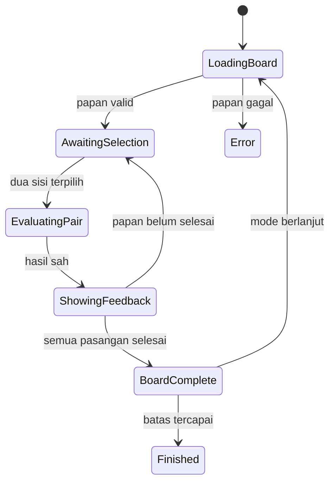

# Engine Matching

**Proyek:** Website Les Privat Kak Harris  
**Lokasi tujuan:** `docs/Games/05-Engine-Matching.md`  
**Status:** Rancangan awal  
**Prioritas:** P1 — setelah Engine Quiz dan Generated Drill  
**Fokus rilis:** Matematika SD–SMP

## 1. Tujuan

Engine Matching menjalankan permainan dengan meminta murid memasangkan dua item yang memiliki hubungan sah. Hubungan tersebut dapat berupa soal–jawaban, istilah–definisi, bentuk matematika–nilai, gambar–nama, atau representasi yang setara.

Engine ini dirancang untuk:

- melatih pengenalan hubungan antarkonsep secara cepat;
- menggunakan ulang mekanik yang sama untuk banyak materi;
- bekerja baik pada layar sentuh tanpa bergantung pada drag-and-drop;
- mendukung pasangan berbasis teks, rumus sederhana, dan gambar;
- mencatat ketepatan, jumlah percobaan, dan waktu penyelesaian;
- memakai Session Manager, Mode Controller, Scoring Service, dan Result Service bersama.

Matching bukan engine untuk menyusun urutan, mengelompokkan banyak item, atau memindahkan objek ke area tertentu. Mekanik tersebut menjadi tanggung jawab Engine Drag & Drop atau Puzzle.

## 2. Bentuk Interaksi Resmi

MVP menggunakan **pemilihan dua sisi**:

1. murid memilih satu item pada kelompok kiri;
2. murid memilih satu item pada kelompok kanan;
3. engine meminta Pair Evaluator memeriksa hubungan keduanya;
4. pasangan benar dikunci sebagai selesai;
5. pasangan salah dilepas agar dapat dicoba kembali.

Urutan pemilihan boleh dimulai dari sisi kiri atau kanan. Memilih item lain pada sisi yang sama hanya mengganti pilihan aktif dan belum dihitung sebagai percobaan.

### Variasi yang tidak termasuk MVP

- kartu memori tertutup yang harus dibalik;
- garis yang digambar manual antaritem;
- drag-and-drop antarkolom;
- satu item memiliki banyak pasangan benar;
- kelompok berisi lebih dari dua sisi;
- pertandingan langsung antarmurid.

Variasi kartu memori dapat ditambahkan sebagai `interactionStyle: "memory_flip"` setelah mekanik dasar stabil, tetapi tidak boleh mengubah arti hasil dan kontrak pasangan.

## 3. Batas Tanggung Jawab

### Engine menangani

- state papan dan item yang tampil;
- urutan acak item pada setiap sisi;
- pilihan aktif kiri dan kanan;
- penguncian input selama evaluasi dan feedback;
- pengiriman kandidat pasangan ke Pair Evaluator;
- penandaan pasangan yang telah selesai;
- pergantian papan;
- ringkasan khusus matching.

### Engine tidak menangani

- autentikasi atau hak akses murid;
- filter katalog berdasarkan jenjang;
- penulisan langsung ke Firestore;
- perhitungan XP atau achievement permanen;
- penentuan akhir sesi;
- kurasi pasangan pembelajaran;
- penyimpanan kunci hubungan di komponen tampilan;
- mekanik menyeret, mengurutkan, atau mengelompokkan.

Pembagian ini mengikuti `02-Arsitektur-Game.md` dan `14-Mode-Permainan.md`.

## 4. Target Penggunaan

### Jenjang awal

- SD kelas 1–6.
- SMP kelas 7–9.

### Contoh materi

- operasi hitung dan hasilnya;
- pecahan dengan bentuk senilai;
- persen dengan desimal atau pecahan;
- bangun datar dengan rumus atau sifatnya;
- satuan dengan hasil konversinya;
- bentuk aljabar dengan bentuk sederhananya;
- istilah statistika dengan definisinya;
- titik pada gambar dengan nama unsur geometri.

Struktur data dapat menerima kelas 10–12 pada masa depan, tetapi konten SMA dan renderer notasi kompleks belum termasuk target awal.

## 5. Istilah Inti

| Istilah | Arti |
| --- | --- |
| Papan (`board`) | Satu set pasangan yang ditampilkan bersamaan |
| Item | Satu tombol atau kartu pada salah satu sisi |
| Pasangan target | Dua item yang memiliki hubungan benar |
| Kandidat | Dua item yang sedang diajukan untuk dinilai |
| Percobaan (`attempt`) | Kandidat lengkap yang telah dinilai |
| Pasangan selesai | Pasangan benar yang sudah dikunci |
| Kesalahan | Percobaan pasangan yang tidak sah |
| Putaran papan | Proses dari papan tampil sampai semua pasangan target selesai |

Satu pergantian pilihan pada sisi yang sama bukan percobaan. Percobaan baru tercatat setelah satu item dari setiap sisi membentuk kandidat lengkap.

## 6. Kontrak Konfigurasi Engine

Properti khusus ditempatkan di dalam `engineConfig`:

```json
{
  "engineConfig": {
    "interactionStyle": "two_sided_select",
    "pairsPerBoard": 5,
    "shuffleLeft": true,
    "shuffleRight": true,
    "allowStartFromEitherSide": true,
    "wrongPairBehavior": "clear_both",
    "wrongFeedbackDurationMs": 700,
    "correctFeedbackDurationMs": 500,
    "showConnectionAfterCorrect": true,
    "removeResolvedPairs": false,
    "allowHint": false,
    "hintAfterWrongAttempts": 3,
    "content": {
      "allowedFormats": ["text", "math", "image"],
      "maxTextLength": 120
    },
    "repeatPolicy": {
      "minimumBoardGap": 2,
      "recentPairLimit": 30
    }
  }
}
```

### Aturan validasi

- `interactionStyle` MVP hanya menerima `two_sided_select`.
- `pairsPerBoard` berada pada rentang 3–8; default mobile adalah 5.
- Kedua sisi sebaiknya diacak secara independen.
- `wrongPairBehavior` MVP hanya menerima `clear_both`.
- Durasi feedback berada pada rentang 300–3000 milidetik.
- `hintAfterWrongAttempts` minimal 2 jika petunjuk diaktifkan.
- `allowedFormats` hanya boleh memuat renderer yang tersedia.
- Papan tidak boleh dimulai jika jumlah pasangan valid kurang dari kebutuhan.
- Konfigurasi tidak valid ditolak sebelum sesi dibuat.

Delapan pasangan adalah batas awal agar papan tetap terbaca di HP. Jumlah lebih besar harus dibagi menjadi beberapa papan, bukan dipaksakan dalam satu layar panjang.

## 7. Kontrak Set Pasangan

Question Provider memberikan set yang telah lolos filter:

```json
{
  "setId": "pecahan-senilai-01",
  "setVersion": 1,
  "title": "Pasangkan Pecahan Senilai",
  "instruction": "Pilih satu pecahan di kiri dan bentuk senilainya di kanan.",
  "pairs": [
    {
      "pairId": "pair-1",
      "left": {
        "itemId": "left-1",
        "content": { "format": "math", "value": "1/2" }
      },
      "right": {
        "itemId": "right-1",
        "content": { "format": "math", "value": "2/4" }
      },
      "answerSpecRef": "pair-ref-pecahan-01-1",
      "explanation": "Pembilang dan penyebut sama-sama dikali 2."
    },
    {
      "pairId": "pair-2",
      "left": {
        "itemId": "left-2",
        "content": { "format": "math", "value": "3/4" }
      },
      "right": {
        "itemId": "right-2",
        "content": { "format": "math", "value": "75%" }
      },
      "answerSpecRef": "pair-ref-pecahan-01-2"
    }
  ],
  "metadata": {
    "educationLevel": "SD",
    "grades": [5, 6],
    "topicId": "pecahan",
    "subtopicId": "pecahan-senilai",
    "difficulty": "medium",
    "estimatedSeconds": 60
  }
}
```

### Aturan konten

- `setId` stabil dan unik di bank konten.
- `setVersion` naik jika hubungan, makna, atau isi pasangan berubah.
- `pairId` unik di dalam set.
- Semua `itemId` unik di dalam set, termasuk lintas sisi.
- Setiap pasangan memiliki tepat satu item kiri dan satu item kanan pada MVP.
- Satu item hanya boleh menjadi anggota satu pasangan target pada papan yang sama.
- Isi kosong, pasangan ambigu, dan duplikat visual yang tidak disengaja harus ditolak.
- Metadata jenjang, kelas, topik, dan kesulitan wajib tersedia.
- `answerSpecRef` digunakan evaluator; UI tidak menentukan kebenaran dari indeks atau posisi.

Jika dua item kanan terlihat sama tetapi sebenarnya mewakili target berbeda, konten dianggap ambigu dan tidak boleh diterbitkan. Bila duplikasi memang diperlukan, tampilkan pembeda yang bermakna.

## 8. Pembentukan Papan

Urutan pembentukan papan:

1. Provider memfilter set berdasarkan game, kelas, topik, dan kesulitan.
2. Provider memilih pasangan yang belum terlalu baru digunakan.
3. Jumlah pasangan disesuaikan dengan `pairsPerBoard` dan sisa target mode.
4. Engine membuat dua daftar presentasi terpisah.
5. Daftar kiri dan kanan diacak memakai RNG sesi.
6. Engine memvalidasi bahwa urutan tidak menampilkan seluruh pasangan dalam posisi sejajar.
7. Papan ditampilkan dan waktu aktif mulai dicatat.

Pengacakan tidak boleh memakai `Math.random()` tanpa seed jika urutan perlu dipulihkan. Checkpoint menyimpan seed atau urutan item final agar refresh menampilkan papan yang sama.

## 9. State Internal Engine

```js
{
  phase: "loading_board",
  boardNumber: 1,
  currentSetId: null,
  currentSetVersion: null,
  leftOrder: [],
  rightOrder: [],
  selectedLeftId: null,
  selectedRightId: null,
  inputLocked: false,
  resolvedPairIds: [],
  itemStatus: {},
  attemptsOnBoard: 0,
  wrongAttemptsOnBoard: 0,
  boardStartedAt: null,
  pendingEvaluation: null,
  recentPairIds: [],
  summary: {
    boardsCompleted: 0,
    pairsResolved: 0,
    totalAttempts: 0,
    wrongAttempts: 0,
    hintsUsed: 0
  }
}
```

Nilai `phase` dibatasi menjadi:

- `loading_board`;
- `ready`;
- `awaiting_selection`;
- `evaluating_pair`;
- `showing_feedback`;
- `board_complete`;
- `finished`;
- `error`.

Skor, streak, waktu mode, status sesi, dan progres permanen tetap menjadi milik modul bersama.

## 10. Alur Permainan



Urutan normal:

1. Engine memuat dan menampilkan papan.
2. Murid memilih item pertama dari sisi mana pun.
3. Murid memilih item dari sisi lainnya.
4. Input dikunci dan kandidat dikirim ke Pair Evaluator.
5. Percobaan serta waktu respons dicatat tepat sekali.
6. Jika benar, kedua item ditandai selesai dan Scoring Service menerima event benar.
7. Jika salah, feedback ditampilkan, streak diputus, lalu kedua pilihan dibersihkan.
8. Jika semua pasangan selesai, ringkasan papan dibuat.
9. Mode Controller menentukan apakah sesi berakhir atau papan berikutnya dimuat.

## 11. Aksi yang Diterima

| `action.type` | Fungsi | Fase sah |
| --- | --- | --- |
| `SELECT_ITEM` | Memilih atau mengganti item pada salah satu sisi | `awaiting_selection` |
| `CLEAR_SELECTION` | Membatalkan pilihan aktif sebelum kandidat lengkap | `awaiting_selection` |
| `REQUEST_HINT` | Meminta petunjuk jika tersedia | `awaiting_selection` |
| `CONTINUE` | Menutup feedback manual bila diperlukan | `showing_feedback` |
| `RETRY_LOAD` | Memuat ulang papan yang gagal | `error` |

Contoh aksi:

```js
{ type: "SELECT_ITEM", side: "left", itemId: "left-1" }
{ type: "SELECT_ITEM", side: "right", itemId: "right-1" }
{ type: "CLEAR_SELECTION" }
```

### Aturan aksi

- item yang sudah selesai tidak dapat dipilih lagi;
- memilih item pada sisi yang sama mengganti pilihan sebelumnya;
- kandidat lengkap otomatis dievaluasi tanpa tombol kirim tambahan;
- input diabaikan saat `inputLocked: true`;
- tap ganda tidak boleh membuat dua evaluasi;
- setiap evaluasi memakai `attemptId` unik;
- aksi setelah timer habis tidak dinilai;
- item yang tidak ada pada papan aktif ditolak.

## 12. Evaluasi Pasangan

Engine mengirimkan kandidat:

```json
{
  "attemptId": "attempt_uuid",
  "sessionId": "session_uuid",
  "boardNumber": 1,
  "leftItemId": "left-1",
  "rightItemId": "right-1",
  "responseTimeMs": 4200
}
```

Pair Evaluator mengembalikan:

```json
{
  "isValid": true,
  "isCorrect": true,
  "resolvedPairId": "pair-1",
  "feedbackCode": "correct_pair",
  "misconceptionCode": null
}
```

### Aturan evaluasi

- kebenaran ditentukan dari identitas hubungan, bukan posisi tampilan;
- satu `attemptId` hanya dapat dinilai sekali;
- kandidat dengan dua item dari sisi sama tidak valid dan tidak memengaruhi skor;
- kandidat yang memuat item selesai tidak valid;
- hasil salah tidak membocorkan seluruh peta jawaban;
- kegagalan evaluator tidak dihitung sebagai kesalahan murid;
- respons terlambat dari papan lama harus diabaikan.

Pada MVP berbasis klien, pemetaan pasangan mungkin tetap tersedia di bundle. Kontrak evaluator dipisahkan agar pemeriksaan dapat dipindahkan ke layanan tepercaya tanpa mengubah engine.

## 13. Skor, Streak, dan Akurasi

Engine tidak menghitung skor akhir sendiri. Engine mengirim event ke Scoring Service:

```js
{
  eventType: "matching_attempt",
  isCorrect: true,
  difficulty: "medium",
  responseTimeMs: 4200,
  wrongAttemptsForTarget: 0,
  hintUsed: false
}
```

Aturan awal:

- pasangan benar memberi skor dasar;
- pasangan salah tidak memberi skor negatif pada MVP;
- pasangan benar pada percobaan pertama dapat menerima skor penuh;
- kesalahan sebelumnya dapat mengurangi bonus, bukan skor dasar menjadi negatif;
- streak bertambah per pasangan benar dan kembali ke nol setelah pasangan salah;
- penggunaan petunjuk menghapus bonus kecepatan atau bonus percobaan pertama;
- skor, akurasi, dan penguasaan materi tetap merupakan metrik berbeda.

Akurasi matching dihitung sebagai:

```text
pairsResolved / totalAttempts × 100%
```

Karena setiap target akhirnya dapat diselesaikan, `pairsResolved / totalPairs` tidak boleh disebut akurasi; nilai itu adalah progres penyelesaian.

## 14. Integrasi Mode Permainan

| Mode | Dukungan | Unit progres |
| --- | --- | --- |
| `limited_questions` | MVP | Pasangan target yang berhasil diselesaikan |
| `limited_time` | MVP | Waktu aktif; hasil mencatat pasangan selesai |
| `endless` | Opsional setelah MVP dasar | Papan dan pasangan selesai |
| `limited_lives` | Tidak untuk MVP | — |

### Mode batas pasangan

Pada Engine Matching, `questionLimit` dibaca sebagai jumlah **pasangan target** yang harus diselesaikan. Percobaan salah tidak mengurangi sisa target karena pasangan belum selesai. Label UI harus memakai “pasangan”, misalnya **7 dari 10 pasangan**, bukan “7 dari 10 soal”.

Provider menyesuaikan ukuran papan terakhir dengan sisa target. Jika target 12 dan `pairsPerBoard` 5, papan berisi 5, 5, lalu 2 pasangan; karena minimum papan normal adalah 3, konfigurasi sebaiknya memilih pembagian 4–4–4 atau 6–6. Validator wajib memilih pembagian yang tidak membuat papan terakhir terlalu kecil.

### Mode waktu

- timer mulai setelah seluruh item papan pertama siap;
- saat waktu habis, input dan evaluasi baru dikunci;
- kandidat yang belum lengkap tidak dihitung;
- pasangan benar yang sudah memperoleh hasil evaluator tetap dicatat;
- papan tidak wajib selesai agar sesi memiliki hasil sah.

### Endless

Endless hanya diaktifkan setelah variasi konten cukup. Engine harus mencegah pasangan dan papan yang sama muncul terlalu cepat serta mengikuti batas keamanan dan hadiah pada `14-Mode-Permainan.md`.

## 15. Tingkat Kesulitan

Kesulitan matching ditentukan oleh kombinasi:

- jumlah pasangan per papan;
- kemiripan visual atau konsep antarpengecoh;
- panjang isi item;
- penggunaan gambar, simbol, atau beberapa representasi;
- tingkat materi;
- kebutuhan melakukan perhitungan sebelum memilih;
- batas waktu yang wajar.

Kesulitan tidak boleh dinaikkan hanya dengan memperkecil teks, membuat posisi terlalu rapat, atau memakai batas waktu yang tidak masuk akal.

Untuk adaptasi awal:

- evaluasi performa setelah satu papan selesai;
- naik maksimal satu tingkat bila akurasi tinggi dan waktu wajar;
- turun satu tingkat bila kesalahan berulang;
- jangan mengganti kesulitan di tengah papan;
- perubahan mengikuti rentang `allowedDifficulties` game.

## 16. Petunjuk dan Umpan Balik

### Pasangan benar

- kedua item mendapat status visual berhasil;
- koneksi dapat ditampilkan dengan garis atau warna yang konsisten;
- kedua item dikunci atau disembunyikan sesuai konfigurasi;
- penjelasan singkat boleh muncul jika bernilai belajar.

### Pasangan salah

- kedua item mendapat feedback singkat tanpa getaran atau kedipan berlebihan;
- pesan menggunakan bahasa netral seperti “Belum cocok, coba lagi”;
- setelah feedback, pilihan dibersihkan;
- engine tidak otomatis menunjukkan jawaban benar pada kesalahan pertama.

### Petunjuk

Petunjuk bukan prioritas MVP. Jika diaktifkan setelah beberapa kesalahan, petunjuk dapat:

- menyorot kategori hubungan;
- menyembunyikan satu pengecoh yang belum selesai;
- memberi penjelasan konsep singkat;
- menyorot salah satu sisi tanpa langsung memasangkan keduanya.

Petunjuk harus tercatat pada hasil dan memengaruhi bonus secara konsisten.

## 17. UI dan Responsivitas

Tampilan utama menggunakan dua kolom pada layar yang cukup lebar. Pada HP sempit, dua kolom tetap dapat digunakan dengan kartu ringkas; jika konten panjang, gunakan dua daftar vertikal yang jelas dan hindari scroll horizontal.

Persyaratan minimum:

- target sentuh minimal sekitar 44 × 44 CSS pixel;
- status `selected`, `correct`, `wrong`, `disabled`, dan `focused` dapat dibedakan tanpa hanya mengandalkan warna;
- judul serta instruksi tetap terlihat sebelum papan;
- progress dan timer tidak menutupi item;
- rumus dirender tanpa terpotong;
- gambar memiliki teks alternatif;
- item selesai tidak mengubah layout secara mengejutkan;
- tombol kembali, jeda, dan selesai tidak berdekatan dengan item permainan.

Jika `removeResolvedPairs: true`, penghapusan memakai animasi singkat dan fokus dipindahkan secara aman. Default MVP adalah `false` agar posisi item stabil.

## 18. Aksesibilitas

Matching tidak boleh bergantung pada garis visual saja. Setiap item adalah kontrol yang dapat difokuskan dan memiliki label sisi serta status.

Persyaratan:

- seluruh papan dapat dimainkan dengan keyboard;
- urutan fokus logis: kontrol sesi, sisi kiri, lalu sisi kanan;
- pembaca layar mengumumkan pilihan dan hasil pasangan;
- status benar atau salah disampaikan lewat teks/ARIA live yang singkat;
- warna memiliki kontras yang memadai;
- animasi menghormati preferensi pengurangan gerak;
- audio bersifat tambahan, bukan satu-satunya feedback;
- garis koneksi dekoratif tidak menjadi satu-satunya penanda hubungan selesai.

Contoh pengumuman: “Satu per dua dipilih dari sisi kiri” dan “Benar, satu per dua berpasangan dengan dua per empat.”

## 19. Checkpoint dan Pemulihan

Checkpoint minimal menyimpan:

```js
{
  sessionId,
  gameVersion,
  engineType: "matching",
  boardNumber,
  currentSetId,
  currentSetVersion,
  leftOrder,
  rightOrder,
  resolvedPairIds,
  selectedLeftId,
  selectedRightId,
  attemptsOnBoard,
  wrongAttemptsOnBoard,
  score,
  streak,
  remainingTime,
  recentPairIds,
  savedAt
}
```

Aturan pemulihan:

- urutan item dan pasangan selesai harus sama setelah refresh;
- kandidat yang sedang menunggu evaluator tidak boleh dinilai dua kali;
- pilihan aktif boleh dipulihkan jika tidak ada evaluasi tertunda;
- feedback sesaat tidak perlu diputar ulang;
- checkpoint dengan versi set atau game yang tidak cocok ditolak dengan aman;
- sesi waktu hanya dipulihkan sesuai kebijakan timer lintas mode;
- hasil final tetap idempoten berdasarkan `sessionId`.

## 20. Kontrak Hasil Khusus Matching

Engine menambahkan detail berikut ke hasil umum:

```json
{
  "engineSummary": {
    "engineType": "matching",
    "boardsStarted": 3,
    "boardsCompleted": 3,
    "pairsPresented": 15,
    "pairsResolved": 15,
    "totalAttempts": 19,
    "wrongAttempts": 4,
    "firstTryPairs": 12,
    "hintsUsed": 0,
    "accuracy": 0.7895,
    "averageResponseTimeMs": 5100,
    "perTopic": {
      "pecahan-senilai": {
        "pairsResolved": 10,
        "totalAttempts": 13
      }
    }
  }
}
```

### Aturan ringkasan

- `pairsPresented` menghitung target unik yang benar-benar ditampilkan;
- `pairsResolved` tidak boleh melebihi `pairsPresented`;
- `totalAttempts = pairsResolved + wrongAttempts` untuk MVP tanpa skip;
- `accuracy = pairsResolved / totalAttempts` jika percobaan lebih dari nol;
- durasi evaluasi error tidak masuk waktu respons murid;
- ringkasan tidak menyimpan isi lengkap setiap soal bila tidak diperlukan.

## 21. Analitik Minimum

Event minimum mengikuti katalog kanonis pada `15-Analitik.md`:

- `matching_set_presented`;
- `matching_attempt_evaluated`;
- `matching_pair_completed`;
- `matching_set_completed`;
- `matching_set_load_failed`.

Payload cukup memuat ID game/set, versi, kelas, topik, kesulitan, waktu respons, hasil benar–salah, mode, serta kode error. Jangan mengirim nama lengkap murid atau isi jawaban sensitif ke analitik jika tidak dibutuhkan.

Event tap biasa dan perubahan pilihan pada sisi yang sama tidak perlu dikirim satu per satu pada MVP karena menambah data tanpa manfaat pembelajaran yang jelas.

## 22. Penanganan Error

| Kondisi | Respons |
| --- | --- |
| Set pasangan kurang atau tidak valid | Tolak papan sebelum tampil dan minta set lain |
| Renderer konten tidak tersedia | Jangan mulai sesi; tampilkan pesan kompatibilitas |
| Evaluator gagal sementara | Buka kembali kandidat yang sama tanpa penalti |
| Set habis pada mode berlanjut | Gunakan fallback sesuai topik/kesulitan atau akhiri wajar |
| Gambar gagal dimuat | Gunakan fallback hanya jika makna tetap utuh; jika tidak, ganti papan |
| Konfigurasi versi berubah | Jangan mencampur versi di sesi aktif |
| Penyimpanan checkpoint gagal | Permainan dapat lanjut; beri status sinkronisasi secara tenang |
| Hasil final gagal dikirim | Simpan antrean lokal dan kirim ulang dengan `sessionId` sama |

Error teknis tidak boleh ditampilkan sebagai jawaban salah atau mengurangi skor, nyawa, dan streak.

## 23. Kasus Batas

Implementasi wajib menangani:

- tap ganda pada item kedua;
- pemilihan kanan lebih dahulu;
- mengganti pilihan kiri beberapa kali;
- memilih item yang baru saja selesai;
- waktu habis saat hanya satu sisi terpilih;
- waktu habis ketika evaluator sedang memproses kandidat;
- refresh saat feedback benar berlangsung;
- evaluator mengirim respons papan lama;
- dua item berbeda memiliki teks yang sama;
- set memiliki `pairId` atau `itemId` ganda;
- target mode tidak habis dibagi `pairsPerBoard`;
- semua pasangan selesai tepat saat batas waktu nol;
- jaringan putus saat hasil final dikirim;
- ukuran layar berubah ketika papan aktif.

## 24. Pengujian MVP

### Unit test

- validasi konfigurasi dan set pasangan;
- pemilihan serta penggantian item;
- pembentukan kandidat dua sisi;
- deduplikasi `attemptId`;
- penandaan pasangan benar;
- pembersihan pasangan salah;
- perhitungan ringkasan dan akurasi;
- pembagian papan sesuai target mode;
- serialisasi serta pemulihan state.

### Integration test

- Provider → Engine → Evaluator → Scoring Service;
- Mode Controller menghentikan sesi pada target pasangan;
- timer mengunci input dengan benar;
- checkpoint memulihkan urutan yang sama;
- hasil final tidak memberi hadiah dua kali;
- konten tidak sesuai kelas ditolak sebelum render.

### UI test

- Android layar sempit dan desktop;
- sentuhan, mouse, dan keyboard;
- teks panjang, rumus, dan gambar;
- orientasi layar berubah;
- pembaca layar dan fokus;
- koneksi lambat serta gambar gagal;
- preferensi reduced motion.

## 25. Batas MVP

MVP Engine Matching mencakup:

- `interactionStyle: "two_sided_select"`;
- tepat satu pasangan benar untuk setiap item;
- 3–8 pasangan per papan;
- konten teks, matematika sederhana, dan gambar ringan;
- mode `limited_questions` dan `limited_time`;
- feedback langsung;
- skor tanpa penalti negatif;
- checkpoint dasar;
- ringkasan akurasi serta waktu;
- tampilan mobile-first dan akses keyboard.

MVP belum mencakup:

- kartu memori tertutup;
- banyak jawaban benar untuk satu item;
- drag-and-drop dan garis bebas;
- leaderboard;
- multiplayer;
- AI pembuat pasangan saat sesi;
- input notasi matematika kompleks;
- mode nyawa.

## 26. Kriteria Siap Implementasi

Dokumen dianggap cukup untuk masuk implementasi ketika:

- kontrak konfigurasi dan set pasangan telah disetujui;
- definisi unit progres mode tidak ambigu;
- minimal tiga set contoh tersedia untuk SD dan tiga untuk SMP;
- renderer `text`, `math`, dan `image` telah ditentukan;
- Pair Evaluator dan deduplikasi percobaan memiliki test;
- perilaku timer dan checkpoint telah disepakati;
- desain dua kolom telah diuji pada layar HP;
- aturan Firestore mendukung penyimpanan sesi tanpa tulis langsung dari engine;
- analitik dan batas data telah ditetapkan.

## 27. Contoh Game yang Dapat Dibuat

| Game | Jenjang | Isi pasangan |
| --- | --- | --- |
| Pasangan Hitung Cepat | SD | Operasi dan hasil |
| Pecahan Kembar | SD | Pecahan dengan bentuk senilai |
| Detektif Satuan | SD–SMP | Besaran dan hasil konversi |
| Jodohkan Bangun | SD–SMP | Bangun, sifat, atau rumus |
| Aljabar Berpasangan | SMP | Bentuk aljabar dan bentuk sederhana |
| Statistik Cocok | SMP | Istilah dan definisi/contoh |

Game-game tersebut menggunakan engine yang sama. Perbedaan materi, tampilan, target kelas, jumlah pasangan, mode, dan tingkat kesulitan berasal dari konfigurasi serta bank konten.

## 28. Keputusan Akhir

Engine Matching resmi menggunakan ID `matching` dan mekanik utama `two_sided_select`. Unit penyelesaian pada mode batas soal adalah **pasangan target yang berhasil diselesaikan**, sedangkan percobaan salah tetap dicatat untuk akurasi dan skor. Engine ini diprioritaskan setelah Quiz dan Generated Drill karena memberi variasi interaksi tanpa kompleksitas drag-and-drop.

Langkah dokumentasi berikutnya adalah `06-Engine-DragDrop.md`.
