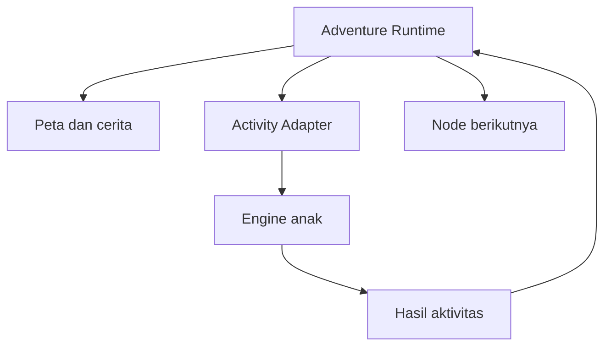

# Engine Adventure

**Proyek:** Website Les Privat Kak Harris

**Lokasi tujuan:** `docs/Games/08-Engine-Adventure.md`

**Status:** Rancangan awal

**Fokus rilis:** Matematika SD–SMP

## 1. Tujuan

Engine Adventure adalah lapisan orkestrasi yang mengubah beberapa aktivitas belajar menjadi perjalanan bertahap. Murid bergerak dari satu node ke node berikutnya pada peta, membaca narasi singkat, menyelesaikan tantangan, menerima umpan balik, dan membuka bagian perjalanan berikutnya.

Engine ini dirancang untuk:

- mengatur peta, chapter, node, dan hubungan antar-node;
- menampilkan cerita serta dialog singkat tanpa mesin percakapan kompleks;
- memanggil engine lain sebagai tantangan di dalam sebuah node;
- mengunci atau membuka node berdasarkan progres yang sah;
- mendukung percabangan sederhana tanpa membuat alur sulit dipelihara;
- menyimpan checkpoint perjalanan dan checkpoint aktivitas aktif;
- memberikan ringkasan perjalanan tanpa menggandakan skor atau XP;
- menjaga pengalaman tetap ringan pada HP;
- memakai Session Manager, Mode Controller, Result Service, dan analitik bersama.

Adventure merupakan engine lanjutan berprioritas P2. Implementasinya dilakukan setelah engine aktivitas yang akan dipanggilnya stabil.

## 2. Posisi Adventure dalam Sistem

Adventure bukan pengganti Quiz, Matching, Drag & Drop, Puzzle, atau `generated_drill`. Adventure memilih aktivitas, memberi konteks cerita, dan menentukan node berikutnya; engine anak tetap menilai interaksi belajarnya sendiri.



Contoh: node “Jembatan Bilangan” dapat memanggil Engine Quiz untuk lima soal bilangan bulat. Adventure hanya menerima hasil terstruktur seperti `completed`, `accuracy`, dan `score`; Adventure tidak memeriksa jawaban soal satu per satu.

## 3. Batas Tanggung Jawab

### Engine Adventure menangani

- definisi chapter, peta, node, dan edge;
- status node terkunci, tersedia, aktif, selesai, atau gagal;
- urutan layar narasi, pilihan, aktivitas, dan hasil node;
- evaluasi syarat membuka node;
- pemilihan cabang yang sah;
- pemanggilan serta penghentian engine anak melalui adapter;
- agregasi hasil aktivitas pada tingkat node dan perjalanan;
- checkpoint perjalanan;
- ringkasan khusus Adventure.

### Engine Adventure tidak menangani

- autentikasi atau filter katalog;
- penilaian benar–salah di dalam engine anak;
- implementasi gesture milik Matching, Drag & Drop, atau Puzzle;
- penulisan langsung ke Firestore;
- pemberian XP permanen;
- aturan skor global;
- dialog bebas berbasis AI;
- dunia terbuka, simulasi fisika, pertarungan aksi, atau inventaris kompleks;
- multiplayer atau interaksi antarmurid;
- kurasi kebenaran materi.

Pembagian ini mengikuti `02-Arsitektur-Game.md` dan `14-Mode-Permainan.md`.

## 4. Prinsip Desain

1. **Perjalanan di atas aktivitas.** Cerita memberi konteks; tujuan belajar tetap pusat permainan.
2. **Engine anak tetap mandiri.** Satu aktivitas dapat diuji tanpa membuka Adventure.
3. **Graf terarah, bukan kode bercabang.** Jalur disimpan sebagai data node dan edge.
4. **Progres dapat dijelaskan.** Setiap node terkunci harus memiliki alasan yang dapat ditampilkan.
5. **Percabangan dibatasi.** MVP tidak menerima siklus bebas atau puluhan jalur paralel.
6. **Hasil tidak dihitung dua kali.** Skor aktivitas berasal dari engine anak; Adventure hanya mengagregasi.
7. **Kegagalan tidak menghukum berlebihan.** Murid dapat mencoba lagi sesuai aturan node.
8. **Mobile-first.** Peta, dialog, dan kontrol dapat digunakan pada layar 320 piksel.
9. **Konten dapat diverifikasi.** Semua rute wajib lolos validasi sebelum diterbitkan.

## 5. Target Penggunaan

### Jenjang awal

- SD kelas 1–6.
- SMP kelas 7–9.

### Contoh perjalanan

- menyelamatkan kota angka melalui operasi hitung;
- menjelajahi pulau pecahan dan membuka jembatan perbandingan;
- memecahkan misteri bentuk geometri;
- menyelesaikan ekspedisi aljabar dasar;
- mengumpulkan petunjuk dari beberapa jenis soal;
- mengikuti misi remedial berdasarkan materi tertentu.

Struktur data tetap dapat menerima kelas 10–12 pada masa depan. Konten SMA, grafik kompleks, input simbol lanjutan, dan cerita khusus SMA belum menjadi target awal.

## 6. Model Perjalanan Resmi

MVP memakai graf terarah tanpa siklus untuk satu chapter. Setiap perjalanan terdiri dari:

| Komponen | Fungsi |
| --- | --- |
| `chapter` | Kelompok perjalanan dengan satu tujuan belajar |
| `node` | Satu langkah: cerita, aktivitas, pilihan, hadiah, atau akhir |
| `edge` | Hubungan sah dari satu node ke node lain |
| `condition` | Syarat agar edge atau node tersedia |
| `activity` | Tantangan yang dijalankan oleh engine anak |
| `checkpoint` | Salinan state perjalanan yang dapat dipulihkan |

Satu game Adventure MVP boleh memiliki satu hingga tiga chapter. Setiap chapter disarankan memiliki 5–12 node dan maksimum dua pilihan keluar yang bermakna dari satu node.

## 7. Jenis Node Resmi

| `nodeType` | Fungsi | Dukungan MVP |
| --- | --- | --- |
| `start` | Titik awal chapter | Ya |
| `story` | Narasi atau dialog singkat | Ya |
| `activity` | Menjalankan satu engine anak | Ya |
| `choice` | Memilih satu cabang | Ya, sederhana |
| `reward` | Menampilkan hadiah perjalanan nonpermanen atau hasil unlock | Ya |
| `checkpoint` | Menandai titik pulih aman | Ya |
| `ending` | Menutup chapter atau perjalanan | Ya |

Jenis berikut ditunda:

- toko dan mata uang kompleks;
- inventaris dengan penggunaan item;
- pertarungan waktu nyata;
- node prosedural bebas;
- dialog bercabang dengan variabel sosial;
- cutscene video berat;
- node multiplayer.

## 8. Status Node

Status node dibatasi menjadi:

- `locked`: syarat belum terpenuhi;
- `available`: dapat dipilih atau dimulai;
- `active`: sedang dijalankan;
- `completed`: berhasil diselesaikan;
- `failed`: percobaan terakhir belum memenuhi syarat;
- `skipped`: dilewati oleh rute sah;
- `unreachable`: tidak lagi berada pada rute aktif.

`completed` adalah status permanen dalam satu run kecuali seluruh run diulang. `failed` bukan akhir perjalanan; node kembali `available` bila percobaan ulang diizinkan.

## 9. Kontrak Konfigurasi Engine

Properti khusus ditempatkan di dalam `engineConfig`:

```json
{
  "engineConfig": {
    "navigationStyle": "guided_map",
    "sessionPolicy": {
      "type": "ending_driven",
      "allowPause": true,
      "allowManualExit": true
    },
    "allowNodeReplay": true,
    "allowChapterRestart": true,
    "showLockedNodes": true,
    "showUnlockReason": true,
    "maximumActiveBranches": 2,
    "maximumNodesPerChapter": 12,
    "checkpointPolicy": "after_activity",
    "childActivityPolicy": {
      "allowedEngines": ["quiz", "generated_drill", "matching", "drag_drop", "puzzle"],
      "allowNestedAdventure": false,
      "maximumActivitiesPerNode": 1
    },
    "story": {
      "maximumTextLength": 500,
      "maximumDialogueTurns": 6,
      "allowSkipSeenText": true
    },
    "retryPolicy": {
      "defaultMaxAttempts": null,
      "preserveBestResult": true,
      "showLearningFeedback": true
    }
  }
}
```

### Aturan validasi

- `navigationStyle` MVP hanya menerima `guided_map`.
- `sessionPolicy.type` MVP hanya menerima `ending_driven`.
- Nested Adventure selalu ditolak.
- Satu node MVP hanya boleh menjalankan satu aktivitas anak.
- `maximumActiveBranches` berada pada rentang 1–2.
- `maximumNodesPerChapter` berada pada rentang 3–20; nilai rekomendasi tetap 12.
- Teks dan jumlah dialog harus berada dalam batas konfigurasi.
- Semua `engineType` anak harus terdaftar pada Engine Registry.
- `checkpointPolicy` menerima `after_activity`, `at_checkpoint_node`, atau `both`.
- Konfigurasi tidak valid ditolak sebelum sesi dibuat.

## 10. Kontrak Definisi Adventure

```json
{
  "adventureId": "pulau-bilangan-v1",
  "adventureVersion": 1,
  "title": "Ekspedisi Pulau Bilangan",
  "startChapterId": "chapter-1",
  "chapters": [
    {
      "chapterId": "chapter-1",
      "title": "Gerbang Bilangan Bulat",
      "startNodeId": "node-start",
      "nodes": [
        {
          "nodeId": "node-start",
          "nodeType": "start",
          "content": {
            "title": "Pelabuhan Angka",
            "text": "Buka gerbang dengan memecahkan tantangan bilangan bulat."
          }
        },
        {
          "nodeId": "node-quiz-1",
          "nodeType": "activity",
          "content": { "title": "Jembatan Bilangan" },
          "activity": {
            "activityId": "activity-bilangan-1",
            "engineType": "quiz",
            "gameRef": { "gameId": "quiz-bilangan-bulat", "version": 1 },
            "mode": { "type": "limited_questions", "questionLimit": 5 },
            "completionRule": { "type": "minimum_accuracy", "value": 0.6 }
          },
          "retryPolicy": { "allowed": true, "maxAttempts": null }
        },
        {
          "nodeId": "node-finish",
          "nodeType": "ending",
          "content": {
            "title": "Gerbang Terbuka",
            "text": "Kamu berhasil menyelesaikan ekspedisi pertama."
          }
        }
      ],
      "edges": [
        { "from": "node-start", "to": "node-quiz-1", "condition": { "type": "always" } },
        { "from": "node-quiz-1", "to": "node-finish", "condition": { "type": "node_completed", "nodeId": "node-quiz-1" } }
      ]
    }
  ],
  "metadata": {
    "educationLevel": "SMP",
    "grades": [7],
    "topicTags": ["bilangan-bulat"],
    "estimatedMinutes": 15
  }
}
```

### Aturan konten

- ID adventure, chapter, node, edge, dan activity unik dalam cakupannya.
- `startChapterId` dan `startNodeId` wajib ditemukan.
- Setiap chapter wajib memiliki tepat satu node `start` dan minimal satu `ending`.
- Setiap edge mengarah ke node yang ada dalam chapter yang sama.
- Semua node wajib dapat dicapai dari `start` atau sengaja ditandai sebagai konten draf.
- Rute menuju minimal satu `ending` wajib tersedia.
- Node `activity` wajib memiliki referensi engine anak dan aturan selesai.
- Node cerita tidak boleh menyimpan HTML bebas yang tidak disanitasi.
- Kunci jawaban engine anak tidak disalin ke definisi Adventure.

## 11. Validasi Graf

Adventure Validator memeriksa struktur sebelum publikasi:

1. seluruh referensi ID valid;
2. tidak ada node yatim;
3. tidak ada siklus dalam chapter MVP;
4. tidak ada jalan buntu selain `ending`;
5. semua kondisi memakai tipe resmi;
6. minimal satu ending dapat dicapai;
7. jumlah cabang dan node tidak melewati batas;
8. setiap node aktivitas mengarah ke konfigurasi yang kompatibel;
9. tidak ada Adventure sebagai engine anak;
10. setiap pilihan mempunyai label dan tujuan berbeda.

Validator graf harus berjalan pada saat authoring/publikasi dan kembali dijalankan oleh Game Loader untuk versi konfigurasi yang dimuat.

## 12. Kondisi dan Aturan Unlock

MVP mendukung kondisi deklaratif berikut:

| `type` | Arti |
| --- | --- |
| `always` | Selalu sah setelah node asal selesai |
| `node_completed` | Node tertentu selesai |
| `minimum_accuracy` | Akurasi node aktivitas mencapai batas |
| `minimum_score` | Skor node mencapai batas versi |
| `choice_selected` | Pilihan tertentu telah dipilih |
| `all_of` | Semua kondisi anak terpenuhi |
| `any_of` | Minimal satu kondisi anak terpenuhi |

Contoh:

```json
{
  "type": "all_of",
  "conditions": [
    { "type": "node_completed", "nodeId": "node-quiz-1" },
    { "type": "minimum_accuracy", "nodeId": "node-quiz-1", "value": 0.75 }
  ]
}
```

Kondisi tidak boleh menjalankan kode, membaca properti sembarang, atau bergantung pada waktu perangkat tanpa standar bersama. Evaluator mengembalikan `isMet` dan `reasonCode` agar UI dapat menjelaskan alasan node masih terkunci.

## 13. Activity Adapter

Activity Adapter menjadi batas antara Adventure dan engine anak.

```js
{
  prepare(activityDefinition, parentContext),
  start(),
  pause(),
  resume(),
  getCheckpoint(),
  finish(reason),
  destroy()
}
```

Adventure mengirim konteks minimum:

```js
{
  parentSessionId,
  adventureId,
  chapterId,
  nodeId,
  activityId,
  childSessionId,
  mode,
  gameRef
}
```

Engine anak mengembalikan hasil minimum:

```js
{
  childSessionId: "session-child-001",
  status: "completed",
  finishReason: "question_limit_reached",
  score: 420,
  accuracy: 0.8,
  activeDurationSeconds: 95,
  summary: {},
  resultVersion: 1
}
```

Adventure tidak boleh membaca state internal engine anak atau mengubah hasilnya setelah selesai.

## 14. State Internal Engine

```js
{
  adventureId,
  adventureVersion,
  runId,
  currentChapterId,
  currentNodeId,
  currentScreen,
  status,
  visitedNodeIds,
  completedNodeIds,
  skippedNodeIds,
  unreachableNodeIds,
  nodeAttempts,
  nodeBestResults,
  selectedChoices,
  unlockedNodeIds,
  activeChildSession: {
    activityId,
    childSessionId,
    engineType,
    status
  },
  totalScore,
  totalActiveSeconds,
  checkpointVersion,
  lastActionId,
  error
}
```

`currentScreen` dibatasi menjadi `map`, `story`, `choice`, `activity_loading`, `activity`, `node_result`, `chapter_result`, dan `adventure_result`.

State presentasi seperti posisi piksel peta, status animasi, atau scroll tidak menjadi sumber kebenaran domain.

## 15. Alur Permainan

1. Game Loader memvalidasi Adventure dan engine anak yang dibutuhkan.
2. Engine membuat run baru atau menawarkan pemulihan checkpoint.
3. Chapter awal dan node awal diaktifkan.
4. Murid membaca cerita atau memilih node yang tersedia.
5. Untuk node aktivitas, adapter membuat child session dengan ID unik.
6. Engine anak menjalankan tantangan dan mengembalikan hasil final.
7. Adventure mengevaluasi `completionRule` node.
8. Hasil node, percobaan, dan best result diperbarui secara atomik.
9. Kondisi edge dievaluasi dan node berikutnya dibuka.
10. Checkpoint disimpan sesuai kebijakan.
11. Chapter berakhir saat node `ending` yang sah diselesaikan.
12. Result Service menyimpan hasil run dengan idempotency key.

## 16. Aksi yang Diterima

| Aksi | Fungsi |
| --- | --- |
| `OPEN_NODE` | Membuka node yang tersedia |
| `ADVANCE_STORY` | Melanjutkan bagian narasi |
| `SKIP_SEEN_STORY` | Melewati teks yang sudah pernah dilihat |
| `SELECT_CHOICE` | Memilih cabang yang sah |
| `START_ACTIVITY` | Membuat dan memulai child session |
| `RETRY_ACTIVITY` | Mengulang node aktivitas |
| `ACCEPT_NODE_RESULT` | Mengunci hasil anak yang telah tervalidasi |
| `RETURN_TO_MAP` | Kembali ke peta |
| `PAUSE` | Menjeda runtime sesuai mode |
| `RESUME` | Melanjutkan runtime |
| `RESTART_CHAPTER` | Memulai ulang chapter setelah konfirmasi |
| `FINISH_ADVENTURE` | Menyelesaikan run pada ending yang sah |

### Aturan aksi

- setiap aksi memiliki `actionId` unik;
- aksi diproses hanya jika sah untuk state saat ini;
- aksi ganda dengan `actionId` sama diabaikan;
- node terkunci tidak dapat dibuka melalui URL atau state UI;
- hasil anak hanya diterima dari `childSessionId` aktif;
- pilihan dikunci setelah transisi disimpan;
- input dikunci selama pergantian engine atau penyimpanan hasil node.

## 17. Penyelesaian Node Aktivitas

Aturan selesai resmi:

- `child_completed`: cukup menyelesaikan aktivitas;
- `minimum_accuracy`: akurasi memenuhi batas;
- `minimum_score`: skor memenuhi batas;
- `all_of`: seluruh syarat anak terpenuhi.

Jika engine anak selesai tetapi syarat node tidak terpenuhi:

- hasil percobaan tetap dicatat;
- node berstatus `failed` untuk percobaan tersebut;
- feedback belajar ditampilkan;
- node kembali `available` jika retry diizinkan;
- jalur sukses belum dibuka;
- XP permanen tidak diberikan ulang dari parent dan child.

MVP tidak memakai skor tersembunyi untuk membuka rute penting. Syarat harus tampil sebelum aktivitas dimulai.

## 18. Percabangan dan Pilihan

Node `choice` mendukung maksimum dua opsi utama pada MVP. Pilihan dapat mengubah jalur cerita atau urutan aktivitas, tetapi tidak boleh membuat satu pilihan menjadi jebakan permanen tanpa penjelasan.

Aturan:

- opsi memakai `choiceId`, label, deskripsi singkat, dan target node;
- hanya satu pilihan dapat dikunci dalam satu node;
- pemilihan meminta konfirmasi bila tidak dapat dibatalkan;
- cabang yang tidak dipilih menjadi `unreachable` untuk run tersebut;
- semua cabang idealnya bertemu kembali atau memiliki ending yang valid;
- tingkat hadiah antarcabang tidak boleh timpang secara tidak sengaja;
- pilihan cerita tidak digunakan untuk menilai kemampuan matematika.

## 19. Retry, Replay, dan Restart

### Retry aktivitas

- membuat `childSessionId` baru;
- tidak menghapus hasil percobaan lama;
- best result diperbarui hanya jika hasil baru lebih baik menurut kebijakan versi;
- soal dapat diacak ulang oleh engine anak sesuai kontraknya;
- reward permanen hanya dihitung dari hasil sah yang belum pernah diberi hadiah.

### Replay node selesai

Replay digunakan untuk latihan. Node tetap `completed`, jalur tidak dikunci ulang, dan hasil replay ditandai agar tidak menggandakan unlock atau hadiah.

### Restart chapter

Restart memerlukan konfirmasi. Run lama tidak ditimpa; sistem membuat attempt chapter baru atau menandai restart pada run yang sama sesuai versi penyimpanan. Riwayat belajar tidak dihapus.

## 20. Skor, XP, dan Hadiah

Adventure tidak menilai jawaban. Skor perjalanan merupakan agregasi dari hasil engine anak:

```text
totalScore = jumlah skor terbaik yang sah dari node aktivitas wajib
           + bonus perjalanan versi tertentu
```

Aturan minimum:

- skor satu child session tidak ditambahkan dua kali;
- replay tidak menghasilkan bonus unlock kedua;
- bonus cerita tidak diberikan hanya karena mengetuk dialog;
- hadiah node dan hadiah chapter memakai `rewardGrantId` idempoten;
- XP dihitung oleh Progress/Reward Service, bukan runtime Adventure;
- kosmetik atau badge boleh ditampilkan, tetapi sumber kebenarannya tetap service permanen;
- kegagalan aktivitas tidak mengurangi XP yang telah diperoleh sebelumnya.

Adventure MVP tidak memakai mata uang, toko, loot acak, atau mekanik gacha.

## 21. Integrasi Mode Permainan

Mode parent mengatur keseluruhan perjalanan; mode child mengatur satu aktivitas.

### `limited_questions`

Kurang cocok sebagai mode parent karena node memiliki unit berbeda. Jika digunakan, `questionLimit` tidak boleh dihitung dari node cerita. Untuk MVP, mode ini hanya digunakan pada child activity.

### `limited_time`

MVP tidak memberikan timer global pada cerita dan navigasi peta. Batas waktu diterapkan pada child activity yang kompatibel agar murid tidak dihukum karena membaca.

### `endless`

Tidak digunakan sebagai mode parent Adventure MVP. Node child boleh memakai Endless hanya jika memiliki cara selesai manual yang jelas dan Adventure menerima hasil `manual_finish` sebagai hasil sah sesuai `completionRule`.

### Lifecycle parent Adventure

Adventure tidak mendaftarkan mode parent baru. Sesi parent memakai `sessionPolicy.type: ending_driven`: selesai ketika ending sah tercapai, sedangkan keluar sebelum ending disimpan sebagai run yang dapat dipulihkan atau `abandoned` sesuai tindakan murid. Setiap aktivitas anak tetap memakai salah satu mode resmi di `14-Mode-Permainan.md`.

Karena itu, array `modes` pada konfigurasi game Adventure dikosongkan. Validator memberi pengecualian terkontrol hanya untuk `engineType: adventure`; engine lain tetap wajib mengikuti kontrak mode umum. Keputusan ini mencegah istilah Adventure bertabrakan dengan arti Endless atau Terbatas.

## 22. Tingkat Kesulitan dan Adaptasi

Kesulitan Adventure berasal dari:

- jumlah dan urutan aktivitas;
- tingkat soal di engine anak;
- syarat akurasi atau skor;
- panjang perjalanan;
- banyaknya konsep yang digabungkan;
- kompleksitas keputusan yang relevan.

Adventure tidak boleh meningkatkan kesulitan dengan teks panjang, peta membingungkan, tombol kecil, atau batas waktu membaca.

Adaptasi MVP bersifat terbatas. Jika satu node gagal berulang kali, sistem dapat:

- menawarkan petunjuk konsep;
- mengarahkan ke node remedial yang telah dikurasi;
- menurunkan difficulty child sesuai konfigurasi;
- memberi kesempatan latihan tanpa penalti.

Perubahan adaptif dicatat dan tidak boleh mengubah rute diam-diam tanpa penjelasan.

## 23. Narasi dan Dialog

Narasi mendukung:

- judul;
- teks singkat;
- nama pembicara opsional;
- ilustrasi atau ikon opsional;
- maksimal dua tombol respons pada node pilihan;
- penanda teks pernah dilihat.

Pedoman konten:

- satu layar idealnya 1–3 kalimat pendek;
- bahasa sesuai usia dan tidak merendahkan murid;
- instruksi matematika dipisahkan dari dialog dekoratif;
- teks penting tetap dapat dipahami tanpa audio;
- tidak memakai efek ketik yang menghambat;
- tombol lanjut selalu konsisten;
- `skip seen` hanya tersedia untuk teks yang memang telah selesai dilihat.

## 24. UI Mobile dan Navigasi

### Peta

- peta memakai jalur vertikal atau bertingkat, bukan kanvas luas yang harus digeser bebas;
- node aktif dan tersedia terlihat jelas;
- node terkunci menampilkan alasan singkat bila diketuk;
- posisi murid dapat ditemukan kembali setelah kembali dari aktivitas;
- daftar node sederhana tersedia sebagai fallback aksesibilitas.

### Aktivitas

- engine anak memakai area layar utama;
- header Adventure diperkecil agar tidak mengurangi ruang kerja;
- tombol kembali tidak langsung membatalkan child session;
- transisi antarmesin menampilkan loading dan fallback error.

### Hasil

- hasil node menampilkan capaian, feedback, dan langkah berikutnya;
- tombol retry terpisah jelas dari lanjut;
- hasil chapter merangkum pembelajaran, bukan hanya skor total.

## 25. Aksesibilitas

- seluruh node dan pilihan dapat diakses dengan keyboard;
- fokus berpindah ke judul layar saat transisi;
- koneksi antar-node tidak dibedakan hanya dengan warna;
- status terkunci, tersedia, dan selesai memiliki label teks;
- ilustrasi informatif memiliki alt text;
- audio narasi tidak wajib untuk memahami cerita;
- animasi menghormati `prefers-reduced-motion`;
- tidak ada kilatan cepat atau countdown pada layar cerita;
- target sentuh minimum mengikuti standar UI bersama;
- daftar peta alternatif menjaga urutan baca yang logis.

## 26. Pause, Checkpoint, dan Pemulihan

Checkpoint Adventure menyimpan:

- `runId` dan versi Adventure;
- chapter serta node aktif;
- node yang dikunjungi, selesai, dilewati, dan tidak terjangkau;
- percobaan serta best result per node;
- pilihan yang telah dikunci;
- daftar unlock;
- child session aktif dan checkpoint referensinya;
- skor agregat;
- timestamp dan versi checkpoint.

Urutan penyimpanan saat aktivitas selesai:

1. Result Service menyelesaikan hasil child secara idempoten.
2. Adventure memverifikasi referensi hasil dan `childSessionId`.
3. Status node serta unlock baru dihitung.
4. Checkpoint parent disimpan.
5. UI menampilkan node result dan jalur baru.

Jika langkah 1 berhasil tetapi langkah 4 gagal, pemulihan membaca hasil child yang sudah sah lalu menerapkan transisi parent sekali saja.

### Aturan pemulihan

- versi graf dan konfigurasi harus cocok;
- child session aktif dipulihkan melalui engine anak, bukan direkonstruksi Adventure;
- hasil child final tidak dijalankan ulang;
- pilihan yang sudah dikunci tidak dapat diganti lewat refresh;
- checkpoint kedaluwarsa menawarkan mulai ulang tanpa menghapus hasil permanen;
- update konten yang tidak kompatibel tidak diterapkan ke run lama.

## 27. Kontrak Hasil Khusus Adventure

```json
{
  "engineSummary": {
    "engineType": "adventure",
    "adventureId": "pulau-bilangan-v1",
    "adventureVersion": 1,
    "runId": "run-001",
    "endingId": "ending-gerbang-terbuka",
    "chaptersCompleted": 1,
    "nodesVisited": 6,
    "nodesCompleted": 4,
    "activitiesCompleted": 3,
    "activityAttempts": 4,
    "retriesUsed": 1,
    "choices": [
      { "nodeId": "node-choice-1", "choiceId": "jalur-pecahan" }
    ],
    "childSessionIds": ["child-001", "child-002", "child-003", "child-004"],
    "aggregateScore": 1250,
    "weightedAccuracy": 0.82,
    "activeDurationSeconds": 720,
    "finishReason": "ending_reached"
  }
}
```

### Aturan ringkasan

- `activitiesCompleted` menghitung node aktivitas unik yang memenuhi syarat;
- `activityAttempts` mencakup retry;
- `weightedAccuracy` dihitung dari total item dinilai bila data kompatibel, bukan rata-rata mentah antarnode;
- child result tetap menjadi sumber detail aktivitas;
- daftar `childSessionIds` mencegah agregasi ganda;
- teks dialog dan kunci jawaban tidak disimpan dalam ringkasan;
- pilihan disimpan hanya sejauh diperlukan untuk memulihkan rute dan analitik.

## 28. Analitik Minimum

| Event | Data penting |
| --- | --- |
| `adventure_started` | adventure, version, run, chapter |
| `adventure_node_entered` | node, type, prior node |
| `adventure_node_completed` | node, completion rule, attempt number |
| `adventure_branch_selected` | node, branch, target |
| `adventure_child_session_started` | node, activity, child engine, child session |
| `adventure_child_session_finished` | child status, completion rule met, score band |
| `adventure_ending_reached` | ending, finish reason, summary |
| `adventure_abandoned` | node, chapter, reason code |

Analitik tidak perlu mengirim seluruh teks cerita, jawaban murid, atau state lengkap peta.

## 29. Error dan Kasus Batas

| Kondisi | Respons |
| --- | --- |
| Graf memiliki siklus | Tolak publikasi atau pemuatan versi MVP |
| Node tujuan tidak ditemukan | Tandai konfigurasi rusak dan hentikan dengan aman |
| Tidak ada ending yang dapat dicapai | Tolak konfigurasi |
| Engine anak belum tersedia | Tandai node tidak dapat dimulai dan berikan kembali ke peta |
| Konfigurasi child tidak kompatibel | Jangan membuat child session |
| Hasil child datang dua kali | Terima satu hasil berdasarkan ID dan versi |
| Hasil child berasal dari session lain | Tolak tanpa mengubah node |
| Refresh setelah memilih cabang | Pulihkan pilihan yang sudah terkunci |
| Jaringan putus setelah aktivitas | Simpan lokal dan rekonsiliasi hasil secara idempoten |
| Node terkunci dibuka melalui URL | Validasi domain menolak |
| Aset ilustrasi gagal | Gunakan fallback teks dan ikon |
| Update Adventure saat run aktif | Pertahankan versi run lama |
| Tidak ada aktivitas berikutnya | Selesaikan hanya bila ending sah; selain itu laporkan data rusak |

Kasus khusus:

- Jika dua edge sah tanpa node pilihan yang eksplisit, validator menolak ambiguitas.
- Jika retry menghasilkan skor lebih rendah, best result lama tetap dipakai, tetapi attempt baru tetap tercatat.
- Jika child selesai saat parent ditutup, hasil child dapat direkonsiliasi ketika run dipulihkan.
- Jika reward berhasil diberikan tetapi UI gagal, refresh menampilkan status reward yang sudah sah tanpa memberi ulang.
- Jika satu cabang memiliki konten belum terbit, cabang itu tidak boleh ditawarkan.

## 30. Keamanan dan Integritas

- izin akses diverifikasi sebelum Adventure dan setiap child game dimuat;
- status node tidak dipercaya hanya dari local storage;
- unlock dihitung ulang dari checkpoint dan child result yang sah;
- child result memiliki `parentSessionId`, `nodeId`, dan `activityId` yang cocok;
- result final dan reward grant bersifat idempoten;
- definisi cerita disanitasi;
- URL aset dibatasi pada sumber yang diizinkan;
- nilai skor dan akurasi dari browser dapat diperiksa ulang sesuai kemampuan backend;
- perubahan jam perangkat tidak boleh membuka node;
- debug route dan pilihan tersembunyi tidak tersedia pada build produksi.

## 31. Performa dan Pemuatan

- katalog hanya memuat metadata Adventure;
- chapter awal dan aset kecil diprefetch sebelum mulai;
- engine anak dimuat secara lazy ketika node aktivitas mendekat;
- ilustrasi dikompresi dan memiliki ukuran responsif;
- satu Adventure tidak membundel seluruh bank soal engine anak;
- peta merender node chapter aktif, bukan seluruh dunia masa depan;
- listener dan runtime child dihancurkan setelah keluar;
- cache diberi versi agar run lama tidak memakai konfigurasi baru;
- placeholder teks tersedia saat gambar belum siap.

Target awal: layar peta tetap responsif pada Android kelas menengah dan perpindahan dari peta ke aktivitas tidak meninggalkan dua engine aktif.

## 32. Struktur Implementasi yang Disarankan

```text
games/
  engines/
    adventure/
      adventure-engine.js
      adventure-state.js
      adventure-actions.js
      adventure-reducer.js
      adventure-validator.js
      graph-validator.js
      condition-evaluator.js
      node-controller.js
      activity-adapter.js
      adventure-checkpoint.js
      adventure-summary.js
      renderers/
        map-renderer.js
        story-renderer.js
        choice-renderer.js
        node-result-renderer.js
      adventure.test.js
```

Activity Adapter tidak boleh mengimpor seluruh engine anak secara statis. Ia meminta engine yang diperlukan melalui Engine Registry.

## 33. Contoh Konfigurasi Game

```json
{
  "schemaVersion": 1,
  "gameId": "ekspedisi-pulau-bilangan",
  "version": 1,
  "status": "draft",
  "title": "Ekspedisi Pulau Bilangan",
  "description": "Selesaikan misi bilangan bulat untuk membuka gerbang pulau.",
  "engineType": "adventure",
  "education": {
    "levels": ["SMP"],
    "grades": [7],
    "curriculumTags": ["bilangan-bulat", "operasi-hitung"]
  },
  "modes": [],
  "content": {
    "adventureDefinitionId": "pulau-bilangan-v1",
    "initialDifficulty": "easy",
    "allowedDifficulties": ["easy", "medium"]
  },
  "scoring": {
    "version": 1,
    "aggregationPolicy": "best_required_nodes",
    "chapterBonusEnabled": true
  },
  "progress": {
    "xpEnabled": true,
    "achievementsEnabled": true,
    "checkpointEnabled": true
  },
  "engineConfig": {
    "navigationStyle": "guided_map",
    "sessionPolicy": {
      "type": "ending_driven",
      "allowPause": true,
      "allowManualExit": true
    },
    "allowNodeReplay": true,
    "allowChapterRestart": true,
    "showLockedNodes": true,
    "showUnlockReason": true,
    "maximumActiveBranches": 2,
    "maximumNodesPerChapter": 12,
    "checkpointPolicy": "both",
    "childActivityPolicy": {
      "allowedEngines": ["quiz", "matching", "puzzle"],
      "allowNestedAdventure": false,
      "maximumActivitiesPerNode": 1
    }
  }
}
```

Catatan: array `modes` kosong hanya sah untuk Adventure dengan `sessionPolicy.type: ending_driven`. Mode setiap child activity tetap ditetapkan pada definisi node dan divalidasi menurut `14-Mode-Permainan.md`.

## 34. Pengujian Minimum

### Unit test

- validator menolak ID ganda, node yatim, edge rusak, siklus, dan jalan buntu;
- evaluator kondisi menerima dan menolak setiap tipe kondisi dengan benar;
- reducer tidak memutasi state lama;
- node terkunci tidak dapat menjadi aktif;
- pilihan yang dikunci tidak berubah setelah refresh;
- hasil child dengan ID salah ditolak;
- hasil child duplikat tidak menambah skor atau unlock;
- best result dan attempt count dihitung benar;
- retry membuat child session baru;
- ringkasan tidak menghitung child yang sama dua kali;
- checkpoint dapat diserialisasi tanpa state UI.

### Integration test

- Adventure memanggil Quiz melalui Engine Registry dan menerima hasil;
- Matching, Drag & Drop, dan Puzzle dapat menggantikan Quiz tanpa mengubah parent;
- child gagal, retry, lalu berhasil membuka node tepat sekali;
- hasil child tersimpan tetapi checkpoint parent gagal lalu dapat direkonsiliasi;
- dua cabang hanya membuka rute pilihan yang sah;
- chapter selesai hanya pada ending yang dapat dicapai;
- restart tidak menghapus riwayat lama;
- reward final idempoten;
- run versi lama tetap dapat dipulihkan setelah versi baru terbit.

### UI dan perangkat

- peta dapat digunakan pada lebar 320 piksel;
- daftar alternatif dapat menavigasi semua node tersedia;
- fokus keyboard benar setelah transisi;
- kembali dari child activity mengembalikan posisi peta;
- tombol retry dan lanjut tidak tertukar;
- teks tetap terbaca dengan font besar;
- reduced motion tidak menghilangkan status;
- uji minimal pada Android kelas menengah dan browser desktop modern.

### Fixture wajib

- satu chapter linear: start–story–Quiz–ending;
- satu chapter dengan pilihan dua cabang lalu bertemu kembali;
- satu node aktivitas yang gagal lalu retry;
- satu node remedial opsional;
- satu checkpoint dengan child session aktif;
- satu hasil child ganda untuk pengujian idempotensi;
- satu graf tidak valid untuk setiap jenis error utama.

## 35. Batas MVP

MVP mencakup:

- satu sampai tiga chapter;
- 5–12 node yang direkomendasikan per chapter;
- node start, story, activity, choice, reward, checkpoint, dan ending;
- graf terarah tanpa siklus;
- maksimal dua cabang aktif;
- satu engine anak per node;
- integrasi Quiz sebagai child pertama;
- adapter yang siap untuk Matching, Drag & Drop, Puzzle, dan `generated_drill`;
- aturan selesai berdasarkan completion, akurasi, atau skor;
- retry, replay, checkpoint, dan pemulihan;
- peta terpandu dan daftar aksesibel;
- ringkasan serta analitik dasar;
- konten matematika SD–SMP.

MVP tidak mencakup:

- open world;
- pergerakan karakter bebas;
- pertarungan real-time;
- inventaris, crafting, toko, atau ekonomi;
- dialog AI;
- graf bersiklus;
- procedural story;
- multiplayer;
- leaderboard global;
- cutscene video berat;
- konten khusus SMA.

## 36. Kriteria Siap Implementasi

Engine dianggap siap diimplementasikan jika:

1. Kontrak Adventure, chapter, node, edge, kondisi, child activity, state, dan hasil disepakati.
2. Graf validator dapat membuktikan rute awal menuju minimal satu ending.
3. Activity Adapter memiliki kontrak yang sama untuk seluruh engine anak.
4. ID dan hasil child dapat direkonsiliasi secara idempoten.
5. Syarat node terkunci dapat dijelaskan kepada murid.
6. Retry, replay, dan restart memiliki dampak berbeda yang jelas.
7. Parent dan child tidak menggandakan skor, XP, atau reward.
8. Checkpoint dapat memulihkan cabang dan child session yang benar.
9. Peta memiliki fallback daftar yang dapat diakses.
10. Semua fixture dan test minimum tersedia.

Engine dianggap siap dirilis setelah satu perjalanan linear dan satu perjalanan bercabang lolos uji pada perangkat target tanpa kehilangan progres, node terkunci terbuka salah, atau hadiah ganda.

## 37. Contoh Game yang Dapat Dibuat

- **Ekspedisi Pulau Bilangan:** operasi bilangan bulat melalui Quiz dan Puzzle.
- **Misteri Kota Pecahan:** bandingkan pecahan untuk mengumpulkan petunjuk.
- **Laboratorium Bangun Datar:** cocokkan sifat, klasifikasikan bentuk, lalu susun puzzle.
- **Misi Aljabar Dasar:** buka ruangan melalui variabel, suku sejenis, dan persamaan sederhana.
- **Kereta Konversi Satuan:** selesaikan stasiun panjang, berat, waktu, dan volume.
- **Jelajah Koordinat:** baca titik, arah, dan pola pada beberapa node bertingkat.
- **Rute Remedial Matematika:** cabang latihan berdasarkan materi yang belum dikuasai.

Game pertama sebaiknya **Ekspedisi Pulau Bilangan** dengan satu chapter linear dan tiga node aktivitas Quiz. Ini cukup untuk menguji orkestrasi, child session, unlock, retry, checkpoint, agregasi hasil, dan ending sebelum menambah cabang atau engine anak lain.

## 38. Keputusan yang Ditetapkan

1. ID teknis engine adalah `adventure`.
2. Adventure merupakan orchestrator, bukan evaluator soal.
3. Tantangan dijalankan oleh engine anak melalui Activity Adapter.
4. Nested Adventure tidak didukung.
5. MVP memakai graf terarah tanpa siklus.
6. Satu node hanya menjalankan satu child activity.
7. Maksimum dua cabang aktif per node pilihan.
8. Hasil child menjadi sumber skor aktivitas; parent hanya mengagregasi.
9. Child result, parent checkpoint, dan reward wajib idempoten.
10. Syarat membuka node harus deklaratif dan dapat dijelaskan.
11. Cerita tidak diberi timer; batas waktu berada pada child activity.
12. Parent memakai lifecycle `ending_driven`, bukan mode baru; mode resmi hanya dipakai child activity.
13. Retry tidak menghapus riwayat dan replay tidak menggandakan hadiah.
14. Peta terpandu memiliki fallback daftar aksesibel.
15. Implementasi pertama memakai perjalanan linear dengan Engine Quiz.
16. Fokus rilis tetap SD–SMP; SMA hanya disiapkan pada struktur.

## 39. Langkah Berikutnya

Setelah seluruh dokumen engine inti selesai, rancangan dilanjutkan ke `09-Bank-Soal.md`. Dokumen tersebut akan menetapkan format konten bersama, metadata materi, versi soal, kurasi, validasi, distribusi kesulitan, serta cara satu bank soal digunakan oleh beberapa engine tanpa mencampurkan kunci jawaban ke lapisan presentasi.
