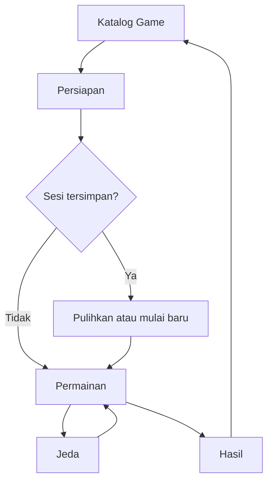

# Standar UI/UX Sistem Game

**Proyek:** Website Les Privat Kak Harris  
**Lokasi tujuan:** `docs/Games/10-UI-UX.md`  
**Status:** Rancangan awal  
**Fokus rilis:** Matematika SD–SMP  
**Platform:** Website responsif, mobile-first

## 1. Tujuan

Dokumen ini menetapkan bahasa antarmuka bersama untuk seluruh sistem game. Setiap game boleh memiliki tema, ilustrasi, dan mekanik berbeda, tetapi struktur layar, perilaku kontrol, feedback, aksesibilitas, serta penanganan loading dan error harus tetap konsisten.

Standar ini bertujuan agar:

- murid tidak perlu mempelajari ulang navigasi pada setiap game;
- game nyaman digunakan pada ponsel Android berlayar kecil;
- komponen dapat dipakai ulang lintas engine;
- keadaan UI selalu mencerminkan state dari runtime;
- tampilan tidak mengambil alih logika penilaian, skor, mode, atau progres;
- pengalaman tetap dapat digunakan saat koneksi lambat atau terputus sementara;
- ekspansi konten tidak membuat pola interaksi baru tanpa alasan yang kuat.

## 2. Sasaran Pengguna dan Perangkat

### Pengguna awal

- Murid SD kelas 1–6.
- Murid SMP kelas 7–9.
- Admin atau tutor hanya untuk kebutuhan pratinjau dan pengujian; bukan target utama layar permainan.

Perbedaan usia ditangani melalui tingkat bahasa, kepadatan konten, dan kompleksitas soal. Standar kontrol dasar tetap sama agar desain tidak terpecah menjadi dua aplikasi.

### Perangkat awal

- ponsel Android dengan lebar viewport mulai 320 CSS pixel;
- tablet dalam orientasi potret atau lanskap;
- laptop dan desktop dengan mouse atau keyboard;
- koneksi yang dapat melambat atau terputus sementara.

Browser modern yang didukung harus memiliki JavaScript, Pointer Events, penyimpanan lokal yang tersedia, dan dukungan dasar aksesibilitas. Dukungan browser lama ditentukan pada implementasi, bukan dengan mengurangi standar interaksi utama.

## 3. Prinsip Desain

1. **Mobile-first.** Alur utama dirancang untuk layar kecil lebih dahulu.
2. **Konsisten lintas engine.** Kontrol sesi dan arti setiap status tidak berubah antar-game.
3. **Matematika menjadi fokus.** Dekorasi tidak boleh menutupi soal, pilihan, atau area kerja.
4. **Kesulitan berasal dari materi.** Target kecil, gesture rumit, timer mengejutkan, dan instruksi tersembunyi bukan cara menaikkan level.
5. **Satu aksi, satu akibat.** Klik ganda atau sentuhan berulang tidak boleh menilai jawaban dua kali.
6. **State sebagai sumber kebenaran.** UI merender state dan mengirim action; UI tidak menghitung jawaban, skor, XP, atau kondisi selesai sendiri.
7. **Feedback bermakna.** Benar, salah, input tidak valid, dan error sistem harus dibedakan.
8. **Aksesibilitas sejak awal.** Keyboard, pembaca layar, kontras, dan pengurangan gerak bukan tambahan akhir.
9. **Kegagalan aman.** Masalah jaringan atau konten tidak boleh dianggap kesalahan murid.
10. **Tidak manipulatif.** Tidak ada tombol menyesatkan, hadiah palsu, countdown buatan, atau hukuman karena keluar dari layar.

## 4. Batas Tanggung Jawab Lapisan UI

### UI menangani

- struktur dan tata letak layar;
- penyajian soal, instruksi, progres, skor, timer, dan nyawa;
- kontrol sentuh, mouse, keyboard, serta fokus;
- state visual seperti dipilih, aktif, terkunci, benar, salah, loading, dan error;
- pengiriman action terstruktur kepada runtime;
- pengumuman perubahan penting kepada teknologi bantu;
- tampilan pemulihan sesi dan antrean penyimpanan hasil.

### UI tidak menangani

- menentukan benar atau salah;
- menghitung skor, streak, XP, achievement, atau hadiah;
- memutuskan kondisi akhir mode;
- mengambil bank soal atau kunci jawaban secara langsung;
- menulis hasil sesi langsung ke Firestore;
- menyimpulkan jenjang hanya dari komponen yang sedang terlihat;
- mengubah checkpoint domain berdasarkan animasi;
- mempercayai data tampilan sebagai bukti hasil yang sah.

## 5. Arsitektur Informasi

Alur utama murid:



Adventure dapat menyisipkan peta, cerita, pilihan, dan hasil node. Engine anak tetap memakai pola permainan, jeda, feedback, serta hasil yang sama.

## 6. Jenis Layar Resmi

| ID layar | Tujuan | Kontrol utama |
| --- | --- | --- |
| `catalog` | Memilih game yang sesuai akun | Buka detail game |
| `preparation` | Menjelaskan tujuan, aturan, dan mode | Mulai |
| `recovery_prompt` | Menangani checkpoint kompatibel | Lanjutkan atau mulai baru |
| `gameplay` | Menjalankan aktivitas | Aksi engine, jeda, selesai bila tersedia |
| `pause` | Menghentikan interaksi sementara | Lanjutkan atau keluar |
| `feedback` | Menjelaskan hasil aksi yang telah dinilai | Lanjut jika tidak otomatis |
| `node_result` | Menutup satu node Adventure | Retry atau lanjut |
| `result` | Merangkum sesi | Main lagi atau kembali ke katalog |
| `loading` | Menunggu dependensi penting | Tidak selalu memiliki aksi |
| `empty` | Menjelaskan tidak adanya konten yang sah | Kembali atau ubah filter |
| `error` | Menjelaskan kegagalan yang dapat atau tidak dapat dipulihkan | Coba lagi atau kembali |

`feedback` dapat berupa lapisan di dalam `gameplay`, tetapi tetap harus memiliki state dan aturan fokus yang eksplisit. UI tidak boleh menebak layar dari kombinasi kelas CSS.

## 7. Kontrak State Presentasi

UI menerima model presentasi terstruktur dari adapter. Contoh umum:

```js
{
  screen: "gameplay",
  phase: "awaiting_input",
  title: "Misi Bilangan Bulat",
  instruction: "Pilih hasil yang benar.",
  sessionStatus: {
    mode: "limited_questions",
    progressLabel: "4 dari 10 soal",
    scoreLabel: "320 poin",
    timerLabel: null,
    livesLabel: null
  },
  content: {
    renderer: "single_choice",
    prompt: "-8 + 13 = ...",
    options: []
  },
  controls: {
    canSubmit: false,
    canPause: true,
    canFinish: false
  },
  feedback: null,
  connection: "online"
}
```

Aturan:

- renderer dipilih dari daftar yang terdaftar, bukan dari HTML yang dikirim konten;
- `canSubmit`, `canPause`, dan kemampuan lain berasal dari runtime;
- label tampilan tidak digunakan kembali sebagai nilai domain;
- state harus dapat dirender tanpa membaca Firestore dari komponen;
- data evaluator atau kunci jawaban tidak masuk model presentasi mentah;
- komponen tidak mengubah state domain langsung.

## 8. UI Adapter dan Action

Komponen mengirim action semantik kepada engine atau Session Manager.

```js
dispatch({
  type: "SUBMIT_ANSWER",
  payload: {
    optionId: "opt_b"
  },
  clientActionId: "action_uuid",
  occurredAt: 1785901200000
});
```

Aturan action:

- nama action menjelaskan maksud, bukan event DOM seperti `BUTTON_CLICKED`;
- ID domain dikirim, bukan indeks visual atau koordinat layar;
- setiap action yang dapat dinilai memiliki `clientActionId` unik;
- input dikunci ketika action sedang dievaluasi;
- action dari layar atau putaran lama diabaikan;
- metode `drag`, `tap`, atau `keyboard` boleh dicatat untuk evaluasi UX, tetapi tidak mengubah kebenaran atau skor;
- komponen tidak mengirim ulang action karena animasi selesai.

## 9. Struktur Layar Permainan

Urutan visual umum:

1. header sesi;
2. instruksi singkat;
3. area konten atau papan;
4. area feedback kontekstual;
5. kontrol aksi utama;
6. bantuan sekunder bila tersedia.

### Header sesi

Header dapat memuat:

- tombol kembali atau jeda;
- progres;
- skor;
- timer;
- nyawa bila mode mendukungnya.

Tidak semua informasi harus tampil dengan bobot yang sama. Prioritasnya adalah batas yang dapat mengakhiri sesi, kemudian progres, lalu skor. Pada HP sempit, label dapat dipadatkan tetapi arti dan nama aksesibelnya tidak boleh hilang.

### Area konten

- menjadi area terbesar pada layar;
- tidak tertutup header, bottom action bar, keyboard, atau toast;
- mendukung rumus panjang tanpa scroll horizontal halaman;
- scroll internal hanya digunakan bila benar-benar diperlukan;
- tinggi tidak dikunci pada nilai yang membuat konten terpotong saat ukuran font diperbesar.

### Kontrol aksi

- satu tombol utama per tahap;
- tombol utama ditempatkan konsisten dan mudah dijangkau ibu jari;
- aksi destruktif atau keluar dipisahkan dari jawaban;
- tombol tidak berpindah posisi hanya karena label feedback berubah;
- state disabled terlihat dan memiliki alasan yang dapat dipahami.

## 10. Pola Layar Persiapan

Sebelum sesi dimulai, tampilkan:

- judul dan tujuan belajar;
- jenjang atau kelas bila relevan;
- cara bermain dalam maksimal beberapa langkah ringkas;
- mode yang dipilih;
- batas soal, waktu, atau nyawa;
- tingkat kesulitan;
- informasi apakah sesi dapat dijeda;
- tombol **Mulai**.

Countdown mode waktu belum berjalan pada layar ini. Aset minimum dan soal pertama harus siap sebelum tombol mulai benar-benar membuat status `playing`.

Jika game mendukung beberapa mode, mode dipilih melalui kartu atau radio button yang memiliki nama serta deskripsi. Mode tidak dibedakan hanya dari ikon.

## 11. Pola Pemulihan Sesi

Jika checkpoint kompatibel ditemukan, layar menampilkan:

- nama game;
- progres terakhir;
- waktu penyimpanan relatif;
- dampak timer bila sesi berbatas waktu;
- tombol **Lanjutkan sesi**;
- tombol **Mulai dari awal** dengan konfirmasi.

UI tidak menjanjikan progres dapat dipulihkan sebelum loader memvalidasi versi game, bank, konten, dan kebijakan waktu. Checkpoint tidak kompatibel menghasilkan pesan sederhana dan opsi memulai sesi baru tanpa menyalahkan murid.

## 12. Pola Layar Hasil

Urutan informasi:

1. status penyelesaian dan alasan yang mudah dipahami;
2. pencapaian utama;
3. akurasi dan progres;
4. feedback pembelajaran;
5. XP atau achievement setelah sistem terkait tersedia;
6. aksi berikutnya.

Hasil tidak hanya menampilkan skor. Ringkasan minimal menjawab:

- apa yang berhasil diselesaikan;
- bagian apa yang perlu dilatih;
- apakah hasil sudah tersimpan;
- apa yang dapat dilakukan selanjutnya.

Akurasi `null` ditampilkan sebagai **Belum ada jawaban yang dinilai**, bukan `0%`. Retry dipisahkan dari tombol kembali agar tidak tertekan tanpa sengaja. Main ulang tidak memberi hadiah ganda untuk sesi lama.

## 13. Komponen Bersama

| Komponen | Fungsi | State minimum |
| --- | --- | --- |
| `GameCard` | Kartu katalog ringan | default, locked, loading, unavailable |
| `SessionHeader` | Progres dan kontrol sesi | normal, warning, paused |
| `ProgressIndicator` | Menjelaskan kemajuan | determinate, round, hidden |
| `TimerDisplay` | Menampilkan waktu | normal, warning, expired |
| `ScoreDisplay` | Menampilkan skor | normal, updated |
| `LivesDisplay` | Menampilkan nyawa | normal, decreased, empty |
| `InstructionBlock` | Instruksi singkat | default, expanded |
| `PrimaryAction` | Aksi utama tahap | enabled, disabled, busy |
| `FeedbackPanel` | Feedback pembelajaran | correct, wrong, invalid, neutral |
| `HintPanel` | Petunjuk | closed, open, used |
| `PauseDialog` | Jeda dan keluar | open, confirming_exit |
| `RecoveryPrompt` | Pemulihan checkpoint | resumable, incompatible |
| `ResultSummary` | Ringkasan hasil | saving, saved, queued, failed |
| `InlineNotice` | Informasi lokal | info, warning, error, success |
| `EmptyState` | Konten kosong | filter_empty, no_content |
| `ErrorState` | Kegagalan layar | recoverable, unrecoverable |

Nama state semantik dipakai lintas tema. Kelas CSS atau warna tidak boleh menjadi kontrak antar-komponen.

## 14. Sistem Visual dan Token

Sistem game mengikuti identitas Les Privat Kak Harris: biru tua dan putih sebagai dasar, teal untuk aksi utama, serta kuning lembut sebagai aksen. Warna semantik benar, salah, peringatan, dan informasi tetap memiliki fungsi khusus.

Contoh token awal:

```css
:root {
  --color-brand-navy: #12304a;
  --color-brand-teal: #0f766e;
  --color-brand-yellow: #f4c95d;
  --color-surface: #ffffff;
  --color-surface-muted: #f4f7f9;
  --color-text: #17212b;
  --color-text-muted: #51606f;
  --color-border: #cbd5df;
  --color-success: #16794b;
  --color-error: #b42318;
  --color-warning: #8a5a00;
  --color-info: #155eef;
  --focus-ring: 0 0 0 3px rgba(21, 94, 239, 0.35);
  --radius-control: 12px;
  --touch-target-min: 44px;
}
```

Nilai akhir harus diuji kontras pada pasangan foreground–background aktual. Token warna tidak menghapus kewajiban ikon, teks, pola, atau perubahan bentuk sebagai penanda status.

Game boleh mempunyai tema visual melalui token tambahan. Tema tidak boleh:

- mengubah arti warna semantik;
- mengurangi kontras;
- memindahkan kontrol inti tanpa kebutuhan mekanik;
- mengubah ukuran sentuh minimum;
- membuat teks matematika menyerupai dekorasi;
- mengganti ikon standar dengan simbol ambigu.

## 15. Tipografi dan Notasi Matematika

- Gunakan font antarmuka yang jelas dan tersedia konsisten pada web.
- Ukuran teks utama pada HP tidak kurang dari 16 CSS pixel.
- Teks soal dapat lebih besar sesuai jenjang dan panjang konten.
- Line-height cukup untuk pecahan, pangkat, akar, serta indeks.
- Teks tidak dipadatkan untuk memaksa satu baris.
- Zoom browser tidak dinonaktifkan.
- Notasi matematika dirender dengan renderer yang konsisten, misalnya KaTeX, bila teks biasa tidak cukup.
- Renderer memiliki fallback teks dan label aksesibel.
- Minus matematika dibedakan secara visual dari pemisah dekoratif.
- Desimal Indonesia atau format lain harus mengikuti aturan evaluator dan instruksi soal, bukan ditebak oleh tampilan.

Konten LaTeX atau rich text dari bank soal harus melalui parser dan sanitasi yang diizinkan. HTML mentah dari konten tidak dirender langsung.

## 16. Responsivitas

Breakpoints adalah alat tata letak, bukan pembeda kemampuan pengguna.

| Rentang awal | Pola utama |
| --- | --- |
| 320–479 px | Satu kolom, header padat, kontrol utama lebar penuh |
| 480–767 px | Satu kolom lebar atau dua area ringkas bila konten mendukung |
| 768–1023 px | Dua kolom untuk papan yang sesuai |
| ≥1024 px | Area permainan dibatasi agar tidak terlalu melebar |

Aturan:

- tidak ada scroll horizontal pada halaman utama;
- area permainan memiliki lebar maksimum yang menjaga fokus;
- orientasi berubah tanpa mereset state;
- safe area perangkat diperhitungkan pada header dan bottom action bar;
- keyboard virtual tidak menutup input atau tombol kirim;
- tombol utama boleh sticky di bawah jika tidak menutupi konten;
- komponen dua kolom harus memiliki fallback yang jelas pada layar sempit;
- papan tidak diperkecil sampai teks atau target sentuh menjadi tidak layak.

## 17. Sentuhan, Pointer, dan Keyboard Virtual

- Target interaktif minimum sekitar 44 × 44 CSS pixel.
- Jarak antartarget mencegah salah sentuh, terutama antara jawaban dan keluar.
- Gunakan Pointer Events untuk interaksi seret.
- Hover hanya enhancement, bukan satu-satunya cara melihat informasi.
- Gesture seret selalu memiliki alternatif ketuk dan keyboard pada engine yang mewajibkannya.
- Scroll halaman tetap tersedia di luar gesture aktif yang sah.
- Input angka memakai `inputmode` sesuai format yang diizinkan.
- Tombol kirim tetap terlihat saat keyboard virtual terbuka.
- `Enter` tidak mengirim jawaban ketika input belum valid atau evaluasi sedang berjalan.
- Autofocus tidak digunakan jika membuat keyboard terbuka secara mengejutkan.

## 18. Keyboard dan Manajemen Fokus

Semua alur inti harus dapat diselesaikan dengan keyboard.

- `Tab` mengikuti urutan baca dan visual yang logis.
- `Enter` atau `Space` mengaktifkan kontrol.
- `Escape` membatalkan pilihan aktif atau membuka jalur kembali yang aman; tidak langsung menghapus sesi.
- Fokus terlihat jelas pada seluruh tema.
- Saat layar berganti, fokus pindah ke judul layar atau kontrol yang paling relevan.
- Setelah dialog ditutup, fokus kembali ke pemicu.
- Dialog menahan fokus selama terbuka.
- Item yang dipindahkan tidak membuat fokus hilang.
- Feedback otomatis tidak memindahkan fokus berulang kali.
- Shortcut tidak menggantikan kontrol yang terlihat.

## 19. Aksesibilitas

Target awal adalah memenuhi WCAG 2.2 Level AA pada alur utama.

Persyaratan minimum:

- struktur heading dan landmark semantik;
- label yang dapat dibaca untuk setiap kontrol;
- kontras teks, ikon penting, fokus, dan batas kontrol yang memadai;
- informasi tidak disampaikan hanya melalui warna, posisi, garis, audio, atau animasi;
- alt text untuk gambar informatif dan alt kosong untuk dekorasi;
- live region singkat untuk feedback dan perubahan progres penting;
- pembaca layar tidak menerima kunci jawaban atau konten tersembunyi yang seharusnya belum tersedia;
- ukuran teks dapat diperbesar tanpa kehilangan fungsi;
- urutan DOM tetap masuk akal ketika layout berubah;
- `prefers-reduced-motion` dihormati;
- tidak ada kilatan berulang yang berisiko;
- timer memberi peringatan teks dan tidak hanya perubahan warna;
- batas waktu digunakan hanya ketika sesuai tujuan belajar.

Live region tidak membacakan skor pada setiap perubahan kecil jika mengganggu fokus. Prioritas pengumuman adalah hasil aksi, error, waktu hampir habis, dan perubahan layar.

## 20. Status Interaktif

Setiap kontrol atau item dapat memiliki state berikut sesuai jenisnya:

- `default`;
- `hovered` sebagai enhancement;
- `focused`;
- `selected`;
- `submitting`;
- `correct`;
- `wrong`;
- `invalid`;
- `disabled`;
- `locked`;
- `completed`;
- `loading`.

`disabled` berarti aksi belum dapat dilakukan. `locked` berarti konten belum tersedia dan harus memiliki alasan. `invalid` berarti format atau aksi belum sah dan bukan jawaban salah. Perbedaan ini harus tampak pada teks serta perilaku, bukan hanya warna.

## 21. Feedback dan Validasi

| Kondisi | Arti | Dampak sesi | Perilaku UI |
| --- | --- | --- | --- |
| Benar | Evaluator menerima jawaban | Skor/progres sesuai aturan | Ikon, teks, dan penjelasan singkat |
| Salah | Jawaban sah tetapi tidak tepat | Dicatat sesuai engine | Ikon, teks, dan bantuan konsep bila tersedia |
| Input tidak valid | Format belum dapat dinilai | Tidak mengubah skor, streak, nyawa, atau progres | Pesan dekat input dan fokus kembali |
| Aksi ilegal | Gerakan tidak diizinkan | Tidak dianggap kesalahan matematika | Jelaskan aksi yang tersedia |
| Error konten | Item rusak atau tidak konsisten | Tidak menghukum murid | Ganti item atau tawarkan pemulihan |
| Error sistem | Runtime, jaringan, atau penyimpanan gagal | Hasil dipertahankan bila mungkin | Pesan sederhana dan aksi aman |

Feedback langsung idealnya singkat, stabil, dan tidak menutup soal sepenuhnya. Penjelasan konsep boleh diperluas. Konfeti atau animasi besar tidak digunakan pada setiap jawaban; perayaan lebih cocok pada akhir sesi atau pencapaian penting.

## 22. Loading, Empty, Error, dan Offline

### Loading

- skeleton digunakan untuk katalog jika struktur sudah diketahui;
- spinner digunakan untuk aksi singkat dengan label yang jelas;
- soal pertama tidak menampilkan countdown sebelum siap;
- loading lebih lama harus menjelaskan apa yang sedang dipersiapkan;
- tombol yang memicu request menjadi busy dan tidak dapat ditekan ulang;
- layar lama tidak boleh tetap menerima input ketika sesi baru dimuat.

### Empty

Bedakan:

- tidak ada game sesuai jenjang;
- filter tidak menemukan hasil;
- bank soal belum cukup untuk mode yang dipilih;
- seluruh konten sedang tidak tersedia.

Setiap keadaan menyediakan tindakan yang relevan, bukan hanya teks **Data kosong**.

### Error

Pesan kepada murid terdiri dari:

- apa yang gagal dalam bahasa sederhana;
- apakah progres aman;
- aksi yang dapat dilakukan;
- kode referensi ringkas hanya bila diperlukan untuk bantuan.

Stack trace, path internal, kunci jawaban, ID sensitif, dan pesan Firebase mentah tidak ditampilkan.

### Offline atau koneksi buruk

- indikator koneksi tidak menutupi area permainan;
- aktivitas lokal dapat berlanjut hanya jika kontrak engine mengizinkan;
- hasil yang belum tersimpan diberi status **Menunggu koneksi**;
- retry memakai `sessionId` yang sama;
- UI tidak menampilkan **Tersimpan** sebelum service mengonfirmasi atau antrean lokal sah;
- keluar dari layar tidak menghapus hasil yang masih mengantre.

## 23. Timer, Progres, Skor, dan Nyawa

### Timer

- countdown wajib pada `limited_time`;
- label dapat dibaca pembaca layar tanpa diumumkan setiap detik;
- peringatan waktu menggunakan teks atau ikon selain warna;
- animasi tidak menentukan deadline;
- timer berhenti atau terus berjalan saat jeda sesuai kontrak mode.

### Progres

- memakai satuan engine: soal, pasangan, item, puzzle, node, atau putaran;
- label tidak boleh menyebut **soal** untuk semua engine;
- indikator visual selalu memiliki nilai teks;
- progres salah tidak mundur kecuali aturan domain secara eksplisit menyatakannya.

### Skor

- perubahan skor boleh dianimasikan singkat;
- skor yang terlihat berasal dari Session Manager;
- skor bukan satu-satunya ukuran keberhasilan belajar.

### Nyawa

- ikon disertai jumlah atau label;
- pengurangan nyawa tidak memakai efek menakutkan atau mempermalukan;
- mode nyawa belum menjadi prioritas MVP.

## 24. Pause, Keluar, dan Selesai Manual

- Tombol jeda berada di lokasi konsisten.
- Pause menghentikan input, audio, dan animasi aktif sesuai kebijakan mode.
- Dialog jeda menampilkan **Lanjutkan**, **Pengaturan** bila tersedia, dan **Keluar**.
- Keluar meminta konfirmasi serta menjelaskan apakah sesi dapat dilanjutkan.
- Mode Endless memiliki tombol **Selesai** yang terpisah dari **Keluar**.
- **Selesai** menghasilkan hasil sah; **Keluar** dapat berarti meninggalkan atau menyimpan checkpoint.
- Tombol destruktif tidak menjadi default focused action.
- Browser back ditangani konsisten dengan navigasi dalam aplikasi dan tidak langsung membuang sesi.

## 25. Animasi, Audio, dan Getaran

### Animasi

- digunakan untuk memperjelas perubahan state;
- tidak menjadi sumber kebenaran;
- tidak menunda aksi penting tanpa alasan pembelajaran;
- berdurasi singkat untuk feedback rutin;
- dihentikan saat pause atau engine dihancurkan;
- memiliki versi reduced motion tanpa kehilangan informasi.

### Audio

- default mengikuti kebijakan produk dan preferensi tersimpan;
- kontrol mute mudah ditemukan;
- efek suara bersifat tambahan;
- narasi penting memiliki teks;
- audio tidak diputar otomatis sebelum interaksi pengguna;
- engine membersihkan audio saat keluar.

### Getaran

- tidak wajib pada MVP;
- bila tersedia, bersifat ringan dan dapat dimatikan;
- tidak digunakan untuk mempermalukan jawaban salah;
- bukan satu-satunya feedback.

## 26. Pola Khusus per Engine

| Engine | Pola utama | Ketentuan UI penting |
| --- | --- | --- |
| Quiz | Prompt, pilihan/input, kirim | Satu jawaban sah per putaran; keyboard sesuai tipe input |
| Generated Drill | Prompt hasil generator | Prefetch tidak mengubah soal aktif; perubahan level tidak mengganggu |
| Matching | Pilih kiri lalu kanan | Dua sisi berlabel; pasangan selesai tetap terbaca |
| Drag & Drop | Item sumber dan target | Seret memiliki alternatif ketuk serta keyboard |
| Puzzle | Papan dan transformasi state | Undo, reset, hint, dan submit dibedakan jelas |
| Adventure | Peta, cerita, pilihan, aktivitas anak | Peta vertikal; fokus dan header dipulihkan setelah engine anak |

Aturan rinci tetap mengikuti dokumen masing-masing engine. Dokumen ini menjadi fallback bila engine belum menentukan perilaku visual tertentu.

## 27. Katalog Game

- hanya metadata ringan dan gambar thumbnail teroptimasi yang dimuat;
- filter jenjang diterapkan sebelum kartu dirender;
- kartu menampilkan judul, engine atau gaya permainan yang mudah dipahami, kelas, materi, serta estimasi durasi bila relevan;
- game terkunci tidak menyerupai game yang dapat dimainkan;
- status **Segera hadir** tidak menggunakan tombol aktif;
- jumlah kartu besar memakai pagination, load-more, atau virtualisasi sesuai kebutuhan;
- perpindahan filter tidak membuat seluruh halaman berkedip;
- thumbnail dekoratif tidak wajib dibacakan;
- urutan game dapat dipahami tanpa bergantung pada animasi masuk.

## 28. Bahasa dan Microcopy

- Gunakan Bahasa Indonesia yang ringkas dan sesuai usia.
- Satu instruksi berisi satu tindakan utama.
- Hindari istilah teknis seperti `session`, `checkpoint`, `invalid payload`, atau nama engine pada layar murid.
- Gunakan kata kerja konkret: **Pilih**, **Pasangkan**, **Urutkan**, **Letakkan**, **Lanjutkan**.
- Bedakan **Coba lagi** untuk aksi, **Main lagi** untuk sesi baru, dan **Lanjutkan** untuk tahap berikutnya.
- Jangan memakai kalimat yang mempermalukan: **Kamu gagal**, **Kok salah lagi?**, atau sejenisnya.
- Feedback salah tetap jujur, misalnya **Belum tepat. Perhatikan tanda negatifnya.**
- Pesan sistem tidak menyamar sebagai feedback matematika.
- Istilah, kapitalisasi, dan tanda baca memakai kamus UI bersama.

Untuk kelas kecil, instruksi dapat didukung ikon atau ilustrasi, tetapi teks tetap tersedia. Untuk SMP, bahasa tidak dibuat kekanak-kanakan.

## 29. Performa yang Terlihat Pengguna

- katalog tidak mengunduh bundle semua engine sekaligus;
- engine dimuat secara lazy sesuai game;
- soal atau papan berikutnya boleh diprefetch setelah sesi stabil;
- gambar memakai format dan ukuran responsif;
- font dan renderer matematika tidak menggeser layout secara besar setelah tampil;
- animasi menggunakan properti yang tidak memicu layout berat bila memungkinkan;
- satu engine aktif dibersihkan sebelum engine berikutnya dibuat;
- placeholder menjaga tata letak selama aset dimuat;
- UI tetap responsif saat checkpoint disimpan di latar belakang.

Target implementasi rinci ditentukan melalui pengujian perangkat nyata. Kecepatan tidak boleh dicapai dengan menampilkan katalog belum terfilter atau memulai timer sebelum konten siap.

## 30. Privasi dan Keamanan Tampilan

- nama lengkap murid tidak perlu ditampilkan pada layar permainan;
- kunci jawaban tidak berada pada atribut DOM, label aksesibel tersembunyi, atau log UI;
- konten dari bank soal disanitasi;
- URL aset divalidasi sesuai sumber yang diizinkan;
- error tidak membocorkan konfigurasi, token, path, atau aturan keamanan;
- analitik UI tidak merekam isi jawaban bebas kecuali benar-benar diperlukan dan diizinkan;
- screenshot atau share hasil belum menjadi bagian MVP;
- data akun lain tidak pernah muncul saat pergantian sesi.

## 31. Analitik UX Minimum

Event yang dapat membantu mengevaluasi antarmuka:

- `game_card_opened`;
- `game_preparation_viewed`;
- `game_start_requested`;
- `session_recovery_offered`;
- `session_recovery_selected`;
- `pause_opened`;
- `exit_confirmation_opened`;
- `hint_opened`;
- `invalid_input_shown`;
- `ui_error_shown`;
- `result_viewed`;
- `result_primary_action_selected`.

Payload hanya memuat konteks teknis yang diperlukan, seperti game, engine, mode, viewport class, input method, phase, kode error, dan versi UI. Analitik dipakai untuk menemukan hambatan UX, bukan menyimpulkan kemampuan murid hanya dari metode input atau jumlah salah sentuh.

## 32. Preferensi Pengguna

Preferensi yang dapat disimpan:

- suara aktif atau nonaktif;
- reduced motion bila pengguna memilih override;
- ukuran teks tambahan bila produk menyediakannya;
- metode input terakhir sebagai kenyamanan, bukan pembatas;
- tampilan petunjuk instruksi yang sudah dipahami.

Preferensi tidak boleh mengubah aturan permainan, skor, atau kebenaran. Preferensi aksesibilitas dikirim melalui `playerContext` secukupnya dan tidak disalin ke setiap dokumen hasil.

## 33. Struktur Implementasi yang Disarankan

```text
src/
└── games/
    └── ui/
        ├── adapters/
        │   ├── createPresentationModel.js
        │   └── dispatchGameAction.js
        ├── components/
        │   ├── GameCard.*
        │   ├── SessionHeader.*
        │   ├── ProgressIndicator.*
        │   ├── TimerDisplay.*
        │   ├── FeedbackPanel.*
        │   ├── PauseDialog.*
        │   └── ResultSummary.*
        ├── layouts/
        │   ├── GameShell.*
        │   └── BoardLayout.*
        ├── screens/
        │   ├── CatalogScreen.*
        │   ├── PreparationScreen.*
        │   ├── GameplayScreen.*
        │   ├── RecoveryScreen.*
        │   └── ResultScreen.*
        ├── accessibility/
        │   ├── focusManager.js
        │   └── announcements.js
        ├── tokens/
        │   ├── colors.css
        │   ├── spacing.css
        │   └── typography.css
        └── states/
            ├── LoadingState.*
            ├── EmptyState.*
            └── ErrorState.*
```

Nama ekstensi disesuaikan dengan framework website. Struktur logis lebih penting daripada memaksakan folder jika proyek memiliki konvensi yang sudah jelas.

## 34. Pengujian Minimum

### Pengujian komponen

- seluruh state resmi dapat dirender;
- tombol busy tidak mengirim action ganda;
- state disabled dan locked memiliki arti berbeda;
- feedback benar, salah, invalid, dan error dapat dibedakan;
- komponen menerima teks panjang dan nilai kosong yang sah;
- live region tidak mengumumkan informasi berulang secara berlebihan.

### Pengujian alur

- katalog ke persiapan, permainan, hasil, dan kembali;
- pemulihan sesi kompatibel dan tidak kompatibel;
- pause, resume, selesai manual, dan keluar;
- error konten tidak menghukum murid;
- jaringan terputus saat bermain dan saat menyimpan hasil;
- refresh saat input, evaluasi, feedback, dan hasil;
- back browser tidak membuang sesi tanpa konfirmasi;
- satu action tidak dinilai dua kali.

### Pengujian perangkat

- viewport 320, 360, 390, 768, dan desktop;
- Android kelas menengah dengan sentuhan;
- orientasi potret dan lanskap;
- keyboard virtual terbuka;
- mouse dan keyboard fisik;
- zoom 200%;
- teks diperbesar;
- koneksi lambat dan offline sementara.

### Pengujian aksesibilitas

- seluruh alur utama dapat diselesaikan hanya dengan keyboard;
- fokus terlihat dan tidak hilang;
- pembaca layar menerima urutan serta pengumuman yang benar;
- kontras tema dan seluruh state interaktif;
- reduced motion;
- informasi tetap jelas tanpa warna dan tanpa audio;
- target sentuh memenuhi ukuran minimum.

### Pengujian lintas engine

Minimal satu fixture resmi untuk Quiz, Generated Drill, Matching, Drag & Drop, Puzzle, dan Adventure. Semua fixture harus menggunakan shell, kontrol sesi, feedback, error, serta hasil bersama.

## 35. Batas MVP

MVP wajib mencakup:

- katalog yang terfilter sebelum render;
- layar persiapan, permainan, pause, recovery, hasil, loading, empty, dan error;
- shell permainan responsif;
- header sesi dan kontrol mode bersama;
- feedback benar, salah, dan input tidak valid;
- area sentuh minimum;
- keyboard dan fokus dasar;
- reduced motion;
- indikator hasil tersimpan atau menunggu koneksi;
- token visual bersama;
- pola Quiz sebagai implementasi UI pertama;
- kontrak adapter dan action.

Belum wajib pada MVP:

- dark mode;
- avatar atau karakter animasi global;
- skin yang dapat dibeli;
- editor tema untuk admin;
- voice input;
- narasi audio penuh;
- haptic wajib;
- leaderboard publik;
- share card hasil;
- personalisasi layout berbasis AI;
- animasi 3D;
- dukungan khusus notasi SMA.

## 36. Kriteria Penerimaan

Dokumen dan implementasi UI/UX dianggap memenuhi standar jika:

1. Murid dapat menyelesaikan alur Quiz pada viewport 320 piksel tanpa scroll horizontal.
2. Keyboard virtual tidak menutup input atau tombol kirim.
3. Semua aksi utama dapat digunakan dengan sentuhan dan keyboard.
4. Status benar, salah, invalid, terkunci, disabled, dan error tidak bergantung pada warna saja.
5. UI tidak menentukan kebenaran, skor, XP, atau kondisi selesai.
6. Klik ganda dan action lama tidak menilai dua kali.
7. Mode menampilkan batasnya sebelum sesi dimulai.
8. Refresh atau jaringan putus tidak membuat UI menjanjikan hasil yang belum tersimpan.
9. Loading, empty, error, dan recovery memiliki tindakan yang sesuai.
10. Fokus berpindah dengan benar pada dialog dan transisi layar.
11. Tema engine tetap memakai komponen dan arti state bersama.
12. Konten matematika dapat dibaca pada ponsel dan saat zoom diperbesar.
13. Semua engine memiliki fallback input yang ditetapkan dokumennya.
14. Pengujian perangkat, aksesibilitas, dan lintas engine tersedia.

## 37. Keputusan yang Ditetapkan

- Sistem memakai pola mobile-first dengan dukungan viewport mulai 320 CSS pixel.
- Seluruh engine memakai shell, kontrol sesi, state semantik, dan layar hasil bersama.
- Target sentuh minimum sekitar 44 × 44 CSS pixel.
- UI merender state dan mengirim action; logika domain tetap berada di runtime dan service.
- Feedback benar, salah, input tidak valid, error konten, dan error sistem dibedakan.
- Gesture seret bukan satu-satunya metode input.
- Warna, audio, garis, posisi, atau animasi tidak pernah menjadi satu-satunya pembawa informasi.
- Target aksesibilitas awal adalah WCAG 2.2 Level AA pada alur utama.
- Brand biru tua, putih, teal, dan kuning lembut diterapkan melalui token bersama.
- Game pertama untuk memvalidasi sistem UI adalah Engine Quiz.
- Dark mode dan personalisasi visual tidak masuk MVP.
- UI disiapkan agar renderer baru dapat ditambah, tetapi konten SMA belum menjadi target rilis.

## 38. Langkah Berikutnya

Setelah standar UI/UX selesai, dokumentasi dilanjutkan ke `11-Database.md`. Dokumen tersebut harus menetapkan koleksi Firestore, dokumen game dan versi, sesi aktif, hasil, progres, XP, achievement, analitik, indeks, hak akses, retensi, serta migrasi data tanpa membuat komponen UI menulis langsung ke database.
