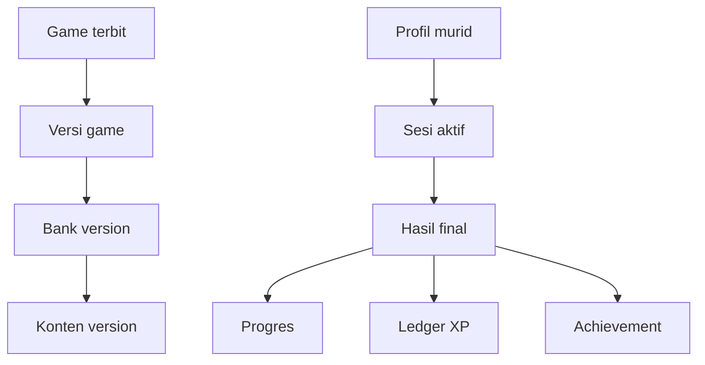

# Rancangan Database Sistem Game

**Proyek:** Website Les Privat Kak Harris  
**Lokasi tujuan:** `docs/Games/11-Database.md`  
**Status:** Rancangan awal  
**Fokus rilis:** Matematika SD–SMP  
**Platform:** Firebase Authentication dan Cloud Firestore

## 1. Tujuan

Dokumen ini menetapkan struktur data permanen untuk seluruh sistem game. Rancangan mencakup katalog, versi game, bank konten, sesi aktif, hasil final, progres, XP, achievement, analitik, indeks, hak akses, retensi, dan migrasi data.

Tujuan utamanya adalah:

- menyediakan satu model data yang dapat digunakan seluruh engine;
- memisahkan data publik, data pribadi murid, dan data tepercaya;
- menjaga hasil sesi tetap idempoten;
- mencegah refresh atau pengiriman ulang memberi hadiah ganda;
- memungkinkan sesi dipulihkan tanpa menganggap checkpoint sebagai hasil final;
- mempertahankan riwayat saat game atau bank soal mendapat versi baru;
- menghindari komponen UI menulis langsung ke banyak koleksi;
- mendukung pertumbuhan jumlah game tanpa mengganti struktur dasar;
- menyiapkan tipe kelas 10–12 tanpa menerbitkan konten SMA saat ini.

## 2. Prinsip Desain

1. **Server menjadi sumber kebenaran data permanen.** Klien dapat mengirim aksi atau ringkasan, tetapi tidak menetapkan XP, achievement, peran, kelas, atau timestamp final.
2. **Checkpoint berbeda dari hasil.** Checkpoint dapat berubah dan kedaluwarsa; hasil final bersifat tetap dan hanya diproses sekali.
3. **Versi dipin pada awal sesi.** Sesi tidak berpindah game version, bank version, atau scoring version di tengah permainan.
4. **ID hasil sama dengan ID sesi.** Satu `sessionId` hanya dapat menghasilkan satu hasil final.
5. **Data turunan dapat dibangun ulang.** Progres, statistik, dan total XP berasal dari ledger atau hasil final, bukan menjadi satu-satunya catatan.
6. **Kunci jawaban tidak dicampur dengan dokumen publik.** Firestore Rules bekerja pada tingkat dokumen, bukan menyembunyikan field tertentu.
7. **Konten terbit tidak diedit di tempat.** Perubahan material membuat versi baru.
8. **Query dirancang sebelum indeks.** Koleksi dan field tidak ditambah hanya karena terlihat praktis.
9. **Data pribadi diminimalkan.** Dokumen game tidak menyalin nama, email, nomor telepon, atau data pembayaran.
10. **MVP tetap sederhana.** Tidak ada leaderboard publik, sinkronisasi multiplayer, atau event log setiap gerakan.

## 3. Batas Tanggung Jawab

### Database menangani

- penyimpanan konfigurasi dan versi game;
- penyimpanan konten yang diterbitkan;
- checkpoint sesi yang dapat dipulihkan;
- hasil final dan status pemrosesannya;
- agregat progres murid;
- ledger XP dan achievement;
- event analitik yang telah diminimalkan;
- status migrasi dan versi skema;
- timestamp tepercaya serta jejak audit minimum.

### Database tidak menangani

- menggambar UI;
- menjalankan animasi atau timer browser;
- menentukan urutan visual pilihan;
- menggantikan evaluator setiap engine;
- menyimpan frame, koordinat pointer, atau seluruh state DOM;
- menyimpan kunci jawaban pada dokumen yang dapat dibaca murid;
- menjadi tempat penyimpanan aset gambar berukuran besar;
- menjamin hadiah sah hanya berdasarkan skor yang dikirim klien.

## 4. Lingkungan dan Namespace

Produksi dan pengembangan tidak boleh memakai dataset murid yang sama. Pilihan yang disarankan:

1. proyek Firebase terpisah untuk `development` dan `production`; atau
2. minimal emulator untuk pengujian lokal dan proyek produksi hanya untuk rilis.

Prefix koleksi seperti `dev_games` tidak dianggap isolasi yang cukup untuk pengujian Security Rules. Emulator harus menjadi jalur utama untuk pengujian rules, migrasi, dan transaksi.

Dokumen ini mengasumsikan database Firestore utama website tetap dipakai. Koleksi game ditambahkan tanpa mengubah koleksi akun, jadwal, dan pembayaran yang sudah ada.

## 5. Peta Data Tingkat Tinggi



Game dan konten adalah data bersama. Sesi, hasil, progres, XP, serta achievement berada di bawah kepemilikan murid atau menyimpan `ownerUid` yang tegas.

## 6. Kelompok Koleksi

| Kelompok | Koleksi utama | Pembaca | Penulis |
| --- | --- | --- | --- |
| Katalog | `games` | Pengguna terautentikasi yang sesuai | Admin/publisher |
| Versi game | `games/{gameId}/versions` | Pengguna yang dapat membuka game | Admin/publisher |
| Bank | `contentBanks` | Loader game | Admin/publisher |
| Konten presentasi | `contentItems` | Runtime sesuai bank | Admin/publisher |
| Evaluasi terlindungi | `evaluationSpecs` | Backend tepercaya | Admin/publisher/backend |
| Sesi | `users/{uid}/gameSessions` | Pemilik dan admin | Service sesi terbatas/backend |
| Hasil | `users/{uid}/gameResults` | Pemilik dan admin | Backend finalizer |
| Progres | `users/{uid}/gameProgress` | Pemilik dan admin | Backend aggregator |
| XP | `users/{uid}/xpLedger` | Pemilik dan admin | Backend reward service |
| Achievement | `users/{uid}/achievements` | Pemilik dan admin | Backend reward service |
| Analitik | `gameAnalyticsEvents` | Admin terbatas | Event service |
| Operasional | `gameSystem` | Admin/backend | Admin/backend |

Nama koleksi harus dibandingkan dengan repo sebelum implementasi untuk menghindari benturan dengan struktur `users` atau `murid` yang telah ada. Jika profil murid saat ini memakai koleksi lain, path anak dapat disesuaikan tanpa mengubah kontrak dokumennya.

## 7. Aturan ID Umum

### ID stabil

- `gameId`, `bankId`, `contentId`, `achievementId`, dan `topicId` menggunakan slug ASCII huruf kecil, angka, serta tanda hubung;
- ID tidak bergantung pada judul yang dapat diedit;
- ID tidak memuat nama, email, kelas aktif, atau data pribadi;
- ID permanen tidak digunakan ulang setelah diarsipkan;
- versi menggunakan integer positif;
- `sessionId`, `eventId`, dan `clientActionId` menggunakan UUID atau ID acak yang sulit ditebak;
- ID berurutan seperti `session-000001` tidak digunakan untuk event bervolume tinggi.

### ID dokumen versi

Versi disimpan dalam bentuk string berpagar nol agar mudah dibaca:

```text
v000001
v000002
```

Nilai numeriknya tetap disimpan dalam field `version: 1`. Kode tidak boleh menentukan versi hanya dengan mengurutkan string ID.

### ID hasil dan ledger

```text
gameResults/{sessionId}
xpLedger/session-complete__{sessionId}
```

Dengan pola tersebut, retry memakai target dokumen yang sama dan tidak membuat hadiah baru.

## 8. Waktu dan Timestamp

Gunakan Firestore `Timestamp`, bukan string tanggal, untuk field operasional:

- `createdAt`;
- `updatedAt`;
- `startedAt`;
- `checkpointedAt`;
- `finishedAt`;
- `publishedAt`;
- `expiresAt`.

Aturan:

- `createdAt`, `finishedAt`, `processedAt`, dan waktu pemberian hadiah memakai server timestamp;
- `clientStartedAt` boleh dikirim untuk diagnostik, tetapi bukan waktu otoritatif;
- timer berbatas waktu memakai deadline yang ditetapkan saat sesi dibuat;
- durasi aktif dihitung dari lifecycle sesi dan divalidasi, bukan dipercaya sebagai angka bebas;
- tanggal kalender untuk laporan mengikuti zona waktu aplikasi, sedangkan penyimpanan tetap timestamp absolut.

## 9. Koleksi `games`

Path:

```text
games/{gameId}
```

Dokumen ini hanya memuat metadata katalog dan pointer versi aktif. Dokumen tidak memuat bank soal lengkap.

```json
{
  "schemaVersion": 1,
  "gameId": "operasi-bilangan-bulat-01",
  "status": "published",
  "title": "Misi Bilangan Bulat",
  "shortDescription": "Latihan operasi bilangan bulat kelas 7.",
  "engineType": "quiz",
  "activeVersion": 1,
  "audienceKeys": ["SMP-7"],
  "topicIds": ["bilangan-bulat"],
  "supportedModes": ["endless", "limited_questions", "limited_time"],
  "thumbnailRef": "game-thumbnails/bilangan-bulat-01.webp",
  "sortOrder": 120,
  "isFeatured": false,
  "publishedAt": "server-timestamp",
  "updatedAt": "server-timestamp"
}
```

### `audienceKeys`

Gunakan satu array gabungan seperti `SD-4` atau `SMP-7`. Ini menghindari query katalog yang harus memakai dua filter array terpisah untuk jenjang dan kelas.

Nilai yang disiapkan:

```text
SD-1 sampai SD-6
SMP-7 sampai SMP-9
SMA-10 sampai SMA-12
```

`SMA-*` sah pada skema, tetapi belum digunakan pada katalog rilis awal.

### Status game

```text
draft
in_review
published
retired
```

Game `retired` tidak muncul untuk sesi baru, tetapi versi dan hasil lamanya tidak dihapus.

## 10. Subkoleksi Versi Game

Path:

```text
games/{gameId}/versions/{versionId}
```

Contoh:

```json
{
  "schemaVersion": 1,
  "gameId": "operasi-bilangan-bulat-01",
  "version": 1,
  "status": "published",
  "engineType": "quiz",
  "engineVersion": 1,
  "modeConfigs": {
    "limited_questions": {
      "questionLimit": 10
    },
    "limited_time": {
      "timeLimitSeconds": 60
    }
  },
  "bankRef": {
    "bankId": "bank-bilangan-bulat-k7",
    "bankVersion": 3
  },
  "scoringVersion": 1,
  "rewardPolicyVersion": 1,
  "minimumClientVersion": 1,
  "compatibleRecoveryFromVersions": [1],
  "themeId": "math-navy-teal-v1",
  "publishedAt": "server-timestamp"
}
```

Aturan:

- versi `published` tidak dapat diedit secara material;
- `activeVersion` pada induk baru dipindahkan setelah versi dan bank tervalidasi;
- rollback dilakukan dengan memindahkan pointer ke versi terbit lama, bukan mengubah versinya;
- checkpoint menyimpan versi eksplisit dan tidak mengikuti pointer terbaru;
- `compatibleRecoveryFromVersions` hanya dipakai bila migrasi state benar-benar tersedia.

## 11. Koleksi `contentBanks`

Path utama:

```text
contentBanks/{bankId}
contentBanks/{bankId}/versions/{versionId}
```

Induk menyimpan metadata dan pointer versi aktif. Dokumen versi menyimpan snapshot aturan seleksi serta manifest referensi konten.

```json
{
  "schemaVersion": 1,
  "bankId": "bank-bilangan-bulat-k7",
  "bankVersion": 3,
  "status": "published",
  "engineTypes": ["quiz", "generated_drill"],
  "audienceKeys": ["SMP-7"],
  "topicIds": ["bilangan-bulat"],
  "selectionPolicy": {
    "strategy": "weighted_without_immediate_repeat",
    "difficultyMix": {
      "easy": 0.3,
      "medium": 0.5,
      "hard": 0.2
    }
  },
  "manifestShardCount": 2,
  "contentCount": 180,
  "publishedAt": "server-timestamp"
}
```

Manifest besar tidak disimpan sebagai satu array tanpa batas. Gunakan shard:

```text
contentBanks/{bankId}/versions/{versionId}/manifestShards/{shardId}
```

Setiap entry minimum memuat `contentId`, `contentVersion`, `contentType`, `difficulty`, dan bobot. Shard dipakai untuk menghindari dokumen terlalu besar dan pembacaan data yang tidak diperlukan.

## 12. Koleksi `contentItems`

Path:

```text
contentItems/{contentKey}
contentItems/{contentKey}/versions/{versionId}
```

`contentKey` dapat memakai gabungan tipe dan ID:

```text
question__bb-k7-penjumlahan-001
matching-set__pecahan-k5-senilai-set-001
puzzle__pola-k4-urutan-001
```

Dokumen versi yang dapat dibaca runtime memuat envelope dan payload presentasi, tetapi tidak memuat rahasia evaluasi bila backend evaluator digunakan.

```json
{
  "schemaVersion": 1,
  "contentId": "bb-k7-penjumlahan-001",
  "contentVersion": 2,
  "contentType": "question",
  "status": "published",
  "engineTypes": ["quiz"],
  "audienceKeys": ["SMP-7"],
  "topicId": "bilangan-bulat",
  "subtopicId": "penjumlahan",
  "difficulty": "easy",
  "payload": {
    "renderer": "single_choice",
    "prompt": "Hasil dari -8 + 13 adalah ...",
    "options": [
      {"optionId": "opt_a", "label": "-21"},
      {"optionId": "opt_b", "label": "-5"},
      {"optionId": "opt_c", "label": "5"},
      {"optionId": "opt_d", "label": "21"}
    ]
  },
  "assetRefs": [],
  "publishedAt": "server-timestamp"
}
```

Data audit internal, catatan reviewer, dan draft tidak ikut dikirim ke runtime murid.

## 13. Koleksi `evaluationSpecs`

Path logis:

```text
evaluationSpecs/{contentKey}/versions/{versionId}
```

Contoh:

```json
{
  "schemaVersion": 1,
  "contentId": "bb-k7-penjumlahan-001",
  "contentVersion": 2,
  "evaluatorType": "single_choice",
  "correctOptionId": "opt_c",
  "explanation": "Karena 13 - 8 = 5.",
  "checksum": "server-generated-value"
}
```

Aturan keamanan:

- murid tidak mendapat izin baca langsung;
- backend evaluator atau Admin SDK yang membaca dokumen;
- admin/editor hanya mendapat akses sesuai peran;
- presentasi dan kunci dipisahkan pada dokumen berbeda;
- rules tidak boleh dianggap mampu menyembunyikan hanya `correctOptionId` di dalam dokumen publik.

### Kompromi MVP

Jika MVP belum memiliki Cloud Functions atau backend evaluator, sebagian kunci mungkin perlu dikirim ke runtime untuk evaluasi lokal. Konsekuensinya:

- hasil tidak dapat dianggap tahan manipulasi;
- XP atau achievement bernilai permanen tidak boleh bergantung penuh pada skor klien;
- data tersebut disebut `clientEvaluated`;
- arsitektur harus tetap memakai pemisahan dokumen agar migrasi ke evaluator tepercaya tidak membongkar bank soal.

## 14. Relasi dengan Profil Pengguna

Profil pengguna yang sudah ada tetap menjadi sumber:

- `uid`;
- peran;
- ID murid internal bila diperlukan;
- jenjang;
- kelas aktif;
- status akun.

Dokumen game hanya menyimpan snapshot minimum yang diperlukan untuk audit sesi:

```json
{
  "audienceSnapshot": {
    "educationLevel": "SMP",
    "grade": 7
  }
}
```

Snapshot tidak menggantikan profil. Perubahan kelas memengaruhi sesi baru, sedangkan hasil lama mempertahankan kelas ketika dimainkan.

Kombinasi sah:

| Jenjang | Kelas |
| --- | --- |
| SD | 1–6 |
| SMP | 7–9 |
| SMA | 10–12, disiapkan tetapi belum diterbitkan |

## 15. Subkoleksi `gameSessions`

Path:

```text
users/{uid}/gameSessions/{sessionId}
```

Satu dokumen mewakili sesi aktif atau sesi yang baru selesai diproses.

```json
{
  "schemaVersion": 1,
  "sessionId": "uuid",
  "ownerUid": "firebase-auth-uid",
  "status": "active",
  "gameId": "operasi-bilangan-bulat-01",
  "gameVersion": 1,
  "engineType": "quiz",
  "engineVersion": 1,
  "bankId": "bank-bilangan-bulat-k7",
  "bankVersion": 3,
  "scoringVersion": 1,
  "rewardPolicyVersion": 1,
  "mode": {
    "type": "limited_questions",
    "questionLimit": 10,
    "timeLimitSeconds": null,
    "initialLives": null
  },
  "audienceSnapshot": {
    "educationLevel": "SMP",
    "grade": 7
  },
  "sessionSeed": "seed-8f2a",
  "contentCursor": 4,
  "progress": {
    "attempted": 4,
    "correct": 3,
    "incorrect": 1,
    "skipped": 0,
    "score": 320,
    "currentStreak": 2,
    "maxStreak": 2
  },
  "engineState": {},
  "usedContentRefs": [],
  "startedAt": "server-timestamp",
  "deadlineAt": null,
  "checkpointedAt": "server-timestamp",
  "expiresAt": "timestamp",
  "checkpointRevision": 4,
  "resultStatus": "not_submitted"
}
```

### Status sesi

```text
created
active
paused
finishing
completed
abandoned
expired
invalidated
```

Transisi status hanya bergerak maju kecuali pemulihan resmi dari `paused` ke `active`. `completed` tidak dapat kembali menjadi `active`.

## 16. Batas Isi Checkpoint

Checkpoint menyimpan state minimum untuk melanjutkan sesi secara adil:

- identitas dan versi;
- seed serta cursor generator;
- ID konten yang sedang aktif;
- referensi konten yang telah digunakan secukupnya;
- progres agregat;
- timer atau deadline;
- state engine serializable;
- revision dan waktu checkpoint.

Checkpoint tidak menyimpan:

- node DOM;
- koordinat pointer mentah;
- animasi yang sedang berjalan;
- seluruh bank soal;
- gambar dalam base64;
- nama atau email murid;
- kunci jawaban yang tidak diperlukan untuk recovery;
- log setiap ketukan tanpa batas.

Jika `usedContentRefs` membesar pada Endless, gunakan ring buffer, hash set terkompresi yang aman, atau subkoleksi checkpoint terpisah. Jangan membiarkan satu dokumen tumbuh terus selama sesi.

## 17. Frekuensi Checkpoint

Checkpoint tidak ditulis pada setiap render. Momen yang disarankan:

- setelah satu jawaban atau target sah selesai;
- setelah satu puzzle selesai;
- setelah satu node Adventure selesai;
- saat pengguna memilih jeda;
- sebelum keluar secara sadar;
- setiap beberapa putaran pada Endless;
- ketika aplikasi berpindah ke background jika waktu memungkinkan.

Gunakan debounce agar beberapa perubahan berdekatan menjadi satu write. State lokal tetap diperbarui lebih cepat daripada Firestore.

`checkpointRevision` naik monoton. Write dengan revision lebih lama tidak boleh menimpa revision baru.

## 18. Pemulihan Sesi

Sesi dapat dipulihkan hanya jika:

- `ownerUid` sama dengan akun aktif;
- status masih `active` atau `paused`;
- `expiresAt` belum lewat;
- game version dan engine version kompatibel;
- bank version masih tersedia;
- hasil final belum ada;
- deadline mode waktu belum menghasilkan keadaan yang tidak adil.

Jika mode waktu telah melewati deadline, recovery tidak memberi waktu baru. Session Manager menyelesaikan sesi dengan `time_expired` atau menandainya tidak dapat dipulihkan sesuai aturan mode.

Memulai sesi baru saat checkpoint lama ada harus meminta keputusan pengguna. Sesi lama kemudian ditandai `abandoned`; tidak dihapus diam-diam.

## 19. Antrean Lokal dan Sinkronisasi

IndexedDB atau penyimpanan lokal boleh menahan:

- checkpoint terbaru yang belum tersinkron;
- request finalisasi dengan `sessionId` sama;
- metadata retry dan waktu percobaan terakhir.

Aturan:

- antrean lokal bukan sumber hadiah permanen;
- retry mempertahankan `sessionId` dan `clientRequestId`;
- data dihapus setelah server mengonfirmasi hasil final;
- konflik revision diselesaikan dengan memilih checkpoint sah yang lebih baru, bukan menggabungkan skor;
- logout menghapus atau mengunci data lokal pengguna tersebut;
- data lokal tidak boleh dipulihkan ke akun berbeda pada perangkat yang sama.

## 20. Subkoleksi `gameResults`

Path:

```text
users/{uid}/gameResults/{sessionId}
```

Dokumen ID wajib sama dengan `sessionId`.

```json
{
  "schemaVersion": 1,
  "sessionId": "uuid",
  "ownerUid": "firebase-auth-uid",
  "status": "completed",
  "finishReason": "question_limit_reached",
  "gameId": "operasi-bilangan-bulat-01",
  "gameVersion": 1,
  "engineType": "quiz",
  "engineVersion": 1,
  "bankId": "bank-bilangan-bulat-k7",
  "bankVersion": 3,
  "modeType": "limited_questions",
  "audienceSnapshot": {
    "educationLevel": "SMP",
    "grade": 7
  },
  "startedAt": "server-timestamp",
  "finishedAt": "server-timestamp",
  "activeDurationSeconds": 184,
  "attemptedCount": 10,
  "correctCount": 8,
  "wrongCount": 2,
  "skippedCount": 0,
  "accuracy": 0.8,
  "score": 920,
  "maxStreak": 5,
  "endingDifficulty": "medium",
  "topicSummary": [
    {
      "topicId": "bilangan-bulat",
      "attempted": 10,
      "correct": 8
    }
  ],
  "scoringVersion": 1,
  "rewardPolicyVersion": 1,
  "evaluationTrust": "server_verified",
  "rewardStatus": "granted",
  "xpGranted": 24,
  "processedAt": "server-timestamp"
}
```

### Aturan hasil

- hasil final tidak diedit untuk mengubah skor;
- koreksi administratif membuat audit adjustment terpisah;
- `accuracy` bernilai `null` jika tidak ada jawaban yang dinilai;
- `topicSummary` hanya memuat agregat, bukan teks soal;
- detail engine diletakkan pada `engineSummary` yang ukurannya dibatasi;
- `evaluationTrust` membedakan `client_evaluated`, `server_verified`, dan `admin_verified`;
- hasil `client_evaluated` tetap berguna untuk riwayat, tetapi kebijakan hadiah dapat membatasinya.

## 21. Finalisasi Idempoten

Finalisasi idealnya dilakukan melalui backend tepercaya dalam transaksi:

1. autentikasi pengguna;
2. baca sesi berdasarkan `uid` dan `sessionId`;
3. pastikan sesi belum memiliki hasil final;
4. validasi versi game, bank, mode, dan status;
5. hitung atau verifikasi ringkasan;
6. buat `gameResults/{sessionId}`;
7. buat event ledger XP dengan ID deterministik;
8. perbarui agregat progres;
9. evaluasi achievement;
10. tandai sesi `completed`;
11. commit seluruh perubahan yang harus atomik.

Jika transaksi diulang karena konflik, keberadaan result dan ledger dengan ID yang sama membuat proses tidak menggandakan hadiah.

Respons finalizer minimum:

```json
{
  "sessionId": "uuid",
  "resultStatus": "completed",
  "alreadyProcessed": false,
  "xpGranted": 24,
  "unlockedAchievementIds": []
}
```

Retry hasil lama mengembalikan hasil yang sudah ada dengan `alreadyProcessed: true`.

## 22. Jalur MVP Tanpa Backend Finalizer

Jika backend tepercaya belum siap, gunakan batas berikut:

- klien hanya menulis checkpoint miliknya melalui Session Service;
- ringkasan akhir masuk status `pending_verification` atau `client_evaluated`;
- XP dan achievement permanen dinonaktifkan atau dibatasi pada penghargaan nonkompetitif;
- admin tidak memakai skor tersebut sebagai penilaian akademik formal;
- struktur ID tetap sama agar migrasi ke finalizer tidak membuat data ganda;
- UI harus membedakan “hasil tersimpan” dari “hadiah terverifikasi”.

Jangan membuka write bebas ke `xpLedger`, `achievements`, atau total XP hanya agar MVP lebih cepat.

## 23. Subkoleksi `gameProgress`

Path:

```text
users/{uid}/gameProgress/{progressKey}
```

Gunakan dua tipe agregat:

```text
game__{gameId}
topic__{topicId}
```

Contoh progres per topik:

```json
{
  "schemaVersion": 1,
  "progressType": "topic",
  "topicId": "bilangan-bulat",
  "audienceKey": "SMP-7",
  "completedSessions": 6,
  "attemptedCount": 60,
  "correctCount": 46,
  "accuracy": 0.7667,
  "bestScore": 980,
  "bestStreak": 7,
  "lastPlayedAt": "server-timestamp",
  "lastResultId": "session-uuid",
  "aggregationVersion": 1,
  "updatedAt": "server-timestamp"
}
```

Aturan:

- progres hanya diperbarui dari hasil yang diterima kebijakan agregasi;
- best score dibandingkan hanya pada game/mode yang sebanding;
- akurasi dihitung ulang dari total benar dan total dinilai, bukan rata-rata persentase sesi;
- data dapat dibangun ulang dari `gameResults`;
- klien tidak mengubah counter secara bebas;
- replay hasil yang sama tidak menambah `completedSessions`.

## 24. Mastery dan Interpretasi Akademik

Database boleh menyimpan indikator mastery, tetapi tidak menyamakan skor game dengan penguasaan materi secara otomatis.

```json
{
  "mastery": {
    "status": "developing",
    "score": 0.64,
    "modelVersion": 1,
    "evidenceSessionCount": 5,
    "evaluatedAt": "server-timestamp"
  }
}
```

Nilai mastery harus memiliki:

- model version;
- jumlah bukti minimum;
- rentang waktu yang jelas;
- aturan soal atau mode yang diterima;
- kemampuan untuk dihitung ulang.

Pada MVP, field mastery boleh belum digunakan. Akurasi dan jumlah sesi cukup untuk laporan awal.

## 25. Subkoleksi `xpLedger`

Path:

```text
users/{uid}/xpLedger/{ledgerEventId}
```

Ledger bersifat append-only.

```json
{
  "schemaVersion": 1,
  "ledgerEventId": "session-complete__session-uuid",
  "ownerUid": "firebase-auth-uid",
  "eventType": "session_complete",
  "sourceId": "session-uuid",
  "gameId": "operasi-bilangan-bulat-01",
  "amount": 24,
  "rewardPolicyVersion": 1,
  "reasonCode": "verified_completion",
  "createdAt": "server-timestamp"
}
```

Aturan:

- nilai positif dan negatif sama-sama dicatat sebagai event baru;
- event lama tidak diubah untuk mengoreksi total;
- adjustment admin memerlukan alasan dan `actorUid` pada audit terlindungi;
- satu sumber dan jenis hadiah memakai ID deterministik;
- total XP adalah cache yang dapat dihitung ulang dari ledger;
- mode Endless mengikuti cap dari `14-Mode-Permainan.md`;
- durasi bermain saja tidak langsung menjadi XP.

## 26. Ringkasan Level dan XP

Ringkasan cepat dapat disimpan pada:

```text
users/{uid}/gameProfile/summary
```

```json
{
  "schemaVersion": 1,
  "totalXp": 1240,
  "level": 8,
  "levelPolicyVersion": 1,
  "lastLedgerEventId": "session-complete__session-uuid",
  "updatedAt": "server-timestamp"
}
```

Ringkasan ini untuk tampilan cepat. Jika berbeda dengan ledger, ledger dan kebijakan versi menjadi dasar rekonsiliasi.

Detail rumus level dan hadiah ditetapkan pada `13-Level-XP.md`.

## 27. Subkoleksi `achievements`

Path:

```text
users/{uid}/achievements/{achievementId}
```

```json
{
  "schemaVersion": 1,
  "achievementId": "streak-5-bilangan-bulat",
  "definitionVersion": 1,
  "status": "unlocked",
  "progress": 5,
  "target": 5,
  "unlockedAt": "server-timestamp",
  "sourceResultId": "session-uuid",
  "grantId": "achievement__streak-5-bilangan-bulat__session-uuid"
}
```

Definisi achievement global berada pada koleksi terpisah:

```text
achievementDefinitions/{achievementId}/versions/{versionId}
```

Definisi terbit dapat dibaca murid. Kondisi evaluasi sensitif dan proses pemberiannya tetap berada pada backend.

Detail aturan achievement ditetapkan pada `12-Achievement.md`.

## 28. Analitik Event

Path:

```text
gameAnalyticsEvents/{eventId}
```

Event minimum:

```text
game_catalog_viewed
game_opened
game_session_started
game_session_paused
game_session_resumed
game_session_recovered
game_session_finished
game_session_abandoned
game_result_save_failed
content_error_detected
```

Contoh:

```json
{
  "schemaVersion": 1,
  "eventId": "uuid",
  "eventName": "game_session_finished",
  "actorHash": "rotating-pseudonymous-id",
  "sessionId": "uuid",
  "gameId": "operasi-bilangan-bulat-01",
  "gameVersion": 1,
  "engineType": "quiz",
  "modeType": "limited_questions",
  "audienceKey": "SMP-7",
  "occurredAt": "server-timestamp",
  "clientOccurredAt": "client-timestamp",
  "properties": {
    "finishReason": "question_limit_reached"
  },
  "expiresAt": "timestamp"
}
```

### Larangan analitik

Jangan menyimpan:

- nama;
- email;
- nomor telepon;
- alamat;
- isi pesan;
- teks jawaban bebas murid tanpa kebutuhan jelas;
- bukti pembayaran;
- token autentikasi;
- seluruh payload soal pada setiap event;
- gerakan pointer atau event render berfrekuensi tinggi.

`actorHash` bersifat opsional dan tidak boleh dipakai untuk mencoba mengenali identitas asli di luar kebutuhan produk.

## 29. Deduplication Event

Setiap event memiliki `eventId` stabil selama retry. Event service menolak event dengan ID yang sama.

Untuk aksi bernilai tinggi:

- hasil memakai `sessionId`;
- XP memakai `ledgerEventId` deterministik;
- achievement memakai `grantId` deterministik;
- action putaran memakai `clientActionId`;
- analytics memakai `eventId`.

Deduplication tidak hanya dilakukan di memori browser karena refresh dapat menghapus memori tersebut.

## 30. Data Adventure

Adventure memakai dokumen sesi parent dan referensi hasil anak.

```json
{
  "engineType": "adventure",
  "engineState": {
    "currentNodeId": "node-03",
    "visitedNodeIds": ["node-01", "node-02", "node-03"],
    "completedNodeIds": ["node-01", "node-02"],
    "selectedBranchIds": ["branch-a"],
    "childSessionIds": ["child-session-01", "child-session-02"]
  }
}
```

Aturan:

- child session tetap memiliki hasil engine masing-masing;
- parent tidak menyalin seluruh detail child;
- XP node dan XP penyelesaian Adventure memakai sumber ledger berbeda;
- retry node tidak menggandakan reward;
- parent final hanya selesai ketika ending sah tercapai;
- graf dan versi Adventure dipin pada awal sesi.

## 31. Data Engine Khusus

Setiap engine boleh memakai `engineState` dan `engineSummary`, tetapi wajib:

- dapat diserialisasi sebagai data Firestore;
- tidak memuat fungsi, elemen DOM, atau circular reference;
- memiliki `engineStateVersion`;
- memiliki ukuran yang dibatasi;
- dapat divalidasi berdasarkan `engineType`;
- tidak mengganti arti field umum sesi dan hasil.

Contoh field khusus:

| Engine | State minimum |
| --- | --- |
| Quiz | konten aktif, phase, action terakhir |
| Generated Drill | seed, cursor, difficulty state |
| Matching | pasangan tersisa dan selection aktif |
| Drag & Drop | item yang terkunci dan target |
| Puzzle | board state, move count, undo terbatas |
| Adventure | node aktif, cabang, child sessions |

## 32. Asset dan Media

Firestore hanya menyimpan referensi asset:

```json
{
  "assetId": "img-pecahan-pizza-001",
  "storagePath": "game-assets/published/img-pecahan-pizza-001-v1.webp",
  "mimeType": "image/webp",
  "width": 800,
  "height": 600,
  "altText": "Satu pizza dibagi menjadi delapan bagian sama besar.",
  "version": 1
}
```

File gambar, audio, dan animasi disimpan pada penyimpanan aset, bukan base64 di Firestore. Asset terbit berversi dan tidak ditimpa jika perubahan memengaruhi soal.

## 33. Security Rules: Prinsip

1. Semua akses default ditolak.
2. Pengguna harus terautentikasi untuk membuka katalog murid.
3. Murid hanya membaca data pribadi miliknya.
4. Admin ditentukan dari profil atau custom claim yang tepercaya.
5. Role tidak diterima dari payload write.
6. Field yang dapat diubah klien menggunakan allowlist.
7. `ownerUid` harus sama dengan `request.auth.uid` dan tidak dapat diganti.
8. Dokumen versi terbit tidak dapat diubah oleh murid.
9. `gameResults`, `xpLedger`, progres, serta achievement tidak menerima write langsung dari klien murid.
10. `evaluationSpecs` tidak dapat dibaca murid.
11. Query harus sesuai batas yang dapat dibuktikan rules.
12. Rules diuji dengan Emulator Suite sebelum deploy.

Security Rules bukan filter. Query yang berpotensi mengembalikan dokumen tanpa izin akan ditolak seluruhnya; aplikasi harus membuat query yang selaras dengan aturan akses.

## 34. Security Rules: Kerangka Konseptual

Contoh berikut adalah kerangka, bukan file rules siap salin. Nama koleksi profil harus disesuaikan dengan repo aktual.

```js
rules_version = '2';
service cloud.firestore {
  match /databases/{database}/documents {
    function signedIn() {
      return request.auth != null;
    }

    function owns(uid) {
      return signedIn() && request.auth.uid == uid;
    }

    function isAdmin() {
      return signedIn()
        && get(/databases/$(database)/documents/users/$(request.auth.uid)).data.role == "admin";
    }

    match /games/{gameId} {
      allow read: if signedIn() && resource.data.status == "published";
      allow write: if isAdmin();

      match /versions/{versionId} {
        allow read: if signedIn() && resource.data.status == "published";
        allow write: if isAdmin();
      }
    }

    match /users/{uid}/gameSessions/{sessionId} {
      allow read: if owns(uid) || isAdmin();
      allow create, update: if owns(uid) && validSessionWrite(uid, sessionId);
      allow delete: if false;
    }

    match /users/{uid}/gameResults/{sessionId} {
      allow read: if owns(uid) || isAdmin();
      allow write: if false;
    }

    match /users/{uid}/xpLedger/{eventId} {
      allow read: if owns(uid) || isAdmin();
      allow write: if false;
    }
  }
}
```

Admin SDK atau server library melewati Firestore Security Rules, sehingga backend juga wajib dilindungi oleh autentikasi, otorisasi, validasi input, IAM, dan pemeriksaan kepemilikan.

## 35. Validasi Write Sesi

Write klien pada checkpoint harus membatasi:

- daftar field yang boleh ada;
- tipe setiap field;
- panjang array;
- rentang skor, counter, dan revision;
- `ownerUid` yang tidak berubah;
- `sessionId` sama dengan ID dokumen;
- `gameId` dan versi tidak berubah setelah sesi dibuat;
- status mengikuti transisi sah;
- `checkpointRevision` tidak mundur;
- timestamp server atau batas waktu yang masuk akal;
- ukuran `engineState` melalui struktur yang diketahui, bukan map bebas tanpa batas.

Rules saja tidak dapat membuktikan seluruh kebenaran matematis. Validasi skor dan hadiah tetap membutuhkan service tepercaya jika integritasnya penting.

## 36. Strategi Query Katalog

Query utama:

```js
query(
  collection(db, "games"),
  where("status", "==", "published"),
  where("audienceKeys", "array-contains", "SMP-7"),
  orderBy("sortOrder", "asc")
)
```

Filter dilakukan sebelum kartu dirender. URL langsung tetap divalidasi ulang oleh loader terhadap profil pengguna dan `audienceKeys`.

Katalog hanya mengambil metadata kartu. Versi game dan bank dimuat setelah murid memilih game.

## 37. Indeks Minimum

Indeks final harus berasal dari query implementasi. Kandidat awal:

| Collection / group | Field | Tujuan |
| --- | --- | --- |
| `games` | `status ASC`, `audienceKeys ARRAY`, `sortOrder ASC` | Katalog per kelas |
| `games` | `status ASC`, `isFeatured ASC`, `sortOrder ASC` | Game unggulan |
| `gameResults` collection group | `ownerUid ASC`, `finishedAt DESC` | Riwayat lintas path bila diperlukan admin |
| `gameResults` collection group | `gameId ASC`, `finishedAt DESC` | Laporan game admin |
| `gameSessions` collection group | `status ASC`, `expiresAt ASC` | Pembersihan sesi |
| `gameAnalyticsEvents` | `eventName ASC`, `occurredAt DESC` | Analisis event |
| `contentItems` | `status ASC`, `topicId ASC`, `difficulty ASC` | Kurasi admin |

Query riwayat milik sendiri di subkoleksi pengguna cukup memakai `orderBy(finishedAt, desc)` dan pagination.

Jangan membuat indeks untuk field besar yang tidak pernah dipakai query, seperti `payload`, `engineState`, `topicSummary`, `usedContentRefs`, atau manifest array. Tambahkan pengecualian indeks untuk field tersebut bila sesuai.

## 38. Pagination dan Batas Pembacaan

- riwayat hasil dimuat per halaman;
- katalog dapat dimuat penuh selama masih kecil, tetapi kontrak mendukung cursor;
- konten diambil dari manifest terpilih, bukan memindai seluruh `contentItems`;
- dashboard admin memakai cursor `startAfter`, bukan offset besar;
- listener realtime tidak dipakai untuk riwayat statis;
- session aktif dapat memakai pembacaan langsung satu dokumen;
- statistik agregat dibaca dari `gameProgress`, bukan menghitung seluruh hasil pada setiap layar.

## 39. Ukuran Dokumen

Cloud Firestore Standard membatasi ukuran satu dokumen hingga 1 MiB. Rancangan internal sebaiknya memakai pagar yang jauh lebih kecil agar aman terhadap pertumbuhan indeks dan metadata.

Target praktis:

- katalog: di bawah 20 KiB;
- versi game: di bawah 50 KiB;
- konten tunggal: di bawah 100 KiB tanpa asset biner;
- checkpoint: di bawah 100 KiB;
- hasil: di bawah 50 KiB;
- shard manifest: di bawah 250 KiB.

Jika data mendekati pagar, pecah menjadi subkoleksi atau asset terpisah. Jangan menunggu hingga limit platform tercapai.

## 40. Retensi Data

Kebijakan awal:

| Data | Retensi awal | Tindakan |
| --- | --- | --- |
| Sesi aktif | Sampai selesai atau kedaluwarsa | Tandai selesai/expired |
| Checkpoint abandoned | 30 hari | Hapus atau TTL setelah audit minimum |
| Hasil final | Selama akun aktif dan dibutuhkan laporan | Arsip/hapus sesuai kebijakan akun |
| XP ledger | Selama total XP dipertahankan | Jangan hapus parsial tanpa rekonsiliasi |
| Achievement | Selama akun aktif | Pertahankan bersama definisi versi |
| Analitik mentah | 90 hari | Hapus otomatis atau job terjadwal |
| Agregat anonim | Sesuai kebutuhan produk | Pastikan tidak dapat mengidentifikasi murid |
| Draft konten lama | Berdasarkan kebijakan editor | Arsipkan sebelum hapus |

Durasi final harus mempertimbangkan kebutuhan sekolah, persetujuan pengguna, biaya, dan kebijakan privasi yang berlaku. Angka di atas adalah titik awal teknis, bukan keputusan hukum final.

## 41. TTL dan Pembersihan

Field `expiresAt` dapat dipakai untuk TTL pada koleksi yang sesuai. Namun:

- TTL tidak menghapus data tepat pada detik kedaluwarsa;
- query dan rules tetap harus memeriksa `expiresAt`;
- TTL pada dokumen induk tidak otomatis menghapus subkoleksi;
- data anak harus dihindari pada dokumen ephemeral atau dibersihkan rekursif oleh backend;
- field TTL yang tidak digunakan query dapat dikecualikan dari indeks biasa sesuai kebutuhan;
- pembersihan diuji pada lingkungan nonproduksi.

## 42. Penghapusan Akun

Penghapusan akun game membutuhkan proses backend terkontrol:

1. nonaktifkan sesi baru;
2. tandai permintaan penghapusan;
3. hapus atau anonimisasi data pribadi sesuai kebijakan;
4. hapus subkoleksi sesi, hasil, progres, ledger, dan achievement secara rekursif bila memang diwajibkan;
5. tangani analitik dengan actor pseudonim;
6. tulis audit tanpa menyalin data yang telah diminta dihapus;
7. konfirmasi keberhasilan semua batch.

Menghapus dokumen induk `users/{uid}` saja tidak dianggap cukup karena subkoleksi Firestore tidak otomatis hilang.

## 43. Backup dan Pemulihan

Sebelum migrasi besar:

- ekspor atau backup sesuai kemampuan paket Firebase;
- simpan versi rules dan indeks di Git;
- uji restore pada lingkungan nonproduksi;
- catat nomor migrasi dan waktu cutover;
- siapkan rollback pointer untuk katalog dan versi game;
- jangan mengandalkan cache browser sebagai backup.

Backup database tidak menggantikan versioning konten. Keduanya menyelesaikan masalah berbeda.

## 44. Migrasi Skema

Setiap dokumen utama memiliki `schemaVersion`. Migrasi menggunakan koleksi operasional:

```text
gameSystem/migrations/{migrationId}
```

Contoh:

```json
{
  "migrationId": "2026-08-add-audience-keys",
  "fromSchemaVersion": 1,
  "toSchemaVersion": 2,
  "status": "completed",
  "startedAt": "server-timestamp",
  "completedAt": "server-timestamp",
  "lastCursor": null,
  "processedCount": 1240,
  "failedCount": 0,
  "codeVersion": "git-commit-sha"
}
```

Aturan migrasi:

- idempoten;
- dapat dilanjutkan dari cursor;
- bekerja dalam batch terbatas;
- tidak mengganti versi konten terbit secara diam-diam;
- mencatat kegagalan tanpa menyimpan data sensitif;
- memiliki dry run;
- memiliki validasi sebelum dan sesudah;
- tidak menghapus field lama sebelum semua pembaca kompatibel.

## 45. Pola Expand–Migrate–Contract

Gunakan urutan:

1. **Expand:** tambahkan field atau struktur baru yang masih opsional.
2. **Dual read:** aplikasi dapat membaca struktur lama dan baru.
3. **Migrate:** isi data lama secara bertahap.
4. **Dual write:** bila diperlukan singkat, tulis kedua struktur.
5. **Switch:** pembaca memakai struktur baru.
6. **Verify:** bandingkan jumlah dan hasil agregat.
7. **Contract:** hapus dukungan lama setelah aman.

Perubahan langsung yang membuat aplikasi lama gagal membaca data tidak dilakukan pada rilis yang sama tanpa strategi kompatibilitas.

## 46. Audit Operasional

Perubahan penting yang perlu audit:

- publikasi atau penarikan game;
- perubahan pointer versi aktif;
- publikasi bank;
- adjustment XP;
- grant atau revoke achievement manual;
- invalidasi hasil;
- migrasi skema;
- perubahan aturan hadiah.

Audit minimum:

```json
{
  "action": "game_version_activated",
  "actorUid": "admin-uid",
  "targetType": "game",
  "targetId": "operasi-bilangan-bulat-01",
  "fromVersion": 1,
  "toVersion": 2,
  "reasonCode": "content_revision",
  "createdAt": "server-timestamp"
}
```

Audit tidak menyimpan token, kata sandi, atau salinan seluruh dokumen sebelum dan sesudah jika tidak diperlukan.

## 47. Penanganan Koreksi Hasil

Hasil final tidak diedit diam-diam. Gunakan:

```text
users/{uid}/gameResultAdjustments/{adjustmentId}
```

Adjustment memuat:

- `resultId`;
- jenis koreksi;
- alasan;
- actor tepercaya;
- nilai sebelum dan dampak setelah;
- timestamp;
- referensi ledger kompensasi bila XP berubah.

UI laporan dapat menampilkan hasil asli dan status koreksinya. Progres dibangun ulang atau disesuaikan melalui aggregator.

## 48. Penanganan Konten Bermasalah

Jika soal terbit terbukti salah:

1. tandai versi konten `withdrawn` untuk seleksi sesi baru;
2. buat versi perbaikan;
3. terbitkan bank version baru;
4. pertahankan referensi versi lama untuk audit hasil;
5. tentukan apakah hasil terdampak perlu adjustment;
6. jangan mengubah kunci versi lama di tempat.

Checkpoint yang memin versi bermasalah dapat:

- dilanjutkan jika masalah tidak material;
- mengganti item melalui fallback yang tercatat;
- diakhiri dengan `incompatible_version` atau `no_content` tanpa menghukum murid.

## 49. Error dan Status Sinkronisasi

Status penyimpanan yang dikenali UI:

```text
local_only
checkpoint_syncing
checkpoint_saved
result_pending
result_processing
result_saved
sync_failed_retryable
sync_failed_terminal
```

UI tidak menampilkan “Berhasil” sebelum server mengonfirmasi hasil final. Error retryable mempertahankan request dengan ID yang sama. Error terminal memberi tindakan kembali atau menghubungi admin tanpa meminta murid mengulang berkali-kali.

## 50. Monitoring Teknis

Pantau minimal:

- rasio sesi dimulai dibanding hasil tersimpan;
- kegagalan checkpoint;
- retry finalisasi;
- konflik revision;
- hasil duplikat yang dicegah;
- event XP duplikat yang dicegah;
- sesi kedaluwarsa;
- konten kosong atau tidak kompatibel;
- latency pemuatan katalog dan game;
- pertumbuhan ukuran koleksi analitik;
- read/write per sesi untuk mengendalikan biaya.

Alert tidak boleh mengirim data pribadi murid ke kanal yang tidak semestinya.

## 51. Efisiensi Biaya

- jangan memakai listener realtime pada data yang jarang berubah;
- cache katalog dan versi berdasarkan nomor versi;
- checkpoint dengan debounce;
- baca hasil dengan pagination;
- gunakan agregat progres untuk dashboard;
- jangan menulis analitik setiap render atau gerakan pointer;
- hindari array yang terus membesar;
- nonaktifkan indeks pada field besar yang tidak ditanyakan;
- ukur biaya per sesi sebelum memperluas katalog.

Optimasi biaya tidak boleh dilakukan dengan membuka rules atau menggabungkan data sensitif ke dokumen publik.

## 52. Pengujian Database

### Unit rules

Wajib menguji:

- pengguna tanpa login ditolak;
- murid dapat membaca data miliknya;
- murid tidak dapat membaca sesi murid lain;
- murid tidak dapat menulis hasil final;
- murid tidak dapat menulis XP atau achievement;
- murid tidak dapat membaca `evaluationSpecs`;
- admin dapat melakukan operasi yang memang diizinkan;
- perubahan `ownerUid`, `gameId`, atau versi pada checkpoint ditolak;
- revision lama ditolak;
- query katalog sesuai rules.

### Transaksi dan idempotensi

- finalisasi pertama membuat satu hasil dan satu ledger event;
- retry menghasilkan respons sama tanpa hadiah baru;
- dua request bersamaan tidak membuat dua hasil;
- kegagalan di tengah tidak meninggalkan sebagian reward;
- adjustment menghasilkan ledger kompensasi yang dapat diaudit.

### Recovery

- refresh setelah checkpoint;
- offline lalu online;
- deadline mode waktu lewat saat offline;
- game version berubah;
- bank version ditarik;
- akun berbeda pada perangkat yang sama;
- checkpoint kedaluwarsa;
- action lama datang setelah sesi final.

### Migrasi

- dry run;
- batch dapat diulang;
- cursor dapat dilanjutkan;
- jumlah dokumen cocok;
- aplikasi lama dan baru tetap membaca selama masa transisi;
- rollback telah diuji.

## 53. Data Uji

Data emulator harus menggunakan identitas fiktif:

```text
student-sd-4
student-smp-7
admin-test
```

Fixture minimum:

- satu game Quiz terbit;
- satu versi game;
- satu bank version;
- sepuluh konten valid;
- satu konten ditarik;
- satu checkpoint aktif;
- satu hasil completed;
- satu ledger XP;
- satu achievement;
- satu migrasi contoh.

Jangan menyalin data murid produksi ke emulator hanya demi kemudahan pengujian.

## 54. Batas MVP

Termasuk MVP:

- katalog `games` terfilter kelas;
- versi game immutable;
- satu bank untuk Engine Quiz;
- konten presentasi dan evaluasi terpisah secara struktural;
- checkpoint satu sesi aktif per game atau kebijakan sederhana yang jelas;
- hasil ber-ID sama dengan sesi;
- riwayat hasil murid;
- agregat progres dasar;
- fondasi ledger XP walaupun pemberian hadiah dapat ditunda;
- Security Rules dan pengujian emulator;
- analitik event minimum;
- migrasi berbasis `schemaVersion`.

Belum termasuk MVP:

- leaderboard publik;
- multiplayer realtime;
- sinkronisasi lintas perangkat pada setiap gerakan;
- data warehouse;
- rekomendasi AI;
- mastery model kompleks;
- event stream seluruh jawaban mentah;
- marketplace skin;
- pelaporan sekolah multi-organisasi;
- konten SMA terbit.

## 55. Tahap Implementasi

### Tahap P0 — Fondasi

1. cocokkan path profil aktual pada repo;
2. buat koleksi katalog dan versi;
3. buat fixture Quiz;
4. buat Session Service;
5. buat checkpoint dengan revision;
6. buat rules default-deny dan unit test;
7. uji katalog kelas SD serta SMP.

### Tahap P1 — Hasil tepercaya

1. buat finalizer idempoten;
2. simpan hasil dengan ID sesi;
3. buat progres agregat;
4. buat ledger XP;
5. buat recovery offline dan retry;
6. aktifkan analitik minimum.

### Tahap P2 — Sistem pendukung

1. achievement;
2. level dan XP lengkap;
3. laporan admin;
4. retensi otomatis;
5. audit adjustment;
6. migrasi engine lain.

## 56. Kriteria Penerimaan

Rancangan dan implementasi database dianggap memenuhi standar jika:

1. katalog hanya menampilkan game yang sesuai kelas murid.
2. URL langsung ke game yang tidak sesuai ditolak.
3. sesi memin seluruh versi yang memengaruhi hasil.
4. checkpoint lama tidak menimpa revision baru.
5. refresh tidak mengganti soal aktif pada generated drill.
6. satu `sessionId` hanya menghasilkan satu dokumen hasil.
7. retry finalisasi tidak menggandakan XP atau achievement.
8. murid tidak dapat membaca data murid lain.
9. murid tidak dapat menulis XP, achievement, atau hasil tepercaya secara bebas.
10. kunci jawaban tidak berada pada dokumen publik ketika evaluator backend digunakan.
11. progres dapat dibangun ulang dari hasil final.
12. versi konten lama tetap dapat dirujuk hasil historis.
13. sesi kedaluwarsa tidak dapat dipulihkan sebagai sesi baru.
14. rules memiliki pengujian emulator untuk skenario izin dan penolakan.
15. dokumen tidak menyimpan asset biner atau data pribadi yang tidak relevan.
16. migrasi dapat dijalankan ulang tanpa merusak data.
17. indeks hanya dibuat untuk query nyata.
18. UI tidak menulis langsung ke koleksi hasil, progres, XP, atau achievement.
19. mode Endless mematuhi cap hadiah dan batas checkpoint.
20. struktur menerima kelas 10–12 tanpa menerbitkan katalog SMA.

## 57. Keputusan yang Ditetapkan

- Firestore tetap menjadi database utama sistem game.
- Data katalog, pribadi, dan tepercaya dipisahkan.
- `audienceKeys` menjadi field filter katalog per kelas.
- Versi game, bank, konten, engine, skor, dan reward dipin pada awal sesi.
- Checkpoint berada di `gameSessions`; hasil final berada di `gameResults`.
- ID dokumen hasil sama dengan `sessionId`.
- XP disimpan sebagai ledger append-only dengan ID event deterministik.
- Progres adalah data turunan yang dapat dibangun ulang.
- Kunci jawaban dipisahkan karena Security Rules tidak memberi field-level read protection.
- Backend tepercaya diperlukan untuk hadiah yang tahan manipulasi.
- Jika backend belum tersedia, hasil klien ditandai sesuai tingkat kepercayaannya.
- Analitik tidak menyimpan data pribadi yang tidak diperlukan.
- TTL bukan pengganti pemeriksaan kedaluwarsa atau penghapusan subkoleksi.
- SMA hanya disiapkan pada skema; rilis konten tetap SD–SMP.

## 58. Referensi Teknis

- [Usage and limits — Cloud Firestore](https://firebase.google.com/docs/firestore/quotas)
- [Control access to specific fields — Cloud Firestore Security Rules](https://firebase.google.com/docs/firestore/security/rules-fields)
- [Transactions and batched writes — Cloud Firestore](https://firebase.google.com/docs/firestore/manage-data/transactions)
- [Manage data retention with TTL policies — Cloud Firestore](https://firebase.google.com/docs/firestore/ttl)
- [Test Security Rules with Firebase Emulator Suite](https://firebase.google.com/docs/firestore/security/test-rules-emulator)
- [Index types in Cloud Firestore](https://firebase.google.com/docs/firestore/query-data/index-overview)

## 59. Langkah Berikutnya

Setelah rancangan database selesai, dokumentasi dilanjutkan ke `12-Achievement.md`. Dokumen tersebut harus menetapkan definisi achievement, kategori, progres, kondisi unlock, versi aturan, pencegahan pemberian ganda, tampilan yang tidak manipulatif, serta batas achievement untuk MVP.
