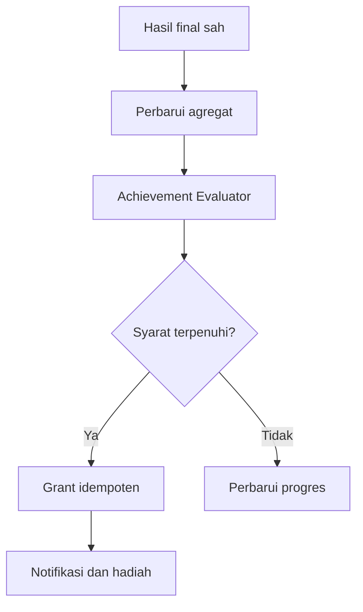

# Rancangan Sistem Achievement

**Proyek:** Website Les Privat Kak Harris  
**Lokasi tujuan:** `docs/Games/12-Achievement.md`  
**Status:** Rancangan awal  
**Fokus rilis:** Matematika SD–SMP  
**Platform:** Website responsif, Firebase Authentication, dan Cloud Firestore

## 1. Tujuan

Dokumen ini menetapkan aturan pencapaian untuk seluruh sistem game. Achievement berfungsi sebagai penanda kemajuan belajar yang dapat dijelaskan, bukan sekadar hadiah karena murid membuka halaman atau bermain selama mungkin.

Tujuan utamanya adalah:

- memberi pengakuan atas usaha, konsistensi, perkembangan, dan penguasaan yang memiliki bukti;
- memakai aturan yang konsisten lintas engine dan mode;
- mencegah refresh, retry, replay, atau pengiriman hasil berulang membuka achievement ganda;
- memisahkan achievement dari skor mentah, XP, dan mastery akademik;
- menjaga definisi lama tetap dapat dijelaskan setelah aturan berubah;
- menyediakan progres yang mudah dipahami murid;
- menghindari desain yang manipulatif, memalukan, atau mendorong bermain berlebihan;
- mendukung penambahan materi dan jenjang tanpa menanam aturan ke komponen game;
- menyiapkan struktur kelas 10–12 tanpa menerbitkan achievement SMA saat ini.

## 2. Definisi Achievement

Achievement adalah pencapaian satu kali yang terbuka ketika bukti terverifikasi memenuhi definisi berversi.

Achievement bukan:

- skor satu sesi;
- XP atau level;
- hadiah acak;
- misi harian yang dapat diklaim berulang;
- leaderboard;
- pengganti laporan belajar;
- bukti tunggal bahwa murid telah menguasai materi;
- hukuman terselubung bagi murid yang belum mendapatkannya.

Misi berulang, tantangan mingguan, dan target acara harus memakai sistem misi terpisah jika kelak dibuat. Achievement pada rancangan ini bersifat permanen dan hanya dapat terbuka satu kali per akun.

## 3. Prinsip Desain

1. **Berbasis bukti.** Pencapaian hanya dievaluasi dari hasil atau agregat yang sah.
2. **Server sebagai sumber kebenaran.** Klien tidak menetapkan status unlock, waktu unlock, atau hadiah permanen.
3. **Satu achievement, satu grant aktif.** Retry tidak boleh membuat pencapaian atau hadiah baru.
4. **Aturan berversi.** Definisi yang dipakai saat unlock tetap dapat diaudit.
5. **Dapat dijelaskan.** Murid dapat mengetahui apa yang dicapai dan mengapa.
6. **Tidak memanipulasi.** Tidak ada rasa takut kehilangan, hitung mundur palsu, atau hukuman karena tidak bermain.
7. **Belajar lebih penting dari kecepatan.** Achievement kecepatan tidak menjadi fondasi MVP.
8. **Tidak mempermalukan.** Tidak ada badge untuk kegagalan, kesalahan terbanyak, atau peringkat rendah.
9. **Progres tidak dilebihkan.** UI tidak menampilkan angka yang belum terverifikasi sebagai unlock permanen.
10. **Mudah dihitung ulang.** Status dapat direkonsiliasi dari hasil, progres, dan definisi versi.
11. **Privasi dijaga.** Achievement murid tidak dipublikasikan tanpa kebutuhan dan izin yang jelas.
12. **MVP tetap kecil.** Lebih baik enam achievement yang valid daripada puluhan badge tanpa makna.

## 4. Posisi dalam Sistem



Urutan tersebut menjaga agar achievement tidak menilai data tampilan atau event mentah. Untuk aturan yang hanya bergantung pada satu sesi, evaluator tetap menerima hasil final yang sudah disahkan. Untuk aturan kumulatif, evaluator membaca agregat yang baru diperbarui.

## 5. Batas Tanggung Jawab

### Sistem Achievement menangani

- membaca definisi achievement yang aktif;
- menentukan kandidat yang relevan dengan hasil baru;
- menghitung atau membaca progres terverifikasi;
- mengevaluasi kondisi unlock;
- membuat grant satu kali;
- menyimpan versi definisi yang digunakan;
- mengirim ringkasan unlock ke layar hasil;
- memicu hadiah tambahan melalui Reward Service bila diaktifkan;
- mendukung rekonsiliasi, koreksi, retirement, dan audit.

### Sistem Achievement tidak menangani

- menilai jawaban soal;
- menghitung skor sesi;
- menentukan hasil final sah;
- menghitung total XP atau level;
- menentukan mastery hanya dari satu badge;
- menulis konten achievement dari UI murid;
- menampilkan achievement publik lintas murid;
- membuat jadwal misi harian;
- mengubah aturan engine, mode, atau bank soal;
- memberi reward hanya berdasarkan lama halaman terbuka.

## 6. Istilah Resmi

| Istilah | Arti |
| --- | --- |
| `definition` | Aturan global sebuah achievement |
| `definitionVersion` | Versi aturan yang tidak berubah setelah diterbitkan |
| `progress` | Nilai bukti saat ini terhadap target |
| `target` | Nilai minimum yang harus dicapai |
| `unlock` | Perubahan status pertama kali menjadi terbuka |
| `grant` | Catatan pemberian achievement yang idempoten |
| `sourceResultId` | Hasil yang terakhir melengkapi syarat |
| `evidence` | Data sah yang dipakai untuk evaluasi |
| `retired` | Tidak lagi ditawarkan untuk unlock baru |
| `revoked` | Grant ditarik melalui koreksi tertepercaya |
| `hidden` | Belum menampilkan syarat lengkap sebelum terbuka |

Istilah `badge` boleh dipakai pada teks antarmuka untuk ikon visual, tetapi model domain tetap menggunakan `achievement`.

## 7. Kategori Achievement

Kategori resmi awal:

| ID | Tujuan | Contoh |
| --- | --- | --- |
| `onboarding` | Mengenalkan alur sistem | Menyelesaikan sesi pertama |
| `consistency` | Menghargai kebiasaan belajar wajar | Belajar pada tiga hari berbeda |
| `accuracy` | Menghargai ketelitian dengan jumlah bukti minimum | Akurasi minimal 80% pada 20 soal |
| `streak` | Mengakui rangkaian jawaban benar | Streak 5 pada topik tertentu |
| `topic_progress` | Mengakui perkembangan per materi | Menyelesaikan lima sesi bilangan bulat |
| `breadth` | Mendorong variasi materi atau engine | Mencoba tiga materi berbeda |
| `improvement` | Menghargai peningkatan terhadap diri sendiri | Akurasi meningkat setelah bukti cukup |
| `adventure` | Menandai penyelesaian perjalanan | Menyelesaikan satu chapter |
| `special` | Pencapaian terbatas yang dikurasi admin | Tantangan acara sekolah |

Kategori tidak menentukan rumus. Setiap achievement tetap memiliki kondisi eksplisit dan versi sendiri.

## 8. Kategori yang Tidak Dipakai pada MVP

MVP tidak memakai:

- achievement tercepat menjawab;
- achievement bermain paling lama;
- achievement login berturut-turut tanpa hari jeda;
- achievement berdasarkan jumlah klik;
- achievement peringkat pertama;
- achievement mengalahkan teman;
- achievement menyelesaikan ratusan soal dalam satu hari;
- achievement yang hanya dapat diperoleh dengan transaksi;
- achievement rahasia yang syaratnya mustahil dipahami setelah terbuka.

Kecepatan boleh menjadi statistik game tertentu, tetapi tidak boleh mengalahkan akurasi dan pemahaman sebagai sinyal utama belajar.

## 9. Cakupan Achievement

Field `scope` menentukan batas bukti yang diterima:

```json
{
  "audienceKeys": ["SMP-7"],
  "gameIds": [],
  "engineTypes": ["quiz", "generated_drill"],
  "modeTypes": ["limited_questions", "limited_time"],
  "topicIds": ["bilangan-bulat"],
  "minimumTrust": "server_verified"
}
```

Aturan:

- array kosong berarti tidak membatasi dimensi tersebut;
- nilai cakupan menggunakan ID stabil, bukan judul tampilan;
- filter jenjang dilakukan pada evidence, bukan hanya profil akun saat ini;
- hasil kelas lama tetap memakai `audienceSnapshot` pada saat sesi;
- satu definisi tidak boleh menggabungkan cakupan yang sulit dijelaskan;
- definisi SD dan SMP dapat memakai ID berbeda jika target atau bahasa berbeda;
- `SMA-10` sampai `SMA-12` valid pada skema, tetapi tidak digunakan pada rilis awal.

## 10. Sumber Bukti yang Diterima

| Sumber | Contoh penggunaan | Status MVP |
| --- | --- | --- |
| `game_result` | Sesi pertama, akurasi, streak | Wajib |
| `game_progress` | Jumlah sesi atau akurasi kumulatif per materi | Wajib |
| `achievement_state` | Prasyarat achievement lain | Opsional |
| `adventure_result` | Chapter atau ending selesai | Setelah Adventure |
| `calendar_aggregate` | Hari belajar berbeda | Opsional |
| `admin_grant` | Penghargaan khusus terverifikasi | Opsional |

Event analitik tidak menjadi sumber kebenaran unlock. Analitik dapat membantu mengukur penggunaan, tetapi event yang hilang atau terkirim ulang tidak boleh mengubah hak murid atas achievement.

## 11. Tingkat Kepercayaan Evidence

Urutan tingkat kepercayaan:

```text
client_evaluated < server_verified < admin_verified
```

Setiap definisi menyatakan `minimumTrust`.

Aturan:

- hasil di bawah tingkat minimum tidak dihitung;
- peningkatan trust pada hasil lama dapat memicu evaluasi ulang;
- penurunan atau invalidasi trust masuk alur koreksi;
- achievement kosmetik MVP dapat menerima `client_evaluated` hanya jika tidak memberi XP dan tidak digunakan untuk perbandingan;
- achievement dengan hadiah, mastery, atau acara resmi minimal memakai `server_verified`;
- UI membedakan progres sementara dari unlock terverifikasi bila jalur MVP belum memiliki backend finalizer.

## 12. Jenis Kondisi Resmi

Jenis kondisi awal:

| `conditionType` | Nilai yang diuji | Contoh |
| --- | --- | --- |
| `session_count` | Jumlah sesi selesai sah | 5 sesi |
| `attempted_count` | Jumlah item yang dinilai | 20 soal |
| `correct_count` | Jumlah jawaban benar | 50 benar |
| `accuracy_threshold` | Akurasi dengan bukti minimum | ≥ 0,8 dari ≥ 20 soal |
| `max_streak` | Streak tertinggi sah | ≥ 5 |
| `distinct_topic_count` | Jumlah topik berbeda | ≥ 3 topik |
| `distinct_game_count` | Jumlah game berbeda | ≥ 3 game |
| `distinct_engine_count` | Jumlah engine berbeda | ≥ 2 engine |
| `distinct_active_day_count` | Hari lokal berbeda dengan sesi sah | ≥ 3 hari |
| `improvement_delta` | Peningkatan antarjendela bukti | +0,15 akurasi |
| `adventure_completion` | Chapter/ending tertentu | Selesai chapter 1 |
| `achievement_prerequisite` | Achievement lain sudah terbuka | Prasyarat tier sebelumnya |

Jenis baru harus ditambahkan ke registry evaluator dan memiliki pengujian sendiri. Definisi tidak boleh mengirim ekspresi JavaScript bebas untuk dijalankan backend.

## 13. Operator Kondisi

Operator numerik resmi:

```text
gte
gt
eq
lte
lt
```

Kondisi gabungan memakai:

```text
all
any
```

MVP mengizinkan `all` pada satu tingkat dan maksimal lima kondisi atomik. Nested expression tanpa batas tidak digunakan karena sulit divalidasi, dijelaskan, dan diuji.

Contoh:

```json
{
  "logic": "all",
  "conditions": [
    {
      "conditionType": "attempted_count",
      "operator": "gte",
      "value": 20
    },
    {
      "conditionType": "accuracy_threshold",
      "operator": "gte",
      "value": 0.8
    }
  ]
}
```

## 14. Definisi Achievement Global

Path induk:

```text
achievementDefinitions/{achievementId}
```

Contoh metadata:

```json
{
  "schemaVersion": 1,
  "achievementId": "teliti-bilangan-bulat-1",
  "status": "published",
  "activeVersion": 1,
  "category": "accuracy",
  "sortOrder": 120,
  "publishedAt": "server-timestamp",
  "updatedAt": "server-timestamp"
}
```

Status resmi:

```text
draft
in_review
published
retired
```

Dokumen induk hanya menjadi metadata dan pointer. Aturan lengkap berada pada subkoleksi versi.

## 15. Definisi Achievement Berversi

Path:

```text
achievementDefinitions/{achievementId}/versions/{versionId}
```

Contoh:

```json
{
  "schemaVersion": 1,
  "achievementId": "teliti-bilangan-bulat-1",
  "definitionVersion": 1,
  "status": "published",
  "category": "accuracy",
  "title": "Teliti Bilangan Bulat I",
  "description": "Jawab sedikitnya 20 soal bilangan bulat dengan akurasi minimal 80%.",
  "lockedDescription": "Capai akurasi 80% dari sedikitnya 20 soal bilangan bulat.",
  "iconRef": "achievement-icons/teliti-bilangan-bulat-1.svg",
  "visibility": "visible",
  "progressMetric": "correct_ratio",
  "target": 0.8,
  "scope": {
    "audienceKeys": ["SMP-7"],
    "gameIds": [],
    "engineTypes": [],
    "modeTypes": [],
    "topicIds": ["bilangan-bulat"],
    "minimumTrust": "server_verified"
  },
  "conditionGroup": {
    "logic": "all",
    "conditions": [
      {
        "conditionType": "attempted_count",
        "operator": "gte",
        "value": 20
      },
      {
        "conditionType": "accuracy_threshold",
        "operator": "gte",
        "value": 0.8
      }
    ]
  },
  "reward": {
    "xpAmount": 0,
    "cosmeticIds": []
  },
  "effectiveFrom": "server-timestamp",
  "effectiveUntil": null,
  "publishedAt": "server-timestamp"
}
```

## 16. Validasi Definisi

Sebelum terbit, definisi wajib lolos:

- ID dan versi unik;
- judul, deskripsi, dan syarat tidak kosong;
- kategori serta tipe kondisi terdaftar;
- target dan operator memiliki tipe data yang benar;
- rasio berada pada rentang 0 sampai 1;
- `attempted_count` minimum menyertai syarat akurasi;
- cakupan tidak menunjuk game, topik, atau audience yang tidak dikenal;
- waktu berlaku tidak terbalik;
- icon tersedia dan memiliki alternatif teks;
- reward tidak melebihi kebijakan global;
- prasyarat tidak membuat siklus;
- syarat yang terlihat dapat dijelaskan dengan bahasa sederhana;
- evaluator versi yang diperlukan sudah tersedia;
- fixture lulus untuk kondisi belum tercapai, hampir tercapai, dan tercapai.

Definisi gagal validasi tidak boleh dipindahkan ke status `published`.

## 17. Versi dan Immutability

Aturan versi:

- versi terbit tidak diedit secara material;
- perubahan target, cakupan, kondisi, reward, atau arti achievement membuat versi baru;
- perbaikan typo minor dapat mengikuti kebijakan konten, tetapi versi yang pernah dipin tetap dapat dirender;
- grant menyimpan `definitionVersion` yang digunakan;
- pointer `activeVersion` hanya berlaku untuk evaluasi baru;
- retirement menghentikan unlock baru tanpa menghapus grant lama;
- versi evaluator dan aggregation policy dicatat bila memengaruhi hasil;
- perubahan versi tidak otomatis mencabut achievement yang sudah sah.

## 18. Kebijakan Evaluasi Versi Baru

Saat versi baru diterbitkan, pilih satu kebijakan eksplisit:

| Kebijakan | Perilaku |
| --- | --- |
| `prospective_only` | Hanya evidence setelah waktu efektif yang dihitung |
| `include_existing_evidence` | Agregat lama yang sah boleh langsung memenuhi syarat |
| `manual_backfill` | Evaluasi historis dijalankan sebagai pekerjaan admin |

Default MVP adalah `include_existing_evidence` untuk achievement progres umum. Achievement acara terbatas menggunakan `prospective_only` dengan rentang waktu jelas.

Backfill tidak boleh dijalankan diam-diam untuk definisi yang memberi hadiah besar. Job menyimpan versi, jumlah akun yang diproses, checkpoint batch, serta hasil audit.

## 19. Status Achievement Pengguna

Status resmi:

```text
locked
in_progress
unlocked
revoked
```

Aturan:

- dokumen pengguna boleh belum ada saat status efektifnya `locked` dan progres nol;
- `in_progress` digunakan jika progres perlu ditampilkan atau disimpan;
- `unlocked` adalah status permanen normal;
- `revoked` hanya berasal dari koreksi tepercaya;
- retirement definisi tidak mengubah `unlocked` menjadi `revoked`;
- status tidak kembali ke `in_progress` hanya karena target versi baru lebih tinggi.

## 20. Dokumen Achievement Pengguna

Path:

```text
users/{uid}/achievements/{achievementId}
```

Contoh:

```json
{
  "schemaVersion": 1,
  "ownerUid": "firebase-auth-uid",
  "achievementId": "teliti-bilangan-bulat-1",
  "definitionVersion": 1,
  "status": "unlocked",
  "progress": 0.8,
  "target": 0.8,
  "progressMetric": "correct_ratio",
  "unlockedAt": "server-timestamp",
  "sourceResultId": "session-uuid",
  "grantId": "achievement__teliti-bilangan-bulat-1",
  "evaluationPolicyVersion": 1,
  "lastEvaluatedAt": "server-timestamp",
  "updatedAt": "server-timestamp"
}
```

Keputusan penting: `grantId` satu kali menggunakan achievement ID, bukan session ID. `sourceResultId` tetap mencatat hasil yang menyelesaikan syarat. Dengan begitu, dua sesi yang selesai hampir bersamaan tetap menargetkan grant yang sama.

## 21. Progres Achievement

Tipe progres tampilan:

| `progressMetric` | Tampilan contoh |
| --- | --- |
| `count` | 3 dari 5 sesi |
| `correct_count` | 42 dari 50 jawaban benar |
| `correct_ratio` | 80% dari target 80% |
| `distinct_count` | 2 dari 3 topik |
| `day_count` | 2 dari 3 hari belajar |
| `binary` | Belum/Selesai |
| `delta` | Naik 10 dari target 15 poin persentase |

Aturan progres:

- progres berasal dari evidence yang sama dengan evaluator;
- `displayProgress` dapat dibatasi pada target agar tidak menjadi `12/5` setelah unlock;
- nilai mentah agregat boleh lebih besar dari target;
- rasio selalu menyertakan jumlah bukti agar `100% dari 1 soal` tidak terlihat setara dengan bukti yang cukup;
- pembulatan hanya untuk tampilan, bukan evaluasi;
- progres tidak valid atau belum terverifikasi tidak digabungkan diam-diam;
- definisi `hidden` dapat menampilkan petunjuk umum tanpa angka tepat.

## 22. Agregasi Progres

Evaluator tidak boleh membaca seluruh riwayat hasil pada setiap sesi. Gunakan `gameProgress`, agregat kalender, atau indeks pencapaian yang dapat dibangun ulang.

Contoh state internal progres:

```json
{
  "achievementId": "penjelajah-materi-1",
  "definitionVersion": 1,
  "status": "in_progress",
  "progress": 2,
  "target": 3,
  "evidenceCursor": {
    "lastResultId": "session-uuid",
    "aggregationVersion": 1
  },
  "lastEvaluatedAt": "server-timestamp"
}
```

Aturan:

- satu hasil hanya diterapkan sekali pada agregat;
- cursor atau processed-result marker menggunakan ID deterministik;
- nilai `distinct` memakai set terbatas atau ringkasan terindeks, bukan array tanpa batas;
- perubahan definisi tidak menulis ulang agregat sumber;
- hasil yang diinvalidasi memicu rekonsiliasi, bukan pengurangan counter bebas;
- cache progres boleh dihapus dan dibangun ulang dari evidence permanen.

## 23. Achievement Evaluator

Kontrak evaluator yang disarankan:

```js
evaluateAchievement({
  definition,
  userAchievement,
  result,
  aggregates,
  now,
  evaluationPolicyVersion
}) => {
  status,
  progress,
  target,
  shouldUnlock,
  evidenceSummary,
  reasonCode
}
```

Evaluator harus:

- murni dan deterministik untuk input yang sama;
- tidak menulis Firestore sendiri;
- menolak definisi yang tidak dikenal;
- menggunakan nilai domain, bukan label UI;
- tidak bergantung pada zona waktu perangkat;
- menghasilkan reason code yang dapat diaudit;
- membatasi evidence summary agar tidak menyimpan jawaban pribadi;
- memiliki unit test untuk setiap tipe kondisi.

## 24. Pemilihan Kandidat Evaluasi

Tidak semua definisi dibaca setelah setiap hasil. Bangun indeks kandidat berdasarkan:

- status `published`;
- audience key;
- topic ID;
- game ID;
- engine type;
- mode type;
- kategori event seperti `result_finalized` atau `adventure_completed`;
- rentang waktu efektif.

Satu hasil bilangan bulat kelas 7 tidak perlu mengevaluasi achievement pecahan kelas 5. Kandidat yang sudah `unlocked` juga tidak perlu dievaluasi ulang kecuali untuk audit atau migrasi.

## 25. Alur Unlock Idempoten

Alur ideal berada dalam transaksi finalisasi atau job tepercaya:

1. terima hasil final yang sah;
2. perbarui agregat progres idempoten;
3. cari definisi kandidat;
4. baca status achievement pengguna;
5. lewati pencapaian yang sudah `unlocked`;
6. evaluasi syarat dengan definisi versi aktif;
7. buat atau perbarui progres;
8. jika terpenuhi, tulis grant pada dokumen achievement;
9. bila ada XP, buat ledger event deterministik;
10. masukkan ringkasan unlock ke respons finalizer;
11. commit perubahan atomik atau gunakan outbox yang dapat diulang.

ID grant satu kali:

```text
achievement__{achievementId}
```

ID ledger hadiah:

```text
achievement-unlock__{achievementId}
```

Retry menargetkan dokumen dan ledger event yang sama.

## 26. Transaksi dan Konkruensi

Kasus dua sesi selesai hampir bersamaan:

- kedua finalizer dapat menemukan progres mendekati target;
- transaksi pertama membuka achievement;
- transaksi kedua membaca ulang state dan menemukan status sudah `unlocked`;
- transaksi kedua tidak membuat grant atau XP baru;
- kedua hasil tetap boleh memperbarui progres akademik masing-masing secara idempoten.

Jangan mengandalkan pengecekan di UI seperti “jika badge belum terlihat, berikan badge”. Pengecekan dan penulisan harus berada pada jalur tepercaya yang mendukung konflik transaksi.

## 27. Hubungan dengan XP dan Level

Achievement dan XP berbeda:

- achievement menjawab **apa yang pernah dicapai**;
- XP mengukur **akumulasi hadiah/progres sistem**;
- level berasal dari total XP menurut kebijakan versi;
- mastery berasal dari bukti akademik, bukan badge.

Aturan integrasi:

- achievement boleh memberikan XP tambahan, tetapi tidak wajib;
- MVP disarankan memakai `xpAmount: 0` sampai `13-Level-XP.md` selesai dan backend tepercaya tersedia;
- XP achievement masuk `xpLedger`, bukan field total yang ditambah langsung;
- satu unlock hanya membuat satu ledger event;
- achievement tidak boleh dipicu oleh level jika achievement tersebut juga memberi XP, untuk menghindari siklus;
- perubahan level tidak mencabut achievement;
- reward kosmetik dicatat terpisah dan juga idempoten.

## 28. Hubungan dengan Mastery

Achievement boleh merujuk evidence mastery jika model mastery sudah stabil dan berversi. Pada MVP:

- gunakan attempted count, correct count, akurasi, dan jumlah sesi sebagai bukti yang lebih transparan;
- jangan menamai achievement “Menguasai” hanya karena satu sesi sempurna;
- deskripsi harus sesuai kekuatan bukti;
- badge tidak dipakai sebagai nilai rapor;
- tutor tetap melihat detail akurasi dan jumlah bukti, bukan hanya ikon.

Nama yang disarankan memakai kata seperti “Teliti”, “Konsisten”, “Penjelajah”, atau “Langkah Pertama”, bukan klaim akademik absolut yang belum terbukti.

## 29. Achievement Bertingkat

Achievement dapat memiliki tier:

```text
teliti-bilangan-bulat-1
teliti-bilangan-bulat-2
teliti-bilangan-bulat-3
```

Aturan:

- setiap tier adalah definition ID terpisah;
- tier berikutnya dapat memakai `achievement_prerequisite`;
- target harus meningkat secara masuk akal;
- satu sesi boleh membuka beberapa tier bila kebijakan backfill mengizinkan, tetapi UI merangkum secara wajar;
- tier tidak boleh hanya menggandakan waktu bermain tanpa peningkatan kualitas bukti;
- MVP maksimal dua tier untuk satu tema achievement;
- graf prasyarat wajib bebas siklus.

## 30. Konsistensi dan Hari Belajar

Achievement konsistensi memakai jumlah **hari belajar berbeda**, bukan streak login tanpa jeda.

Aturan:

- satu hari dihitung jika ada minimal satu sesi sah dengan bukti minimum;
- beberapa sesi pada hari yang sama tetap dihitung satu hari;
- zona waktu aplikasi awal adalah `Asia/Jakarta` dan tanggal lokal diturunkan di backend;
- perubahan zona waktu perangkat tidak menambah hari;
- murid tidak kehilangan achievement jika melewatkan hari;
- tidak ada notifikasi menakutkan bahwa streak akan hilang;
- rentang seperti “3 hari dalam 14 hari” lebih sehat daripada “wajib 3 hari berturut-turut”;
- durasi halaman terbuka tanpa aktivitas tidak dihitung.

## 31. Achievement Peningkatan

Achievement peningkatan membandingkan murid dengan performanya sendiri.

Contoh aturan:

- jendela awal: minimal 20 item pada tiga sesi pertama;
- jendela baru: minimal 20 item pada tiga sesi berikutnya;
- topik dan tingkat kesulitan harus sebanding;
- peningkatan akurasi minimal 0,15;
- hasil dengan evidence trust di bawah minimum dikeluarkan;
- pembulatan tidak digunakan untuk menentukan unlock.

Achievement ini belum wajib pada MVP karena memerlukan normalisasi kesulitan dan jendela evidence yang matang. Jangan membandingkan dua sesi tunggal yang ukuran atau kesulitannya berbeda jauh.

## 32. Achievement Tersembunyi

Nilai `visibility`:

```text
visible
hinted
hidden
```

Aturan:

- `visible` menampilkan nama, syarat, dan progres;
- `hinted` menampilkan nama serta petunjuk umum;
- `hidden` hanya menampilkan placeholder sebelum terbuka;
- setelah terbuka, syarat dan evidence summary harus dapat dijelaskan;
- hidden achievement tidak boleh menjadi prasyarat penting yang menghalangi progres;
- hidden achievement tidak boleh memberi keunggulan kompetitif;
- MVP maksimal satu hidden achievement dan boleh dihilangkan sepenuhnya.

## 33. Achievement Acara Terbatas

Achievement `special` dapat memiliki `effectiveFrom` dan `effectiveUntil`.

Aturan:

- waktu mulai dan selesai ditampilkan jelas;
- evidence di luar rentang tidak dihitung;
- sesi yang dimulai sebelum batas dan selesai setelah batas mengikuti kebijakan eksplisit;
- reward tidak boleh dijanjikan jika belum dapat diberikan;
- definition tetap tersimpan setelah acara berakhir;
- achievement yang sudah terbuka tetap terlihat;
- acara tidak menggunakan kelangkaan palsu atau timer buatan;
- admin dapat menutup acara lebih awal hanya dengan alasan audit.

## 34. Achievement Adventure

Adventure mengirim hasil parent terverifikasi setelah ending tercapai. Achievement dapat memakai:

- chapter selesai;
- ending tertentu;
- jumlah node aktivitas selesai;
- seluruh node wajib selesai;
- akurasi gabungan child result dengan minimum evidence.

Aturan:

- node child tidak menggandakan reward parent;
- replay chapter tidak membuka ulang achievement;
- retry node memakai result child yang idempoten;
- pilihan naratif tidak dinilai benar atau salah kecuali tujuan belajarnya memang jelas;
- achievement ending tidak menyimpulkan mastery seluruh materi tanpa bukti tambahan.

## 35. Grant Manual dan Koreksi

Admin dapat melakukan grant manual hanya untuk kasus yang sah, seperti hasil kegiatan offline yang telah diverifikasi atau pemulihan akibat kegagalan sistem.

Grant manual wajib menyimpan:

- `achievementId` dan versi definisi;
- `ownerUid`;
- `actorUid`;
- `reasonCode`;
- catatan singkat yang tidak memuat data sensitif;
- waktu server;
- sumber bukti atau referensi kegiatan;
- ID grant deterministik atau unik yang diaudit.

Klien murid tidak memiliki akses ke operasi ini. Grant manual bukan cara rutin menggantikan evaluator.

## 36. Revocation

Achievement hanya dicabut jika:

- hasil sumber terbukti tidak sah;
- grant diberikan kepada akun yang salah;
- terdapat error sistem material;
- admin melakukan koreksi berdasarkan audit.

Aturan revocation:

- grant lama tidak dihapus diam-diam;
- status menjadi `revoked`;
- simpan `revokedAt`, `revokedBy`, dan `reasonCode` pada catatan terlindungi;
- jika ada XP, buat ledger kompensasi negatif, jangan mengedit event lama;
- UI pengguna menampilkan status koreksi secara netral;
- retirement atau perubahan target bukan alasan revocation;
- jika koreksi dibatalkan, reinstatement tercatat sebagai aksi audit baru.

## 37. Retirement dan Penghapusan

Definisi yang tidak lagi relevan diubah menjadi `retired`.

- tidak muncul sebagai target baru;
- tidak dievaluasi untuk hasil baru;
- grant pengguna tetap terlihat;
- ikon dan teks versi lama dipertahankan;
- data tidak dihapus hanya untuk merapikan katalog;
- definition ID tidak digunakan ulang untuk arti berbeda;
- penghapusan fisik hanya untuk data uji atau kewajiban penghapusan yang jelas.

## 38. Keamanan dan Security Rules

Prinsip:

- murid hanya membaca definisi terbit yang boleh dilihat;
- murid membaca achievement miliknya sendiri;
- murid tidak menulis `status`, `progress`, `unlockedAt`, `grantId`, atau reward;
- admin biasa tidak otomatis dapat memalsukan grant tanpa jalur audit;
- evaluator tepercaya menulis melalui service account atau backend function;
- definition draft dan kondisi internal hanya dapat dibaca publisher/admin;
- kunci atau logika sensitif tidak dikirim ke klien jika dapat dieksploitasi;
- query tidak menjadi pengganti rules kepemilikan;
- App Check dapat menambah perlindungan, tetapi bukan pengganti autentikasi dan rules.

Kerangka konseptual:

```js
match /achievementDefinitions/{achievementId} {
  allow read: if signedIn() && resource.data.status in ["published", "retired"];
  allow write: if isPublisher();
}

match /users/{uid}/achievements/{achievementId} {
  allow read: if isOwner(uid) || isAdmin();
  allow write: if false;
}
```

Rules final harus disesuaikan dengan helper peran dan struktur user pada repo.

## 39. UI Daftar Achievement

Layar daftar menampilkan:

- filter sederhana berdasarkan kategori;
- kartu achievement;
- status terkunci, berlangsung, terbuka, atau retired;
- ikon, judul, deskripsi, progres, dan tanggal unlock;
- urutan yang stabil;
- penjelasan sumber progres bila diperlukan;
- empty state jika belum ada achievement yang ditampilkan.

Aturan:

- achievement terbuka tidak disembunyikan hanya karena definisinya retired;
- locked card tidak dibuat kusam sampai tidak terbaca;
- persentase selalu memiliki label teks;
- pencapaian murid lain tidak ditampilkan sebagai pembanding default;
- kartu tidak mendorong pembelian atau sesi berlebihan;
- informasi akademik rinci tetap berada pada riwayat/progres, bukan dipadatkan menjadi ikon.

## 40. Notifikasi Unlock

Unlock dapat ditampilkan pada layar hasil setelah hasil dan grant benar-benar tersimpan.

Urutan:

1. tampilkan ringkasan hasil belajar;
2. tampilkan XP jika ada;
3. tampilkan achievement baru;
4. beri kontrol untuk menutup atau melihat detail;
5. kembalikan fokus dengan benar.

Aturan:

- maksimal tiga achievement ditampilkan langsung; sisanya diringkas;
- animasi singkat dan dapat dikurangi melalui `prefers-reduced-motion`;
- tidak memakai suara otomatis sebagai satu-satunya feedback;
- notifikasi tidak menutupi hasil penting;
- refresh tidak memutar ulang seolah-olah grant baru;
- retry finalizer dapat mengembalikan `alreadyUnlocked: true` tanpa perayaan ulang;
- unlock offline ditampilkan setelah sinkronisasi terkonfirmasi, bukan saat masih pending.

## 41. Aksesibilitas

- ikon selalu memiliki nama achievement dalam teks;
- warna bukan satu-satunya pembeda status;
- progres menggunakan elemen yang memiliki label aksesibel;
- modal unlock memiliki judul, deskripsi, dan urutan fokus benar;
- tombol tutup dapat digunakan lewat keyboard;
- fokus tidak terjebak setelah modal ditutup;
- animasi skala, kilatan, dan confetti mengikuti preferensi pengurangan gerak;
- kontras mengikuti target WCAG 2.2 Level AA dari `10-UI-UX.md`;
- istilah disesuaikan usia tanpa mengurangi ketepatan arti;
- tanggal dan angka dapat dibaca teknologi bantu dalam Bahasa Indonesia.

## 42. Bahasa dan Nada

Teks achievement harus:

- singkat dan konkret;
- menjelaskan tindakan atau bukti yang dicapai;
- berfokus pada usaha dan perkembangan;
- tidak memberi label negatif;
- tidak mengklaim kecerdasan sebagai sifat tetap;
- tidak memakai tekanan seperti “jangan putus sekarang”;
- tidak menjanjikan nilai sekolah;
- membedakan “mencapai target latihan” dari “menguasai materi”.

Contoh baik:

```text
Teliti Bilangan Bulat I
Kamu menjawab sedikitnya 20 soal bilangan bulat dengan akurasi 80%.
```

Contoh yang dihindari:

```text
Jenius Matematika
Kamu pasti sudah menguasai semua bilangan bulat!
```

## 43. Privasi dan Visibilitas Sosial

Default achievement bersifat pribadi untuk murid dan admin/tutor yang berwenang.

- tidak ada profil achievement publik pada MVP;
- tidak ada peringkat jumlah badge;
- nama murid tidak disalin ke definisi atau event achievement;
- share card eksternal hanya dibuat jika kelak diminta pengguna secara sadar;
- orang tua hanya melihat data anak yang memang terhubung menurut rules;
- analitik memakai ID teknis dan agregat minimum;
- achievement tidak dipakai untuk mempermalukan murid yang progresnya lebih lambat.

## 44. Analitik Minimum

Event yang dapat dicatat:

```text
achievement_progress_updated
achievement_unlocked
achievement_unlock_deduplicated
achievement_revoked
achievement_list_viewed
achievement_detail_viewed
```

Payload minimum:

- `achievementId`;
- `definitionVersion`;
- kategori;
- source type;
- `sourceResultId` bila perlu untuk deduplikasi internal;
- reason code;
- timestamp tepercaya;
- konteks teknis minimum.

Jangan mencatat:

- teks jawaban bebas;
- isi soal lengkap;
- nama murid pada payload analitik;
- seluruh riwayat evidence dalam satu event;
- tampilan progress setiap frame;
- event unlock dari UI sebelum backend mengonfirmasi grant.

## 45. Monitoring Operasional

Pantau:

- jumlah unlock per achievement dan versi;
- rasio akun yang mulai dan menyelesaikan progres;
- grant duplikat yang dicegah;
- evaluator error;
- definisi tanpa kandidat atau terlalu mudah terbuka;
- waktu proses evaluasi;
- job backfill gagal;
- ketidaksesuaian antara grant dan XP ledger;
- achievement yang terbuka dari evidence trust tidak sesuai;
- revocation serta grant manual.

Lonjakan unlock tidak langsung dianggap keberhasilan. Bisa jadi target terlalu rendah, filter salah, atau evaluator memproses hasil ganda.

## 46. Performa dan Biaya

- indeks kandidat memakai dimensi yang benar-benar dibutuhkan;
- evaluasi dipicu hasil baru, bukan polling seluruh pengguna;
- definition terbit dapat di-cache berdasarkan versi;
- achievement yang sudah terbuka dilewati lebih awal;
- agregat digunakan untuk kondisi kumulatif;
- transaksi tidak memuat seluruh katalog achievement;
- backfill diproses per batch dengan checkpoint;
- UI melakukan pagination atau pengelompokan bila jumlah achievement bertambah;
- jangan menyimpan evidence array tanpa batas dalam dokumen pengguna.

## 47. Error dan Pemulihan

| Kondisi | Perilaku |
| --- | --- |
| Hasil tersimpan, evaluator gagal | Tandai reward processing pending dan retry idempoten |
| Achievement terbuka, notifikasi gagal | Tampilkan status sah pada refresh tanpa grant baru |
| XP ledger gagal setelah unlock | Gunakan transaksi atau outbox untuk menyelesaikan hadiah |
| Definisi aktif tidak ditemukan | Catat error dan jangan menebak aturan |
| Agregat belum konsisten | Tunda evaluasi atau jalankan rekonsiliasi |
| Jaringan klien putus | Jangan menganggap achievement terbuka sampai server mengonfirmasi |
| Versi evaluator tidak tersedia | Hentikan definisi terkait dan beri alarm operasional |
| Backfill berhenti | Lanjutkan dari checkpoint batch terakhir |

UI membedakan “hasil tersimpan, hadiah sedang diproses” dari “gagal menyimpan hasil”.

## 48. Rekonsiliasi

Job rekonsiliasi harus dapat:

1. memilih satu pengguna atau rentang pengguna;
2. membaca hasil dan agregat sah;
3. memuat definisi serta versi yang relevan;
4. menghitung state yang diharapkan;
5. membandingkan dengan dokumen achievement;
6. melaporkan perbedaan sebelum menulis;
7. membuat perbaikan idempoten;
8. membuat audit untuk grant, revocation, atau XP kompensasi.

Mode `dry_run` wajib tersedia untuk migrasi dan koreksi massal. Rekonsiliasi tidak boleh menghapus grant hanya karena definition induk tidak lagi aktif.

## 49. Data Uji Minimum

Fixture wajib mencakup:

- definisi sesi pertama;
- definisi akurasi dengan minimum attempted count;
- definisi streak per topik;
- definisi distinct topic;
- definition draft, published, dan retired;
- pengguna progres nol, hampir target, tepat target, dan di atas target;
- hasil `client_evaluated` dan `server_verified`;
- dua hasil bersamaan yang menyelesaikan target sama;
- achievement sudah terbuka lalu finalizer retry;
- hasil yang diinvalidasi;
- grant manual dan revocation;
- versi baru dengan backfill;
- satu prasyarat tier yang valid dan satu siklus yang harus ditolak.

## 50. Pengujian Minimum

### Unit test evaluator

- setiap operator numerik;
- kondisi `all` dan `any`;
- batas tepat pada target;
- akurasi tanpa attempted count cukup tidak unlock;
- pembulatan tampilan tidak memengaruhi evaluasi;
- scope topik, game, engine, mode, audience, dan trust;
- waktu efektif;
- prasyarat;
- evaluator deterministik.

### Integration test

- hasil final memicu kandidat yang benar;
- satu hasil diterapkan sekali;
- retry tidak menggandakan grant;
- dua transaksi bersamaan hanya memberi satu unlock;
- XP achievement hanya satu ledger event;
- definition retired tidak membuka achievement baru;
- perubahan pointer versi tidak mengubah grant lama;
- invalidasi hasil memicu jalur koreksi;
- murid tidak dapat menulis achievement sendiri.

### UI test

- daftar pada viewport 320 px;
- status terkunci dan terbuka tidak hanya dibedakan warna;
- progres memiliki label;
- modal unlock dapat ditutup dengan keyboard;
- reduced motion bekerja;
- refresh tidak memutar unlock lama sebagai pencapaian baru;
- offline/pending ditampilkan secara jujur;
- hidden achievement tidak membocorkan syarat yang sengaja disembunyikan.

## 51. Achievement MVP yang Disarankan

MVP dimulai dengan enam achievement:

| ID | Kategori | Syarat ringkas | Reward XP |
| --- | --- | --- | --- |
| `langkah-pertama` | `onboarding` | Selesaikan 1 sesi sah dengan minimal 5 item | 0 |
| `mulai-konsisten` | `consistency` | Sesi sah pada 3 hari berbeda dalam 14 hari | 0 |
| `teliti-1` | `accuracy` | Minimal 20 item dengan akurasi ≥ 80% | 0 |
| `streak-5` | `streak` | Capai streak benar 5 pada sesi sah | 0 |
| `penjelajah-materi-1` | `breadth` | Kerjakan 3 topik berbeda | 0 |
| `tekun-topik-1` | `topic_progress` | Selesaikan 5 sesi pada satu topik | 0 |

Catatan:

- ID final boleh diberi scope topik jika diperlukan;
- target harus diuji memakai data nyata sebelum rilis luas;
- semua reward XP tetap nol sampai kebijakan pada `13-Level-XP.md` aktif;
- Adventure achievement ditambahkan setelah engine Adventure diimplementasikan;
- improvement achievement ditunda sampai normalisasi evidence matang.

## 52. Batas MVP

MVP wajib mencakup:

- definition dan version yang tervalidasi;
- enam achievement awal;
- kondisi `session_count`, `attempted_count`, `accuracy_threshold`, `max_streak`, `distinct_topic_count`, dan `distinct_active_day_count`;
- scope audience, topic, game, engine, mode, dan minimum trust;
- progres count dan ratio;
- grant satu kali yang idempoten;
- daftar achievement pribadi;
- notifikasi unlock pada hasil;
- status pending saat backend belum mengonfirmasi;
- rules yang melarang write murid;
- pengujian transaksi dan deduplikasi.

Belum wajib:

- achievement sosial;
- leaderboard badge;
- share card;
- marketplace kosmetik;
- achievement rahasia kompleks;
- misi harian/mingguan;
- peningkatan berbasis model statistik;
- achievement SMA;
- reward XP tambahan;
- backfill massal otomatis;
- sinkronisasi notifikasi eksternal.

## 53. Tahap Implementasi

### Tahap P0 — Fondasi

1. buat schema definition dan version;
2. buat validator dan condition registry;
3. buat evaluator murni;
4. buat indeks kandidat;
5. buat fixture dan unit test.

### Tahap P1 — Grant tepercaya

1. hubungkan evaluator ke finalizer hasil;
2. buat progress update idempoten;
3. buat transaksi unlock;
4. tambahkan Security Rules;
5. uji retry dan konkruensi.

### Tahap P2 — UI MVP

1. terbitkan enam definisi awal;
2. buat daftar achievement;
3. tampilkan progres;
4. tampilkan unlock pada layar hasil;
5. tambahkan reduced motion dan aksesibilitas.

### Tahap P3 — Operasional

1. buat audit dan grant manual;
2. buat rekonsiliasi dry-run;
3. tambah monitoring;
4. evaluasi target dari data nyata;
5. siapkan reward XP setelah `13-Level-XP.md` diterapkan.

## 54. Kriteria Penerimaan

Sistem Achievement dianggap siap jika:

1. Definisi terbit tidak berubah secara material.
2. Setiap grant menyimpan definition version.
3. Satu achievement hanya terbuka sekali per akun.
4. Retry finalizer tidak menggandakan grant atau XP.
5. Dua hasil bersamaan tidak membuat unlock ganda.
6. Murid tidak dapat menulis status achievement sendiri.
7. Akurasi selalu memiliki jumlah evidence minimum.
8. Scope jenjang, kelas, materi, game, engine, dan mode bekerja benar.
9. Evidence di bawah trust minimum tidak dihitung.
10. Progress dapat dibangun ulang dari sumber permanen.
11. Retirement tidak menghapus grant lama.
12. Revocation dan grant manual memiliki audit.
13. Daftar serta notifikasi dapat digunakan pada ponsel kecil.
14. Status tidak hanya dibedakan dengan warna.
15. Unlock pending tidak ditampilkan sebagai terverifikasi.
16. Achievement tidak menjadi klaim mastery tanpa bukti cukup.
17. Tidak ada mekanik kehilangan streak atau tekanan bermain berlebihan pada MVP.
18. Seluruh jalur utama dan kasus batas memiliki pengujian.

## 55. Keputusan yang Ditetapkan

- Achievement adalah pencapaian permanen satu kali, bukan misi berulang.
- Evaluasi berasal dari hasil final atau agregat sah, bukan event UI.
- Backend tepercaya menjadi sumber kebenaran unlock.
- Definisi terbit bersifat immutable dan berversi.
- Dokumen grant menggunakan satu achievement ID per pengguna.
- `sourceResultId` mencatat hasil yang menyelesaikan syarat tanpa menjadi kunci grant.
- Retry dan konkruensi harus menghasilkan paling banyak satu unlock.
- Achievement tidak sama dengan XP, level, skor, atau mastery.
- XP dari achievement dinonaktifkan pada MVP.
- Konsistensi memakai hari belajar berbeda tanpa hukuman kehilangan streak.
- Kecepatan, leaderboard, dan perbandingan sosial tidak menjadi fondasi MVP.
- Daftar achievement bersifat pribadi.
- Enam achievement awal cukup untuk validasi sistem.
- Fokus konten tetap SD–SMP; SMA hanya disiapkan pada skema.

## 56. Ketergantungan Dokumen

Dokumen ini bergantung pada:

- `02-Arsitektur-Game.md` untuk finalizer dan service bersama;
- `08-Engine-Adventure.md` untuk hasil chapter dan ending;
- `10-UI-UX.md` untuk komponen, feedback, serta aksesibilitas;
- `11-Database.md` untuk koleksi, transaksi, ledger, dan Security Rules;
- `14-Mode-Permainan.md` untuk kontrak hasil lintas mode.

Dokumen ini menjadi input untuk:

- `13-Level-XP.md` agar reward achievement masuk ledger tanpa siklus;
- `15-Analitik.md` untuk event, laporan, dan batas privasi;
- `99-Ide-Game.md` untuk achievement yang relevan pada setiap katalog game.

## 57. Langkah Berikutnya

Setelah rancangan achievement selesai, dokumentasi dilanjutkan ke `13-Level-XP.md`. Dokumen tersebut harus menetapkan sumber XP, rumus dan batas hadiah, ledger event, kurva level, cap mode Endless, pencegahan farming, koreksi, rekonsiliasi, serta hubungan XP dengan achievement tanpa menciptakan siklus reward.
