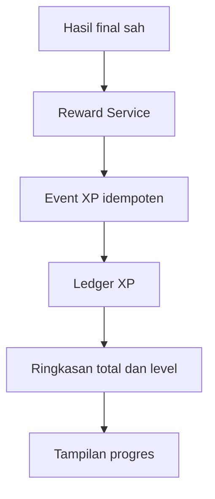

# Rancangan Sistem Level dan XP

**Proyek:** Website Les Privat Kak Harris  
**Lokasi tujuan:** `docs/Games/13-Level-XP.md`  
**Status:** Rancangan awal  
**Fokus rilis:** Matematika SD–SMP  
**Platform:** Website responsif, Firebase Authentication, dan Cloud Firestore

## 1. Tujuan

Dokumen ini menetapkan cara sistem memberikan XP, menghitung level, membatasi hadiah, mencegah farming, dan menjaga seluruh perubahan tetap dapat diaudit.

Tujuan utamanya adalah:

- menghargai usaha belajar yang sah tanpa menyamakan XP dengan nilai akademik;
- memakai aturan yang konsisten lintas game, engine, dan mode;
- memastikan satu hasil hanya memberi satu hadiah;
- mencegah refresh, retry, pengulangan soal, dan sesi sangat panjang menggandakan XP;
- memberi progres awal yang terasa, tetapi tetap masuk akal untuk pemakaian jangka panjang;
- memisahkan XP, level, skor, achievement, dan mastery;
- membuat total XP dapat dihitung ulang dari ledger;
- menjaga kebijakan lama tetap dapat diaudit setelah aturan berubah;
- menghindari mekanik yang mendorong bermain berlebihan;
- menyiapkan struktur kelas 10–12 tanpa menjadikan SMA target konten saat ini.

## 2. Definisi XP dan Level

**XP** adalah satuan progres sistem yang diberikan dari aktivitas belajar yang memenuhi kebijakan hadiah.

**Level** adalah representasi visual dari total XP menurut kurva level berversi.

XP dan level bukan:

- skor sesi;
- nilai rapor;
- peringkat kecerdasan;
- bukti tunggal penguasaan materi;
- mata uang yang dapat diuangkan;
- alasan untuk membuka akses akademik wajib;
- ukuran yang adil untuk membandingkan dua murid;
- hadiah berdasarkan lama halaman dibiarkan terbuka.

Murid dengan level tinggi berarti telah mengumpulkan banyak progres yang diterima sistem. Itu tidak otomatis berarti ia menguasai semua topik.

## 3. Prinsip Desain

1. **Hasil sah lebih dulu.** XP hanya berasal dari hasil final atau tindakan administratif yang terverifikasi.
2. **Ledger sebagai sumber kebenaran.** Total XP adalah agregat, bukan satu-satunya catatan.
3. **Idempoten.** Satu sumber dan jenis hadiah menghasilkan paling banyak satu event ledger.
4. **Berversi.** Rumus hadiah dan kurva level memiliki versi yang tidak diubah diam-diam.
5. **Usaha tetap dihargai.** Murid tidak harus sempurna untuk memperoleh XP.
6. **Ketepatan tetap bermakna.** Jawaban benar dan akurasi memberi tambahan wajar.
7. **Kesulitan tidak dieksploitasi.** Label `hard` dari klien tidak otomatis memberi XP lebih besar.
8. **Tidak berbasis durasi.** Waktu aktif dipakai untuk validasi dan analitik, bukan sumber XP langsung.
9. **Ada batas sehat.** Sesi, game, dan hari memiliki pagar hadiah tanpa melarang murid tetap belajar.
10. **Tidak ada hukuman kebiasaan.** Absen sehari tidak mengurangi XP atau level.
11. **Dapat dijelaskan.** Layar hasil dapat menunjukkan asal XP dengan bahasa sederhana.
12. **Tidak kompetitif pada MVP.** Tidak ada leaderboard global atau perbandingan publik.

## 4. Posisi dalam Sistem



Engine menghitung keadaan permainan dan Scoring Service menghitung skor. Result Finalizer memvalidasi hasil. Reward Service baru menghitung XP setelah hasil diterima. UI hanya menampilkan hasil yang dikembalikan service.

## 5. Batas Tanggung Jawab

### Sistem Level dan XP menangani

- memilih kebijakan hadiah yang dipin pada sesi;
- memeriksa kelayakan hasil;
- menghitung komponen XP;
- menerapkan cap dan pengurang anti-farming;
- menulis event ledger idempoten;
- menghitung ulang total XP;
- menurunkan level dari total XP;
- membuat riwayat level tercapai;
- memproses koreksi dengan event kompensasi;
- menyediakan rincian XP untuk layar hasil;
- mendukung rekonsiliasi dan audit.

### Sistem Level dan XP tidak menangani

- menilai benar atau salahnya jawaban;
- menghitung skor game;
- menentukan mastery akademik;
- membuka achievement secara langsung;
- menentukan jenjang murid;
- menulis hasil final dari browser;
- memberikan akses berbayar;
- membuat leaderboard;
- menghukum murid karena tidak bermain;
- mengubah aturan engine atau mode.

## 6. Istilah Resmi

| Istilah | Arti |
| --- | --- |
| `rewardPolicy` | Kebijakan perhitungan XP |
| `rewardPolicyVersion` | Versi immutable kebijakan hadiah |
| `levelPolicy` | Kurva yang memetakan total XP ke level |
| `levelPolicyVersion` | Versi immutable kurva level |
| `ledgerEvent` | Catatan perubahan XP positif atau negatif |
| `baseXp` | XP dari item yang dinilai dan jawaban benar |
| `completionBonus` | Bonus kecil karena menyelesaikan sesi secara sah |
| `accuracyBonus` | Bonus berdasarkan akurasi dengan bukti minimum |
| `grossXp` | Jumlah sebelum cap dan pengurang |
| `grantedXp` | Jumlah final yang ditulis ke ledger |
| `sessionCap` | XP maksimum dari satu sumber sesi |
| `dailyCap` | XP maksimum efektif dalam satu hari hadiah |
| `rewardDayKey` | Hari lokal yang dihitung server untuk cap harian |
| `farming` | Pengulangan aktivitas untuk mengejar hadiah tanpa nilai belajar yang sepadan |
| `adjustment` | Event koreksi positif atau negatif tanpa mengubah event lama |

## 7. Pemisahan Skor, XP, Level, Achievement, dan Mastery

| Sistem | Menjawab pertanyaan | Contoh |
| --- | --- | --- |
| Skor | Seberapa baik performa pada sesi ini? | 920 poin |
| XP | Berapa progres sistem yang diberikan? | 24 XP |
| Level | Di tahap progres jangka panjang mana akun berada? | Level 8 |
| Achievement | Apa yang pernah dicapai? | Langkah Pertama |
| Mastery | Seberapa kuat bukti penguasaan topik? | Developing |

Perubahan rumus skor tidak boleh otomatis mengubah XP lama. Level tidak boleh dipakai sebagai klaim mastery. Achievement tidak boleh menjadi jalur XP berulang.

## 8. Sumber XP Resmi

Sumber XP yang diizinkan:

| `eventType` | Sumber | Status awal |
| --- | --- | --- |
| `session_complete` | Hasil sesi game yang sah | Aktif pada P1 |
| `adventure_complete` | Penyelesaian chapter atau ending yang sah | Ditunda sampai Adventure aktif |
| `achievement_unlock` | Achievement satu kali | Nonaktif pada MVP |
| `admin_adjustment` | Koreksi terotorisasi | Aktif untuk operasional |
| `migration_adjustment` | Migrasi kebijakan atau data | Hanya alat internal |

Sumber berikut tidak memberi XP:

- membuka halaman game;
- login;
- durasi halaman terbuka;
- event klik mentah;
- checkpoint;
- sesi `abandoned`;
- hasil duplikat;
- jawaban yang tidak valid;
- preview admin;
- sesi pengujian internal;
- hasil yang belum memenuhi tingkat kepercayaan minimum.

## 9. Tingkat Kepercayaan Hasil

| `evaluationTrust` | XP permanen | Keterangan |
| --- | --- | --- |
| `server_verified` | Ya | Jalur normal produksi |
| `admin_verified` | Ya | Koreksi atau verifikasi khusus |
| `client_evaluated` | Tidak pada MVP | Boleh tampil sebagai hasil latihan |
| `pending_verification` | Belum | Diproses setelah verifikasi |
| `rejected` | Tidak | Alasan disimpan pada audit |

UI boleh menampilkan estimasi XP saat offline, tetapi wajib diberi label **menunggu verifikasi**. Estimasi tidak menambah total atau level.

## 10. Kelayakan Sesi untuk XP

Hasil `session_complete` layak dihitung jika seluruh syarat berikut terpenuhi:

1. pengguna terautentikasi dan memiliki akses ke game;
2. `sessionId` cocok dengan dokumen sesi dan hasil;
3. versi game, engine, bank, mode, skor, dan reward valid;
4. hasil belum pernah diproses untuk event yang sama;
5. `evaluationTrust` memenuhi kebijakan;
6. sesi bukan preview, test, atau simulasi admin;
7. jumlah item dan durasi masih masuk akal untuk konfigurasi;
8. item yang dihitung memiliki identitas atau fingerprint yang dapat dideduplikasi;
9. `finishReason` diterima oleh kebijakan;
10. tidak ada flag integritas yang mewajibkan peninjauan.

Minimum bukti default adalah 5 item layak. Jika konfigurasi resmi suatu aktivitas memang memiliki maksimum kurang dari 5 unit, minimum efektif adalah nilai yang lebih kecil antara 5 dan maksimum unit resmi tersebut. Nilai maksimum tidak boleh berasal dari klaim bebas klien.

## 11. `finishReason` dan Hadiah

| `finishReason` | Kelayakan | Bonus selesai |
| --- | --- | ---: |
| `question_limit_reached` | Ya | 2 XP |
| `time_expired` | Ya | 2 XP |
| `lives_depleted` | Ya, jika minimum bukti terpenuhi | 2 XP |
| `ending_reached` | Melalui hasil parent Adventure | Sesuai kebijakan Adventure |
| `manual_finish` | Ya, jika minimum bukti terpenuhi | 0 XP |
| `abandoned` | Tidak | 0 XP |
| `unrecoverable_error` | Tidak otomatis | 0 XP |
| `no_content` | Tidak | 0 XP |
| `incompatible_version` | Tidak | 0 XP |

`lives_depleted` tetap dianggap penyelesaian sah karena murid telah mengikuti aturan mode. Sistem tidak menghukum kegagalan dengan XP negatif.

## 12. Kebijakan Hadiah Versi 1

Kebijakan awal memakai empat komponen sederhana:

```text
grossXp = effortXp + correctXp + completionBonus + accuracyBonus
```

Nilai final:

```text
grantedXp = floor(min(grossXp, sessionCap) × repeatMultiplier)
```

Setelah itu, batas harian diterapkan. XP final tidak pernah kurang dari nol untuk event sesi biasa.

Versi 1 tidak memberi pengali berdasarkan kelas, jenjang, kecepatan, atau label kesulitan.

## 13. Item yang Layak Dihitung

Sebuah item dianggap `eligibleEvaluatedItem` jika:

- berasal dari bank atau generator versi yang dipin;
- telah mendapat hasil `correct` atau `wrong` yang sah;
- bukan `invalid_input`;
- bukan item preview;
- bukan item yang ditarik sebelum sempat dijawab;
- tidak menggandakan fingerprint yang sama dalam jendela anti-pengulangan;
- memiliki data minimum yang diperlukan untuk verifikasi.

Item `skipped` dilaporkan, tetapi tidak menghasilkan `effortXp` atau `correctXp` pada kebijakan versi 1.

## 14. `effortXp`

`effortXp` menghargai item sah yang benar-benar dinilai:

```text
effortXp = min(eligibleEvaluatedCount, 20)
```

Artinya:

- satu item dinilai memberi 1 XP usaha;
- maksimum 20 XP usaha per sesi;
- jawaban salah tetap dihargai sebagai usaha;
- input tidak valid tidak dihitung;
- pengulangan identik yang ditolak tidak dihitung.

## 15. `correctXp`

`correctXp` menghargai jawaban benar:

```text
correctXp = min(eligibleCorrectCount, 20)
```

Artinya satu jawaban benar memberi tambahan 1 XP. Maksimum komponen ini 20 XP per sesi.

Kebijakan versi 1 sengaja tidak memberi bobot lebih tinggi pada soal `hard`. Kesulitan antarjenjang dan antargame belum cukup seragam untuk menjadi dasar hadiah permanen.

## 16. `completionBonus`

Bonus selesai diberikan jika:

- `finishReason` termasuk kondisi akhir resmi;
- sedikitnya 5 item layak telah dinilai; dan
- hasil memenuhi verifikasi integritas.

Nilainya:

```text
completionBonus = 2
```

Untuk `manual_finish`, nilainya 0. Murid tetap mendapat XP usaha dan benar jika minimal kelayakan sesi terpenuhi.

## 17. `accuracyBonus`

Bonus akurasi baru aktif jika minimal 10 item layak telah dinilai.

| Akurasi | Bonus |
| --- | ---: |
| Di bawah 80% | 0 XP |
| 80%–89,99% | 4 XP |
| 90%–99,99% | 6 XP |
| 100% | 8 XP |

Bonus tidak ditumpuk. Akurasi 100% mendapat 8 XP, bukan `4 + 6 + 8`.

## 18. Contoh Perhitungan Dasar

### Contoh A — 10 soal, 8 benar

```text
effortXp         = 10
correctXp        = 8
completionBonus  = 2
accuracyBonus    = 4
grossXp          = 24
grantedXp        = 24
```

Contoh ini konsisten dengan contoh `xpGranted: 24` pada `11-Database.md`.

### Contoh B — 10 soal, 4 benar

```text
effortXp         = 10
correctXp        = 4
completionBonus  = 2
accuracyBonus    = 0
grossXp          = 16
grantedXp        = 16
```

### Contoh C — 20 soal, semua benar

```text
effortXp         = 20
correctXp        = 20
completionBonus  = 2
accuracyBonus    = 8
grossXp          = 50
grantedXp        = 50
```

### Contoh D — berhenti manual setelah 6 soal, 5 benar

```text
effortXp         = 6
correctXp        = 5
completionBonus  = 0
accuracyBonus    = 0
grossXp          = 11
grantedXp        = 11
```

## 19. Cap XP per Sesi

Default kebijakan versi 1:

| Mode atau sumber | `sessionCap` |
| --- | ---: |
| `limited_questions` | 50 XP |
| `limited_time` | 40 XP |
| `limited_lives` | 40 XP |
| `endless` | 40 XP |
| `adventure_complete` parent | 10 XP |
| `achievement_unlock` | 0 XP pada MVP |

Cap membatasi XP, bukan jumlah item yang boleh dimainkan. Seluruh hasil tetap disimpan untuk riwayat dan analitik sesuai kebijakan retensi.

## 20. Kebijakan Khusus Mode Endless

Mode Endless memakai aturan tambahan:

- maksimal 20 item layak masuk komponen dasar;
- `completionBonus` selalu 0 karena sesi selesai secara manual;
- `sessionCap` 40 XP;
- soal dengan fingerprint berulang dalam jendela aktif tidak memberi XP lagi;
- hasil setelah pagar keamanan sesi tetap boleh ditampilkan, tetapi tidak menambah XP;
- refresh tidak mengubah soal aktif atau mereset cap;
- satu sesi Endless memiliki batas umur teknis;
- memulai sesi baru segera tidak otomatis memulihkan hadiah penuh jika game yang sama sudah berulang.

Mode Endless bukan jalur tercepat untuk farming XP. Nilai utamanya adalah latihan berkelanjutan.

## 21. Mode Terbatas

### `limited_questions`

- cap tertinggi 50 XP;
- bonus selesai aktif jika target sah tercapai;
- target yang dikonfigurasi di atas 20 item tidak menambah komponen dasar setelah cap item, tetapi hasil lengkap tetap dicatat.

### `limited_time`

- cap 40 XP;
- waktu tidak menjadi faktor pengali;
- item yang selesai sebelum waktu habis dihitung seperti biasa;
- timer harus berasal dari state sesi yang dapat diverifikasi.

### `limited_lives`

- cap 40 XP;
- kehabisan nyawa tetap dapat menerima bonus selesai;
- XP tidak dikurangi karena jawaban salah;
- exploit dengan menghabiskan nyawa tanpa usaha dicegah melalui minimum item layak.

## 22. Engine dengan Unit Progres Berbeda

Kebijakan XP tidak mengasumsikan semua engine memakai soal tunggal.

| Engine | Unit layak versi 1 |
| --- | --- |
| Quiz | Pertanyaan yang dinilai |
| Generated Drill | Tantangan yang dinilai |
| Matching | Pasangan target yang diselesaikan |
| Drag & Drop | Item target yang ditempatkan benar atau percobaan yang dinilai |
| Puzzle | Puzzle selesai, bukan setiap gerakan |
| Adventure | Hasil engine anak dan completion parent terpisah |

Adapter masing-masing engine mengubah ringkasan khusus menjadi `eligibleEvaluatedCount` dan `eligibleCorrectCount`. Reward Service tidak membaca koordinat, teks jawaban, atau state UI.

Untuk Puzzle, satu puzzle selesai dapat dipetakan ke unit kebijakan melalui konfigurasi berversi, misalnya 5 unit usaha dan maksimal 5 unit benar. Nilai tersebut tidak boleh dikirim bebas dari klien.

## 23. Reward Adapter

Setiap engine menyediakan adapter server-side atau spesifikasi verifikasi:

```json
{
  "schemaVersion": 1,
  "engineType": "matching",
  "engineVersion": 1,
  "rewardAdapterVersion": 1,
  "eligibleEvaluatedCount": 10,
  "eligibleCorrectCount": 8,
  "duplicateExcludedCount": 1,
  "minimumEvidenceMet": true
}
```

Aturan adapter:

- versi dipin pada awal sesi;
- output dapat direproduksi dari hasil tepercaya;
- count tidak boleh melebihi batas konfigurasi yang masuk akal;
- adapter tidak menulis XP;
- perubahan pemetaan membuat versi baru;
- kegagalan adapter membuat reward `pending`, bukan menebak nilai.

## 24. Adventure dan XP Anak

Adventure adalah orchestrator. Karena itu:

- engine anak menghasilkan event `session_complete` masing-masing;
- chapter atau ending dapat menghasilkan `adventure_complete` satu kali;
- XP child tidak dihitung ulang pada parent;
- retry node memakai `sessionId` child yang sama atau aturan retry tanpa hadiah ganda;
- completion parent memiliki cap 10 XP;
- replay Adventure tidak memberi completion XP kedua untuk grant yang sama;
- definisi `chapterId`, `endingId`, dan reward harus berversi.

ID contoh:

```text
session-complete__{childSessionId}
adventure-complete__{adventureSessionId}
```

## 25. Achievement dan XP

Pada MVP, seluruh achievement memberi `0 XP`.

Jika diaktifkan setelah backend tepercaya tersedia:

- satu achievement memberi maksimal 10 XP;
- event memakai ID `achievement-unlock__{achievementId}`;
- satu unlock hanya memberi satu event;
- achievement yang dipicu oleh level tidak boleh memberi XP;
- XP tidak boleh memicu achievement yang memberi XP dalam siklus;
- revocation memakai kompensasi ledger, bukan mengubah event lama;
- definisi achievement menyimpan `rewardPolicyVersion` yang dipakai.

Hadiah achievement adalah fitur P3, bukan syarat peluncuran MVP.

## 26. Pengali Pengulangan per Game

Untuk mengurangi farming satu game dalam hari yang sama, gunakan jumlah sesi berhadiah per `gameId` dan `rewardDayKey`:

| Urutan sesi layak pada game yang sama | `repeatMultiplier` |
| --- | ---: |
| 1–3 | 1,00 |
| 4 | 0,50 |
| 5 dan seterusnya | 0,00 |

Aturan:

- penghitung dibuat server-side;
- sesi dengan `grantedXp: 0` karena tidak layak tidak menambah urutan farming;
- mengganti mode pada `gameId` yang sama tidak mereset hitungan;
- versi game baru tidak otomatis mereset hitungan pada hari yang sama;
- tutor tetap dapat melihat seluruh aktivitas walaupun XP sudah nol;
- UI memberi tahu sebelum sesi jika hadiah sudah berkurang atau mencapai batas.

Kebijakan ini dapat ditinjau ulang berdasarkan data nyata. Tujuannya bukan membatasi belajar, melainkan memisahkan belajar dari farming.

## 27. Batas XP Harian

Default versi 1:

```text
dailyFullCap = 200 XP
dailyAbsoluteCap = 250 XP
```

Perilakunya:

- sampai 200 XP, hadiah diberikan sesuai hitungan;
- setelah 200 XP, sisa hadiah dikalikan 0,25;
- total XP sesi dipotong agar total harian tidak melebihi 250 XP;
- setelah 250 XP, permainan tetap dapat dilanjutkan tanpa XP;
- admin adjustment dan migration adjustment tidak masuk cap harian;
- cap dihitung dari event positif yang termasuk kebijakan hari tersebut.

Contoh: murid sudah memperoleh 195 XP dan sesi baru bernilai 24 XP. Lima XP pertama penuh, sisa 19 XP masuk zona 25% dan dibulatkan ke bawah menjadi 4 XP. Total event sesi menjadi 9 XP.

## 28. Hari Hadiah dan Zona Waktu

`rewardDayKey` dihitung server menggunakan zona waktu kebijakan, bukan jam perangkat.

Default proyek:

```text
rewardTimezone = Asia/Jakarta
rewardDayKey = YYYY-MM-DD
```

Aturan:

- sesi menggunakan hari saat hasil final diproses, kecuali kebijakan eksplisit memakai `finishedAt` terverifikasi;
- timestamp klien tidak menentukan hari;
- perubahan zona waktu kebijakan membutuhkan versi baru;
- sesi offline lama tidak boleh digunakan untuk menembus cap beberapa hari;
- perhitungan harus konsisten saat melewati tengah malam.

## 29. Pembulatan

Semua XP disimpan sebagai integer.

Urutan pembulatan:

1. hitung komponen integer;
2. terapkan `sessionCap`;
3. terapkan `repeatMultiplier`;
4. bulatkan ke bawah;
5. terapkan cap harian;
6. hasil akhir tidak kurang dari nol untuk sesi biasa.

Jangan membulatkan setiap subkomponen berulang kali karena dapat menghasilkan nilai berbeda.

## 30. Pencegahan Farming Berbasis Konten

Selain cap, gunakan kontrol berikut:

- fingerprint soal atau tantangan;
- anti-pengulangan dalam sesi;
- versi generator dan seed;
- validasi bahwa item benar-benar berasal dari bank atau generator sah;
- batas count berdasarkan konfigurasi;
- deteksi waktu respons yang mustahil sebagai sinyal, bukan vonis otomatis;
- pengurangan reward untuk pengulangan game harian;
- pemisahan mode preview dari produksi;
- audit pola hasil identik dalam jumlah tidak wajar.

Kecepatan tinggi tidak boleh langsung dianggap curang. Murid dapat memang cepat. Sistem menggabungkan beberapa sinyal sebelum menahan reward.

## 31. Flag Integritas

Status reward yang disarankan:

```text
not_applicable
pending
granted
partially_granted
withheld_review
rejected
adjusted
```

Contoh flag:

```text
duplicate_result
invalid_version
impossible_count
content_fingerprint_mismatch
abnormal_timing_pattern
untrusted_evaluation
daily_cap_reached
repeat_cap_reached
```

`withheld_review` tidak berarti murid bersalah. UI cukup menyatakan bahwa hadiah sedang diperiksa, tanpa bahasa menuduh.

## 32. Kontrak Kebijakan Hadiah

```json
{
  "schemaVersion": 1,
  "rewardPolicyId": "game-xp-standard",
  "rewardPolicyVersion": 1,
  "status": "published",
  "effectiveFrom": "server-timestamp",
  "minimumEvaluatedForSession": 5,
  "minimumEvaluatedForAccuracyBonus": 10,
  "effortXpPerItem": 1,
  "correctXpPerItem": 1,
  "maxRewardedItems": 20,
  "completionBonus": 2,
  "accuracyBonus": [
    { "minimum": 0.8, "amount": 4 },
    { "minimum": 0.9, "amount": 6 },
    { "minimum": 1.0, "amount": 8 }
  ],
  "sessionCaps": {
    "limited_questions": 50,
    "limited_time": 40,
    "limited_lives": 40,
    "endless": 40,
    "adventure_complete": 10
  },
  "dailyFullCap": 200,
  "dailyAbsoluteCap": 250,
  "rewardTimezone": "Asia/Jakarta",
  "achievementXpEnabled": false
}
```

Array `accuracyBonus` dievaluasi dari threshold tertinggi yang terpenuhi.

## 33. Immutability dan Versi Kebijakan

Setelah `rewardPolicyVersion` diterbitkan:

- rumus, threshold, cap, trust minimum, dan arti field tidak diubah;
- perbaikan typo deskripsi yang tidak memengaruhi perilaku boleh dicatat sebagai metadata;
- perubahan perhitungan membuat versi baru;
- sesi memin versi saat dimulai;
- finalizer memakai versi yang dipin, selama masih didukung dan aman;
- versi yang ditarik karena cacat keamanan dapat menghasilkan `pending_review`;
- hasil menyimpan versi yang digunakan;
- ledger menyimpan versi yang menghasilkan event.

## 34. Reward Service

Input minimum:

```json
{
  "ownerUid": "firebase-auth-uid",
  "sessionId": "session-uuid",
  "resultId": "session-uuid",
  "rewardPolicyVersion": 1
}
```

Output minimum:

```json
{
  "rewardStatus": "granted",
  "grossXp": 24,
  "grantedXp": 24,
  "ledgerEventId": "session-complete__session-uuid",
  "totalXp": 1240,
  "previousLevel": 7,
  "currentLevel": 8,
  "levelUp": true,
  "capReason": null
}
```

Service tidak menerima `grantedXp` sebagai fakta dari klien.

## 35. Alur Pemberian XP Idempoten

1. autentikasi pemilik sesi;
2. baca hasil final berdasarkan `sessionId`;
3. tentukan `ledgerEventId` deterministik;
4. jika event sudah ada, kembalikan hasil lama;
5. validasi trust, versi, status, count, dan fingerprint;
6. jalankan Reward Adapter;
7. hitung komponen XP;
8. baca penghitung pengulangan dan total hari;
9. terapkan multiplier serta cap;
10. tulis event ledger;
11. perbarui ringkasan XP dan level;
12. buat riwayat level baru bila melewati threshold;
13. tandai status reward pada hasil;
14. commit atomik atau gunakan outbox yang dapat diulang;
15. kembalikan rincian final.

Retry pada langkah mana pun tidak boleh membuat event kedua.

## 36. ID Event Ledger

Format resmi:

```text
session-complete__{sessionId}
adventure-complete__{adventureSessionId}
achievement-unlock__{achievementId}
admin-adjustment__{adjustmentId}
migration-adjustment__{migrationId}
```

Satu sumber dengan dua jenis hadiah sah dapat memiliki dua event berbeda. Satu jenis hadiah tidak boleh menggunakan ID acak pada retry.

## 37. Dokumen Ledger XP

Path:

```text
users/{uid}/xpLedger/{ledgerEventId}
```

Contoh:

```json
{
  "schemaVersion": 1,
  "ledgerEventId": "session-complete__session-uuid",
  "ownerUid": "firebase-auth-uid",
  "eventType": "session_complete",
  "sourceId": "session-uuid",
  "gameId": "operasi-bilangan-bulat-01",
  "rewardDayKey": "2026-08-06",
  "grossXp": 24,
  "repeatMultiplier": 1,
  "amount": 24,
  "rewardPolicyVersion": 1,
  "reasonCode": "verified_completion",
  "capReason": null,
  "createdAt": "server-timestamp"
}
```

Ledger bersifat append-only. Koreksi selalu membuat event baru.

## 38. Rincian Perhitungan

Untuk audit tanpa menyimpan data soal, event dapat menyimpan:

```json
{
  "calculation": {
    "eligibleEvaluatedCount": 10,
    "eligibleCorrectCount": 8,
    "effortXp": 10,
    "correctXp": 8,
    "completionBonus": 2,
    "accuracyBonus": 4,
    "sessionCap": 50,
    "dailyXpBefore": 112,
    "dailyXpAfter": 136
  }
}
```

Jangan menyimpan teks soal, jawaban murid, atau data pribadi tambahan pada ledger.

## 39. Ringkasan Profil Game

Path:

```text
users/{uid}/gameProfile/summary
```

```json
{
  "schemaVersion": 1,
  "totalXp": 1240,
  "level": 8,
  "highestLevelReached": 8,
  "levelPolicyVersion": 1,
  "lastLedgerEventId": "session-complete__session-uuid",
  "updatedAt": "server-timestamp"
}
```

Ringkasan adalah cache untuk baca cepat. Ledger dan kebijakan versi tetap menjadi sumber rekonsiliasi.

## 40. Kurva Level Versi 1

Level dimulai dari 1. XP minimum untuk level `L`:

```text
threshold(L) = 25 × (L - 1)²
```

Level saat ini adalah nilai `L` tertinggi dengan `threshold(L) <= totalXp`.

Alasan memilih kurva kuadrat sederhana:

- level awal dapat dicapai relatif cepat;
- kebutuhan XP tumbuh bertahap;
- rumus mudah dihitung ulang;
- tidak bergantung pada game tertentu;
- tidak memerlukan tabel manual tak terbatas.

## 41. Tabel Threshold Awal

| Level | Total XP minimum | XP dari level sebelumnya |
| ---: | ---: | ---: |
| 1 | 0 | 0 |
| 2 | 25 | 25 |
| 3 | 100 | 75 |
| 4 | 225 | 125 |
| 5 | 400 | 175 |
| 6 | 625 | 225 |
| 7 | 900 | 275 |
| 8 | 1.225 | 325 |
| 9 | 1.600 | 375 |
| 10 | 2.025 | 425 |
| 11 | 2.500 | 475 |
| 12 | 3.025 | 525 |
| 13 | 3.600 | 575 |
| 14 | 4.225 | 625 |
| 15 | 4.900 | 675 |
| 16 | 5.625 | 725 |
| 17 | 6.400 | 775 |
| 18 | 7.225 | 825 |
| 19 | 8.100 | 875 |
| 20 | 9.025 | 925 |

Titik sebagai pemisah ribuan hanya untuk tampilan dokumen. Nilai database tetap integer tanpa pemisah.

## 42. Perhitungan Level

Pseudocode:

```js
function levelFromTotalXp(totalXp) {
  const safeXp = Math.max(0, Math.floor(totalXp));
  return Math.floor(Math.sqrt(safeXp / 25)) + 1;
}

function thresholdForLevel(level) {
  const safeLevel = Math.max(1, Math.floor(level));
  return 25 * (safeLevel - 1) ** 2;
}
```

Untuk menampilkan progres:

```text
levelStartXp = threshold(currentLevel)
nextLevelXp = threshold(currentLevel + 1)
progressXp = totalXp - levelStartXp
requiredXp = nextLevelXp - levelStartXp
progressRatio = progressXp / requiredXp
```

## 43. Level Up

Jika satu event melewati beberapa threshold:

- `currentLevel` langsung menjadi level hasil perhitungan;
- UI boleh menampilkan satu ringkasan “Naik 2 level”;
- riwayat mencatat setiap level yang terlewati atau satu rentang atomik;
- hadiah kosmetik per level, jika kelak ada, wajib idempoten;
- level up tidak menghasilkan XP baru;
- level up tidak otomatis berarti achievement kecuali definisinya aman dari siklus.

## 44. Riwayat Level

Path opsional:

```text
users/{uid}/levelHistory/{levelPolicyVersion}__{level}
```

```json
{
  "schemaVersion": 1,
  "level": 8,
  "levelPolicyVersion": 1,
  "thresholdXp": 1225,
  "reachedByLedgerEventId": "session-complete__session-uuid",
  "reachedAt": "server-timestamp"
}
```

ID deterministik mencegah notifikasi dan hadiah level ganda.

## 45. Level Maksimum

Kebijakan versi 1 tidak menetapkan level maksimum secara matematis. UI awal cukup dirancang dan diuji hingga level 100.

Jika diperlukan batas tampilan:

- simpan level hasil rumus sebenarnya;
- jangan mengubah total XP;
- label seperti `100+` hanya merupakan presentasi;
- perubahan batas tampilan tidak membutuhkan perubahan ledger;
- fitur level tinggi tidak menjadi prioritas sebelum ada data penggunaan nyata.

## 46. Perubahan Kurva Level

`levelPolicyVersion: 1` bersifat immutable.

Jika kurva perlu diubah:

1. buat versi baru;
2. lakukan simulasi dampak terhadap seluruh rentang total XP;
3. pastikan migrasi tidak mengejutkan murid;
4. tetapkan tanggal efektif;
5. hitung ulang ringkasan dalam dry-run;
6. simpan versi lama untuk audit;
7. jalankan migrasi idempoten;
8. komunikasikan perubahan jika level tampilan terdampak.

Perubahan kebijakan tidak boleh menghapus XP ledger lama. Secara default, migrasi level tidak menurunkan `highestLevelReached`.

## 47. XP Negatif dan Koreksi

Event sesi biasa tidak pernah bernilai negatif. XP negatif hanya digunakan untuk:

- membatalkan event ganda yang telanjur masuk;
- memperbaiki bug reward;
- mencabut hadiah yang terbukti tidak sah;
- membalik adjustment yang salah;
- menyelaraskan migrasi dengan audit jelas.

Aturan:

- event lama tetap ada;
- event kompensasi mereferensikan event asal;
- alasan wajib diisi;
- actor dan timestamp tercatat;
- total XP minimum 0;
- kosmetik yang sudah terbuka tidak dicabut otomatis;
- perubahan level akibat koreksi ditangani secara jujur dan tidak diumumkan sebagai hukuman.

## 48. Dokumen Adjustment

```json
{
  "schemaVersion": 1,
  "ledgerEventId": "admin-adjustment__adjustment-uuid",
  "ownerUid": "firebase-auth-uid",
  "eventType": "admin_adjustment",
  "sourceId": "adjustment-uuid",
  "amount": -24,
  "reasonCode": "duplicate_reward_reversal",
  "reversesLedgerEventId": "session-complete__session-uuid",
  "actorUid": "admin-auth-uid",
  "createdAt": "server-timestamp"
}
```

Catatan alasan rinci berada pada audit terlindungi, bukan pada data yang dibaca publik.

## 49. Konkruensi

Dua sesi dapat selesai hampir bersamaan. Sistem harus:

- memakai transaksi atau mekanisme serialisasi yang sesuai;
- membuat event dengan ID deterministik;
- menghitung cap harian dari state konsisten;
- mencegah kedua transaksi membaca kuota harian lama dan melampaui cap;
- memperbarui summary menggunakan nilai transaksi, bukan `totalXp` dari klien;
- aman ketika fungsi backend diulang otomatis.

Jika transaksi konflik, salah satu retry membaca event atau penghitung terbaru.

## 50. Counter Harian

Path yang disarankan:

```text
users/{uid}/rewardDays/{rewardDayKey}
```

```json
{
  "schemaVersion": 1,
  "rewardDayKey": "2026-08-06",
  "rewardTimezone": "Asia/Jakarta",
  "positiveXp": 136,
  "rewardedSessionCount": 6,
  "gameSessionCounts": {
    "operasi-bilangan-bulat-01": 2
  },
  "rewardPolicyVersion": 1,
  "updatedAt": "server-timestamp"
}
```

Jika map game berpotensi besar, pindahkan penghitung per game ke subkoleksi atau dokumen bucket. Jangan biarkan satu dokumen tumbuh tanpa batas.

## 51. Offline dan Pemulihan

Saat offline:

- sesi boleh berjalan jika konten telah tersedia;
- checkpoint disimpan lokal sesuai arsitektur;
- layar hasil menampilkan XP estimasi sebagai pending;
- total XP dan level tidak berubah sebelum verifikasi;
- retry memakai `sessionId` yang sama;
- waktu perangkat tidak dipercaya untuk cap harian;
- hasil yang kedaluwarsa dapat masuk peninjauan tanpa hilang dari riwayat lokal.

Setelah sinkronisasi, UI mengganti estimasi dengan nilai final dari server.

## 52. UI Level dan XP

Ringkasan minimum:

- level saat ini;
- total XP;
- XP menuju level berikutnya;
- progress bar dengan label teks;
- rincian XP sesi;
- status `pending`, `granted`, atau `capped`;
- penjelasan singkat bila hadiah berkurang;
- timestamp pembaruan terakhir bila offline.

Contoh teks:

```text
+24 XP
10 XP usaha · 8 XP jawaban benar · 2 XP selesai · 4 XP ketelitian
```

Jangan hanya menampilkan animasi tanpa rincian yang dapat dibaca.

## 53. Bahasa dan Nada UI

Gunakan:

- “Kamu mendapat 24 XP dari sesi ini.”
- “XP game ini sudah mencapai batas hari ini. Kamu tetap bisa lanjut latihan.”
- “Hadiah sedang diverifikasi.”
- “Sedikit lagi menuju Level 8.”

Hindari:

- “Kamu gagal mendapat XP.”
- “Main sekarang atau progresmu hilang.”
- “Temanmu sudah lebih tinggi.”
- “Levelmu membuktikan kamu paling pintar.”
- hitung mundur palsu untuk memaksa sesi tambahan.

## 54. Animasi dan Aksesibilitas

- level up tidak bergantung pada suara atau warna;
- progress bar memiliki nilai teks dan atribut aksesibilitas;
- perubahan XP diumumkan secukupnya oleh screen reader;
- animasi dapat dikurangi melalui `prefers-reduced-motion`;
- tidak memakai kedipan cepat;
- modal level up dapat ditutup dengan keyboard;
- angka memakai format lokal pada tampilan;
- informasi cap tidak disembunyikan dalam tooltip saja.

## 55. Privasi dan Perbandingan Sosial

Pada MVP:

- level dan XP bersifat privat bagi murid, orang tua sesuai akses, dan admin/tutor yang berwenang;
- tidak ada leaderboard global;
- tidak ada ranking kelas;
- tidak ada profil publik;
- analitik memakai identitas minimum;
- laporan tutor menekankan aktivitas dan akurasi, bukan level saja;
- ekspor data mengikuti kontrol akses pengguna.

## 56. Security Rules dan Backend

Prinsip:

- murid boleh membaca ledger dan ringkasan miliknya;
- murid tidak boleh membuat atau mengubah ledger;
- murid tidak boleh menulis `totalXp`, `level`, atau counter harian;
- definisi kebijakan diterbitkan admin melalui jalur tepercaya;
- finalizer atau Reward Service menulis dengan otoritas backend;
- adjustment memerlukan peran dan audit;
- UI tidak menjadi pengaman utama.

Jalur MVP tanpa backend tepercaya tidak mengaktifkan XP permanen.

## 57. Analitik Minimum

Event yang berguna:

```text
xp_reward_granted
xp_reward_capped
xp_reward_pending
xp_reward_rejected
level_reached
xp_adjusted
xp_reconciliation_mismatch
```

Properti minimum:

- `eventId`;
- `ownerUidHash` atau identifier internal yang sesuai;
- `sessionId` bila relevan;
- `gameId`;
- `engineType`;
- `modeType`;
- `rewardPolicyVersion`;
- `levelPolicyVersion`;
- `grossXp`;
- `grantedXp`;
- `capReason`;
- `createdAt` server.

Jangan mengirim teks soal, jawaban mentah, email, atau nama murid ke event analitik.

## 58. Monitoring Operasional

Pantau:

- persentase hasil yang mendapat XP;
- reward pending terlalu lama;
- event duplikat yang berhasil dicegah;
- rasio XP yang terkena repeat cap;
- rasio XP yang terkena daily cap;
- rata-rata XP per sesi menurut engine dan mode;
- distribusi level;
- lonjakan XP tidak wajar;
- perbedaan summary dan ledger;
- kegagalan transaksi;
- jumlah adjustment manual.

Monitoring dipakai untuk menemukan bug dan kebijakan yang terlalu keras, bukan membuat tuduhan otomatis kepada murid.

## 59. Rekonsiliasi

Proses rekonsiliasi:

1. pilih pengguna atau rentang waktu;
2. baca ledger secara berurutan;
3. validasi ID, tipe, amount, dan versi;
4. hitung total XP dari nol;
5. batasi total minimum pada nol sesuai aturan koreksi;
6. hitung level dari kebijakan aktif;
7. bandingkan dengan summary;
8. laporkan mismatch tanpa langsung menulis;
9. jalankan perbaikan hanya setelah dry-run ditinjau;
10. simpan audit perbaikan.

Rekonsiliasi tidak mengubah event historis.

## 60. Retensi dan Penghapusan

- ledger dipertahankan selama total XP dipertahankan;
- summary dapat dibuat ulang;
- counter harian dapat diringkas setelah periode audit selesai;
- audit adjustment mengikuti kebijakan retensi administrasi;
- penghapusan akun menghapus atau menganonimkan data sesuai kebijakan proyek;
- data analitik terpisah tidak boleh membuat profil murid dapat dipulihkan tanpa dasar;
- backup harus menyertakan ledger dan definisi kebijakan versi.

## 61. Migrasi Skema

Setiap dokumen memiliki `schemaVersion`. Pola migrasi:

1. tambah field baru sebagai opsional;
2. deploy reader yang memahami format lama dan baru;
3. lakukan backfill idempoten;
4. verifikasi jumlah serta total;
5. baru wajibkan format baru;
6. jangan menghapus field lama sebelum seluruh reader berpindah.

Migrasi tidak boleh membuat ledger event baru kecuali memang berupa adjustment dengan alasan yang dapat diaudit.

## 62. Error dan Pemulihan

| Kondisi | Penanganan |
| --- | --- |
| Hasil tersimpan, ledger gagal | Tandai reward pending dan retry idempoten |
| Ledger ada, summary gagal | Bangun ulang summary dari ledger |
| Summary berubah, transaksi gagal | Transaksi membatalkan seluruh write |
| Kebijakan versi hilang | Tahan reward dan beri alert operasional |
| Counter harian konflik | Retry transaksi |
| Event duplikat | Kembalikan event lama |
| Adapter gagal | Tahan reward, jangan memakai count dari klien |
| Klien offline | Tampilkan estimasi pending |
| Adjustment melebihi total | Batasi total efektif ke nol dan audit |

## 63. Data Uji Minimum

Siapkan fixture untuk:

- sesi 10 soal dengan 8 benar;
- sesi 10 soal dengan 4 benar;
- sesi sempurna 20 soal;
- manual finish setelah 6 item;
- Endless melewati 20 item;
- empat sesi pada game yang sama dalam satu hari;
- sesi kelima dengan multiplier nol;
- pengguna tepat di bawah daily full cap;
- pengguna tepat di bawah daily absolute cap;
- retry hasil yang sama;
- dua sesi selesai bersamaan;
- hasil client-evaluated;
- adventure child dan parent;
- achievement XP nonaktif;
- adjustment positif dan negatif;
- total XP tepat pada setiap threshold level awal.

## 64. Pengujian Unit

Uji fungsi:

- kelayakan hasil;
- count item layak;
- setiap threshold bonus akurasi;
- minimum bukti;
- completion bonus per `finishReason`;
- cap per mode;
- multiplier pengulangan;
- cap harian dua zona;
- urutan pembulatan;
- ID ledger deterministik;
- level dari total XP;
- threshold dari level;
- total tidak negatif;
- adapter tiap engine.

## 65. Pengujian Integrasi

Pastikan:

- finalisasi membuat hasil, ledger, summary, dan status reward konsisten;
- retry tidak menggandakan XP;
- dua sesi bersamaan tidak melampaui cap harian;
- event ledger dan summary tetap konsisten saat fungsi diulang;
- hasil tidak tepercaya tidak mendapat XP;
- murid tidak dapat menulis XP langsung;
- correction membuat event baru;
- rekonsiliasi menemukan summary rusak;
- level history hanya dibuat sekali;
- offline result memakai `sessionId` lama saat sinkronisasi.

## 66. Pengujian UI

Uji pada viewport kecil dan desktop:

- rincian XP dapat dibaca;
- pending tidak terlihat seperti granted;
- repeat cap dan daily cap dijelaskan;
- level up tidak diputar ulang setelah refresh;
- reduced motion bekerja;
- progress bar memiliki label;
- screen reader menerima perubahan yang relevan;
- format ribuan mengikuti lokal;
- permainan tetap dapat dilanjutkan saat XP nol;
- UI tidak menampilkan leaderboard tersembunyi.

## 67. Simulasi Ekonomi XP

Sebelum rilis luas, jalankan simulasi dengan distribusi sesi realistis:

- 5, 10, dan 20 item;
- akurasi 40%, 60%, 80%, 90%, dan 100%;
- satu sampai lima sesi per hari;
- campuran mode;
- murid yang berlatih rutin dan murid yang sesekali bermain;
- level setelah 1 minggu, 1 bulan, 3 bulan, dan 1 tahun.

Targetnya bukan membuat semua murid naik level dengan kecepatan sama. Targetnya memastikan progres awal terasa, level tinggi tidak terlalu cepat, dan murid yang kesulitan tetap mendapat pengakuan atas usaha sah.

## 68. Parameter yang Wajib Dievaluasi dari Data Nyata

- minimum 5 item untuk kelayakan sesi;
- minimum 10 item untuk bonus akurasi;
- cap 20 item berhadiah;
- cap 40–50 XP per sesi;
- multiplier sesi keempat dan kelima;
- daily full cap 200 XP;
- daily absolute cap 250 XP;
- kurva `25 × (L - 1)²`;
- pengaruh mode dan engine terhadap XP rata-rata;
- proporsi murid yang sering menyentuh cap.

Perubahan parameter membuat `rewardPolicyVersion` atau `levelPolicyVersion` baru sesuai jenis perubahan.

## 69. Batas MVP

MVP wajib mencakup:

- kontrak reward policy versi 1;
- sumber XP hanya dari sesi terverifikasi;
- rumus empat komponen;
- cap per sesi;
- ledger append-only;
- ID event deterministik;
- summary total dan level;
- kurva level versi 1;
- status pending dan granted;
- Security Rules yang menolak write XP dari murid;
- retry idempoten;
- rekonsiliasi dasar;
- tampilan XP dan progres level yang aksesibel.

MVP belum mencakup:

- XP achievement;
- hadiah kosmetik level;
- toko atau mata uang virtual;
- leaderboard;
- streak harian yang dapat hilang;
- bonus kecepatan;
- multiplier kesulitan;
- XP sosial;
- event musiman;
- pertukaran XP;
- level prestise;
- konten SMA.

## 70. Tahap Implementasi

### Tahap P0 — Fondasi data

1. terbitkan reward policy dan level policy versi 1;
2. buat model ledger dan summary;
3. buat fungsi threshold level;
4. siapkan status reward tanpa mengaktifkan write dari klien;
5. buat unit test perhitungan.

### Tahap P1 — Reward tepercaya

1. implementasikan Reward Adapter untuk Engine Quiz;
2. integrasikan dengan Result Finalizer;
3. tulis ledger dan summary secara atomik;
4. aktifkan cap sesi;
5. aktifkan idempotensi dan monitoring.

### Tahap P2 — Pagar anti-farming

1. aktifkan penghitung per game;
2. aktifkan cap harian;
3. tampilkan status cap pada UI;
4. tambah rekonsiliasi;
5. uji konkruensi.

### Tahap P3 — Ekspansi engine

1. buat adapter Matching;
2. buat adapter Drag & Drop;
3. buat adapter Puzzle;
4. buat reward Adventure parent;
5. evaluasi XP achievement setelah semua jalur tepercaya.

## 71. Kriteria Penerimaan

Sistem Level dan XP dianggap siap jika:

1. XP hanya berasal dari sumber resmi.
2. Hasil tidak tepercaya tidak menambah total permanen.
3. Rumus versi 1 menghasilkan 24 XP untuk contoh 10 soal dengan 8 benar.
4. Jawaban salah tetap dapat memberi XP usaha.
5. Input tidak valid dan item duplikat tidak memberi XP.
6. Satu `sessionId` hanya membuat satu event sesi.
7. Retry mengembalikan hadiah yang sama.
8. Cap per sesi bekerja untuk seluruh mode.
9. Endless tidak memberi XP tanpa batas.
10. Pengulangan game harian menerapkan multiplier yang benar.
11. Cap harian aman terhadap dua transaksi bersamaan.
12. Ledger tidak dapat diedit oleh murid.
13. Summary dapat dibangun ulang dari ledger.
14. Level cocok dengan threshold kebijakan.
15. Level up tidak menghasilkan siklus XP.
16. Achievement tidak memberi XP pada MVP.
17. Koreksi memakai event kompensasi.
18. Total efektif tidak kurang dari nol.
19. UI membedakan pending dan granted.
20. Murid tetap dapat bermain setelah cap tercapai.
21. Tidak ada leaderboard pada MVP.
22. Seluruh perubahan kebijakan memakai versi baru.
23. Adapter engine tidak mempercayai count bebas dari klien.
24. Pengujian aksesibilitas dan viewport kecil lulus.
25. Fokus konten tetap SD–SMP.

## 72. Keputusan yang Ditetapkan

- XP adalah progres sistem, bukan nilai akademik.
- Level diturunkan dari total XP dan tidak sama dengan mastery.
- Hasil `server_verified` dan `admin_verified` menjadi sumber XP permanen.
- Reward policy versi 1 memakai XP usaha, benar, selesai, dan akurasi.
- Sepuluh soal dengan delapan benar menghasilkan 24 XP sebelum cap lain.
- Maksimum komponen dasar dihitung dari 20 item per sesi.
- Mode Endless memiliki cap 40 XP dan tanpa bonus selesai.
- `limited_questions` memiliki cap 50 XP.
- Tiga sesi pertama pada game yang sama mendapat hadiah penuh per hari.
- Sesi keempat mendapat 50%; sesi kelima dan seterusnya 0%.
- Batas harian penuh adalah 200 XP dan batas absolut 250 XP.
- Hari hadiah memakai zona `Asia/Jakarta` yang dihitung server.
- Ledger bersifat append-only dengan ID deterministik.
- Kurva level versi 1 adalah `25 × (L - 1)²`.
- XP achievement dinonaktifkan pada MVP.
- Tidak ada leaderboard, streak yang hilang, atau bonus kecepatan pada MVP.
- Fokus tetap SD–SMP; SMA hanya disiapkan pada struktur.

## 73. Ketergantungan Dokumen

Dokumen ini bergantung pada:

- `02-Arsitektur-Game.md` untuk Result Finalizer dan service bersama;
- `03-Engine-Quiz.md` hingga `08-Engine-Adventure.md` untuk ringkasan engine;
- `09-Bank-Soal.md` untuk identitas konten dan fingerprint;
- `10-UI-UX.md` untuk pola tampilan dan aksesibilitas;
- `11-Database.md` untuk ledger, summary, transaksi, dan Security Rules;
- `12-Achievement.md` untuk grant dan pencegahan siklus;
- `14-Mode-Permainan.md` untuk kondisi selesai serta cap mode.

Dokumen ini menjadi input untuk:

- `15-Analitik.md` untuk event, laporan, privasi, dan monitoring;
- `99-Ide-Game.md` untuk menentukan hadiah yang sesuai per game;
- implementasi Reward Service dan level UI.

## 74. Langkah Berikutnya

Setelah rancangan Level dan XP selesai, dokumentasi dilanjutkan ke `15-Analitik.md`. Dokumen tersebut harus menetapkan event minimum lintas engine, batas data pribadi, identitas dan deduplikasi event, funnel penggunaan, metrik pembelajaran yang tidak berlebihan, retensi, dashboard admin, monitoring kualitas konten, serta aturan agar analitik tidak berubah menjadi pengawasan berlebihan terhadap murid.
