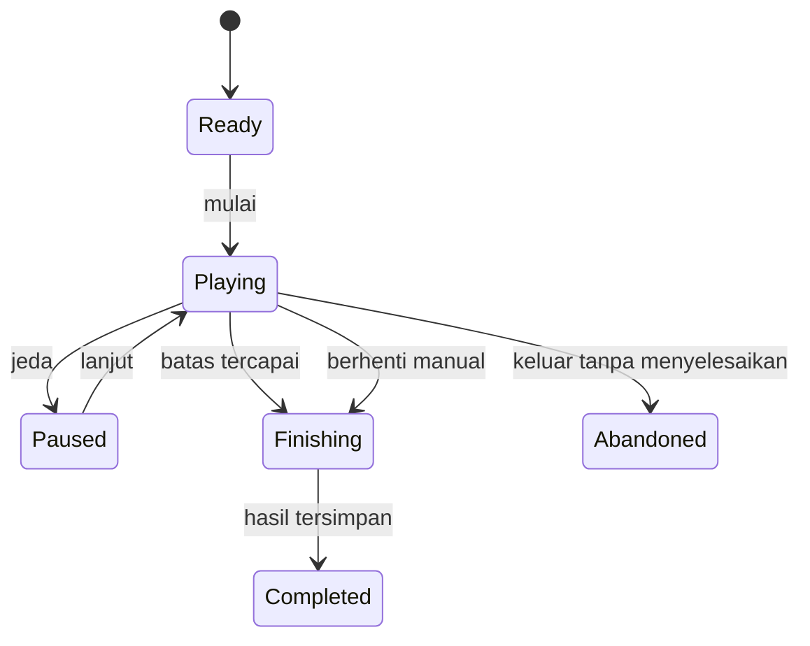

# Standar Mode Permainan

**Proyek:** Website Les Privat Kak Harris  
**Lokasi tujuan:** `docs/Games/14-Mode-Permainan.md`  
**Status:** Rancangan awal  
**Fokus rilis:** Matematika SD–SMP

## 1. Tujuan

Dokumen ini menetapkan aturan mode permainan yang digunakan bersama oleh seluruh engine. Mode mengatur durasi dan kondisi berakhirnya sesi, sedangkan engine mengatur mekanik interaksi. Pemisahan ini mencegah setiap game membuat definisi Endless, batas waktu, skor, atau hasil akhir yang berbeda-beda.

Standar ini menjadi acuan bagi Engine Quiz, Endless, Matching, Drag & Drop, Puzzle, dan Adventure. Engine boleh mendukung sebagian mode saja, tetapi tidak boleh mengubah arti mode yang didukung.

## 2. Prinsip Umum

1. **Mode terpisah dari engine.** Engine menangani cara bermain; mode menentukan batas dan akhir sesi.
2. **Aturan terlihat sebelum mulai.** Murid harus mengetahui batas soal, waktu, atau nyawa pada layar persiapan.
3. **Satu kondisi akhir utama.** Konfigurasi MVP tidak menggabungkan beberapa batas yang saling bersaing kecuali jenis mode memang mendefinisikannya.
4. **Berhenti manual selalu tersedia.** Endless bukan alasan untuk mengunci murid di dalam sesi.
5. **Jeda tidak memberi keuntungan.** Timer, soal aktif, dan status sesi harus dipulihkan secara konsisten.
6. **Hasil dapat dibandingkan secara adil.** Ringkasan selalu mencatat mode dan konfigurasi batasnya.
7. **Hadiah permanen dibatasi.** XP dan achievement tidak dihitung hanya dari durasi bermain atau jumlah putaran mentah.
8. **Mobile-first.** Kontrol utama dapat digunakan lewat sentuhan dan tidak bergantung pada hover atau keyboard fisik.

## 3. Jenis Mode Resmi

| `type` | Nama tampilan | Kondisi selesai utama | Dukungan MVP |
| --- | --- | --- | --- |
| `endless` | Endless | Murid berhenti, nyawa habis bila diaktifkan, atau sesi tidak dapat dilanjutkan | Ya |
| `limited_questions` | Tantangan Soal | Jumlah soal yang ditetapkan selesai dikerjakan | Ya |
| `limited_time` | Tantangan Waktu | Waktu aktif habis | Ya |
| `limited_lives` | Tantangan Nyawa | Target tercapai atau nyawa habis | Setelah MVP dasar |

Istilah **Terbatas** adalah kelompok mode, bukan nilai `type`. Dalam data, mode harus menggunakan salah satu tipe spesifik di atas.

## 4. Kontrak Konfigurasi Umum

```json
{
  "type": "limited_questions",
  "label": "10 Soal",
  "enabled": true,
  "questionLimit": 10,
  "timeLimitSeconds": null,
  "initialLives": null,
  "targetScore": null,
  "allowPause": true,
  "allowManualFinish": true,
  "checkpointInterval": 5,
  "difficultyPolicy": "adaptive",
  "rewardPolicy": "standard"
}
```

### Aturan validasi

- `type` wajib termasuk jenis mode resmi.
- `questionLimit` wajib berupa bilangan bulat positif untuk `limited_questions`.
- `timeLimitSeconds` wajib berupa bilangan bulat positif untuk `limited_time`.
- `initialLives` wajib berupa bilangan bulat positif untuk `limited_lives`.
- Properti batas yang tidak relevan diisi `null` atau dihilangkan.
- `allowManualFinish` selalu `true` untuk Endless.
- `checkpointInterval` menyatakan jumlah jawaban antar-checkpoint, bukan detik.
- Konfigurasi tidak valid harus ditolak sebelum sesi dibuat.
- Engine yang tidak mendukung mode terpilih harus menampilkan mode sebagai tidak tersedia, bukan gagal setelah permainan dimulai.

## 5. State dan Transisi Mode

Mode Controller menggunakan state sesi yang ditetapkan dalam `02-Arsitektur-Game.md`.



Mode Controller hanya mengirim sinyal bahwa kondisi selesai telah tercapai. Session Manager melakukan transisi final dan Result Service menyimpan hasil.

## 6. Mode Endless

### 6.1 Tujuan

Endless digunakan untuk latihan berkelanjutan, mengejar skor, membangun streak, dan meningkatkan kesulitan secara bertahap. Mode ini tidak memiliki jumlah soal atau durasi kemenangan yang tetap.

### 6.2 Kondisi selesai

Sesi Endless berakhir jika:

- murid memilih **Selesai**;
- nyawa habis, jika variasi Endless memakai nyawa;
- tidak ada soal valid yang dapat disediakan;
- terjadi error yang tidak dapat dipulihkan;
- batas keamanan sesi tercapai.

Batas keamanan adalah batas teknis, bukan target yang ditampilkan sebagai kemenangan. Nilai awal yang disarankan adalah maksimum 60 menit atau 200 putaran per sesi. Setelah tercapai, sistem menyelesaikan sesi dengan wajar dan menawarkan sesi baru.

### 6.3 Kesulitan

Kenaikan kesulitan tidak hanya berdasarkan jumlah soal. Difficulty Controller dapat mempertimbangkan:

- akurasi pada jendela 5–10 jawaban terakhir;
- streak benar;
- waktu respons;
- tingkat kesulitan soal saat ini;
- jumlah penurunan tingkat yang baru terjadi.

Aturan awal yang disarankan:

- naik satu tingkat setelah minimal 5 jawaban dengan akurasi sekurangnya 80%;
- turun satu tingkat setelah minimal 5 jawaban dengan akurasi di bawah 50%;
- perubahan maksimal satu tingkat dalam satu evaluasi;
- tingkat tidak melampaui `allowedDifficulties` pada konfigurasi game.

Angka tersebut merupakan default MVP dan harus dapat dikonfigurasi serta diberi versi.

### 6.4 Berhenti dan hasil

Tombol **Selesai** meminta konfirmasi agar tidak tersentuh tanpa sengaja. Jawaban yang sudah dinilai tetap tercatat. Sesi diberi `finishReason: manual_finish`, bukan `abandoned`.

Menutup halaman tanpa konfirmasi tidak langsung dianggap selesai. Sistem menyimpan checkpoint dan menawarkan pemulihan selama sesi masih memenuhi masa berlaku.

### 6.5 Hadiah

Endless berisiko dieksploitasi melalui soal mudah atau sesi sangat panjang. Karena itu:

- XP tidak boleh dihitung langsung dari durasi;
- soal yang sama berulang terlalu cepat tidak memberi hadiah penuh;
- XP efektif per sesi memiliki batas;
- akurasi minimum dapat menjadi syarat hadiah;
- hasil setelah batas keamanan tidak ditambahkan ke sesi yang sama;
- pengiriman hasil dengan `sessionId` sama tidak boleh memberi hadiah dua kali.

## 7. Mode Terbatas Berdasarkan Soal

### 7.1 Tujuan

`limited_questions` cocok untuk latihan harian, evaluasi singkat, atau level dengan jumlah tugas yang jelas.

### 7.2 Aturan sesi

- `questionLimit` menghitung item yang telah dinilai, bukan item yang baru ditampilkan.
- Soal yang batal dimuat tidak mengurangi sisa soal.
- Soal yang dilewati dihitung hanya jika engine memang mengizinkan lewati; hasilnya dicatat sebagai `skipped`.
- Putaran selesai segera setelah item terakhir dinilai dan umpan balik singkat selesai ditampilkan.
- Progress bar menampilkan `answeredCount / questionLimit`.

Rekomendasi pilihan awal: 5 soal untuk sesi cepat, 10 soal sebagai default, dan 20 soal untuk latihan panjang.

### 7.3 Menang dan selesai

Menyelesaikan seluruh soal berarti **sesi selesai**, bukan otomatis menguasai materi. Status performa ditentukan dari akurasi:

| Akurasi | Label hasil awal |
| --- | --- |
| 90–100% | Sangat Baik |
| 75–89% | Baik |
| 60–74% | Perlu Latihan |
| di bawah 60% | Ulangi Materi |

Label ini merupakan umpan balik, bukan nilai rapor. Batasnya dapat disesuaikan kemudian melalui konfigurasi versi.

## 8. Mode Terbatas Berdasarkan Waktu

### 8.1 Tujuan

`limited_time` menguji kelancaran dan kecepatan tanpa mengabaikan ketepatan. Mode ini cocok untuk operasi hitung singkat, mencocokkan, atau tantangan respons cepat. Soal kompleks tidak boleh dipaksa memakai batas waktu pendek.

### 8.2 Timer

- Waktu menggunakan monotonic clock di browser selama halaman aktif.
- Timestamp server atau waktu tepercaya digunakan untuk memeriksa manipulasi yang mencolok saat hasil disimpan.
- Countdown dimulai setelah layar dan soal pertama siap, bukan saat aset masih dimuat.
- Saat waktu mencapai nol, input dikunci dan jawaban yang belum dikirim tidak dinilai.
- Timer tidak boleh menjadi negatif di tampilan atau hasil.
- Peringatan visual diberikan tanpa kedipan berlebihan; audio bersifat opsional.

### 8.3 Jeda

Untuk latihan biasa, jeda dapat diizinkan. Untuk tantangan skor atau leaderboard masa depan, jeda harus dinonaktifkan atau waktu tetap berjalan.

Jika `allowPause: true`:

- timer berhenti hanya setelah status resmi menjadi `paused`;
- jeda otomatis karena aplikasi masuk latar belakang dicatat;
- jumlah dan durasi jeda masuk ke ringkasan internal;
- batas jeda wajar dapat diterapkan untuk mencegah penyalahgunaan.

### 8.4 Durasi awal

Pilihan MVP yang disarankan:

- 60 detik untuk tantangan cepat;
- 120 detik sebagai default;
- 300 detik untuk soal yang membutuhkan beberapa langkah.

Durasi harus ditetapkan berdasarkan karakter materi dan pengujian, bukan hanya jenjang kelas.

## 9. Mode Terbatas Berdasarkan Nyawa

`limited_lives` memberi sejumlah kesempatan salah dan cocok untuk tantangan ketelitian. Mode ini bukan prioritas MVP dasar karena dapat membuat murid yang sedang belajar cepat gagal.

Aturan minimum:

- jawaban salah mengurangi satu nyawa setelah hasil evaluasi sah;
- soal yang gagal dimuat tidak mengurangi nyawa;
- nyawa tidak boleh negatif;
- sesi selesai saat nyawa nol atau target yang ditetapkan tercapai;
- tersedia umpan balik belajar setelah kesalahan;
- konfigurasi default tidak menggunakan kurang dari tiga nyawa;
- mode ini tidak dipakai untuk asesmen formal.

Penggunaan nyawa harus tetap mendukung belajar. Visual tidak boleh mempermalukan murid atau memakai pesan seperti “gagal total”.

## 10. Skor, Streak, dan Penalti

Mode mengirim konteks batas kepada Scoring Service, tetapi tidak menghitung skor sendiri.

Aturan lintas mode:

- jawaban benar memberi skor dasar;
- jawaban salah tidak boleh memberi skor negatif pada MVP;
- streak bertambah setelah jawaban benar dan kembali ke nol setelah jawaban salah;
- `skipped` memutus streak jika fitur lewati diizinkan;
- bonus kecepatan hanya aktif pada soal yang memang layak dikerjakan cepat;
- bonus dibatasi agar jawaban cepat tidak mengalahkan ketepatan;
- rumus skor dan reward memiliki nomor versi.

Skor mentah, akurasi, dan XP adalah tiga hal berbeda. Perubahan skor tidak boleh otomatis mengubah definisi penguasaan materi.

## 11. Pause, Keluar, dan Pemulihan Sesi

### Pause manual

- Hanya muncul jika `allowPause: true`.
- Input soal dinonaktifkan selama jeda.
- Audio dan animasi aktif dihentikan.
- Melanjutkan sesi mengembalikan soal yang sama tanpa mengganti jawabannya.

### Keluar

Saat murid memilih kembali ke katalog, tampilkan pilihan:

- **Selesaikan sesi**, bila mode mengizinkan hasil parsial;
- **Simpan dan lanjutkan nanti**, bila checkpoint tersedia;
- **Keluar tanpa menyelesaikan**.

Pilihan yang tidak didukung tidak ditampilkan.

### Pemulihan

- Satu murid hanya memiliki satu sesi aktif per game dan mode pada MVP.
- Checkpoint menyimpan indeks/putaran, skor, streak, waktu relevan, kesulitan, dan ID soal yang telah dipakai.
- Masa berlaku checkpoint awal disarankan 24 jam.
- Mode waktu hanya dipulihkan jika aturan timer dapat dijaga secara adil.
- Sesi yang versi game-nya sudah tidak kompatibel ditutup dengan aman tanpa memberi hadiah ganda.

## 12. Prioritas Kondisi Selesai

Jika beberapa kejadian terjadi hampir bersamaan, gunakan prioritas berikut:

1. hasil sudah pernah diselesaikan dengan `sessionId` yang sama;
2. error keamanan atau konfigurasi tidak valid;
3. waktu habis;
4. nyawa habis;
5. jumlah soal atau target tercapai;
6. selesai manual;
7. keluar atau koneksi terputus.

Satu sesi hanya memiliki satu `finishReason` final. Event sesudah status `finishing` tidak boleh mengubah jawaban, skor, atau hadiah.

Nilai `finishReason` minimum:

```text
question_limit_reached
time_expired
lives_depleted
target_reached
ending_reached
manual_finish
safety_limit_reached
no_content
incompatible_version
unrecoverable_error
abandoned
```

## 13. Kontrak Hasil Mode

Semua mode menghasilkan ringkasan dengan bentuk dasar yang sama:

```json
{
  "sessionId": "session-uuid",
  "gameId": "operasi-bilangan-bulat-01",
  "gameVersion": 1,
  "engineType": "quiz",
  "mode": {
    "type": "limited_questions",
    "questionLimit": 10,
    "timeLimitSeconds": null,
    "initialLives": null
  },
  "status": "completed",
  "finishReason": "question_limit_reached",
  "startedAt": "server-timestamp",
  "finishedAt": "server-timestamp",
  "activeDurationSeconds": 184,
  "answeredCount": 10,
  "correctCount": 8,
  "wrongCount": 2,
  "skippedCount": 0,
  "accuracy": 0.8,
  "score": 920,
  "maxStreak": 5,
  "endingDifficulty": "medium",
  "pauseCount": 1,
  "rewardPolicyVersion": 1,
  "scoringVersion": 1
}
```

`accuracy` dihitung dari jawaban yang dinilai: `correctCount / (correctCount + wrongCount)`. Item `skipped` dilaporkan terpisah. Jika belum ada jawaban yang dinilai, akurasi disimpan sebagai `null`, bukan nol.

## 14. UI Wajib per Mode

| Komponen | Endless | Batas soal | Batas waktu | Batas nyawa |
| --- | --- | --- | --- | --- |
| Skor | Ya | Ya | Ya | Ya |
| Progres soal | Putaran | `x / total` | Opsional | Target bila ada |
| Timer | Durasi opsional | Durasi opsional | Countdown wajib | Durasi opsional |
| Nyawa | Jika aktif | Tidak | Tidak | Wajib |
| Tombol jeda | Sesuai konfigurasi | Sesuai konfigurasi | Sesuai konfigurasi | Sesuai konfigurasi |
| Tombol selesai | Wajib | Opsional | Opsional | Opsional |
| Konfirmasi keluar | Wajib | Wajib | Wajib | Wajib |

Timer tidak boleh menjadi satu-satunya penanda waktu habis; perubahan label dan penguncian input juga diperlukan. Warna tidak boleh menjadi satu-satunya pembeda benar, salah, nyawa, atau peringatan.

## 15. Analitik Minimum

Event lintas mode yang dicatat:

- `game_mode_selected`;
- `game_session_started`;
- `game_session_paused`;
- `game_session_resumed`;
- `game_session_finished`;
- `game_session_abandoned`;
- `game_session_recovered`;
- `difficulty_changed`.

Payload hanya memuat ID game, engine, mode, versi, alasan selesai, durasi, jumlah jawaban, akurasi, dan konteks teknis yang diperlukan. Analitik tidak menyimpan isi jawaban bebas yang tidak diperlukan.

## 16. Kasus Batas

| Kondisi | Perilaku yang diharapkan |
| --- | --- |
| Bank soal lebih sedikit dari batas soal | Jangan mulai; tawarkan batas yang valid atau tampilkan pesan konten belum cukup |
| Soal habis di Endless | Minta set baru; jika tetap kosong, selesaikan dengan `no_content` |
| Waktu habis saat animasi feedback | Kunci input dan selesaikan setelah feedback singkat tanpa memuat soal baru |
| Jawaban dikirim tepat saat waktu habis | Gunakan timestamp penerimaan action; evaluasi hanya jika diterima sebelum deadline |
| Tombol jawaban ditekan dua kali | Terima action pertama dan abaikan duplikat |
| Halaman direfresh | Tawarkan pemulihan dari checkpoint yang kompatibel |
| Jaringan putus saat selesai | Simpan hasil final di antrean lokal dan kirim ulang dengan `sessionId` sama |
| Konfigurasi mode berubah saat sesi aktif | Sesi lama tetap memakai snapshot konfigurasi dan versinya |
| Perangkat tidur lama | Validasi kembali timer dan masa berlaku sesi saat aplikasi aktif |

## 17. Dukungan Engine

| Engine | Endless | Batas soal | Batas waktu | Batas nyawa |
| --- | --- | --- | --- | --- |
| Quiz | Ya | Ya | Ya | Opsional |
| Generated Drill | Ya | Ya | Ya | Setelah MVP dasar |
| Matching | Opsional | Ya | Ya | Tidak untuk MVP |
| Drag & Drop | Opsional | Ya | Ya | Tidak untuk MVP |
| Puzzle | Opsional | Berdasarkan level | Ya | Opsional |
| Adventure | Tidak sebagai parent | Tidak sebagai parent | Tidak sebagai parent | Tidak sebagai parent |

Adventure memakai lifecycle parent `ending_driven` dan selesai dengan `ending_reached`; setiap aktivitas anak tetap memakai salah satu mode resmi sesuai engine anaknya. Tabel ini adalah batas awal. Dukungan baru hanya ditambahkan setelah kontrak engine menjelaskan perilakunya dan pengujian lintas mode tersedia.

## 18. Batas MVP

MVP mode permainan wajib mencakup:

- `endless`;
- `limited_questions`;
- `limited_time`;
- konfigurasi tervalidasi;
- pause/resume dasar;
- selesai manual pada Endless;
- checkpoint dan idempotensi hasil;
- ringkasan hasil standar;
- penguncian input saat sesi selesai;
- UI responsif untuk ponsel.

Belum wajib pada MVP:

- leaderboard publik;
- kompetisi sinkron;
- energi harian;
- nyawa berbayar;
- turnamen;
- gabungan beberapa kondisi menang kompleks;
- sinkronisasi sesi aktif antarperangkat secara waktu nyata.

## 19. Kriteria Penerimaan

Dokumen dan implementasi mode dianggap memenuhi standar jika:

1. Engine tidak menghitung kondisi selesai secara terpisah dari Mode Controller.
2. Setiap mode menolak konfigurasi yang tidak valid sebelum sesi dibuat.
3. Countdown dimulai setelah permainan siap dan berhenti tepat satu kali.
4. Endless dapat dihentikan secara aman dan memiliki batas keamanan.
5. Pause, refresh, dan gangguan jaringan tidak menggandakan skor atau hadiah.
6. Satu sesi hanya menghasilkan satu alasan selesai final.
7. Ringkasan menyimpan jenis mode, batas, versi, dan statistik yang konsisten.
8. UI utama dapat dipakai dengan sentuhan pada layar kecil.
9. Akun SD dan SMP menerima mode yang sama tanpa mencampur materi atau jenjang.
10. Semua jalur utama dan kasus batas pada dokumen ini memiliki pengujian.

## 20. Keputusan yang Ditetapkan

- Endless dan Terbatas adalah aturan lintas engine, bukan aplikasi terpisah.
- Terbatas disimpan sebagai tipe spesifik: soal, waktu, atau nyawa.
- MVP mendahulukan Endless, batas soal, dan batas waktu.
- Mode nyawa ditunda sampai alur dasar stabil.
- Endless memiliki batas keamanan teknis dan pembatasan hadiah.
- Akurasi lebih penting daripada kecepatan untuk evaluasi belajar.
- Mode tidak menghitung XP, achievement, atau skor permanen sendiri.
- Sesi menyimpan snapshot konfigurasi dan versi agar hasil lama tetap dapat dijelaskan.

## 21. Langkah Berikutnya

Setelah standar mode ini disetujui, lanjutkan ke `03-Engine-Quiz.md`. Dokumen Engine Quiz harus memakai kontrak mode di sini, mendefinisikan tipe pertanyaan yang didukung, alur satu putaran, evaluasi jawaban, konfigurasi khusus engine, dan hubungan dengan Question Provider serta Session Manager.
