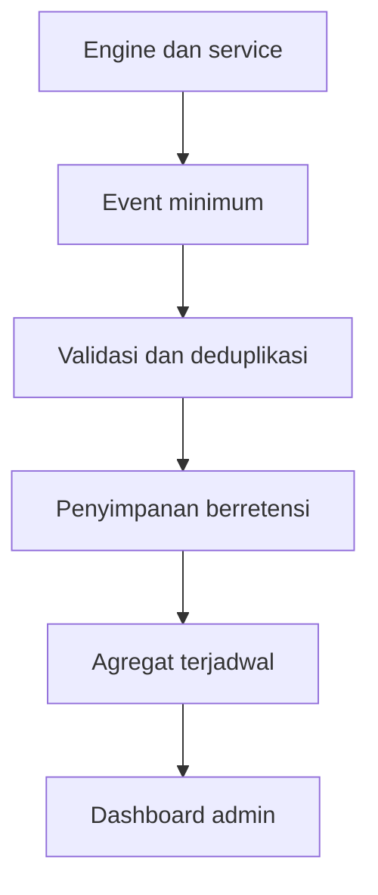
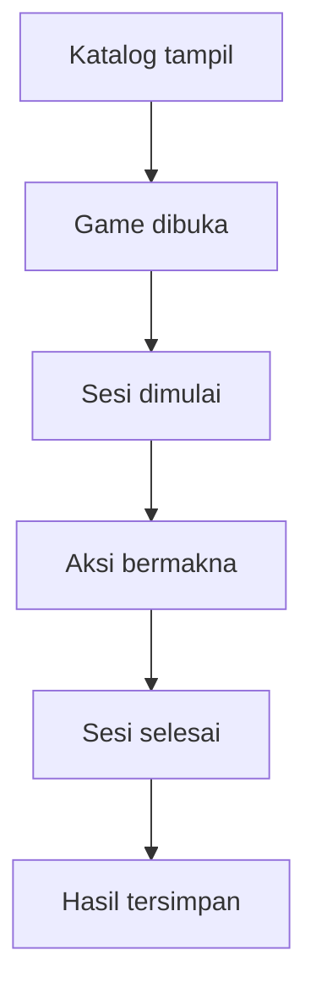

# Rancangan Analitik Sistem Game

**Proyek:** Website Les Privat Kak Harris  
**Lokasi tujuan:** `docs/Games/15-Analitik.md`  
**Status:** Rancangan awal  
**Fokus rilis:** Matematika SD–SMP  
**Platform:** Website responsif, Firebase Authentication, Cloud Firestore, dan backend tepercaya

## 1. Tujuan

Dokumen ini menetapkan event, metrik, agregasi, dashboard, retensi, privasi, dan monitoring untuk sistem game.

Tujuan utamanya adalah:

- mengetahui game yang benar-benar dibuka, dimulai, dan diselesaikan;
- menemukan materi, soal, generator, atau alur yang sering bermasalah;
- membedakan masalah pembelajaran, masalah konten, dan masalah teknis;
- memberi admin atau tutor laporan yang dapat ditindaklanjuti;
- menjaga definisi metrik konsisten setelah aplikasi berkembang;
- mencegah retry dan jaringan tidak stabil menggandakan event;
- mengumpulkan data sesedikit mungkin sesuai kebutuhan;
- melindungi identitas dan aktivitas murid;
- menghindari leaderboard, profiling berlebihan, dan desain yang mendorong bermain tidak sehat;
- menyiapkan struktur kelas 10–12 tanpa menjadikan SMA target analitik saat ini.

## 2. Prinsip Desain

1. **Tujuan lebih dulu.** Event hanya dibuat jika mendukung keputusan produk, pembelajaran, kualitas konten, atau operasional.
2. **Bukan sumber kebenaran.** Analitik tidak menentukan hasil, XP, level, achievement, mastery, atau hak akses.
3. **Minim data.** Simpan ID, kategori, versi, durasi, dan hasil evaluasi; hindari teks serta data pribadi.
4. **Agregat sebagai default.** Dashboard umum menampilkan ringkasan, bukan jejak aktivitas individual.
5. **Definisi berversi.** Nama, schema, dan rumus metrik tidak berubah diam-diam.
6. **Idempoten.** Retry memakai `eventId` yang sama.
7. **Waktu server diutamakan.** Waktu klien hanya membantu urutan dan diagnostik.
8. **Tidak merekam semua interaksi.** Pointer, scroll, render, dan ketukan kosmetik tidak dicatat.
9. **Anak bukan target eksperimen agresif.** Tidak ada dark pattern, personalisasi manipulatif, atau perbandingan sosial publik.
10. **Bisa dihapus.** Data memiliki masa retensi dan jalur penghapusan yang jelas.
11. **Dapat dijelaskan.** Admin dapat mengetahui arti, pembilang, penyebut, dan batas setiap metrik.
12. **Kegagalan analitik tidak memblokir belajar.** Game tetap dapat berjalan ketika event gagal dikirim.

## 3. Posisi Analitik dalam Sistem



Engine dan service menghasilkan event. Event Service memvalidasi, meminimalkan, memberi waktu server, dan mendeduplikasi event. Agregator membuat laporan. Dashboard tidak membaca aliran event mentah secara bebas.

## 4. Batas Tanggung Jawab

### Analitik menangani

- funnel katalog sampai hasil tersimpan;
- penggunaan game, engine, mode, dan materi;
- kualitas konten dan generator;
- performa teknis serta error operasional;
- tren agregat jawaban benar, salah, skip, hint, dan waktu respons;
- kesehatan penyimpanan hasil;
- indikator kebutuhan perbaikan;
- audit definisi metrik dan schema event;
- retensi serta penghapusan event analitik.

### Analitik tidak menangani

- menilai jawaban;
- menyimpan hasil final resmi;
- memberi atau membatalkan XP;
- membuka achievement;
- menentukan mastery hanya dari event;
- menggantikan riwayat hasil murid;
- menyimpan isi chat, pembayaran, profil, atau kontak;
- membuat ranking publik;
- mengawasi keaktifan murid secara real-time;
- menjadi sistem ujian berisiko tinggi.

## 5. Sumber Kebenaran per Kebutuhan

| Kebutuhan | Sumber kebenaran | Peran analitik |
| --- | --- | --- |
| Hasil satu sesi | `gameResults/{sessionId}` | Mengukur tren hasil tersimpan |
| Checkpoint aktif | `gameSessions/{sessionId}` | Mengukur pemulihan secara agregat |
| XP dan level | `xpLedger` dan ringkasan XP | Mengukur distribusi pemberian, bukan menghitung ulang hak |
| Achievement | grant achievement | Mengukur unlock, bukan memberi badge |
| Progres per murid | `gameProgress` dan hasil | Menyediakan metrik produk tambahan |
| Kualitas soal | Konten berversi + hasil/evaluasi | Menandai kandidat review |
| Error sistem | Log operasional + event error | Mengukur frekuensi dan dampak |
| Penggunaan produk | Event analitik | Sumber utama |

Jika analitik berbeda dengan hasil final, hasil final tetap dianggap benar untuk hak dan riwayat murid.

## 6. Kelompok Event

| Kelompok | Tujuan | Contoh |
| --- | --- | --- |
| `discovery` | Menilai katalog dan pembukaan game | `game_catalog_viewed`, `game_opened` |
| `session` | Menilai lifecycle sesi | `game_session_started`, `game_session_finished` |
| `learning_interaction` | Menilai pola interaksi akademik minimum | `quiz_answer_evaluated`, `matching_attempt_evaluated` |
| `content_quality` | Menemukan konten rusak atau tidak efektif | `content_error_detected`, `question_load_failed` |
| `difficulty` | Menilai perubahan tingkat kesulitan | `difficulty_changed`, `repeat_policy_relaxed` |
| `reward` | Mengawasi hasil pemrosesan hadiah | `xp_granted`, `achievement_unlocked` |
| `technical` | Menilai penyimpanan dan pemulihan | `game_result_save_failed`, `session_recovered` |
| `adventure` | Menilai perjalanan dan node | `adventure_node_completed`, `adventure_ending_reached` |

## 7. Konvensi Nama Event

Nama event menggunakan `snake_case` dan bentuk lampau untuk kejadian yang sudah terjadi.

Pola umum:

```text
<domain>_<object>_<verb>
```

Contoh yang benar:

```text
game_session_started
quiz_answer_evaluated
content_error_detected
xp_granted
```

Hindari:

```text
button_clicked
track_user
doAnalytics
answer
event_01
```

Perubahan arti wajib membuat nama baru atau menaikkan `schemaVersion`. Nama lama tidak boleh dipakai untuk dua arti berbeda.

## 8. Envelope Event Umum

Semua event memakai field tingkat atas yang sama:

```json
{
  "schemaVersion": 1,
  "eventId": "uuid-stabil-selama-retry",
  "eventName": "game_session_finished",
  "eventSource": "result_service",
  "actorHash": "pseudonim-berotasi",
  "sessionId": "session-uuid",
  "gameId": "operasi-bilangan-bulat-01",
  "gameVersion": 1,
  "engineType": "quiz",
  "modeType": "limited_questions",
  "audienceKey": "SMP-7",
  "topicId": "bilangan-bulat",
  "occurredAt": "server-timestamp",
  "clientOccurredAt": "client-timestamp",
  "receivedAt": "server-timestamp",
  "properties": {
    "finishReason": "question_limit_reached"
  },
  "expiresAt": "timestamp"
}
```

Field yang tidak relevan boleh dihilangkan. `properties` hanya menerima field yang terdaftar pada schema event tersebut.

## 9. Identitas dan Pseudonim

Event umum tidak menyimpan `uid`, nama, email, nomor telepon, alamat, atau ID orang tua.

`actorHash`:

- dibuat oleh backend dari identitas internal dan secret yang tidak tersedia di browser;
- berotasi per periode, disarankan bulanan;
- hanya dipakai untuk menghitung pengguna unik dalam jendela tersebut;
- tidak ditampilkan pada dashboard;
- tidak dipakai untuk menebak identitas asli;
- boleh dihilangkan jika suatu event tidak membutuhkan pengguna unik.

Laporan per murid tidak memakai `actorHash`. Laporan tersebut membaca `gameResults` sesuai hak akses dan berada di jalur terpisah dari analitik produk.

## 10. ID, Retry, dan Deduplikasi

Aturan:

- satu kejadian logis memiliki satu `eventId`;
- retry jaringan mengirim `eventId` yang sama;
- Event Service menulis ke `gameAnalyticsEvents/{eventId}`;
- create kedua dengan ID sama mengembalikan sukses idempoten tanpa membuat duplikat;
- event turunan dari hasil dapat memakai ID deterministik;
- event interaksi klien memakai UUID yang disimpan dalam antrean sampai terkirim atau kedaluwarsa;
- deduplikasi tidak hanya bergantung pada memori tab.

Contoh ID deterministik:

```text
session-started__{sessionId}
session-finished__{sessionId}
result-save-failed__{sessionId}__{failureAttemptGroupId}
xp-granted__{ledgerEventId}
achievement-unlocked__{achievementId}__{ownerScopeId}
```

`failureAttemptGroupId` mewakili satu rangkaian retry, bukan setiap percobaan HTTP.

## 11. Waktu dan Urutan

- `occurredAt` adalah timestamp server yang diterima sebagai waktu resmi event;
- `clientOccurredAt` bersifat opsional untuk menyusun kejadian offline;
- `receivedAt` membantu mengukur keterlambatan pengiriman;
- durasi berasal dari lifecycle sesi atau timer terverifikasi, bukan selisih dua event klien secara buta;
- event dengan jam klien jauh menyimpang tetap dapat diterima, tetapi ditandai `clockSkewBucket`;
- dashboard harian memakai zona waktu aplikasi `Asia/Jakarta`;
- penyimpanan tetap menggunakan timestamp absolut.

Urutan event klien yang tiba terlambat tidak boleh mengubah hasil final.

## 12. Event Funnel Minimum

Event P0:

| Event | Dipicu saat | Sumber |
| --- | --- | --- |
| `game_catalog_viewed` | Katalog berhasil dirender dengan minimal satu game | UI katalog |
| `game_opened` | Halaman detail atau layar persiapan game terbuka | UI game |
| `game_session_start_requested` | Murid meminta mulai | UI game |
| `game_session_started` | Session Manager menerima sesi aktif | Session Manager |
| `game_first_meaningful_action` | Aksi akademik sah pertama diterima | Engine/Event Service |
| `game_session_finished` | Engine atau mode mengakhiri sesi | Result Service |
| `game_result_saved` | Hasil final tersimpan | Result Finalizer |
| `game_session_abandoned` | Sesi kedaluwarsa tanpa hasil final | Cleanup/backend |

`game_first_meaningful_action` bukan klik tombol dekoratif. Contohnya adalah submit jawaban, memilih pasangan kedua, menempatkan item, atau menjalankan langkah legal puzzle.

## 13. Definisi Funnel



Definisi default:

```text
openRate = uniqueGameOpeners / uniqueCatalogViewers
startRate = startedSessions / gameOpens
meaningfulStartRate = sessionsWithMeaningfulAction / startedSessions
completionRate = completedSessions / eligibleStartedSessions
resultSaveRate = savedResults / completedSessions
```

`eligibleStartedSessions` mengecualikan sesi yang gagal sebelum konten pertama tersedia karena `no_content`, `incompatible_version`, atau error sistem P0. Pengecualian tetap dilaporkan sebagai metrik error, bukan dihapus dari data.

## 14. Event Lifecycle Sesi

Event tambahan:

- `game_session_paused`;
- `game_session_resumed`;
- `game_session_checkpointed`;
- `game_session_recovery_offered`;
- `game_session_recovered`;
- `game_session_recovery_failed`;
- `game_session_manual_finish_requested`;
- `game_session_exit_confirmed`;
- `game_session_expired`.

Jangan mengirim `checkpointed` setiap perubahan kecil. Gunakan interval atau milestone yang sudah ditetapkan Session Manager.

## 15. Event Hasil dan Reward

Event backend:

- `game_result_finalization_started`;
- `game_result_saved`;
- `game_result_save_failed`;
- `game_result_duplicate_ignored`;
- `xp_granted`;
- `xp_capped`;
- `xp_duplicate_prevented`;
- `achievement_unlocked`;
- `achievement_duplicate_prevented`.

Payload reward hanya memuat kategori kebijakan dan angka ringkas yang diperlukan. Event tidak menggantikan ledger.

Contoh:

```json
{
  "eventName": "xp_granted",
  "properties": {
    "rewardPolicyVersion": 1,
    "grantedXp": 24,
    "sessionCapApplied": false,
    "dailyCapBucket": "below_soft_cap"
  }
}
```

## 16. Event Engine Quiz

Event minimum:

- `quiz_question_presented`;
- `quiz_answer_submitted`;
- `quiz_answer_evaluated`;
- `quiz_invalid_input`;
- `quiz_question_skipped`;
- `quiz_question_load_failed`.

Payload yang diizinkan:

```json
{
  "questionId": "bilbul-001",
  "questionVersion": 2,
  "questionType": "numeric_input",
  "topicId": "bilangan-bulat",
  "difficulty": "medium",
  "isCorrect": true,
  "responseTimeBucket": "5s_to_15s",
  "evaluationVersion": 1,
  "usedHint": false
}
```

Nilai jawaban mentah dan teks soal tidak dikirim.

## 17. Event Generated Drill

Event minimum:

- `generated_drill_started`;
- `generated_item_presented`;
- `generated_answer_evaluated`;
- `difficulty_changed`;
- `generation_retry`;
- `repeat_policy_relaxed`;
- `generated_drill_finished`;
- `generated_drill_error`.

Payload tambahan yang diizinkan:

- `generatorId` dan `generatorVersion`;
- `seedFingerprint` non-reversibel jika dibutuhkan debugging;
- kesulitan sebelum dan sesudah;
- `changeReasonCode`;
- jumlah percobaan generator dalam bucket;
- `fallbackCode`;
- fingerprint template, bukan seluruh parameter soal.

Seed penuh tidak perlu dikirim ke event umum. Snapshot sesi tetap menjadi tempat pemulihan deterministik.

## 18. Event Matching

Event minimum:

- `matching_set_presented`;
- `matching_attempt_evaluated`;
- `matching_pair_completed`;
- `matching_set_completed`;
- `matching_set_load_failed`.

Payload yang diizinkan:

- `setId` dan versi;
- `pairId` atau fingerprint pasangan;
- `attemptResult`;
- jumlah pasangan tersisa;
- `inputMethod`: `tap`, `pointer`, atau `keyboard`;
- waktu respons dalam bucket.

Event tidak memuat label teks item.

## 19. Event Drag & Drop

Event minimum:

- `dragdrop_board_presented`;
- `dragdrop_placement_evaluated`;
- `dragdrop_item_completed`;
- `dragdrop_board_completed`;
- `dragdrop_board_load_failed`.

Payload yang diizinkan:

- `boardId` dan versi;
- `itemId` serta `targetId` teknis;
- benar atau salah;
- `inputMethod`;
- percobaan ke-n dalam bucket;
- waktu respons dalam bucket.

Koordinat layar, lintasan pointer, dan rekaman gesture tidak disimpan.

## 20. Event Puzzle

Event minimum:

- `puzzle_presented`;
- `puzzle_legal_move_applied`;
- `puzzle_illegal_move_rejected`;
- `puzzle_hint_used`;
- `puzzle_undo_used`;
- `puzzle_reset_used`;
- `puzzle_completed`;
- `puzzle_load_failed`.

`puzzle_legal_move_applied` tidak wajib dikirim untuk setiap langkah pada MVP. Ringkasan saat puzzle selesai lebih disarankan:

```json
{
  "puzzleId": "urutan-pecahan-01",
  "puzzleVersion": 1,
  "puzzleType": "ordered_sequence",
  "legalMoveCount": 8,
  "illegalMoveCount": 1,
  "undoCount": 2,
  "resetCount": 0,
  "hintCount": 1,
  "completionTimeBucket": "1m_to_3m"
}
```

State papan lengkap tetap berada pada checkpoint jika memang diperlukan, bukan pada event analitik.

## 21. Event Adventure

Event minimum:

- `adventure_started`;
- `adventure_node_entered`;
- `adventure_node_completed`;
- `adventure_branch_selected`;
- `adventure_child_session_started`;
- `adventure_child_session_finished`;
- `adventure_ending_reached`;
- `adventure_abandoned`.

Payload hanya menyimpan ID node, ID cabang, ID ending, dan referensi sesi anak. Teks dialog serta isi cerita tidak disalin ke event.

Pada MVP linear, `adventure_branch_selected` belum diperlukan.

## 22. Event Kualitas Konten

Event:

- `content_validation_failed`;
- `content_error_detected`;
- `content_fallback_used`;
- `content_retired_encountered`;
- `content_report_submitted`;
- `content_insufficient_pool_detected`.

`content_report_submitted` memakai kategori terkontrol:

```text
answer_key_suspected
ambiguous_prompt
unreadable_asset
age_inappropriate
duplicate_content
technical_display_issue
other_without_free_text
```

Free text dinonaktifkan pada MVP. Jika kelak diperlukan, teks masuk jalur moderasi dan retensi terpisah.

## 23. Event Error Teknis

Event error minimum:

- `game_boot_failed`;
- `game_asset_load_failed`;
- `game_content_load_failed`;
- `game_evaluation_failed`;
- `game_checkpoint_save_failed`;
- `game_result_save_failed`;
- `game_offline_queue_overflowed`;
- `game_incompatible_version_detected`.

Payload:

```json
{
  "errorCode": "RESULT_WRITE_TIMEOUT",
  "errorStage": "result_finalization",
  "retryable": true,
  "attemptBucket": "2_to_3",
  "networkState": "online",
  "appVersion": "web-2026.08.1"
}
```

Stack trace penuh, token, URL bertanda tangan, isi dokumen Firestore, dan payload jawaban tidak masuk ke event produk. Log teknis rinci memakai sistem log terbatas bila kelak tersedia.

## 24. Data yang Dilarang

Jangan simpan pada event analitik:

- nama lengkap atau nama panggilan murid;
- email, nomor telepon, alamat, sekolah, atau nama orang tua;
- UID autentikasi mentah;
- foto profil;
- bukti pembayaran;
- token, cookie, header autentikasi, atau URL rahasia;
- teks soal lengkap;
- jawaban bebas atau nilai input mentah;
- isi dialog pribadi;
- koordinat pointer atau rekaman layar;
- detail perangkat yang terlalu spesifik;
- alamat IP sebagai field produk;
- data yang tidak punya tujuan keputusan yang tertulis.

## 25. Tingkat Sensitivitas Data

| Tingkat | Contoh | Kebijakan |
| --- | --- | --- |
| A — publik teknis | `gameId`, engine, versi | Boleh di event |
| B — aktivitas agregat | hasil benar/salah, bucket waktu | Boleh dengan retensi |
| C — pseudonim | `actorHash`, `sessionId` | Akses terbatas |
| D — identitas | nama, email, UID mentah | Dilarang di event umum |
| E — sangat sensitif | token, pembayaran, isi komunikasi | Dilarang total |

Menjadikan data sebagai hash tidak otomatis membuatnya aman. Pseudonim tetap diperlakukan sebagai data terbatas.

## 26. Dimensi Analisis Resmi

Dimensi yang boleh dipakai:

- tanggal dan minggu;
- `gameId` dan `gameVersion`;
- `engineType`;
- `modeType`;
- `audienceKey`;
- `topicId`;
- `difficulty`;
- `questionType` atau tipe aktivitas;
- `finishReason`;
- `appVersion`;
- kategori perangkat kasar: `mobile`, `tablet`, `desktop`;
- kategori koneksi saat event: `online`, `offline`, `unknown`;
- versi evaluator, generator, scoring, dan reward.

Dimensi seperti model perangkat lengkap, browser fingerprint, lokasi presisi, dan sekolah tidak digunakan.

## 27. Bucket Durasi dan Angka

Untuk analitik umum, simpan bucket jika angka presisi tidak diperlukan:

| Metrik | Bucket awal |
| --- | --- |
| Waktu respons | `<2s`, `2–5s`, `5–15s`, `15–30s`, `>30s` |
| Durasi sesi | `<1m`, `1–3m`, `3–5m`, `5–10m`, `10–20m`, `>20m` |
| Percobaan | `1`, `2`, `3`, `4+` |
| Jumlah item | `1–5`, `6–10`, `11–20`, `21+` |
| Keterlambatan kirim | `<10s`, `10s–5m`, `5m–1h`, `>1h` |

Hasil final boleh menyimpan angka presisi sesuai kontrak hasil. Event umum memakai bucket untuk mengurangi detail yang tidak dibutuhkan.

## 28. Metrik Penggunaan Utama

Metrik MVP:

| Metrik | Rumus | Keputusan yang didukung |
| --- | --- | --- |
| Game opens | Jumlah `game_opened` | Apakah katalog menarik perhatian |
| Started sessions | Sesi sah yang dimulai | Apakah game dapat dijalankan |
| Meaningful sessions | Sesi dengan aksi akademik | Apakah murid benar-benar mencoba |
| Completion rate | Selesai / started eligible | Apakah durasi dan alur masuk akal |
| Result save rate | Hasil tersimpan / sesi selesai | Apakah penyimpanan andal |
| Recovery success rate | Pulih / recovery offered | Apakah checkpoint berguna |
| Median session duration | Median durasi sesi sah | Apakah sesi terlalu singkat/panjang |
| Repeat usage | Pengguna pseudonim kembali dalam periode rotasi | Apakah game dipakai ulang |

Semua dashboard harus menampilkan jumlah sampel bersama persentase.

## 29. Indikator Pembelajaran

Analitik hanya menghasilkan indikator, bukan diagnosis akademik otomatis.

Indikator awal:

- akurasi per `topicId` dan tingkat kesulitan;
- jumlah item yang dinilai;
- median waktu respons per tipe soal;
- skip rate;
- hint rate;
- retry improvement untuk topik yang sama;
- kesalahan berulang pada `contentId` tertentu;
- distribusi kesulitan yang benar-benar dimainkan;
- proporsi sesi dengan minimum bukti cukup.

Rumus:

```text
accuracy = correctEvaluations / validEvaluations
skipRate = skippedItems / presentedEligibleItems
hintRate = itemsWithHint / presentedEligibleItems
```

`invalid_input` tidak masuk penyebut akurasi, tetapi memiliki metrik sendiri.

## 30. Batas Interpretasi Pembelajaran

Jangan menyimpulkan:

- satu jawaban salah berarti murid tidak memahami materi;
- waktu respons lama selalu buruk;
- level tinggi berarti mastery tinggi;
- satu sesi cukup untuk menentukan kemampuan;
- game yang sering diulang pasti paling efektif;
- murid yang berhenti berarti tidak termotivasi;
- perbedaan dua kelas disebabkan oleh satu faktor tanpa bukti lain.

Dashboard menggunakan bahasa seperti **indikasi**, **kandidat review**, dan **data belum cukup**, bukan vonis.

## 31. Metrik Kualitas Soal

Per `contentId` dan versi:

| Metrik | Kegunaan |
| --- | --- |
| `presentedCount` | Mengetahui ukuran sampel |
| `validEvaluationCount` | Dasar akurasi |
| `correctRate` | Mengukur tingkat keberhasilan |
| `skipRate` | Menemukan soal yang dihindari |
| `invalidInputRate` | Menemukan masalah format input |
| `medianResponseBucket` | Menemukan soal terlalu berat atau membingungkan |
| `reportCount` | Menemukan laporan langsung |
| `loadFailureRate` | Menemukan aset/schema rusak |
| `distractorSelectionRate` | Menilai opsi pengecoh tanpa menyimpan teks |

Konten tidak otomatis dihapus hanya karena `correctRate` rendah. Sistem membuat flag untuk review manusia.

## 32. Aturan Flag Konten

Contoh aturan kandidat review:

```text
Jika validEvaluationCount >= 20
dan correctRate < 0.20
maka tandai low_success_candidate.
```

```text
Jika presentedCount >= 10
dan invalidInputRate >= 0.25
maka tandai input_design_candidate.
```

```text
Jika loadFailureCount >= 3 dalam 24 jam
maka tandai operational_blocker.
```

Threshold disimpan dalam `analyticsPolicyVersion`. Flag bukan bukti bahwa kunci jawaban salah.

## 33. Kualitas Generator

Untuk `generated_drill`, pantau:

- kegagalan menghasilkan item valid;
- jumlah retry generator;
- pemakaian fallback;
- relaksasi anti-pengulangan;
- duplikasi fingerprint dalam jendela sesi;
- distribusi tingkat kesulitan;
- perubahan kesulitan naik/turun;
- error evaluator per versi generator.

Indikator:

```text
generationFailureRate = failedGenerations / generationRequests
fallbackRate = fallbackUses / generatedItems
repeatRelaxationRate = relaxedSelections / generatedItems
```

Seed dan parameter lengkap tetap tersedia pada data sesi yang dibutuhkan untuk reproduksi, bukan disalin ke event umum.

## 34. Metrik Engine dan Mode

Setiap engine dibandingkan hanya pada metrik yang setara.

| Engine | Unit progres utama |
| --- | --- |
| Quiz | Soal dinilai |
| Generated Drill | Item dinilai |
| Matching | Pasangan target selesai |
| Drag & Drop | Item ditempatkan benar |
| Puzzle | Puzzle selesai |
| Adventure | Node dan ending selesai |

Jangan membandingkan akurasi Puzzle dengan Quiz tanpa definisi khusus. Completion rate Adventure menggunakan lifecycle parent `ending_driven`, sedangkan aktivitas anak memakai mode resminya sendiri.

## 35. Metrik Kesehatan Teknis

Metrik P0:

- boot success rate;
- content load success rate;
- evaluation success rate;
- checkpoint save success rate;
- result save success rate;
- median waktu finalisasi hasil;
- recovery success rate;
- event rejection rate;
- offline queue drop rate;
- incompatible version rate;
- duplikat hasil, XP, dan achievement yang berhasil dicegah.

Metrik teknis selalu dipisahkan per `appVersion`, `engineType`, dan versi terkait agar regresi dapat ditemukan.

## 36. Target Operasional Awal

Target awal bukan janji permanen dan harus ditinjau setelah data nyata tersedia:

| Metrik | Target awal |
| --- | ---: |
| Result save success | ≥ 99% dari sesi selesai |
| Content load success | ≥ 99% |
| Recovery success | ≥ 95% dari recovery yang dicoba |
| Duplicate reward granted | 0 |
| Event schema rejection | < 1% |
| Error blocking per sesi mulai | < 1% |

Jumlah sampel harus ditampilkan. Target tidak dievaluasi secara keras pada data yang sangat sedikit.

## 37. Dashboard MVP

Dashboard admin memiliki lima bagian:

1. **Ringkasan penggunaan** — game dibuka, sesi dimulai, sesi bermakna, selesai, dan hasil tersimpan.
2. **Game dan materi** — game terpakai, topik terlatih, akurasi agregat, serta jumlah sampel.
3. **Kualitas konten** — konten yang dilaporkan, load failure, invalid input tinggi, dan kandidat review.
4. **Kesehatan teknis** — error blocking, penyimpanan hasil, recovery, serta regresi versi.
5. **Reward** — XP yang diberikan, cap yang diterapkan, dan duplikasi yang dicegah.

Filter awal:

- rentang tanggal;
- jenjang/kelas;
- game;
- engine;
- mode;
- topik;
- versi aplikasi.

## 38. Dashboard Tutor dan Orang Tua

Dashboard tutor atau orang tua bukan dashboard analitik produk.

Sumbernya adalah hasil final dan progres sesuai hak akses. Tampilannya dapat memuat:

- game yang diselesaikan;
- materi yang dilatih;
- jumlah soal atau unit valid;
- akurasi per materi dengan konteks jumlah sampel;
- riwayat sesi;
- XP dan level sebagai progres sistem;
- catatan bahwa data game bukan pengganti penilaian guru.

Jangan tampilkan `actorHash`, event mentah, error internal, atau aktivitas murid lain.

## 39. Agregasi

Event mentah tidak menjadi sumber langsung seluruh kartu dashboard. Buat agregat harian:

```text
gameAnalyticsDaily/{dateKey}__{dimensionHash}
contentAnalyticsDaily/{dateKey}__{contentVersionKey}
systemAnalyticsHourly/{hourKey}__{appVersion}
```

Contoh agregat:

```json
{
  "schemaVersion": 1,
  "dateKey": "2026-08-06",
  "timezone": "Asia/Jakarta",
  "gameId": "operasi-bilangan-bulat-01",
  "gameVersion": 1,
  "audienceKey": "SMP-7",
  "startedSessions": 18,
  "meaningfulSessions": 16,
  "completedSessions": 14,
  "savedResults": 14,
  "validEvaluations": 120,
  "correctEvaluations": 89,
  "aggregationVersion": 1,
  "updatedAt": "server-timestamp"
}
```

Agregat dapat dihitung ulang dari event selama event mentah masih berada dalam masa retensi.

## 40. Cardinality dan Batas Properti

Untuk mencegah biaya dan query yang tidak terkendali:

- properti bebas tidak diizinkan;
- setiap event memiliki allowlist schema;
- string error memakai kode terkontrol;
- judul dan teks tidak digunakan sebagai dimensi;
- `sessionId` tidak menjadi dimensi agregasi umum;
- array besar dilarang;
- payload maksimum ditetapkan oleh Event Service;
- nilai tak dikenal dipetakan ke `unknown`, bukan membuat kategori baru;
- kombinasi dimensi agregat dibatasi pada kebutuhan dashboard nyata.

## 41. Sampling dan Event Budget

Event lifecycle, hasil, reward, dan error blocking dikirim 100% selama volume MVP masih kecil.

Event interaksi yang berfrekuensi tinggi dapat:

- diringkas saat sesi selesai;
- diambil sampelnya secara deterministik;
- dibatasi maksimal per sesi;
- dinonaktifkan tanpa mengganggu hasil.

Contoh kebijakan:

| Event | Kebijakan |
| --- | --- |
| Sesi mulai/selesai | 100% |
| Hasil tersimpan/gagal | 100% |
| Error blocking | 100% |
| Jawaban dievaluasi | 100% pada MVP, dapat diringkas kelak |
| Langkah puzzle legal | Ringkasan sesi |
| Pointer/scroll/render | Tidak pernah |

Sampling wajib deterministik berdasarkan event atau sesi agar retry tidak mengubah keputusan sampling.

## 42. Antrean Offline

Event nonkritis boleh masuk antrean lokal terbatas.

Aturan:

- hasil dan checkpoint memakai service masing-masing, bukan antrean analitik;
- antrean memiliki batas jumlah, ukuran, dan usia;
- event lama kedaluwarsa dan tidak menghambat game;
- pengiriman ulang mempertahankan `eventId`;
- event `receivedAt` membedakan kejadian terlambat;
- jika antrean penuh, event prioritas rendah dibuang lebih dulu;
- tidak ada isi jawaban mentah di penyimpanan lokal analitik.

Urutan prioritas:

1. error blocking;
2. sesi selesai dan hasil tersimpan;
3. sesi mulai;
4. kualitas konten;
5. interaksi rinci.

## 43. Validasi Event

Event Service memeriksa:

1. nama event terdaftar;
2. `schemaVersion` didukung;
3. field wajib tersedia;
4. properti hanya berasal dari allowlist;
5. tipe dan rentang nilai benar;
6. ukuran payload di bawah batas;
7. `gameId`, versi, engine, dan mode masuk akal;
8. waktu klien tidak dipercaya sebagai waktu resmi;
9. identitas mentah tidak ikut terkirim;
10. `eventId` belum diproses atau merupakan retry sah.

Event tidak valid ditolak dan dihitung melalui counter operasional minimum tanpa menyimpan payload sensitifnya.

## 44. Skema dan Versi

Setiap definisi event memiliki:

- `eventName`;
- `schemaVersion`;
- pemilik domain;
- deskripsi kejadian;
- sumber pengirim;
- field wajib dan opsional;
- enum yang diizinkan;
- kebijakan retensi;
- prioritas pengiriman;
- apakah sampling boleh dilakukan;
- dashboard atau keputusan yang memakai event tersebut.

Perubahan kompatibel dapat menambah field opsional. Perubahan arti, tipe, atau field wajib menaikkan versi.

## 45. Katalog Event

Definisi event disimpan di kode dan dokumentasi, bukan diedit bebas dari dashboard:

```text
games/analytics/
├── analytics-events.js
├── analytics-schemas.js
├── analytics-client.js
├── analytics-queue.js
├── analytics-service.js
├── analytics-redaction.js
└── analytics.test.js
```

Backend memakai schema yang sama atau artefak schema yang dihasilkan dari sumber terkontrol.

## 46. Retensi Data

Kebijakan awal:

| Data | Retensi awal | Catatan |
| --- | --- | --- |
| Event interaksi rinci | 90 hari | Untuk kualitas konten dan debugging terbatas |
| Event lifecycle sesi | 180 hari | Untuk tren penggunaan |
| Event error teknis | 90 hari | Detail sensitif tetap dilarang |
| Agregat harian | 24 bulan | Tidak memuat identitas atau sesi individual |
| Agregat per konten versi | Selama versi aktif + 12 bulan | Untuk audit kualitas |
| Hasil final | Mengikuti kebijakan hasil, bukan dokumen ini | Bukan event analitik |

`expiresAt` ditulis saat event dibuat. Retensi dapat diperpendek tanpa mengubah hak murid.

## 47. Penghapusan dan Koreksi

- penghapusan akun memicu proses penghapusan atau pemutusan hubungan data sesuai kebijakan produk;
- event yang masih memiliki pseudonim dapat dihapus melalui mapping terbatas selama periode yang ditetapkan;
- agregat anonim yang tidak dapat dikaitkan kembali tidak perlu direkonstruksi untuk mengurangi satu pengguna jika kebijakan yang berlaku tidak mewajibkannya;
- event salah schema dapat dikarantina atau dihapus;
- agregat yang salah dihitung ulang, bukan diedit manual tanpa jejak;
- koreksi definisi metrik menaikkan `aggregationVersion`.

Proses penghapusan tidak boleh membutuhkan ekspor nama atau email ke koleksi analitik.

## 48. Hak Akses

| Peran | Event mentah | Agregat | Hasil per murid |
| --- | --- | --- | --- |
| Murid | Tidak | Ringkasan pribadinya melalui hasil | Miliknya |
| Orang tua | Tidak | Ringkasan anak sesuai relasi | Anak terkait |
| Guru/tutor | Tidak secara umum | Dashboard pembelajaran terbatas | Murid berwenang |
| Admin konten | Hanya event kualitas yang diperlukan | Ya, sesuai tugas | Tidak otomatis |
| Admin sistem | Terbatas untuk diagnostik | Ya | Sesuai kebutuhan operasional |
| Backend | Tulis dan agregasi | Tulis | Sesuai service |

Firestore Rules tidak memberi browser murid akses langsung ke `gameAnalyticsEvents`.

## 49. Keamanan

- Event Service menolak field identitas yang dilarang;
- secret pembentuk `actorHash` hanya berada di backend;
- rotasi secret memiliki prosedur dan versi;
- event tidak memuat token atau data otorisasi;
- dashboard memakai pemeriksaan peran di backend dan rules;
- ekspor dibatasi, tercatat, dan tidak menjadi fitur MVP;
- query event mentah hanya untuk kebutuhan diagnostik yang jelas;
- lingkungan development tidak memakai data produksi nyata;
- data uji diberi penanda dan dikecualikan dari dashboard produksi.

## 50. Privasi untuk Murid

Prinsip khusus:

- kumpulkan yang dibutuhkan untuk pembelajaran dan perbaikan produk;
- jelaskan secara sederhana bahwa aktivitas game dapat dipakai untuk melihat progres dan memperbaiki materi;
- jangan membuat profil perilaku di luar konteks belajar;
- jangan memakai analitik untuk iklan tertarget;
- jangan menjual data;
- jangan membuat leaderboard publik;
- jangan menampilkan perbandingan sosial yang mempermalukan;
- jangan memberi konsekuensi akademik otomatis hanya dari analitik;
- sediakan jalur orang tua/admin untuk meminta penjelasan atau penghapusan sesuai kebijakan layanan.

## 51. Batas Perbandingan Kelompok

Dashboard kelompok harus menampilkan **data belum cukup** bila sampel terlalu kecil.

Rekomendasi awal untuk perbandingan umum:

- minimal 5 sesi sah;
- minimal 3 actor pseudonim dalam periode;
- jumlah sampel selalu ditampilkan;
- tidak menampilkan irisan yang mudah mengarah pada satu murid;
- laporan individual memakai jalur hasil dan otorisasi, bukan mencoba mengakali batas agregat.

Pada jumlah murid sangat kecil, angka agregat dapat tetap mudah ditebak. Karena itu, akses dashboard tetap dibatasi meskipun nama tidak ditampilkan.

## 52. Alerting

Alert dibuat untuk masalah yang membutuhkan tindakan, bukan setiap fluktuasi.

Alert P0:

- result save success turun di bawah target dengan sampel cukup;
- content load failure melonjak pada versi tertentu;
- duplicate reward benar-benar terberikan;
- evaluator tidak tersedia;
- pool konten habis untuk game aktif;
- schema rejection melonjak setelah deploy;
- adventure atau session recovery gagal secara luas.

Alert menyertakan:

- rentang waktu;
- versi aplikasi;
- game/engine terdampak;
- jumlah kejadian dan penyebut;
- kode error;
- tautan internal ke langkah pemeriksaan jika tersedia.

## 53. Review Berkala

Cadence awal:

- mingguan: error blocking, hasil gagal tersimpan, dan konten bermasalah;
- dua mingguan: funnel, completion rate, dan game yang tidak terpakai;
- bulanan: kualitas materi, retensi event, biaya data, dan kebutuhan event baru;
- setiap rilis: perbandingan metrik teknis per `appVersion`;
- setiap perubahan kurikulum/konten besar: review `topicId`, audience, dan versi bank.

Event yang tidak pernah mendukung keputusan selama beberapa siklus review menjadi kandidat untuk dihapus.

## 54. Eksperimen

Eksperimen bukan bagian MVP.

Jika kelak digunakan:

- hanya menguji variasi aman seperti urutan kartu katalog atau kejelasan instruksi;
- tidak menguji tekanan, rasa takut kehilangan, atau hadiah yang mendorong penggunaan berlebihan;
- tidak mengubah tingkat kesulitan akademik secara tersembunyi;
- assignment dilakukan server-side dan berversi;
- hasil utama ditetapkan sebelum eksperimen;
- guardrail teknis dan pembelajaran ikut dipantau;
- variasi dapat dihentikan segera;
- tidak ada personalisasi iklan.

## 55. Anti-Metrik Semu

Angka berikut tidak boleh menjadi target utama tanpa konteks:

- durasi layar selama mungkin;
- jumlah klik;
- jumlah halaman dibuka;
- jumlah sesi sebanyak mungkin;
- XP total tanpa melihat kualitas sesi;
- completion rate tanpa menghitung error dan tingkat kesulitan;
- akurasi tanpa jumlah soal;
- pengguna unik tanpa melihat apakah aksi akademik terjadi.

Keberhasilan sistem bukan membuat anak terus berada di aplikasi, melainkan membuat latihan dapat dimulai, dipahami, diselesaikan, dan ditindaklanjuti.

## 56. Query dan Indeks

Query MVP berfokus pada agregat. Indeks event mentah hanya ditambah jika ada kebutuhan diagnostik nyata.

Contoh indeks:

| Koleksi | Field | Tujuan |
| --- | --- | --- |
| `gameAnalyticsEvents` | `eventName ASC`, `occurredAt DESC` | Error/lifecycle per waktu |
| `gameAnalyticsEvents` | `gameId ASC`, `occurredAt DESC` | Diagnostik satu game |
| `gameAnalyticsEvents` | `expiresAt ASC` | Retensi |
| `gameAnalyticsDaily` | `dateKey DESC`, `gameId ASC` | Dashboard game |
| `contentAnalyticsDaily` | `contentId ASC`, `dateKey DESC` | Review konten |

Hindari indeks pada kombinasi berdimensi tinggi yang tidak dipakai.

## 57. Biaya dan Performa Firestore

- UI tidak menulis langsung satu dokumen untuk setiap render;
- event dapat dikirim dalam batch kecil bila aman;
- agregasi dilakukan backend atau job terjadwal;
- dashboard membaca agregat, bukan memindai seluruh event;
- TTL menghapus event kedaluwarsa;
- agregat memakai shard atau strategi lain hanya jika volume nyata memerlukannya;
- event interaction dapat diringkas jika biaya meningkat;
- biaya penyimpanan dan read dipantau per bulan.

MVP tidak membutuhkan data warehouse terpisah. Migrasi baru dipertimbangkan ketika query dan volume nyata melampaui batas rancangan Firestore.

## 58. Rekonsiliasi

Job rekonsiliasi memeriksa:

- sesi selesai tanpa `game_result_saved`;
- hasil tersimpan tanpa event lifecycle final;
- XP ledger tanpa event monitoring reward;
- achievement grant tanpa event monitoring;
- agregat yang tertinggal dari event mentah;
- event duplikat;
- event dengan versi schema tidak dikenal;
- event melewati `expiresAt` tetapi belum terhapus.

Analitik yang hilang boleh dibuat ulang dari sumber kebenaran jika aman. Hak murid tidak pernah dibatalkan hanya karena event analitik hilang.

## 59. Penanganan Error Analitik

| Kondisi | Perilaku |
| --- | --- |
| Event gagal terkirim | Antrekan jika prioritas mengizinkan; game lanjut |
| Schema tidak valid | Tolak event; jangan blok hasil |
| Event duplikat | Kembalikan sukses idempoten |
| Offline terlalu lama | Kedaluwarsakan event prioritas rendah |
| Payload mengandung field terlarang | Tolak dan catat kode redaksi minimum |
| Aggregator gagal | Retry idempoten dari checkpoint agregasi |
| Dashboard kosong | Tampilkan data belum tersedia, bukan angka nol palsu |
| Sampel kecil | Tampilkan data belum cukup |
| Waktu klien salah | Gunakan waktu server dan bucket skew |

## 60. Pengujian Unit

Minimal menguji:

- validasi setiap schema event;
- field tak dikenal ditolak;
- data pribadi umum terdeteksi oleh redaction guard;
- event retry mempertahankan ID;
- sampling deterministik;
- bucket angka dan durasi;
- rumus metrik;
- pengecualian denominator;
- rotasi pseudonim;
- expiry dihitung sesuai kebijakan;
- payload di atas batas ditolak;
- event analitik gagal tanpa memblokir engine.

## 61. Pengujian Integrasi

Skenario:

1. Katalog hingga hasil tersimpan menghasilkan funnel lengkap.
2. Refresh setelah submit tidak menggandakan event evaluasi logis.
3. Retry hasil tidak menggandakan event reward.
4. Offline queue mengirim ulang dengan ID sama.
5. Event terlambat tetap masuk hari kejadian yang benar sesuai kebijakan agregasi.
6. Konten rusak menghasilkan error tanpa mengirim teks soal.
7. Pengguna lain tidak dapat membaca event mentah.
8. Admin tanpa peran analitik tidak dapat membuka dashboard agregat terbatas.
9. TTL dan penghapusan akun mengikuti kebijakan.
10. Agregat dapat dihitung ulang dan memberi angka yang sama.
11. Data preview/test tidak masuk dashboard produksi.
12. Sampel kecil menampilkan status yang benar.

## 62. Pengujian Definisi Metrik

Buat dataset kecil yang hasilnya dapat dihitung manual.

Contoh:

- 10 sesi dimulai;
- 1 gagal sebelum konten karena `no_content`;
- 8 memiliki aksi bermakna;
- 7 selesai;
- 6 hasil berhasil tersimpan.

Maka:

```text
eligibleStartedSessions = 9
meaningfulStartRate = 8 / 10 = 80%
completionRate = 7 / 9 ≈ 77.8%
resultSaveRate = 6 / 7 ≈ 85.7%
```

Dashboard harus menampilkan pembilang dan penyebut agar angka dapat diaudit.

## 63. Pengujian Privasi

Sebelum rilis:

- cari field `name`, `email`, `phone`, `uid`, `answerText`, `prompt`, `token`, dan variasinya pada payload;
- pastikan `actorHash` tidak dibuat di klien;
- pastikan event tidak berisi teks soal atau jawaban;
- uji akses Firestore dari akun murid, orang tua, guru, dan admin;
- uji penghapusan dan expiry;
- cek apakah gabungan filter dashboard dapat mengarah pada satu murid;
- pastikan screenshot/log error tidak otomatis diunggah;
- pastikan data development tidak bercampur dengan produksi.

## 64. Tahapan Implementasi

### P0 — Observabilitas dasar

1. Buat registry dan schema event.
2. Implementasikan Event Service serta deduplikasi.
3. Aktifkan funnel sesi minimum.
4. Aktifkan error blocking dan result save monitoring.
5. Tambahkan retensi dan akses admin terbatas.
6. Buat dashboard ringkas dari agregat harian.

### P1 — Kualitas pembelajaran dan konten

1. Aktifkan event evaluasi minimum per engine.
2. Buat agregat topik dan konten versi.
3. Tambahkan flag kandidat review.
4. Pantau generator dan fallback.
5. Hubungkan laporan konten terkontrol.

### P2 — Operasional lanjutan

1. Tambahkan alerting.
2. Tambahkan rekonsiliasi otomatis.
3. Evaluasi sampling serta biaya.
4. Tambahkan Adventure setelah engine aktif.
5. Pertimbangkan ekspor atau warehouse hanya jika diperlukan.

## 65. Batas MVP

MVP mencakup:

- event funnel sesi;
- event hasil tersimpan/gagal;
- error teknis blocking;
- event evaluasi minimum Engine Quiz;
- agregat harian per game dan topik;
- dashboard penggunaan, materi, konten, dan teknis;
- `actorHash` berotasi jika pengguna unik diperlukan;
- deduplikasi;
- antrean offline terbatas;
- retensi;
- Security Rules dan pengujian privasi.

MVP belum mencakup:

- data warehouse;
- session replay;
- heatmap;
- rekaman layar;
- pelacakan pointer;
- eksperimen otomatis;
- prediksi kemampuan dengan machine learning;
- leaderboard;
- lokasi presisi;
- fingerprint perangkat;
- dashboard lintas sekolah;
- analitik konten SMA.

## 66. Kriteria Penerimaan

Rancangan dianggap siap diimplementasikan jika:

1. Setiap event memiliki tujuan keputusan yang jelas.
2. Registry event, schema, sumber, dan versi ditetapkan.
3. Hasil, XP, dan achievement tetap memakai sumber kebenarannya sendiri.
4. Event retry tidak membuat duplikat.
5. Nama, email, UID mentah, teks soal, dan jawaban mentah tidak masuk event.
6. Funnel memiliki pembilang, penyebut, dan pengecualian yang tegas.
7. Metrik lintas engine tidak dibandingkan secara menyesatkan.
8. Konten bermasalah hanya ditandai untuk review, bukan dihukum otomatis.
9. Dashboard umum memakai agregat dan menampilkan jumlah sampel.
10. Sampel kecil tidak dibuka sebagai perbandingan kelompok.
11. Retensi serta `expiresAt` ditetapkan.
12. Event analitik gagal tanpa memblokir permainan atau penyimpanan hasil.
13. Hak akses diuji untuk seluruh peran.
14. Data preview dan development tidak mencemari produksi.
15. SMA hanya didukung secara struktur, bukan dianalisis sebagai target rilis.

## 67. Checklist Implementasi

- [ ] Tetapkan katalog event P0.
- [ ] Buat schema validator bersama.
- [ ] Buat redaction guard.
- [ ] Buat pembentuk `eventId` dan deduplikasi.
- [ ] Buat `actorHash` backend dengan rotasi.
- [ ] Buat antrean offline terbatas.
- [ ] Tambahkan event funnel.
- [ ] Tambahkan event hasil dan error blocking.
- [ ] Tambahkan event Quiz minimum.
- [ ] Tetapkan TTL dan `expiresAt`.
- [ ] Tulis Security Rules.
- [ ] Buat agregator harian idempoten.
- [ ] Buat dashboard MVP.
- [ ] Tambahkan flag kualitas konten.
- [ ] Uji rumus metrik dengan dataset manual.
- [ ] Uji privasi dan seluruh peran.
- [ ] Dokumentasikan owner dan versi setiap metrik.
- [ ] Review biaya setelah data nyata terkumpul.

## 68. Hubungan dengan Dokumen Lain

- `02-Arsitektur-Game.md` menetapkan Analytics Service sebagai komponen bersama.
- `03-Engine-Quiz.md` sampai `08-Engine-Adventure.md` menetapkan event domain tiap engine.
- `09-Bank-Soal.md` menyediakan identitas konten dan versi.
- `10-UI-UX.md` menetapkan event berdasarkan aksi semantik, bukan event DOM.
- `11-Database.md` menetapkan koleksi, akses, ID, dan retensi data.
- `12-Achievement.md` menetapkan grant yang menjadi sumber event unlock.
- `13-Level-XP.md` menetapkan ledger yang menjadi sumber event reward.
- `14-Mode-Permainan.md` menetapkan mode dan `finishReason` resmi.
- `99-Ide-Game.md` kelak memakai temuan agregat untuk prioritas katalog, bukan data identitas murid.

## 69. Keputusan Final

- Analitik bukan sumber kebenaran hasil atau hadiah.
- Event memakai schema berversi dan ID idempoten.
- Identitas umum memakai pseudonim berotasi; laporan individual membaca hasil final.
- Data pribadi, teks soal, dan jawaban mentah dilarang dari event umum.
- Dashboard utama memakai agregat dengan jumlah sampel.
- Metrik pembelajaran adalah indikator, bukan diagnosis otomatis.
- Session replay, heatmap, tracking pointer, dan leaderboard tidak dibuat.
- Retensi event terbatas dan agregat disimpan lebih lama tanpa identitas individual.
- Kegagalan analitik tidak boleh mengganggu sesi belajar.
- Fokus rilis tetap SD–SMP; SMA hanya disiapkan pada struktur data.

## 70. Arah Berikutnya

Setelah `15-Analitik.md`, seluruh dokumen fondasi, engine inti, dan sistem pendukung utama telah selesai. Dokumentasi dilanjutkan ke `99-Ide-Game.md` untuk menyusun katalog ide game berdasarkan engine yang tersedia, target kelas, materi, mode, prioritas MVP, tingkat kesulitan implementasi, dan peluang penggunaan ulang bank soal.

Setelah `99-Ide-Game.md` selesai, rangkaian dokumentasi engine ditutup dengan pemeriksaan silang seluruh file dan pembaruan `README.md` agar status serta urutan implementasinya akurat.
